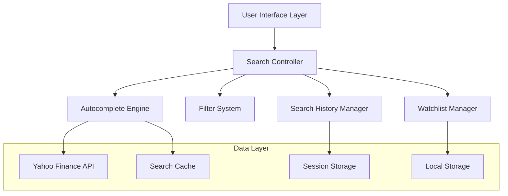
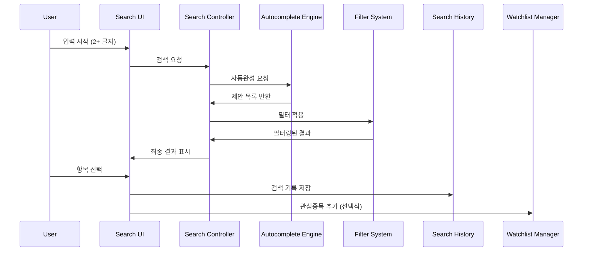

# Enhanced Stock Search System Design

## Overview

현재 Stock Chart Analysis 애플리케이션의 주식 검색 기능을 대폭 개선하여 사용자 경험을 향상시키는 시스템을 설계합니다. 기존의 단순한 텍스트 검색을 실시간 자동완성, 지능형 필터링, 검색 히스토리, 향상된 관심종목 관리 기능으로 확장합니다.

## Architecture

### High-Level Architecture



### Component Interaction Flow



## Components and Interfaces

### 1. Search Controller

**책임**: 모든 검색 관련 기능의 중앙 조정자 역할

**주요 메서드**:
```python
class SearchController:
    def __init__(self):
        self.autocomplete_engine = AutocompleteEngine()
        self.filter_system = FilterSystem()
        self.search_history = SearchHistoryManager()
        self.cache = SearchCache()
    
    async def search_stocks(self, query: str, filters: Dict) -> List[StockResult]
    def get_search_suggestions(self, query: str) -> List[str]
    def apply_filters(self, results: List[StockResult], filters: Dict) -> List[StockResult]
```

### 2. Autocomplete Engine

**책임**: 실시간 자동완성 제안 생성

**핵심 기능**:
- 부분 문자열 매칭 (심볼명, 회사명)
- 관련도 기반 정렬
- 응답 시간 최적화 (500ms 이내)

**구현 방식**:
```python
class AutocompleteEngine:
    def __init__(self):
        self.debounce_timer = None
        self.cache = {}
    
    async def get_suggestions(self, query: str, max_results: int = 10) -> List[StockSuggestion]
    def _calculate_relevance_score(self, stock: StockInfo, query: str) -> float
    def _debounce_search(self, query: str, delay: float = 0.3)
```

**관련도 점수 계산**:
1. 심볼 정확 일치: 100점
2. 심볼 시작 일치: 80점
3. 회사명 시작 일치: 60점
4. 심볼 부분 일치: 40점
5. 회사명 부분 일치: 20점

### 3. Filter System

**책임**: 다중 조건 필터링 및 실시간 결과 업데이트

**필터 유형**:
- 주식 유형 (EQUITY, ETF, MUTUALFUND, INDEX)
- 섹터 (Technology, Healthcare, Finance 등)
- 거래소 (NYSE, NASDAQ, AMEX 등)
- 시가총액 범위
- 가격 범위

**구현**:
```python
class FilterSystem:
    def __init__(self):
        self.active_filters = {}
    
    def add_filter(self, filter_type: str, value: Any)
    def remove_filter(self, filter_type: str)
    def apply_filters(self, stocks: List[StockResult]) -> List[StockResult]
    def get_available_filter_values(self, filter_type: str, stocks: List[StockResult]) -> List[str]
```

### 4. Search History Manager

**책임**: 검색 기록 저장 및 관리

**데이터 구조**:
```python
@dataclass
class SearchHistoryItem:
    symbol: str
    company_name: str
    search_time: datetime
    search_count: int
```

**저장 방식**: Streamlit Session State 활용
- 최대 20개 항목 유지
- 중복 제거 (최신 시간으로 업데이트)
- 검색 빈도 추적

### 5. Enhanced Watchlist Manager

**책임**: 향상된 관심종목 관리

**새로운 기능**:
- 카테고리별 그룹화
- 개인 메모 추가
- 드래그 앤 드롭 정렬 (Streamlit 한계로 인해 버튼 기반 구현)

**데이터 구조**:
```python
@dataclass
class WatchlistItem:
    symbol: str
    company_name: str
    category: str
    note: str
    added_date: datetime
    order_index: int
```

## Data Models

### StockResult
```python
@dataclass
class StockResult:
    symbol: str
    company_name: str
    stock_type: str
    exchange: str
    sector: str
    industry: str
    market_cap: Optional[float]
    current_price: Optional[float]
    relevance_score: float = 0.0
```

### SearchCache
```python
class SearchCache:
    def __init__(self, max_size: int = 1000, ttl_seconds: int = 300):
        self.cache = {}
        self.max_size = max_size
        self.ttl = ttl_seconds
    
    def get(self, key: str) -> Optional[List[StockResult]]
    def set(self, key: str, value: List[StockResult])
    def _cleanup_expired(self)
```

## Error Handling

### 1. API 오류 처리
- **연결 실패**: 재시도 메커니즘 (최대 3회)
- **타임아웃**: 사용자에게 명확한 메시지 표시
- **Rate Limiting**: 요청 간격 조절 및 캐시 활용

### 2. 사용자 입력 검증
- **빈 검색어**: 검색 히스토리 표시
- **특수문자**: 자동 필터링
- **너무 긴 검색어**: 자동 자르기 (50자 제한)

### 3. 성능 최적화
- **Debouncing**: 300ms 지연으로 불필요한 API 호출 방지
- **캐싱**: 5분간 검색 결과 캐시
- **Lazy Loading**: 필터 옵션을 필요시에만 로드

## Testing Strategy

### 1. Unit Tests
- AutocompleteEngine의 관련도 점수 계산
- FilterSystem의 다중 필터 적용
- SearchCache의 TTL 및 크기 제한

### 2. Integration Tests
- Yahoo Finance API 연동 테스트
- Session State 저장/로드 테스트
- 전체 검색 플로우 테스트

### 3. Performance Tests
- 500ms 응답 시간 검증
- 동시 검색 요청 처리 테스트
- 메모리 사용량 모니터링

## UI/UX Design

### 1. 검색 인터페이스 개선

**현재 구조**:
```
[검색창] [검색 버튼] [클리어 버튼]
[검색 결과 목록]
[필터 드롭다운]
```

**개선된 구조**:
```
[🔍 검색창 (자동완성 포함)] [⚙️ 고급 필터]
[📋 검색 히스토리 / 🔥 인기 검색어]
[📊 실시간 검색 결과 (카드 형태)]
[🏷️ 빠른 필터 태그들]
```

### 2. 자동완성 UI
- 드롭다운 스타일의 제안 목록
- 키보드 네비게이션 지원 (↑↓ 화살표)
- 하이라이트된 매칭 텍스트
- 회사 로고 표시 (가능한 경우)

### 3. 향상된 관심종목 패널
```
📁 My Watchlist
├── 📈 Tech Stocks
│   ├── AAPL - Apple Inc. 💭 "Long term hold"
│   └── MSFT - Microsoft Corp.
├── 🏦 Finance
│   └── JPM - JPMorgan Chase
└── ➕ Add Category
```

### 4. 검색 결과 카드 디자인
```
┌─────────────────────────────────────┐
│ AAPL                    📈 +2.5%    │
│ Apple Inc.              $150.25     │
│ NASDAQ • Technology • Large Cap     │
│ [📊 View] [⭐ Add to Watchlist]     │
└─────────────────────────────────────┘
```

## Implementation Phases

### Phase 1: Core Search Enhancement (Week 1)
- AutocompleteEngine 구현
- 기본 필터링 시스템
- 검색 캐싱

### Phase 2: History & Watchlist (Week 2)
- SearchHistoryManager 구현
- 향상된 WatchlistManager
- Session State 통합

### Phase 3: UI/UX Polish (Week 3)
- 자동완성 UI 구현
- 검색 결과 카드 디자인
- 키보드 네비게이션

### Phase 4: Performance & Testing (Week 4)
- 성능 최적화
- 에러 처리 강화
- 종합 테스트

## Technical Considerations

### 1. Streamlit 제약사항
- 실시간 자동완성: `st.text_input`의 `on_change` 콜백 활용
- 드래그 앤 드롭: 버튼 기반 순서 변경으로 대체
- 키보드 네비게이션: JavaScript 컴포넌트 필요시 `st.components.v1.html` 활용

### 2. 상태 관리
- Session State를 활용한 검색 상태 유지
- 브라우저 새로고침 시 상태 복원
- 메모리 효율적인 캐시 관리

### 3. API 최적화
- Yahoo Finance API 호출 최소화
- 배치 요청 처리
- 에러 복구 메커니즘

이 설계는 현재 애플리케이션의 아키텍처를 최대한 활용하면서도 사용자 경험을 크게 향상시킬 수 있는 실용적인 접근 방식을 제시합니다.