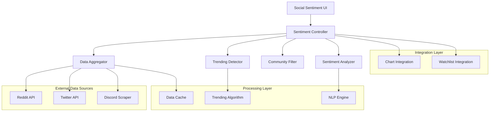
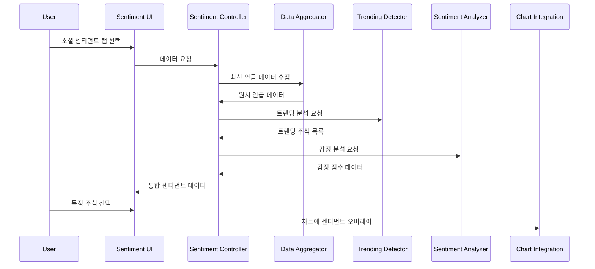

# Social Sentiment Tracker Design

## Overview

Stock Chart Analysis 애플리케이션에 소셜 미디어 센티먼트 분석 기능을 통합하여 Reddit, Twitter, Discord 등에서 언급되는 주식 정보를 실시간으로 추적하고 분석합니다. apewisdom.io와 유사한 기능을 제공하되, 기존 차트 분석 기능과 seamless하게 통합되도록 설계합니다.

## Architecture

### High-Level Architecture



### Data Flow Architecture



## Components and Interfaces

### 1. Sentiment Controller

**책임**: 모든 소셜 센티먼트 기능의 중앙 조정자

```python
class SentimentController:
    def __init__(self):
        self.data_aggregator = DataAggregator()
        self.trending_detector = TrendingDetector()
        self.community_filter = CommunityFilter()
        self.sentiment_analyzer = SentimentAnalyzer()
        self.cache = SentimentCache()
    
    async def get_trending_stocks(self, timeframe: str = "24h") -> List[TrendingStock]
    async def get_mention_rankings(self, limit: int = 20) -> List[MentionRanking]
    async def get_sentiment_data(self, symbol: str) -> SentimentData
    def filter_by_community(self, data: List[Mention], communities: List[str]) -> List[Mention]
```

### 2. Data Aggregator

**책임**: 다양한 소셜 미디어 플랫폼에서 데이터 수집 및 통합

```python
class DataAggregator:
    def __init__(self):
        self.reddit_client = RedditClient()
        self.twitter_client = TwitterClient()
        self.discord_scraper = DiscordScraper()
        self.stock_symbol_extractor = StockSymbolExtractor()
    
    async def collect_mentions(self, timeframe: str) -> List[StockMention]
    async def get_reddit_mentions(self, subreddits: List[str]) -> List[RedditMention]
    async def get_twitter_mentions(self, keywords: List[str]) -> List[TwitterMention]
    def extract_stock_symbols(self, text: str) -> List[str]
```

**데이터 소스별 설정**:
- **Reddit**: wallstreetbets, investing, stocks, SecurityAnalysis, ValueInvesting
- **Twitter**: $TICKER 해시태그, 주요 투자 인플루언서 계정
- **Discord**: 공개 투자 관련 서버 (API 제한으로 인해 제한적)

### 3. Trending Detector

**책임**: 언급량 급증 주식 감지 및 트렌드 분석

```python
class TrendingDetector:
    def __init__(self):
        self.baseline_calculator = BaselineCalculator()
        self.spike_detector = SpikeDetector()
    
    def detect_trending_stocks(self, current_data: List[MentionCount], 
                             historical_data: List[MentionCount]) -> List[TrendingStock]
    def calculate_trend_score(self, current_count: int, baseline: float) -> float
    def get_trend_duration(self, symbol: str) -> timedelta
```

**트렌딩 알고리즘**:
1. **베이스라인 계산**: 지난 7일 평균 언급량
2. **급증 감지**: 현재 언급량이 베이스라인의 200% 이상
3. **지속성 확인**: 최소 30분간 높은 언급량 유지
4. **노이즈 필터링**: 봇 계정 및 스팸 제거

### 4. Community Filter

**책임**: 투자 성향별 커뮤니티 분류 및 필터링

```python
class CommunityFilter:
    def __init__(self):
        self.community_profiles = {
            "day_trading": ["wallstreetbets", "daytrading", "pennystocks"],
            "value_investing": ["SecurityAnalysis", "ValueInvesting", "investing"],
            "growth_investing": ["stocks", "StockMarket", "investing"],
            "crypto": ["cryptocurrency", "CryptoMarkets", "Bitcoin"]
        }
    
    def filter_by_investment_style(self, mentions: List[Mention], 
                                 styles: List[str]) -> List[Mention]
    def get_community_breakdown(self, symbol: str) -> Dict[str, int]
    def classify_community(self, source: str) -> str
```

### 5. Sentiment Analyzer

**책임**: 텍스트 감정 분석 및 점수 계산

```python
class SentimentAnalyzer:
    def __init__(self):
        self.nlp_model = self._load_sentiment_model()
        self.stock_specific_lexicon = StockLexicon()
    
    def analyze_sentiment(self, text: str) -> SentimentScore
    def calculate_aggregate_sentiment(self, mentions: List[Mention]) -> float
    def get_sentiment_trend(self, symbol: str, timeframe: str) -> List[SentimentPoint]
```

**감정 분석 방식**:
- **VADER Sentiment**: 소셜 미디어 텍스트에 특화된 감정 분석
- **주식 특화 어휘**: "moon", "diamond hands", "paper hands" 등 주식 커뮤니티 용어
- **점수 정규화**: -100 (매우 부정) ~ +100 (매우 긍정)

## Data Models

### StockMention
```python
@dataclass
class StockMention:
    symbol: str
    text: str
    source: str  # reddit, twitter, discord
    community: str  # subreddit name, twitter handle, etc.
    author: str
    timestamp: datetime
    upvotes: int
    sentiment_score: float
    investment_style: str  # day_trading, value_investing, etc.
```

### TrendingStock
```python
@dataclass
class TrendingStock:
    symbol: str
    current_mentions: int
    baseline_mentions: float
    trend_score: float  # percentage increase
    trend_start_time: datetime
    peak_mentions: int
    sentiment_score: float
    top_communities: List[str]
```

### SentimentData
```python
@dataclass
class SentimentData:
    symbol: str
    overall_sentiment: float
    mention_count: int
    sentiment_trend: List[SentimentPoint]
    community_breakdown: Dict[str, CommunityData]
    trending_status: bool
```

## Error Handling

### 1. API 제한 및 오류 처리
- **Rate Limiting**: 각 API별 요청 제한 준수
- **Fallback 메커니즘**: 주요 데이터 소스 실패 시 대체 소스 활용
- **Graceful Degradation**: 일부 데이터 소스 실패 시에도 서비스 지속

### 2. 데이터 품질 관리
- **스팸 필터링**: 봇 계정 및 반복 게시물 제거
- **심볼 검증**: 유효한 주식 심볼만 추적
- **데이터 정제**: 노이즈 및 무관한 언급 필터링

### 3. 성능 최적화
- **캐싱 전략**: 5분간 데이터 캐시로 API 호출 최소화
- **배치 처리**: 대량 데이터 처리를 위한 비동기 배치 작업
- **메모리 관리**: 오래된 데이터 자동 정리

## Testing Strategy

### 1. Unit Tests
- 감정 분석 정확도 테스트
- 트렌딩 감지 알고리즘 검증
- 커뮤니티 분류 로직 테스트

### 2. Integration Tests
- 각 소셜 미디어 API 연동 테스트
- 데이터 파이프라인 end-to-end 테스트
- 캐싱 시스템 동작 검증

### 3. Performance Tests
- 대량 데이터 처리 성능 테스트
- 실시간 업데이트 지연 시간 측정
- 메모리 사용량 모니터링

## UI/UX Design

### 1. 소셜 센티먼트 대시보드

```
┌─────────────────────────────────────────────────────────┐
│ 🔥 Trending Now        📊 Top Mentions    ⚙️ Filters    │
├─────────────────────────────────────────────────────────┤
│ TSLA  🚀 +450%        AAPL    1,247      ☑️ Day Trading │
│ GME   📈 +320%        TSLA    1,156      ☑️ Value       │
│ AMC   🌙 +280%        NVDA      892      ☐ Growth       │
└─────────────────────────────────────────────────────────┘
```

### 2. 상세 센티먼트 분석

```
┌─────────────────────────────────────────────────────────┐
│ AAPL - Apple Inc.                                       │
├─────────────────────────────────────────────────────────┤
│ Sentiment Score: +65 🟢                                 │
│ Mentions (24h): 1,247 (↑15%)                          │
│                                                         │
│ Community Breakdown:                                    │
│ ████████░░ r/investing (40%)                           │
│ ██████░░░░ r/stocks (30%)                              │
│ ████░░░░░░ Twitter (20%)                               │
│ ██░░░░░░░░ r/wallstreetbets (10%)                      │
│                                                         │
│ [View Chart Integration] [Add to Watchlist]            │
└─────────────────────────────────────────────────────────┘
```

### 3. 차트 통합 뷰

기존 주식 차트에 추가되는 요소들:
- **언급량 오버레이**: 차트 하단에 언급량 바 그래프
- **감정 점수 서브플롯**: 시간별 감정 변화 라인 차트
- **트렌딩 마커**: 언급 급증 시점에 특별 마커 표시
- **상관관계 지표**: 주가와 센티먼트의 상관계수 표시

## Implementation Phases

### Phase 1: 기본 데이터 수집 (Week 1-2)
- Reddit API 연동 및 기본 언급 수집
- 주식 심볼 추출 로직 구현
- 기본 캐싱 시스템

### Phase 2: 트렌딩 및 감정 분석 (Week 3-4)
- 트렌딩 감지 알고리즘 구현
- VADER 기반 감정 분석 시스템
- 커뮤니티 분류 로직

### Phase 3: UI 통합 (Week 5-6)
- Streamlit 기반 센티먼트 대시보드
- 기존 차트와의 통합 인터페이스
- 필터링 및 검색 기능

### Phase 4: 고도화 및 최적화 (Week 7-8)
- Twitter API 추가 연동
- 성능 최적화 및 에러 처리
- 종합 테스트 및 문서화

## Technical Considerations

### 1. API 제한사항
- **Reddit API**: 분당 60회 요청 제한
- **Twitter API**: 기본 플랜 월 500,000 트윗 제한
- **Discord**: 공식 API 없음, 웹 스크래핑 필요 (제한적)

### 2. 데이터 저장
- **실시간 데이터**: Session State 활용
- **히스토리 데이터**: 로컬 파일 기반 간단 DB (SQLite)
- **캐시**: 메모리 기반 TTL 캐시

### 3. 확장성 고려사항
- **모듈화**: 새로운 데이터 소스 쉽게 추가 가능한 구조
- **설정 가능**: 추적할 커뮤니티 및 키워드 사용자 정의
- **플러그인 아키텍처**: 새로운 분석 알고리즘 추가 용이

이 설계는 apewisdom.io의 핵심 기능을 구현하면서도 현재 Stock Chart Analysis 애플리케이션과 자연스럽게 통합될 수 있도록 설계되었습니다.