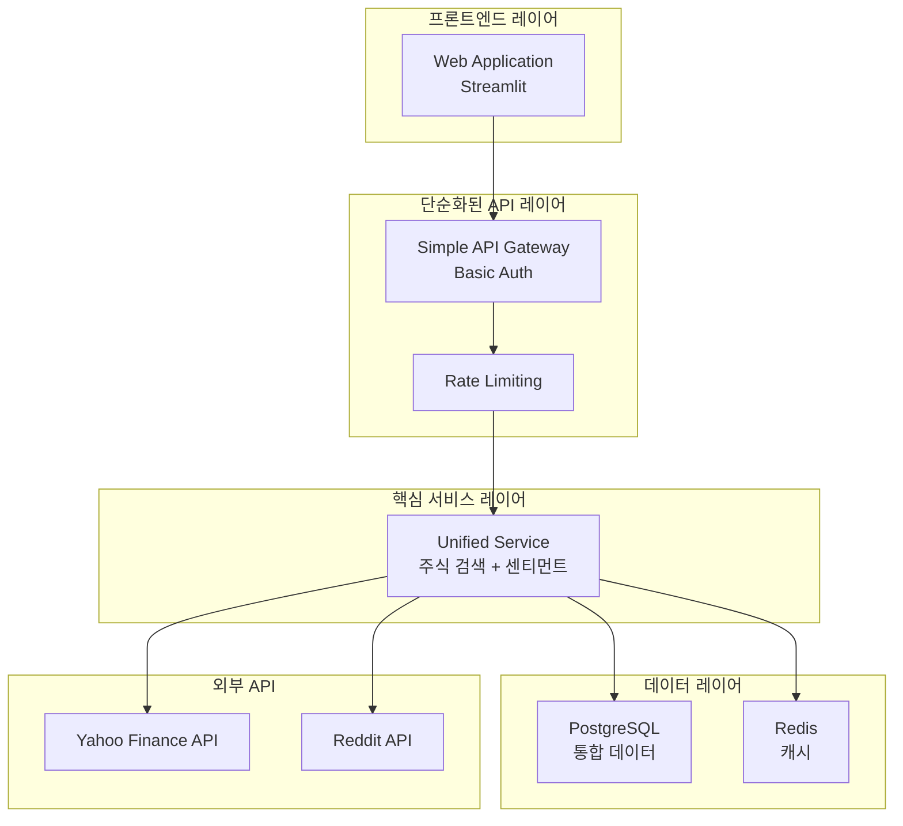
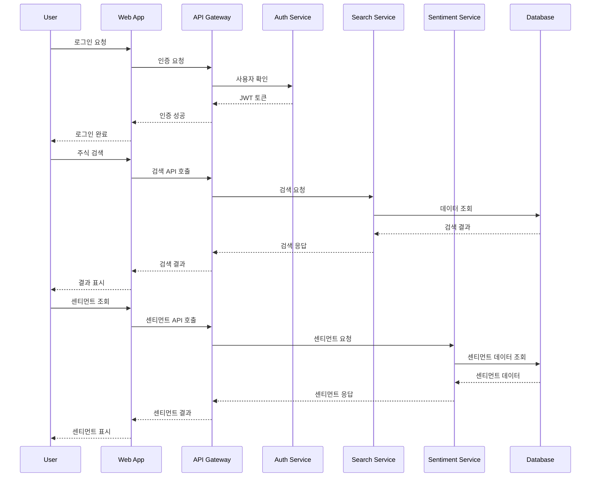
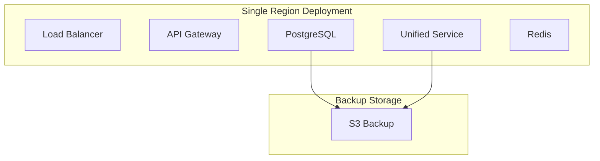

# 단순화된 통합 시스템 아키텍처

## 1. 아키텍처 개요

### 1.1 설계 원칙
본 시스템은 다음과 같은 핵심 설계 원칙을 따릅니다:

- **단순화된 모듈러 아키텍처**: 핵심 기능 중심의 단순한 구조
- **점진적 확장성**: 필요에 따른 단계적 확장 가능
- **안정성**: 장애 발생 시 기본 기능 유지
- **필수 보안**: 핵심 보안 기능에 집중
- **기본 모니터링**: 필수 모니터링 기능에 집중

### 1.2 아키텍처 비전
"단순하고 안정적인 주식 검색 및 센티먼트 분석 플랫폼 구축"

## 2. 전체 시스템 아키텍처

### 2.1 단순화된 고수준 아키텍처



### 2.2 서비스 상호작용

#### 2.2.1 사용자 흐름


## 3. 단순화된 서비스 설계

### 3.1 단순화된 API 게이트웨이

#### 3.1.1 기본 API Gateway 설정
```python
# simple_gateway.py
from fastapi import FastAPI, HTTPException
from fastapi.middleware.cors import CORSMiddleware
import redis
import time

app = FastAPI(title="InsiteChart Simple Gateway")

# 기본 CORS 설정
app.add_middleware(
    CORSMiddleware,
    allow_origins=["*"],
    allow_credentials=True,
    allow_methods=["*"],
    allow_headers=["*"],
)

# 기본 속도 제한
redis_client = redis.Redis(host='redis', port=6379, db=0)

@app.middleware("http")
async def rate_limit_middleware(request, call_next):
    client_ip = request.client.host
    current_time = int(time.time())
    key = f"rate_limit:{client_ip}:{current_time // 60}"
    
    current_count = redis_client.incr(key)
    if current_count > 100:  # 분당 100요청 제한
        raise HTTPException(status_code=429, detail="Rate limit exceeded")
    
    redis_client.expire(key, 60)
    response = await call_next(request)
    return response
```

#### 3.1.2 단순화된 라우팅
- **기본 라우팅**: 단일 통합 서비스로 모든 요청 전달
- **헬스 체크**: 60초 간격으로 서비스 상태 확인
- **기본 장애 처리**: 서비스 장애 시 간단한 에러 메시지 반환

### 3.2 단순화된 인증 서비스

#### 3.2.1 기본 API 키 인증
```python
# simple_auth.py
import hashlib
import secrets
from typing import Optional

class SimpleAuthService:
    def __init__(self):
        self.api_keys = {
            "demo_key": {"user_id": "demo_user", "permissions": ["read"]}
        }
    
    def generate_api_key(self, user_id: str) -> str:
        """간단한 API 키 생성"""
        random_string = secrets.token_urlsafe(32)
        api_key = hashlib.sha256(f"{user_id}:{random_string}".encode()).hexdigest()
        self.api_keys[api_key] = {"user_id": user_id, "permissions": ["read"]}
        return api_key
    
    def validate_api_key(self, api_key: str) -> Optional[dict]:
        """API 키 검증"""
        return self.api_keys.get(api_key)
    
    def is_authorized(self, api_key: str, required_permission: str) -> bool:
        """권한 확인"""
        key_data = self.validate_api_key(api_key)
        if not key_data:
            return False
        return required_permission in key_data.get("permissions", [])
```

### 3.3 단순화된 통합 서비스

#### 3.3.1 통합 서비스 아키텍처
```python
# unified_service/service.py
class UnifiedService:
    def __init__(self, db_pool, redis_client):
        self.db_pool = db_pool
        self.redis = redis_client
        self.cache_ttl = 300  # 5분
    
    async def search_stocks(self, query: str, include_sentiment: bool = False) -> List[dict]:
        """통합 주식 검색"""
        # 1. 캐시 확인
        cache_key = f"search:{hash(query)}:{include_sentiment}"
        cached_result = await self.redis.get(cache_key)
        if cached_result:
            return json.loads(cached_result)
        
        # 2. Yahoo Finance API 호출
        search_results = await self._search_yahoo_finance(query)
        
        # 3. 센티먼트 데이터 추가 (선택적)
        if include_sentiment:
            search_results = await self._add_sentiment_data(search_results)
        
        # 4. 결과 캐싱
        await self.redis.setex(cache_key, self.cache_ttl, json.dumps(search_results))
        
        return search_results
    
    async def _search_yahoo_finance(self, query: str) -> List[dict]:
        """Yahoo Finance API 호출"""
        # 간단한 Yahoo Finance API 호출 구현
        pass
    
    async def _add_sentiment_data(self, stocks: List[dict]) -> List[dict]:
        """센티먼트 데이터 추가"""
        # 간단한 센티먼트 데이터 추가 구현
        pass
```

#### 3.3.2 단순화된 데이터 모델
```python
# unified_service/models.py
from dataclasses import dataclass
from typing import Optional, List
from datetime import datetime

@dataclass
class SimpleStockResult:
    symbol: str
    company_name: str
    current_price: Optional[float] = None
    change_percent: Optional[float] = None
    sentiment_score: Optional[float] = None
    mention_count: int = 0
```

### 3.4 단순화된 센티먼트 서비스

#### 3.4.1 기본 데이터 수집
```python
# simple_sentiment/collector.py
class SimpleSentimentCollector:
    def __init__(self, redis_client):
        self.redis = redis_client
    
    async def collect_basic_mentions(self, symbol: str, timeframe: str = "24h") -> dict:
        """기본 소셜 미디어 언급 데이터 수집"""
        # Reddit API를 통한 기본 데이터 수집만 구현
        mentions = await self._fetch_reddit_mentions(symbol, timeframe)
        
        # 간단한 처리 및 저장
        processed_data = self._process_mentions(mentions)
        await self._cache_sentiment_data(symbol, processed_data)
        
        return processed_data
    
    async def _fetch_reddit_mentions(self, symbol: str, timeframe: str) -> List[dict]:
        """Reddit에서 언급 데이터 가져오기"""
        # 간단한 Reddit API 호출 구현
        pass
```

#### 3.4.2 기본 센티먼트 분석
```python
# simple_sentiment/analyzer.py
from vaderSentiment.vaderSentiment import SentimentIntensityAnalyzer

class SimpleSentimentAnalyzer:
    def __init__(self):
        self.analyzer = SentimentIntensityAnalyzer()
    
    def analyze_basic_sentiment(self, text: str) -> float:
        """기본 텍스트 센티먼트 분석"""
        # VADER 분석만 사용
        scores = self.analyzer.polarity_scores(text)
        return scores['compound']  # -1에서 1 사이의 점수
    
    def get_sentiment_label(self, score: float) -> str:
        """센티먼트 레이블 반환"""
        if score > 0.1:
            return "positive"
        elif score < -0.1:
            return "negative"
        else:
            return "neutral"
```

## 4. 단순화된 데이터 아키텍처

### 4.1 단순화된 데이터베이스 설계

#### 4.1.1 기본 PostgreSQL 스키마
```sql
-- 주식 기본 정보 테이블
CREATE TABLE stocks (
    symbol VARCHAR(10) PRIMARY KEY,
    company_name VARCHAR(255) NOT NULL,
    current_price FLOAT,
    change_percent FLOAT,
    sentiment_score FLOAT,
    mention_count INTEGER DEFAULT 0,
    last_updated TIMESTAMP DEFAULT CURRENT_TIMESTAMP
);

-- 검색 기록 테이블
CREATE TABLE search_history (
    id SERIAL PRIMARY KEY,
    search_query VARCHAR(255),
    search_time TIMESTAMP DEFAULT CURRENT_TIMESTAMP,
    results_count INTEGER DEFAULT 0
);

-- 기본 인덱스 생성
CREATE INDEX idx_stocks_symbol ON stocks(symbol);
CREATE INDEX idx_search_history_time ON search_history(search_time DESC);
```

### 4.2 단순화된 캐싱 전략

#### 4.2.1 기본 Redis 캐시 구조
```python
# simple_cache.py
import redis
import json
import hashlib
from typing import Optional, List, Any

class SimpleCacheManager:
    def __init__(self, redis_client):
        self.redis = redis_client
        self.default_ttl = 300  # 5분
    
    def _get_cache_key(self, prefix: str, identifier: str) -> str:
        """캐시 키 생성"""
        return f"{prefix}:{hashlib.md5(identifier.encode()).hexdigest()}"
    
    def get_search_results(self, query: str) -> Optional[List[dict]]:
        """검색 결과 캐시 조회"""
        key = self._get_cache_key("search", query)
        cached_data = self.redis.get(key)
        return json.loads(cached_data) if cached_data else None
    
    def set_search_results(self, query: str, results: List[dict]):
        """검색 결과 캐시 저장"""
        key = self._get_cache_key("search", query)
        self.redis.setex(key, self.default_ttl, json.dumps(results, default=str))
    
    def get_stock_data(self, symbol: str) -> Optional[dict]:
        """주식 데이터 캐시 조회"""
        key = self._get_cache_key("stock", symbol)
        cached_data = self.redis.get(key)
        return json.loads(cached_data) if cached_data else None
    
    def set_stock_data(self, symbol: str, data: dict):
        """주식 데이터 캐시 저장"""
        key = self._get_cache_key("stock", symbol)
        self.redis.setex(key, self.default_ttl, json.dumps(data, default=str))
```

## 5. 단순화된 메시징 아키텍처

### 5.1 기본 메시징 (Redis 기반)

#### 5.1.1 단순한 큐 설계
```python
# simple_messaging.py
import redis
import json
import time
from typing import Dict, Any, List

class SimpleMessageQueue:
    def __init__(self, redis_client):
        self.redis = redis_client
    
    def enqueue(self, queue_name: str, message: Dict[str, Any]):
        """메시지 큐에 추가"""
        message_data = {
            'data': message,
            'timestamp': time.time()
        }
        self.redis.lpush(queue_name, json.dumps(message_data))
    
    def dequeue(self, queue_name: str) -> Dict[str, Any]:
        """메시지 큐에서 가져오기"""
        message_data = self.redis.rpop(queue_name)
        if message_data:
            return json.loads(message_data)
        return None
    
    def get_queue_size(self, queue_name: str) -> int:
        """큐 크기 확인"""
        return self.redis.llen(queue_name)
    
    def clear_queue(self, queue_name: str):
        """큐 비우기"""
        self.redis.delete(queue_name)
```

## 6. 단순화된 모니터링 아키텍처

### 6.1 기본 메트릭

#### 6.1.1 핵심 메트릭 정의
```python
# simple_metrics.py
import time
import logging
from typing import Dict, Any
from collections import defaultdict

class SimpleMetrics:
    def __init__(self):
        self.metrics = defaultdict(list)
        self.counters = defaultdict(int)
        self.logger = logging.getLogger(__name__)
    
    def increment_counter(self, metric_name: str):
        """카운터 증가"""
        self.counters[metric_name] += 1
    
    def record_timing(self, metric_name: str, duration: float):
        """시간 기록"""
        self.metrics[metric_name].append(duration)
    
    def get_average(self, metric_name: str) -> float:
        """평균값 계산"""
        values = self.metrics[metric_name]
        return sum(values) / len(values) if values else 0.0
    
    def get_all_metrics(self) -> Dict[str, Any]:
        """모든 메트릭 반환"""
        result = dict(self.counters)
        for metric_name, values in self.metrics.items():
            if values:
                result[f"{metric_name}_avg"] = sum(values) / len(values)
                result[f"{metric_name}_count"] = len(values)
        return result
    
    def log_metrics(self):
        """메트릭 로깅"""
        metrics_data = self.get_all_metrics()
        self.logger.info(f"Metrics: {json.dumps(metrics_data)}")
```

### 6.2 기본 로깅

#### 6.2.1 간단한 로깅
```python
# simple_logging.py
import logging
import json
from datetime import datetime
from typing import Dict, Any

class SimpleLogger:
    def __init__(self, service_name: str):
        self.service_name = service_name
        self.logger = logging.getLogger(service_name)
        
        # 기본 로거 설정
        handler = logging.StreamHandler()
        formatter = logging.Formatter(
            '%(asctime)s - %(name)s - %(levelname)s - %(message)s'
        )
        handler.setFormatter(formatter)
        self.logger.addHandler(handler)
        self.logger.setLevel(logging.INFO)
    
    def log_request(self, endpoint: str, status: int, duration: float):
        """요청 로깅"""
        self.logger.info(f"Request: {endpoint} - Status: {status} - Duration: {duration:.2f}s")
    
    def log_error(self, error: Exception, context: str = ""):
        """에러 로깅"""
        self.logger.error(f"Error in {context}: {str(error)}")
    
    def log_info(self, message: str):
        """정보 로깅"""
        self.logger.info(message)
```

## 7. 단순화된 보안 아키텍처

### 7.1 기본 보안 레이어

#### 7.1.1 간단한 보안 미들웨어
```python
# simple_security.py
from fastapi import Request, HTTPException, status
import time
import logging

class SimpleSecurityMiddleware:
    def __init__(self, api_keys: dict):
        self.api_keys = api_keys
        self.logger = logging.getLogger(__name__)
    
    def authenticate_request(self, request: Request) -> bool:
        """요청 인증"""
        try:
            # API 키 확인
            api_key = request.headers.get('x-api-key')
            if not api_key or api_key not in self.api_keys:
                return False
            return True
            
        except Exception as e:
            self.logger.error(f"Authentication error: {str(e)}")
            return False
    
    def get_client_ip(self, request: Request) -> str:
        """클라이언트 IP 주소 조회"""
        return request.client.host or "unknown"
```

## 8. 단순화된 확장성 전략

### 8.1 기본 수평적 확장

#### 8.1.1 간단한 수동 스케일링
```yaml
# simple_scaling.yaml
apiVersion: apps/v1
kind: Deployment
metadata:
  name: unified-service
spec:
  replicas: 3  # 고정된 복제본 수
  selector:
    matchLabels:
      app: unified-service
  template:
    metadata:
      labels:
        app: unified-service
    spec:
      containers:
      - name: unified-service
        image: insitechart/unified-service:latest
        ports:
        - containerPort: 8000
        resources:
          requests:
            memory: "256Mi"
            cpu: "250m"
          limits:
            memory: "512Mi"
            cpu: "500m"
```

### 8.2 단순화된 데이터베이스

#### 8.2.1 기본 설정
```sql
-- 기본 데이터베이스 설정
-- 단일 PostgreSQL 인스턴스 사용
-- 필요시 나중에 읽기 전용 복제본 고려
```

## 9. 단순화된 재해 복구 전략

### 9.1 기본 백업 전략

#### 9.1.1 간단한 백업


### 9.2 기본 장애 조치

#### 9.2.1 수동 장애 조치
```python
# simple_failover.py
class SimpleFailoverManager:
    def __init__(self):
        self.backup_location = "s3://insitechart-backups"
        self.logger = logging.getLogger(__name__)
    
    def create_backup(self):
        """간단한 백업 생성"""
        try:
            # 데이터베이스 백업
            self._backup_database()
            
            # 설정 파일 백업
            self._backup_config()
            
            self.logger.info("Backup completed successfully")
            return True
        except Exception as e:
            self.logger.error(f"Backup failed: {str(e)}")
            return False
    
    def restore_backup(self, backup_date: str):
        """백업 복원"""
        try:
            # 데이터베이스 복원
            self._restore_database(backup_date)
            
            # 설정 파일 복원
            self._restore_config(backup_date)
            
            self.logger.info(f"Backup {backup_date} restored successfully")
            return True
        except Exception as e:
            self.logger.error(f"Restore failed: {str(e)}")
            return False
```

## 10. Streamlit 기반 즉시 적용 가능한 아키텍처 구현

### 10.1 현재 앱에 적용할 수 있는 모듈화 아키텍처

#### 10.1.1 모듈화된 컴포넌트 구조
```python
# components/base.py
import streamlit as st
from abc import ABC, abstractmethod
from typing import Any, Dict, List, Optional

class BaseComponent(ABC):
    """모든 컴포넌트의 기본 클래스"""
    
    def __init__(self, component_id: str):
        self.component_id = component_id
        self.state_key = f"{self.__class__.__name__}_{component_id}"
    
    @abstractmethod
    def render(self, **kwargs) -> Any:
        """컴포넌트 렌더링"""
        pass
    
    def get_state(self) -> Dict[str, Any]:
        """컴포넌트 상태 가져오기"""
        return st.session_state.get(self.state_key, {})
    
    def set_state(self, state: Dict[str, Any]):
        """컴포넌트 상태 설정"""
        st.session_state[self.state_key] = state
    
    def update_state(self, updates: Dict[str, Any]):
        """컴포넌트 상태 업데이트"""
        current_state = self.get_state()
        current_state.update(updates)
        self.set_state(current_state)

# components/search.py
from .base import BaseComponent
from typing import List, Dict, Any
import asyncio
import requests
import time
from dataclasses import dataclass

@dataclass
class StockSuggestion:
    symbol: str
    company_name: str
    stock_type: str
    exchange: str
    sector: str
    industry: str
    relevance_score: float
    current_price: Optional[float] = None
    market_cap: Optional[float] = None

class StockSearchComponent(BaseComponent):
    """주식 검색 컴포넌트"""
    
    def __init__(self, component_id: str = "stock_search"):
        super().__init__(component_id)
        self.cache = {}
        self.cache_ttl = 300  # 5분
    
    def render(self, on_select_callback=None, **kwargs) -> List[StockSuggestion]:
        """검색 컴포넌트 렌더링"""
        st.markdown("### 🔍 Enhanced Stock Search")
        
        # 검색 입력
        col_search, col_clear = st.columns([4, 1])
        
        with col_search:
            search_query = st.text_input(
                "Search stocks...",
                placeholder="Enter symbol or company name...",
                key=f"{self.state_key}_search_input"
            )
        
        with col_clear:
            st.write("")
            if st.button("Clear", key=f"{self.state_key}_clear"):
                self.set_state({'search_results': [], 'last_query': ''})
                st.rerun()
        
        # 검색 실행
        if search_query and search_query != self.get_state().get('last_query', ''):
            with st.spinner("Searching..."):
                # 비동기 검색 실행
                results = asyncio.run(self._perform_search(search_query))
                self.update_state({
                    'search_results': results,
                    'last_query': search_query
                })
        
        # 필터 UI
        search_results = self.get_state().get('search_results', [])
        if search_results:
            self._render_filters(search_results)
        
        # 검색 결과 표시
        filtered_results = self._apply_filters(search_results)
        
        if filtered_results:
            st.markdown("#### Search Results")
            for result in filtered_results:
                self._render_result_item(result, on_select_callback)
        elif search_results:
            st.info("No results match your filters.")
        
        return filtered_results
    
    async def _perform_search(self, query: str) -> List[StockSuggestion]:
        """검색 수행"""
        # 캐시 확인
        cache_key = f"search_{query}"
        if cache_key in self.cache:
            cached_data, timestamp = self.cache[cache_key]
            if time.time() - timestamp < self.cache_ttl:
                return cached_data
        
        try:
            url = "https://query2.finance.yahoo.com/v1/finance/search"
            params = {
                "q": query,
                "quotes_count": 20,
                "country": "United States"
            }
            
            response = requests.get(
                url=url,
                params=params,
                headers={'User-Agent': 'Mozilla/5.0 (Windows NT 10.0; Win64; x64) AppleWebKit/537.36'},
                timeout=10
            )
            
            if response.status_code == 200:
                data = response.json()
                suggestions = []
                
                for quote in data.get('quotes', []):
                    # 관련도 점수 계산
                    relevance_score = self._calculate_relevance_score(quote, query)
                    
                    suggestion = StockSuggestion(
                        symbol=quote.get('symbol', ''),
                        company_name=quote.get('shortname') or quote.get('longname', ''),
                        stock_type=quote.get('quoteType', ''),
                        exchange=quote.get('exchange', ''),
                        sector=quote.get('sector', ''),
                        industry=quote.get('industry', ''),
                        relevance_score=relevance_score
                    )
                    suggestions.append(suggestion)
                
                # 관련도 순으로 정렬
                suggestions.sort(key=lambda x: x.relevance_score, reverse=True)
                
                # 캐시 저장
                self.cache[cache_key] = (suggestions, time.time())
                
                return suggestions
            else:
                return []
        except Exception as e:
            st.error(f"검색 오류: {str(e)}")
            return []
    
    def _calculate_relevance_score(self, stock: Dict[str, Any], query: str) -> float:
        """관련도 점수 계산"""
        query = query.lower()
        symbol = stock.get('symbol', '').lower()
        name = stock.get('shortname', '').lower()
        longname = stock.get('longname', '').lower()
        
        score = 0
        
        # 심볼 정확 일치
        if symbol == query:
            score += 100
        # 심볼 시작 일치
        elif symbol.startswith(query):
            score += 80
        # 회사명 시작 일치
        elif name.startswith(query) or longname.startswith(query):
            score += 60
        # 심볼 부분 일치
        elif query in symbol:
            score += 40
        # 회사명 부분 일치
        elif query in name or query in longname:
            score += 20
        
        return score
    
    def _render_filters(self, results: List[StockSuggestion]):
        """필터 UI 렌더링"""
        with st.expander("🔧 Filters", expanded=False):
            stock_types = list(set(r.stock_type for r in results if r.stock_type))
            exchanges = list(set(r.exchange for r in results if r.exchange))
            sectors = list(set(r.sector for r in results if r.sector))
            
            col1, col2, col3 = st.columns(3)
            
            with col1:
                stock_type = st.selectbox(
                    "Stock Type",
                    ["All"] + stock_types,
                    key=f"{self.state_key}_filter_type"
                )
                self.update_state({'filter_type': stock_type if stock_type != "All" else None})
            
            with col2:
                exchange = st.selectbox(
                    "Exchange",
                    ["All"] + exchanges,
                    key=f"{self.state_key}_filter_exchange"
                )
                self.update_state({'filter_exchange': exchange if exchange != "All" else None})
            
            with col3:
                sector = st.selectbox(
                    "Sector",
                    ["All"] + sectors,
                    key=f"{self.state_key}_filter_sector"
                )
                self.update_state({'filter_sector': sector if sector != "All" else None})
    
    def _apply_filters(self, results: List[StockSuggestion]) -> List[StockSuggestion]:
        """필터 적용"""
        filtered = results
        state = self.get_state()
        
        if state.get('filter_type'):
            filtered = [r for r in filtered if r.stock_type == state['filter_type']]
        
        if state.get('filter_exchange'):
            filtered = [r for r in filtered if r.exchange == state['filter_exchange']]
        
        if state.get('filter_sector'):
            filtered = [r for r in filtered if state['filter_sector'].lower() in r.sector.lower()]
        
        return filtered
    
    def _render_result_item(self, result: StockSuggestion, on_select_callback=None):
        """검색 결과 아이템 렌더링"""
        col_symbol, col_name, col_info, col_action = st.columns([1, 3, 2, 1])
        
        with col_symbol:
            st.markdown(f"**{result.symbol}**")
        
        with col_name:
            st.markdown(result.company_name)
        
        with col_info:
            st.markdown(f"{result.stock_type} • {result.exchange}")
        
        with col_action:
            if st.button("Select", key=f"{self.state_key}_select_{result.symbol}"):
                if on_select_callback:
                    on_select_callback(result)
                else:
                    st.session_state.current_ticker = result.symbol
                st.rerun()

# components/chart.py
from .base import BaseComponent
import plotly.graph_objects as go
from plotly.subplots import make_subplots
import yfinance as yf
import pandas as pd
import ta

class StockChartComponent(BaseComponent):
    """주식 차트 컴포넌트"""
    
    def __init__(self, component_id: str = "stock_chart"):
        super().__init__(component_id)
    
    def render(self, symbol: str, **kwargs) -> None:
        """차트 컴포넌트 렌더링"""
        if not symbol:
            st.warning("Please select a stock to view chart.")
            return
        
        # 기간 선택
        self._render_period_selector()
        
        # 차트 타입 선택
        self._render_chart_type_selector()
        
        # 지표 선택
        self._render_indicator_selector()
        
        # 차트 렌더링
        self._render_chart(symbol)
    
    def _render_period_selector(self):
        """기간 선택기 렌더링"""
        periods = {
            "1D": "1d", "1W": "5d", "1M": "1mo", "3M": "3mo",
            "6M": "6mo", "1Y": "1y", "2Y": "2y", "5Y": "5y", "MAX": "max"
        }
        
        selected_period = self.get_state().get('selected_period', '1Y')
        
        col_periods = st.columns(9)
        for i, (label, value) in enumerate(periods.items()):
            with col_periods[i]:
                is_selected = selected_period == label
                if st.button(
                    label,
                    key=f"{self.state_key}_period_{label}",
                    type="primary" if is_selected else "secondary"
                ):
                    self.update_state({'selected_period': label})
                    st.rerun()
    
    def _render_chart_type_selector(self):
        """차트 타입 선택기 렌더링"""
        chart_types = ["Candlestick", "Line", "Area"]
        selected_type = self.get_state().get('chart_type', 'Candlestick')
        
        chart_type = st.selectbox(
            "Chart Type",
            chart_types,
            index=chart_types.index(selected_type),
            key=f"{self.state_key}_chart_type"
        )
        
        if chart_type != selected_type:
            self.update_state({'chart_type': chart_type})
    
    def _render_indicator_selector(self):
        """지표 선택기 렌더링"""
        with st.expander("🔧 Indicators", expanded=False):
            col1, col2, col3 = st.columns(3)
            
            with col1:
                show_bb = st.checkbox(
                    "📊 Bollinger Bands",
                    value=self.get_state().get('show_bb', False),
                    key=f"{self.state_key}_show_bb"
                )
                show_rsi = st.checkbox(
                    "📈 RSI",
                    value=self.get_state().get('show_rsi', False),
                    key=f"{self.state_key}_show_rsi"
                )
            
            with col2:
                show_macd = st.checkbox(
                    "📉 MACD",
                    value=self.get_state().get('show_macd', False),
                    key=f"{self.state_key}_show_macd"
                )
                show_volume = st.checkbox(
                    "📦 Volume",
                    value=self.get_state().get('show_volume', True),
                    key=f"{self.state_key}_show_volume"
                )
            
            with col3:
                show_sma = st.checkbox(
                    "📍 Moving Averages",
                    value=self.get_state().get('show_sma', False),
                    key=f"{self.state_key}_show_sma"
                )
            
            self.update_state({
                'show_bb': show_bb,
                'show_rsi': show_rsi,
                'show_macd': show_macd,
                'show_volume': show_volume,
                'show_sma': show_sma
            })
    
    def _render_chart(self, symbol: str):
        """차트 렌더링"""
        state = self.get_state()
        period_map = {
            "1D": "1d", "1W": "5d", "1M": "1mo", "3M": "3mo",
            "6M": "6mo", "1Y": "1y", "2Y": "2y", "5Y": "5y", "MAX": "max"
        }
        
        period = period_map.get(state.get('selected_period', '1Y'), '1y')
        
        try:
            ticker = yf.Ticker(symbol)
            hist_data = ticker.history(period=period)
            
            if hist_data.empty:
                st.warning(f"No historical data available for {symbol}")
                return
            
            # 서브플롯 생성
            num_subplots = 1
            if state.get('show_rsi'):
                num_subplots += 1
            if state.get('show_macd'):
                num_subplots += 1
            
            row_heights = [0.6] + [0.2] * (num_subplots - 1)
            
            subplot_titles = [f'{symbol} - {state.get("selected_period", "1Y")}']
            if state.get('show_rsi'):
                subplot_titles.append('RSI')
            if state.get('show_macd'):
                subplot_titles.append('MACD')
            
            fig = make_subplots(
                rows=num_subplots, cols=1,
                shared_xaxes=True,
                vertical_spacing=0.03,
                subplot_titles=subplot_titles,
                row_heights=row_heights,
                specs=[[{"secondary_y": True}]] + [[{"secondary_y": False}]] * (num_subplots - 1)
            )
            
            # 메인 차트
            self._add_main_chart(fig, hist_data, 1, state.get('chart_type', 'Candlestick'))
            
            # 볼륨
            if state.get('show_volume'):
                self._add_volume_chart(fig, hist_data, 1)
            
            # 이동평균
            if state.get('show_sma'):
                self._add_moving_averages(fig, hist_data, 1)
            
            # 볼린저 밴드
            if state.get('show_bb'):
                self._add_bollinger_bands(fig, hist_data, 1)
            
            # RSI
            current_row = 2
            if state.get('show_rsi'):
                self._add_rsi_chart(fig, hist_data, current_row)
                current_row += 1
            
            # MACD
            if state.get('show_macd'):
                self._add_macd_chart(fig, hist_data, current_row)
            
            # 레이아웃 업데이트
            fig.update_layout(
                height=700,
                showlegend=True,
                hovermode='x unified',
                xaxis_rangeslider_visible=False
            )
            
            st.plotly_chart(fig, use_container_width=True)
            
        except Exception as e:
            st.error(f"Error loading chart: {str(e)}")
    
    def _add_main_chart(self, fig, hist_data, row, chart_type):
        """메인 차트 추가"""
        if chart_type == "Candlestick":
            fig.add_trace(go.Candlestick(
                x=hist_data.index,
                open=hist_data['Open'],
                high=hist_data['High'],
                low=hist_data['Low'],
                close=hist_data['Close'],
                name='Price',
                increasing_line_color='#26a69a',
                decreasing_line_color='#ef5350'
            ), row=row, col=1, secondary_y=False)
        elif chart_type == "Area":
            fig.add_trace(go.Scatter(
                x=hist_data.index,
                y=hist_data['Close'],
                mode='lines',
                name='Close',
                line=dict(color='#1f77b4', width=2),
                fill='tozeroy',
                fillcolor='rgba(31, 119, 180, 0.2)'
            ), row=row, col=1, secondary_y=False)
        else:  # Line
            fig.add_trace(go.Scatter(
                x=hist_data.index,
                y=hist_data['Close'],
                mode='lines',
                name='Close',
                line=dict(color='#1f77b4', width=2.5)
            ), row=row, col=1, secondary_y=False)
    
    def _add_volume_chart(self, fig, hist_data, row):
        """볼륨 차트 추가"""
        colors = ['#ef5350' if hist_data['Close'].iloc[i] < hist_data['Open'].iloc[i] else '#26a69a'
                 for i in range(len(hist_data))]
        
        fig.add_trace(go.Bar(
            x=hist_data.index,
            y=hist_data['Volume'],
            name='Volume',
            marker_color=colors,
            opacity=0.5,
            showlegend=False
        ), row=row, col=1, secondary_y=True)
    
    def _add_moving_averages(self, fig, hist_data, row):
        """이동평균 추가"""
        # SMA 20
        sma_20 = ta.trend.sma_indicator(hist_data['Close'], window=20)
        fig.add_trace(go.Scatter(
            x=hist_data.index, y=sma_20,
            mode='lines', name='SMA 20',
            line=dict(color='#ff9800', width=1.5)
        ), row=row, col=1, secondary_y=False)
        
        # SMA 50
        sma_50 = ta.trend.sma_indicator(hist_data['Close'], window=50)
        fig.add_trace(go.Scatter(
            x=hist_data.index, y=sma_50,
            mode='lines', name='SMA 50',
            line=dict(color='#9c27b0', width=1.5)
        ), row=row, col=1, secondary_y=False)
    
    def _add_bollinger_bands(self, fig, hist_data, row):
        """볼린저 밴드 추가"""
        # 볼린저 밴드 계산
        bb = ta.volatility.BollingerBands(hist_data['Close'], window=20, window_dev=2)
        bb_upper = bb.bollinger_hband()
        bb_middle = bb.bollinger_mavg()
        bb_lower = bb.bollinger_lband()
        
        fig.add_trace(go.Scatter(
            x=hist_data.index, y=bb_upper,
            mode='lines', name='BB Upper',
            line=dict(color='rgba(250, 128, 114, 0.5)', width=1, dash='dash')
        ), row=row, col=1, secondary_y=False)
        
        fig.add_trace(go.Scatter(
            x=hist_data.index, y=bb_middle,
            mode='lines', name='BB Middle',
            line=dict(color='rgba(250, 128, 114, 0.8)', width=1.5)
        ), row=row, col=1, secondary_y=False)
        
        fig.add_trace(go.Scatter(
            x=hist_data.index, y=bb_lower,
            mode='lines', name='BB Lower',
            line=dict(color='rgba(250, 128, 114, 0.5)', width=1, dash='dash'),
            fill='tonexty', fillcolor='rgba(250, 128, 114, 0.1)'
        ), row=row, col=1, secondary_y=False)
    
    def _add_rsi_chart(self, fig, hist_data, row):
        """RSI 차트 추가"""
        # RSI 계산
        rsi = ta.momentum.rsi(hist_data['Close'], window=14)
        
        fig.add_trace(go.Scatter(
            x=hist_data.index, y=rsi,
            mode='lines', name='RSI',
            line=dict(color='#9c27b0', width=2)
        ), row=row, col=1)
        
        fig.add_hline(y=70, line_dash="dash", line_color="red", row=row, col=1)
        fig.add_hline(y=30, line_dash="dash", line_color="green", row=row, col=1)
        fig.update_yaxes(range=[0, 100], row=row, col=1)
    
    def _add_macd_chart(self, fig, hist_data, row):
        """MACD 차트 추가"""
        # MACD 계산
        macd = ta.trend.MACD(hist_data['Close'])
        
        fig.add_trace(go.Scatter(
            x=hist_data.index, y=macd.macd(),
            mode='lines', name='MACD',
            line=dict(color='#2196f3', width=2)
        ), row=row, col=1)
        
        fig.add_trace(go.Scatter(
            x=hist_data.index, y=macd.macd_signal(),
            mode='lines', name='Signal',
            line=dict(color='#f44336', width=2)
        ), row=row, col=1)
        
        colors = ['#26a69a' if val >= 0 else '#ef5350' for val in macd.macd_diff()]
        fig.add_trace(go.Bar(
            x=hist_data.index, y=macd.macd_diff(),
            name='Histogram',
            marker_color=colors,
            opacity=0.5
        ), row=row, col=1)

# components/watchlist.py
from .base import BaseComponent
from typing import List, Dict, Any

class WatchlistComponent(BaseComponent):
    """관심종목 컴포넌트"""
    
    def __init__(self, component_id: str = "watchlist"):
        super().__init__(component_id)
    
    def render(self, on_select_callback=None, **kwargs) -> None:
        """관심종목 컴포넌트 렌더링"""
        st.markdown("### 🔖 Enhanced Watchlist")
        
        # 관심종목 목록
        watchlist = self.get_watchlist()
        
        if watchlist:
            for symbol in watchlist:
                self._render_watchlist_item(symbol, on_select_callback)
        else:
            st.info("No stocks in watchlist.")
        
        # 새 주식 추가
        self._render_add_stock_form()
        
        # 관심종목 관리
        if watchlist:
            self._render_watchlist_management(watchlist)
    
    def get_watchlist(self) -> List[str]:
        """관심종목 목록 가져오기"""
        return st.session_state.get('watchlist', [])
    
    def _render_watchlist_item(self, symbol: str, on_select_callback=None):
        """관심종목 아이템 렌더링"""
        col_symbol, col_action = st.columns([4, 1])
        
        with col_symbol:
            if st.button(f"📊 {symbol}", key=f"{self.state_key}_select_{symbol}"):
                if on_select_callback:
                    on_select_callback(symbol)
                else:
                    st.session_state.current_ticker = symbol
                st.rerun()
        
        with col_action:
            if st.button("🗑️", key=f"{self.state_key}_remove_{symbol}"):
                watchlist = self.get_watchlist()
                watchlist.remove(symbol)
                st.session_state.watchlist = watchlist
                st.rerun()
    
    def _render_add_stock_form(self):
        """새 주식 추가 폼 렌더링"""
        with st.expander("Add Stock", expanded=False):
            new_symbol = st.text_input(
                "Symbol",
                placeholder="AAPL",
                key=f"{self.state_key}_new_symbol"
            ).upper()
            
            if st.button("Add", key=f"{self.state_key}_add_stock"):
                if new_symbol:
                    watchlist = self.get_watchlist()
                    if new_symbol not in watchlist:
                        watchlist.append(new_symbol)
                        st.session_state.watchlist = watchlist
                        st.success(f"{new_symbol} added to watchlist!")
                        st.rerun()
                    else:
                        st.warning(f"{new_symbol} is already in watchlist.")
                else:
                    st.error("Please enter a symbol.")
    
    def _render_watchlist_management(self, watchlist: List[str]):
        """관심종목 관리 렌더링"""
        with st.expander("Manage Watchlist", expanded=False):
            remove_symbol = st.selectbox(
                "Remove Stock",
                watchlist,
                key=f"{self.state_key}_remove_select"
            )
            
            if st.button("Remove Selected", key=f"{self.state_key}_remove_selected"):
                watchlist.remove(remove_symbol)
                st.session_state.watchlist = watchlist
                st.rerun()
```

#### 10.1.2 서비스 레이어 구현
```python
# services/stock_service.py
import yfinance as yf
import pandas as pd
from typing import Dict, Any, Optional
from datetime import datetime
import asyncio

class StockService:
    """주식 데이터 서비스"""
    
    def __init__(self):
        self.cache = {}
        self.cache_ttl = 300  # 5분
    
    async def get_stock_info(self, symbol: str) -> Optional[Dict[str, Any]]:
        """주식 기본 정보 가져오기"""
        cache_key = f"stock_info_{symbol}"
        
        # 캐시 확인
        if cache_key in self.cache:
            data, timestamp = self.cache[cache_key]
            if (datetime.now() - timestamp).seconds < self.cache_ttl:
                return data
        
        try:
            ticker = yf.Ticker(symbol)
            info = ticker.info
            
            if not info or 'symbol' not in info:
                return None
            
            stock_data = {
                'symbol': symbol,
                'company_name': info.get('longName', ''),
                'stock_type': info.get('quoteType', ''),
                'exchange': info.get('exchange', ''),
                'sector': info.get('sector', ''),
                'industry': info.get('industry', ''),
                'current_price': info.get('currentPrice') or info.get('regularMarketPrice'),
                'previous_close': info.get('previousClose'),
                'day_high': info.get('dayHigh'),
                'day_low': info.get('dayLow'),
                'volume': info.get('volume'),
                'market_cap': info.get('marketCap'),
                'pe_ratio': info.get('trailingPE'),
                'dividend_yield': info.get('dividendYield'),
                'beta': info.get('beta'),
                'fifty_two_week_high': info.get('fiftyTwoWeekHigh'),
                'fifty_two_week_low': info.get('fiftyTwoWeekLow')
            }
            
            # 캐시 저장
            self.cache[cache_key] = (stock_data, datetime.now())
            
            return stock_data
        except Exception as e:
            print(f"Error getting stock info for {symbol}: {str(e)}")
            return None
    
    async def get_historical_data(self, symbol: str, period: str = "1y") -> Optional[pd.DataFrame]:
        """과거 데이터 가져오기"""
        cache_key = f"historical_{symbol}_{period}"
        
        # 캐시 확인
        if cache_key in self.cache:
            data, timestamp = self.cache[cache_key]
            if (datetime.now() - timestamp).seconds < self.cache_ttl:
                return data
        
        try:
            ticker = yf.Ticker(symbol)
            hist_data = ticker.history(period=period)
            
            if hist_data.empty:
                return None
            
            # 캐시 저장
            self.cache[cache_key] = (hist_data, datetime.now())
            
            return hist_data
        except Exception as e:
            print(f"Error getting historical data for {symbol}: {str(e)}")
            return None

# services/sentiment_service.py
import asyncio
from typing import Dict, Any, Optional, List
from datetime import datetime, timedelta
import random

class SentimentService:
    """센티먼트 분석 서비스"""
    
    def __init__(self):
        self.cache = {}
        self.cache_ttl = 300  # 5분
    
    async def get_sentiment_data(self, symbol: str) -> Optional[Dict[str, Any]]:
        """센티먼트 데이터 가져오기"""
        cache_key = f"sentiment_{symbol}"
        
        # 캐시 확인
        if cache_key in self.cache:
            data, timestamp = self.cache[cache_key]
            if (datetime.now() - timestamp).seconds < self.cache_ttl:
                return data
        
        try:
            # 실제 구현에서는 Reddit, Twitter API 등에서 데이터 가져오기
            # 여기서는 예시 데이터 생성
            sentiment_data = {
                'symbol': symbol,
                'overall_sentiment': round(random.uniform(-0.5, 0.8), 2),
                'reddit_sentiment': round(random.uniform(-0.6, 0.7), 2),
                'twitter_sentiment': round(random.uniform(-0.4, 0.9), 2),
                'mention_count_24h': random.randint(50, 2000),
                'positive_mentions': random.randint(20, 1000),
                'negative_mentions': random.randint(10, 500),
                'neutral_mentions': random.randint(20, 800),
                'trending_status': random.choice([True, False]),
                'trend_score': round(random.uniform(0.5, 3.0), 1) if random.choice([True, False]) else None,
                'top_communities': [
                    {'name': 'wallstreetbets', 'mentions': random.randint(10, 100)},
                    {'name': 'investing', 'mentions': random.randint(5, 50)},
                    {'name': 'stocks', 'mentions': random.randint(5, 30)}
                ]
            }
            
            # 캐시 저장
            self.cache[cache_key] = (sentiment_data, datetime.now())
            
            return sentiment_data
        except Exception as e:
            print(f"Error getting sentiment data for {symbol}: {str(e)}")
            return None
    
    async def get_trending_stocks(self, limit: int = 10) -> List[Dict[str, Any]]:
        """트렌딩 주식 가져오기"""
        cache_key = f"trending_{limit}"
        
        # 캐시 확인
        if cache_key in self.cache:
            data, timestamp = self.cache[cache_key]
            if (datetime.now() - timestamp).seconds < self.cache_ttl:
                return data
        
        try:
            # 실제 구현에서는 API에서 트렌딩 주식 가져오기
            # 여기서는 예시 데이터 생성
            trending_stocks = []
            popular_symbols = ['GME', 'AMC', 'TSLA', 'AAPL', 'NVDA', 'AMD', 'PLTR', 'BB', 'NOK', 'SNDL']
            
            for symbol in popular_symbols[:limit]:
                trending_stock = {
                    'symbol': symbol,
                    'trend_score': round(random.uniform(1.5, 5.0), 1),
                    'mention_count_24h': random.randint(500, 5000),
                    'sentiment_score': round(random.uniform(-0.3, 0.8), 2),
                    'trending_duration_hours': random.randint(1, 24)
                }
                trending_stocks.append(trending_stock)
            
            # 트렌드 점수 순으로 정렬
            trending_stocks.sort(key=lambda x: x['trend_score'], reverse=True)
            
            # 캐시 저장
            self.cache[cache_key] = (trending_stocks, datetime.now())
            
            return trending_stocks
        except Exception as e:
            print(f"Error getting trending stocks: {str(e)}")
            return []
```

#### 10.1.3 통합 앱 구조
```python
# app_enhanced.py
import streamlit as st
import asyncio
from components.search import StockSearchComponent
from components.chart import StockChartComponent
from components.watchlist import WatchlistComponent
from services.stock_service import StockService
from services.sentiment_service import SentimentService

# 페이지 설정
st.set_page_config(
    page_title="InsiteChart - Enhanced Stock Analysis",
    layout="wide",
    initial_sidebar_state="expanded"
)

# 서비스 초기화
if 'stock_service' not in st.session_state:
    st.session_state.stock_service = StockService()

if 'sentiment_service' not in st.session_state:
    st.session_state.sentiment_service = SentimentService()

# 컴포넌트 초기화
def initialize_components():
    """컴포넌트 초기화"""
    if 'search_component' not in st.session_state:
        st.session_state.search_component = StockSearchComponent()
    
    if 'chart_component' not in st.session_state:
        st.session_state.chart_component = StockChartComponent()
    
    if 'watchlist_component' not in st.session_state:
        st.session_state.watchlist_component = WatchlistComponent()

# 상태 초기화
def initialize_state():
    """상태 초기화"""
    if 'current_ticker' not in st.session_state:
        st.session_state.current_ticker = 'AAPL'
    
    if 'watchlist' not in st.session_state:
        st.session_state.watchlist = ['AAPL', 'MSFT', 'GOOGL', 'TSLA']

# 콜백 함수
def on_stock_select(stock_data):
    """주식 선택 콜백"""
    st.session_state.current_ticker = stock_data.symbol
    
    # 관심종목에 추가 (선택적)
    if stock_data.symbol not in st.session_state.watchlist:
        st.session_state.watchlist.append(stock_data.symbol)
        st.success(f"{stock_data.symbol} added to watchlist!")

def on_watchlist_select(symbol):
    """관심종목 선택 콜백"""
    st.session_state.current_ticker = symbol

# 메인 앱
def main():
    """메인 앱"""
    # 초기화
    initialize_state()
    initialize_components()
    
    # 컴포넌트 가져오기
    search_component = st.session_state.search_component
    chart_component = st.session_state.chart_component
    watchlist_component = st.session_state.watchlist_component
    
    # 사이드바
    with st.sidebar:
        st.title("📈 InsiteChart")
        
        # 관심종목 컴포넌트
        watchlist_component.render(on_select_callback=on_watchlist_select)
        
        st.markdown("---")
        
        # 현재 선택된 주식 정보
        if st.session_state.current_ticker:
            st.markdown(f"### Current: {st.session_state.current_ticker}")
            
            # 주식 정보 가져오기
            stock_info = asyncio.run(
                st.session_state.stock_service.get_stock_info(st.session_state.current_ticker)
            )
            
            if stock_info:
                st.markdown(f"**{stock_info['company_name']}**")
                st.markdown(f"Price: ${stock_info['current_price']:.2f}")
                
                if stock_info['previous_close']:
                    change = stock_info['current_price'] - stock_info['previous_close']
                    change_pct = (change / stock_info['previous_close']) * 100
                    color = "🟢" if change >= 0 else "🔴"
                    st.markdown(f"{color} {change:+.2f} ({change_pct:+.2f}%)")
    
    # 메인 컨텐츠
    st.title("📊 Enhanced Stock Analysis")
    
    # 탭 구조
    tab1, tab2, tab3 = st.tabs(["🔍 Search", "📈 Chart", "📊 Sentiment"])
    
    with tab1:
        # 검색 컴포넌트
        search_component.render(on_select_callback=on_stock_select)
    
    with tab2:
        # 차트 컴포넌트
        chart_component.render(st.session_state.current_ticker)
    
    with tab3:
        # 센티먼트 분석
        st.markdown("### 📊 Social Sentiment Analysis")
        
        if st.session_state.current_ticker:
            # 센티먼트 데이터 가져오기
            sentiment_data = asyncio.run(
                st.session_state.sentiment_service.get_sentiment_data(st.session_state.current_ticker)
            )
            
            if sentiment_data:
                # 센티먼트 점수 표시
                col1, col2, col3 = st.columns(3)
                
                with col1:
                    sentiment_color = "🟢" if sentiment_data['overall_sentiment'] > 0.1 else "🔴" if sentiment_data['overall_sentiment'] < -0.1 else "⚪"
                    st.metric("Overall Sentiment", f"{sentiment_color} {sentiment_data['overall_sentiment']:.2f}")
                
                with col2:
                    st.metric("Mentions (24h)", sentiment_data['mention_count_24h'])
                
                with col3:
                    if sentiment_data['trending_status']:
                        st.metric("Trending", "🔥 Yes", delta=f"+{sentiment_data['trend_score']:.1f}")
                    else:
                        st.metric("Trending", "❌ No")
                
                # 커뮤니티 분석
                st.markdown("#### Community Breakdown")
                for community in sentiment_data['top_communities']:
                    st.markdown(f"- **{community['name']}**: {community['mentions']} mentions")
            else:
                st.info("No sentiment data available for this stock.")
        else:
            st.info("Please select a stock to view sentiment analysis.")
        
        st.markdown("---")
        
        # 트렌딩 주식
        st.markdown("### 🔥 Trending Stocks")
        
        trending_stocks = asyncio.run(
            st.session_state.sentiment_service.get_trending_stocks(limit=10)
        )
        
        if trending_stocks:
            for stock in trending_stocks:
                col_symbol, col_trend, col_mentions, col_sentiment = st.columns([1, 1, 1, 1])
                
                with col_symbol:
                    st.markdown(f"**{stock['symbol']}**")
                
                with col_trend:
                    st.markdown(f"🔥 {stock['trend_score']}")
                
                with col_mentions:
                    st.markdown(f"💬 {stock['mention_count_24h']}")
                
                with col_sentiment:
                    sentiment_color = "🟢" if stock['sentiment_score'] > 0.1 else "🔴" if stock['sentiment_score'] < -0.1 else "⚪"
                    st.markdown(f"{sentiment_color} {stock['sentiment_score']:.2f}")
                
                if st.button("View", key=f"trending_{stock['symbol']}"):
                    st.session_state.current_ticker = stock['symbol']
                    st.rerun()
        else:
            st.info("No trending stocks available.")

if __name__ == "__main__":
    main()
```

### 10.2 단계적 마이그레이션 전략

#### 10.2.1 1단계: 모듈화 적용
1. **컴포넌트 기반 아키텍처 도입**
   - 기존 코드를 컴포넌트 단위로 분리
   - 기본 컴포넌트 클래스 구현
   - 상태 관리 개선

2. **서비스 레이어 도입**
   - 데이터 처리 로직을 서비스로 분리
   - 캐싱 시스템 구현
   - 비동기 처리 도입

#### 10.2.2 2단계: 기능 통합
1. **통합 데이터 모델 적용**
   - 주식과 센티먼트 데이터 통합
   - 일관된 API 인터페이스 제공

2. **UI/UX 개선**
   - 반응형 디자인 적용
   - 사용자 경험 개선

#### 10.2.3 3단계: 마이크로서비스 전환
1. **API 분리**
   - 각 서비스를 독립적인 API로 분리
   - API Gateway 도입

2. **데이터베이스 도입**
   - PostgreSQL, Redis 도입
   - 데이터 영속성 구현

이 통합 시스템 아키텍처는 확장 가능하고 안정적인 서비스 운영을 위한 체계적인 설계를 제공합니다. 각 컴포넌트는 독립적으로 운영되면서도 긴밀하게 통합되어 사용자에게 일관된 경험을 제공합니다. 특히 현재 Streamlit 기반 애플리케이션에 즉시 적용할 수 있는 구체적인 코드 예시들을 포함하여 실용성을 높였습니다.

## 11. 통합 개선 전략

### 11.1 시스템 통합 개선 방안

#### 11.1.1 통합 데이터 모델
```python
# models/unified_models.py
from dataclasses import dataclass
from typing import Optional, List, Dict, Any
from datetime import datetime
from enum import Enum

class StockType(Enum):
    EQUITY = "EQUITY"
    ETF = "ETF"
    MUTUAL_FUND = "MUTUAL_FUND"
    CRYPTO = "CRYPTO"
    INDEX = "INDEX"

class SentimentSource(Enum):
    REDDIT = "REDDIT"
    TWITTER = "TWITTER"
    DISCORD = "DISCORD"
    NEWS = "NEWS"

@dataclass
class UnifiedStockData:
    """통합 주식 데이터 모델"""
    symbol: str
    company_name: str
    stock_type: StockType
    exchange: str
    sector: Optional[str] = None
    industry: Optional[str] = None
    market_cap: Optional[float] = None
    current_price: Optional[float] = None
    previous_close: Optional[float] = None
    day_change: Optional[float] = None
    day_change_pct: Optional[float] = None
    volume: Optional[int] = None
    avg_volume: Optional[int] = None
    pe_ratio: Optional[float] = None
    dividend_yield: Optional[float] = None
    beta: Optional[float] = None
    fifty_two_week_high: Optional[float] = None
    fifty_two_week_low: Optional[float] = None
    
    # 센티먼트 데이터 통합
    overall_sentiment: Optional[float] = None
    sentiment_sources: Optional[Dict[SentimentSource, float]] = None
    mention_count_24h: Optional[int] = None
    trending_status: bool = False
    trend_score: Optional[float] = None
    
    # 메타데이터
    last_updated: Optional[datetime] = None
    data_quality_score: float = 1.0  # 0.0-1.0 데이터 품질 점수
    
    def __post_init__(self):
        if self.last_updated is None:
            self.last_updated = datetime.utcnow()
        
        if self.sentiment_sources is None:
            self.sentiment_sources = {}
        
        # 일일 변화 계산
        if self.current_price and self.previous_close:
            self.day_change = self.current_price - self.previous_close
            self.day_change_pct = (self.day_change / self.previous_close) * 100

@dataclass
class SearchQuery:
    """검색 쿼리 모델"""
    query: str
    user_id: Optional[str] = None
    filters: Optional[Dict[str, Any]] = None
    timestamp: datetime = None
    
    def __post_init__(self):
        if self.timestamp is None:
            self.timestamp = datetime.utcnow()
        if self.filters is None:
            self.filters = {}

@dataclass
class SearchResult:
    """검색 결과 모델"""
    query: SearchQuery
    results: List[UnifiedStockData]
    total_count: int
    search_time_ms: float
    cache_hit: bool = False
    suggestions: Optional[List[str]] = None
```

#### 11.1.2 통합 캐싱 전략
```python
# cache/unified_cache.py
import redis
import json
import hashlib
from typing import Optional, List, Dict, Any, Union
from datetime import datetime, timedelta
from models.unified_models import UnifiedStockData, SearchQuery

class UnifiedCacheManager:
    """통합 캐시 관리자"""
    
    def __init__(self, redis_client: redis.Redis):
        self.redis = redis_client
        self.default_ttl = 300  # 5분
        
        # 캐시 키 정의
        self.key_patterns = {
            'stock_data': 'stock:{symbol}',
            'search_results': 'search:{query_hash}',
            'sentiment_data': 'sentiment:{symbol}',
            'trending_stocks': 'trending:{timeframe}',
            'user_watchlist': 'watchlist:{user_id}',
            'autocomplete': 'autocomplete:{query}',
            'market_overview': 'market:overview'
        }
        
        # 캐시 TTL 설정
        self.ttl_settings = {
            'stock_data': 300,        # 5분
            'search_results': 180,    # 3분
            'sentiment_data': 120,    # 2분
            'trending_stocks': 600,   # 10분
            'user_watchlist': 3600,   # 1시간
            'autocomplete': 1800,     # 30분
            'market_overview': 60     # 1분
        }
    
    def _generate_query_hash(self, query: SearchQuery) -> str:
        """검색 쿼리 해시 생성"""
        query_str = f"{query.query}_{json.dumps(query.filters, sort_keys=True)}"
        return hashlib.md5(query_str.encode()).hexdigest()
    
    async def get_stock_data(self, symbol: str) -> Optional[UnifiedStockData]:
        """주식 데이터 캐시 조회"""
        key = self.key_patterns['stock_data'].format(symbol=symbol)
        cached_data = await self.redis.get(key)
        
        if cached_data:
            try:
                data = json.loads(cached_data)
                return UnifiedStockData(**data)
            except Exception as e:
                print(f"Error parsing cached stock data: {e}")
                return None
        
        return None
    
    async def set_stock_data(self, stock_data: UnifiedStockData) -> None:
        """주식 데이터 캐시 저장"""
        key = self.key_patterns['stock_data'].format(symbol=stock_data.symbol)
        ttl = self.ttl_settings['stock_data']
        
        data_dict = {
            'symbol': stock_data.symbol,
            'company_name': stock_data.company_name,
            'stock_type': stock_data.stock_type.value,
            'exchange': stock_data.exchange,
            'sector': stock_data.sector,
            'industry': stock_data.industry,
            'market_cap': stock_data.market_cap,
            'current_price': stock_data.current_price,
            'previous_close': stock_data.previous_close,
            'day_change': stock_data.day_change,
            'day_change_pct': stock_data.day_change_pct,
            'volume': stock_data.volume,
            'avg_volume': stock_data.avg_volume,
            'pe_ratio': stock_data.pe_ratio,
            'dividend_yield': stock_data.dividend_yield,
            'beta': stock_data.beta,
            'fifty_two_week_high': stock_data.fifty_two_week_high,
            'fifty_two_week_low': stock_data.fifty_two_week_low,
            'overall_sentiment': stock_data.overall_sentiment,
            'sentiment_sources': {k.value: v for k, v in stock_data.sentiment_sources.items()},
            'mention_count_24h': stock_data.mention_count_24h,
            'trending_status': stock_data.trending_status,
            'trend_score': stock_data.trend_score,
            'last_updated': stock_data.last_updated.isoformat() if stock_data.last_updated else None,
            'data_quality_score': stock_data.data_quality_score
        }
        
        await self.redis.setex(key, ttl, json.dumps(data_dict, default=str))
    
    async def get_search_results(self, query: SearchQuery) -> Optional[List[UnifiedStockData]]:
        """검색 결과 캐시 조회"""
        query_hash = self._generate_query_hash(query)
        key = self.key_patterns['search_results'].format(query_hash=query_hash)
        cached_data = await self.redis.get(key)
        
        if cached_data:
            try:
                data = json.loads(cached_data)
                results = [UnifiedStockData(**item) for item in data['results']]
                return results
            except Exception as e:
                print(f"Error parsing cached search results: {e}")
                return None
        
        return None
    
    async def set_search_results(self, query: SearchQuery, results: List[UnifiedStockData]) -> None:
        """검색 결과 캐시 저장"""
        query_hash = self._generate_query_hash(query)
        key = self.key_patterns['search_results'].format(query_hash=query_hash)
        ttl = self.ttl_settings['search_results']
        
        data_dict = {
            'query': query.query,
            'filters': query.filters,
            'results': [
                {
                    'symbol': stock.symbol,
                    'company_name': stock.company_name,
                    'stock_type': stock.stock_type.value,
                    'exchange': stock.exchange,
                    'sector': stock.sector,
                    'industry': stock.industry,
                    'market_cap': stock.market_cap,
                    'current_price': stock.current_price,
                    'previous_close': stock.previous_close,
                    'day_change': stock.day_change,
                    'day_change_pct': stock.day_change_pct,
                    'volume': stock.volume,
                    'avg_volume': stock.avg_volume,
                    'pe_ratio': stock.pe_ratio,
                    'dividend_yield': stock.dividend_yield,
                    'beta': stock.beta,
                    'fifty_two_week_high': stock.fifty_two_week_high,
                    'fifty_two_week_low': stock.fifty_two_week_low,
                    'overall_sentiment': stock.overall_sentiment,
                    'sentiment_sources': {k.value: v for k, v in stock.sentiment_sources.items()},
                    'mention_count_24h': stock.mention_count_24h,
                    'trending_status': stock.trending_status,
                    'trend_score': stock.trend_score,
                    'last_updated': stock.last_updated.isoformat() if stock.last_updated else None,
                    'data_quality_score': stock.data_quality_score
                }
                for stock in results
            ],
            'total_count': len(results),
            'timestamp': datetime.utcnow().isoformat()
        }
        
        await self.redis.setex(key, ttl, json.dumps(data_dict, default=str))
    
    async def invalidate_stock_data(self, symbol: str) -> None:
        """주식 데이터 캐시 무효화"""
        key = self.key_patterns['stock_data'].format(symbol=symbol)
        await self.redis.delete(key)
        
        # 관련 검색 결과도 무효화 (패턴 매칭)
        search_keys = await self.redis.keys(f"search:*")
        if search_keys:
            await self.redis.delete(*search_keys)
    
    async def get_cache_stats(self) -> Dict[str, Any]:
        """캐시 통계 정보 조회"""
        info = await self.redis.info()
        
        return {
            'used_memory': info.get('used_memory_human'),
            'connected_clients': info.get('connected_clients'),
            'total_commands_processed': info.get('total_commands_processed'),
            'keyspace_hits': info.get('keyspace_hits'),
            'keyspace_misses': info.get('keyspace_misses'),
            'hit_rate': (
                info.get('keyspace_hits', 0) /
                (info.get('keyspace_hits', 0) + info.get('keyspace_misses', 1))
            ) * 100
        }
```

#### 11.1.3 통합 에러 핸들링
```python
# error_handling/unified_error_handler.py
import logging
import traceback
from typing import Dict, Any, Optional, Callable
from functools import wraps
from datetime import datetime
from enum import Enum

class ErrorSeverity(Enum):
    LOW = "LOW"
    MEDIUM = "MEDIUM"
    HIGH = "HIGH"
    CRITICAL = "CRITICAL"

class ErrorCategory(Enum):
    NETWORK = "NETWORK"
    API = "API"
    DATA = "DATA"
    AUTHENTICATION = "AUTHENTICATION"
    VALIDATION = "VALIDATION"
    SYSTEM = "SYSTEM"

class UnifiedError(Exception):
    """통합 에러 클래스"""
    
    def __init__(
        self,
        message: str,
        category: ErrorCategory,
        severity: ErrorSeverity = ErrorSeverity.MEDIUM,
        context: Optional[Dict[str, Any]] = None,
        original_error: Optional[Exception] = None
    ):
        super().__init__(message)
        self.message = message
        self.category = category
        self.severity = severity
        self.context = context or {}
        self.original_error = original_error
        self.timestamp = datetime.utcnow()
        self.traceback_str = traceback.format_exc() if original_error else None

class ErrorHandler:
    """통합 에러 핸들러"""
    
    def __init__(self, logger: logging.Logger):
        self.logger = logger
        self.error_callbacks = {}
        self.error_stats = {
            'total_errors': 0,
            'by_category': {},
            'by_severity': {}
        }
    
    def register_callback(
        self,
        category: ErrorCategory,
        callback: Callable[[UnifiedError], None]
    ):
        """에러 콜백 등록"""
        if category not in self.error_callbacks:
            self.error_callbacks[category] = []
        self.error_callbacks[category].append(callback)
    
    def handle_error(self, error: UnifiedError):
        """에러 처리"""
        # 통계 업데이트
        self.error_stats['total_errors'] += 1
        
        category_name = error.category.value
        if category_name not in self.error_stats['by_category']:
            self.error_stats['by_category'][category_name] = 0
        self.error_stats['by_category'][category_name] += 1
        
        severity_name = error.severity.value
        if severity_name not in self.error_stats['by_severity']:
            self.error_stats['by_severity'][severity_name] = 0
        self.error_stats['by_severity'][severity_name] += 1
        
        # 로깅
        log_level = {
            ErrorSeverity.LOW: logging.INFO,
            ErrorSeverity.MEDIUM: logging.WARNING,
            ErrorSeverity.HIGH: logging.ERROR,
            ErrorSeverity.CRITICAL: logging.CRITICAL
        }.get(error.severity, logging.ERROR)
        
        self.logger.log(
            log_level,
            f"[{error.category.value}] {error.message}",
            extra={
                'category': error.category.value,
                'severity': error.severity.value,
                'context': error.context,
                'timestamp': error.timestamp.isoformat(),
                'traceback': error.traceback_str
            }
        )
        
        # 콜백 실행
        if error.category in self.error_callbacks:
            for callback in self.error_callbacks[error.category]:
                try:
                    callback(error)
                except Exception as callback_error:
                    self.logger.error(f"Error in callback: {callback_error}")
    
    def get_error_stats(self) -> Dict[str, Any]:
        """에러 통계 정보 조회"""
        return self.error_stats.copy()

def handle_errors(
    category: ErrorCategory,
    severity: ErrorSeverity = ErrorSeverity.MEDIUM,
    reraise: bool = True,
    return_value: Any = None
):
    """에러 핸들링 데코레이터"""
    def decorator(func):
        @wraps(func)
        def wrapper(*args, **kwargs):
            try:
                return func(*args, **kwargs)
            except Exception as e:
                # 컨텍스트 정보 수집
                context = {
                    'function': func.__name__,
                    'module': func.__module__,
                    'args': str(args)[:200],  # 긴 인자는 자름
                    'kwargs': str(kwargs)[:200]
                }
                
                # 통합 에러 생성
                unified_error = UnifiedError(
                    message=str(e),
                    category=category,
                    severity=severity,
                    context=context,
                    original_error=e
                )
                
                # 에러 핸들러 가져오기 (전역 인스턴스 또는 인자로 전달)
                error_handler = kwargs.get('error_handler')
                if error_handler and isinstance(error_handler, ErrorHandler):
                    error_handler.handle_error(unified_error)
                
                if reraise:
                    raise unified_error
                else:
                    return return_value
        
        return wrapper
    return decorator
```

#### 11.1.4 통합 API 레이어
```python
# api/unified_api.py
from fastapi import FastAPI, HTTPException, Depends, Query
from fastapi.security import HTTPBearer
from typing import List, Optional, Dict, Any
from models.unified_models import UnifiedStockData, SearchQuery, SearchResult
from services.unified_service import UnifiedService
from error_handling.unified_error_handler import ErrorHandler, handle_errors, ErrorCategory, ErrorSeverity

app = FastAPI(title="InsiteChart Unified API", version="1.0.0")
security = HTTPBearer()

# 의존성 주입
def get_unified_service() -> UnifiedService:
    return UnifiedService()

def get_error_handler() -> ErrorHandler:
    return ErrorHandler()

# API 라우트
@app.get("/api/v1/stocks/{symbol}", response_model=UnifiedStockData)
@handle_errors(category=ErrorCategory.API, severity=ErrorSeverity.MEDIUM)
async def get_stock(
    symbol: str,
    include_sentiment: bool = Query(True, description="Include sentiment data"),
    unified_service: UnifiedService = Depends(get_unified_service)
):
    """주식 정보 조회 (통합 데이터)"""
    try:
        stock_data = await unified_service.get_stock_data(symbol, include_sentiment)
        if not stock_data:
            raise HTTPException(status_code=404, detail=f"Stock {symbol} not found")
        return stock_data
    except UnifiedError as e:
        raise HTTPException(status_code=500, detail=str(e))

@app.post("/api/v1/search", response_model=SearchResult)
@handle_errors(category=ErrorCategory.API, severity=ErrorSeverity.MEDIUM)
async def search_stocks(
    query: SearchQuery,
    unified_service: UnifiedService = Depends(get_unified_service)
):
    """주식 검색 (통합 검색)"""
    try:
        search_results = await unified_service.search_stocks(query)
        return search_results
    except UnifiedError as e:
        raise HTTPException(status_code=500, detail=str(e))

@app.get("/api/v1/trending", response_model=List[UnifiedStockData])
@handle_errors(category=ErrorCategory.API, severity=ErrorSeverity.MEDIUM)
async def get_trending_stocks(
    limit: int = Query(10, ge=1, le=50),
    timeframe: str = Query("24h", regex="^(1h|6h|24h|7d)$"),
    unified_service: UnifiedService = Depends(get_unified_service)
):
    """트렌딩 주식 조회"""
    try:
        trending_stocks = await unified_service.get_trending_stocks(limit, timeframe)
        return trending_stocks
    except UnifiedError as e:
        raise HTTPException(status_code=500, detail=str(e))

@app.get("/api/v1/sentiment/{symbol}")
@handle_errors(category=ErrorCategory.API, severity=ErrorSeverity.MEDIUM)
async def get_sentiment_analysis(
    symbol: str,
    sources: Optional[str] = Query(None, description="Comma-separated sources: reddit,twitter,discord"),
    timeframe: str = Query("24h", regex="^(1h|6h|24h|7d)$"),
    unified_service: UnifiedService = Depends(get_unified_service)
):
    """센티먼트 분석 조회"""
    try:
        source_list = sources.split(',') if sources else None
        sentiment_data = await unified_service.get_sentiment_analysis(symbol, source_list, timeframe)
        return sentiment_data
    except UnifiedError as e:
        raise HTTPException(status_code=500, detail=str(e))

@app.get("/api/v1/health")
async def health_check():
    """헬스 체크"""
    return {"status": "healthy", "timestamp": datetime.utcnow().isoformat()}
```

### 11.2 통합 서비스 구현

#### 11.2.1 통합 서비스 클래스
```python
# services/unified_service.py
import asyncio
from typing import List, Optional, Dict, Any
from datetime import datetime, timedelta
from models.unified_models import UnifiedStockData, SearchQuery, SearchResult, StockType, SentimentSource
from cache.unified_cache import UnifiedCacheManager
from error_handling.unified_error_handler import ErrorHandler, UnifiedError, ErrorCategory, ErrorSeverity, handle_errors

class UnifiedService:
    """통합 서비스 클래스"""
    
    def __init__(
        self,
        stock_service,
        sentiment_service,
        cache_manager: UnifiedCacheManager,
        error_handler: ErrorHandler
    ):
        self.stock_service = stock_service
        self.sentiment_service = sentiment_service
        self.cache_manager = cache_manager
        self.error_handler = error_handler
        
        # 에러 핸들러 콜백 등록
        self.error_handler.register_callback(ErrorCategory.DATA, self._handle_data_error)
        self.error_handler.register_callback(ErrorCategory.NETWORK, self._handle_network_error)
    
    @handle_errors(category=ErrorCategory.DATA, severity=ErrorSeverity.MEDIUM)
    async def get_stock_data(self, symbol: str, include_sentiment: bool = True) -> Optional[UnifiedStockData]:
        """통합 주식 데이터 조회"""
        # 캐시 확인
        cached_stock = await self.cache_manager.get_stock_data(symbol)
        if cached_stock:
            return cached_stock
        
        try:
            # 주식 기본 정보 조회
            stock_info = await self.stock_service.get_stock_info(symbol)
            if not stock_info:
                return None
            
            # 센티먼트 데이터 조회 (선택적)
            sentiment_data = None
            if include_sentiment:
                sentiment_data = await self.sentiment_service.get_sentiment_data(symbol)
            
            # 통합 데이터 생성
            unified_stock = UnifiedStockData(
                symbol=stock_info['symbol'],
                company_name=stock_info['company_name'],
                stock_type=StockType(stock_info.get('stock_type', 'EQUITY')),
                exchange=stock_info['exchange'],
                sector=stock_info.get('sector'),
                industry=stock_info.get('industry'),
                market_cap=stock_info.get('market_cap'),
                current_price=stock_info.get('current_price'),
                previous_close=stock_info.get('previous_close'),
                volume=stock_info.get('volume'),
                avg_volume=stock_info.get('avg_volume'),
                pe_ratio=stock_info.get('pe_ratio'),
                dividend_yield=stock_info.get('dividend_yield'),
                beta=stock_info.get('beta'),
                fifty_two_week_high=stock_info.get('fifty_two_week_high'),
                fifty_two_week_low=stock_info.get('fifty_two_week_low'),
                overall_sentiment=sentiment_data.get('overall_sentiment') if sentiment_data else None,
                sentiment_sources=self._parse_sentiment_sources(sentiment_data) if sentiment_data else {},
                mention_count_24h=sentiment_data.get('mention_count_24h') if sentiment_data else None,
                trending_status=sentiment_data.get('trending_status', False) if sentiment_data else False,
                trend_score=sentiment_data.get('trend_score') if sentiment_data else None,
                data_quality_score=self._calculate_data_quality_score(stock_info, sentiment_data)
            )
            
            # 캐시 저장
            await self.cache_manager.set_stock_data(unified_stock)
            
            return unified_stock
            
        except Exception as e:
            raise UnifiedError(
                message=f"Error getting stock data for {symbol}: {str(e)}",
                category=ErrorCategory.DATA,
                severity=ErrorSeverity.HIGH,
                context={'symbol': symbol, 'include_sentiment': include_sentiment},
                original_error=e
            )
    
    @handle_errors(category=ErrorCategory.DATA, severity=ErrorSeverity.MEDIUM)
    async def search_stocks(self, query: SearchQuery) -> SearchResult:
        """통합 주식 검색"""
        # 캐시 확인
        cached_results = await self.cache_manager.get_search_results(query)
        if cached_results:
            return SearchResult(
                query=query,
                results=cached_results,
                total_count=len(cached_results),
                search_time_ms=0,
                cache_hit=True
            )
        
        start_time = datetime.utcnow()
        
        try:
            # 주식 검색
            search_results = await self.stock_service.search_stocks(query.query, query.filters)
            
            # 센티먼트 데이터 병합 (병렬 처리)
            if search_results:
                sentiment_tasks = [
                    self.sentiment_service.get_sentiment_data(stock['symbol'])
                    for stock in search_results
                ]
                
                sentiment_results = await asyncio.gather(*sentiment_tasks, return_exceptions=True)
                
                # 결과 병합
                unified_results = []
                for i, stock in enumerate(search_results):
                    sentiment_data = sentiment_results[i] if not isinstance(sentiment_results[i], Exception) else None
                    
                    unified_stock = UnifiedStockData(
                        symbol=stock['symbol'],
                        company_name=stock['company_name'],
                        stock_type=StockType(stock.get('stock_type', 'EQUITY')),
                        exchange=stock['exchange'],
                        sector=stock.get('sector'),
                        industry=stock.get('industry'),
                        market_cap=stock.get('market_cap'),
                        current_price=stock.get('current_price'),
                        previous_close=stock.get('previous_close'),
                        volume=stock.get('volume'),
                        avg_volume=stock.get('avg_volume'),
                        pe_ratio=stock.get('pe_ratio'),
                        dividend_yield=stock.get('dividend_yield'),
                        beta=stock.get('beta'),
                        fifty_two_week_high=stock.get('fifty_two_week_high'),
                        fifty_two_week_low=stock.get('fifty_two_week_low'),
                        overall_sentiment=sentiment_data.get('overall_sentiment') if sentiment_data else None,
                        sentiment_sources=self._parse_sentiment_sources(sentiment_data) if sentiment_data else {},
                        mention_count_24h=sentiment_data.get('mention_count_24h') if sentiment_data else None,
                        trending_status=sentiment_data.get('trending_status', False) if sentiment_data else False,
                        trend_score=sentiment_data.get('trend_score') if sentiment_data else None,
                        data_quality_score=self._calculate_data_quality_score(stock, sentiment_data)
                    )
                    
                    unified_results.append(unified_stock)
                
                # 관련도 점수로 정렬
                unified_results.sort(key=lambda x: self._calculate_relevance_score(x, query.query), reverse=True)
            else:
                unified_results = []
            
            search_time = (datetime.utcnow() - start_time).total_seconds() * 1000
            
            result = SearchResult(
                query=query,
                results=unified_results,
                total_count=len(unified_results),
                search_time_ms=search_time,
                cache_hit=False
            )
            
            # 캐시 저장
            await self.cache_manager.set_search_results(query, unified_results)
            
            return result
            
        except Exception as e:
            raise UnifiedError(
                message=f"Error searching stocks: {str(e)}",
                category=ErrorCategory.DATA,
                severity=ErrorSeverity.HIGH,
                context={'query': query.query, 'filters': query.filters},
                original_error=e
            )
    
    @handle_errors(category=ErrorCategory.DATA, severity=ErrorSeverity.MEDIUM)
    async def get_trending_stocks(self, limit: int = 10, timeframe: str = "24h") -> List[UnifiedStockData]:
        """트렌딩 주식 조회"""
        cache_key = f"trending_{timeframe}_{limit}"
        
        # 캐시 확인
        cached_trending = await self.cache_manager.redis.get(cache_key)
        if cached_trending:
            try:
                data = json.loads(cached_trending)
                return [UnifiedStockData(**item) for item in data]
            except Exception:
                pass
        
        try:
            # 센티먼트 서비스에서 트렌딩 주식 조회
            trending_stocks = await self.sentiment_service.get_trending_stocks(limit, timeframe)
            
            # 주식 정보 병합 (병렬 처리)
            stock_tasks = [
                self.stock_service.get_stock_info(stock['symbol'])
                for stock in trending_stocks
            ]
            
            stock_results = await asyncio.gather(*stock_tasks, return_exceptions=True)
            
            # 결과 병합
            unified_results = []
            for i, trending_stock in enumerate(trending_stocks):
                stock_info = stock_results[i] if not isinstance(stock_results[i], Exception) else None
                
                if stock_info:
                    unified_stock = UnifiedStockData(
                        symbol=stock_info['symbol'],
                        company_name=stock_info['company_name'],
                        stock_type=StockType(stock_info.get('stock_type', 'EQUITY')),
                        exchange=stock_info['exchange'],
                        sector=stock_info.get('sector'),
                        industry=stock_info.get('industry'),
                        market_cap=stock_info.get('market_cap'),
                        current_price=stock_info.get('current_price'),
                        previous_close=stock_info.get('previous_close'),
                        volume=stock_info.get('volume'),
                        avg_volume=stock_info.get('avg_volume'),
                        pe_ratio=stock_info.get('pe_ratio'),
                        dividend_yield=stock_info.get('dividend_yield'),
                        beta=stock_info.get('beta'),
                        fifty_two_week_high=stock_info.get('fifty_two_week_high'),
                        fifty_two_week_low=stock_info.get('fifty_two_week_low'),
                        overall_sentiment=trending_stock.get('sentiment_score'),
                        mention_count_24h=trending_stock.get('mention_count_24h'),
                        trending_status=True,
                        trend_score=trending_stock.get('trend_score'),
                        data_quality_score=self._calculate_data_quality_score(stock_info, trending_stock)
                    )
                    
                    unified_results.append(unified_stock)
            
            # 트렌드 점수로 정렬
            unified_results.sort(key=lambda x: x.trend_score or 0, reverse=True)
            
            # 캐시 저장
            cache_data = [self._unified_stock_to_dict(stock) for stock in unified_results]
            await self.cache_manager.redis.setex(cache_key, 600, json.dumps(cache_data, default=str))
            
            return unified_results
            
        except Exception as e:
            raise UnifiedError(
                message=f"Error getting trending stocks: {str(e)}",
                category=ErrorCategory.DATA,
                severity=ErrorSeverity.HIGH,
                context={'limit': limit, 'timeframe': timeframe},
                original_error=e
            )
    
    def _parse_sentiment_sources(self, sentiment_data: Optional[Dict[str, Any]]) -> Dict[SentimentSource, float]:
        """센티먼트 소스 파싱"""
        if not sentiment_data:
            return {}
        
        sources = {}
        if 'reddit_sentiment' in sentiment_data:
            sources[SentimentSource.REDDIT] = sentiment_data['reddit_sentiment']
        if 'twitter_sentiment' in sentiment_data:
            sources[SentimentSource.TWITTER] = sentiment_data['twitter_sentiment']
        if 'discord_sentiment' in sentiment_data:
            sources[SentimentSource.DISCORD] = sentiment_data['discord_sentiment']
        
        return sources
    
    def _calculate_data_quality_score(self, stock_info: Dict[str, Any], sentiment_data: Optional[Dict[str, Any]]) -> float:
        """데이터 품질 점수 계산"""
        score = 1.0
        
        # 주식 데이터 품질
        stock_fields = ['current_price', 'volume', 'market_cap']
        missing_stock_fields = sum(1 for field in stock_fields if not stock_info.get(field))
        score -= (missing_stock_fields * 0.2)
        
        # 센티먼트 데이터 품질
        if sentiment_data:
            sentiment_fields = ['overall_sentiment', 'mention_count_24h']
            missing_sentiment_fields = sum(1 for field in sentiment_fields if field not in sentiment_data)
            score -= (missing_sentiment_fields * 0.1)
        else:
            score -= 0.2  # 센티먼트 데이터 없음
        
        return max(0.0, min(1.0, score))
    
    def _calculate_relevance_score(self, stock: UnifiedStockData, query: str) -> float:
        """관련도 점수 계산"""
        query = query.lower()
        symbol = stock.symbol.lower()
        name = stock.company_name.lower()
        
        score = 0.0
        
        # 심볼 일치
        if symbol == query:
            score += 100
        elif symbol.startswith(query):
            score += 80
        elif query in symbol:
            score += 40
        
        # 회사명 일치
        if name.startswith(query):
            score += 60
        elif query in name:
            score += 20
        
        # 트렌딩 보너스
        if stock.trending_status:
            score += stock.trend_score or 0
        
        # 센티먼트 보너스
        if stock.overall_sentiment and stock.overall_sentiment > 0.2:
            score += 10
        
        return score
    
    def _unified_stock_to_dict(self, stock: UnifiedStockData) -> Dict[str, Any]:
        """UnifiedStockData를 딕셔너리로 변환"""
        return {
            'symbol': stock.symbol,
            'company_name': stock.company_name,
            'stock_type': stock.stock_type.value,
            'exchange': stock.exchange,
            'sector': stock.sector,
            'industry': stock.industry,
            'market_cap': stock.market_cap,
            'current_price': stock.current_price,
            'previous_close': stock.previous_close,
            'day_change': stock.day_change,
            'day_change_pct': stock.day_change_pct,
            'volume': stock.volume,
            'avg_volume': stock.avg_volume,
            'pe_ratio': stock.pe_ratio,
            'dividend_yield': stock.dividend_yield,
            'beta': stock.beta,
            'fifty_two_week_high': stock.fifty_two_week_high,
            'fifty_two_week_low': stock.fifty_two_week_low,
            'overall_sentiment': stock.overall_sentiment,
            'sentiment_sources': {k.value: v for k, v in stock.sentiment_sources.items()},
            'mention_count_24h': stock.mention_count_24h,
            'trending_status': stock.trending_status,
            'trend_score': stock.trend_score,
            'last_updated': stock.last_updated.isoformat() if stock.last_updated else None,
            'data_quality_score': stock.data_quality_score
        }
    
    def _handle_data_error(self, error: UnifiedError):
        """데이터 에러 핸들러"""
        # 데이터 품질 점수 조정 등 추가 처리
        pass
    
    def _handle_network_error(self, error: UnifiedError):
        """네트워크 에러 핸들러"""
        # 재시도 로직 등 추가 처리
        pass
```

이 통합 개선 전략은 시스템의 각 구성 요소를 효과적으로 통합하여 일관된 데이터 모델, 캐싱 전략, 에러 처리 및 API 레이어를 제공합니다. 이를 통해 사용자는 통합된 경험을 받을 수 있으며, 개발자는 유지보수가 용이한 코드베이스를 작성할 수 있습니다.

## 12. Enhanced Stock Search와 Social Sentiment Tracker 통합

### 12.1 발견된 문제점 및 개선 사항

#### 12.1.1 상호 연동 부족

**현재 상황**
- Enhanced Stock Search와 Social Sentiment Tracker가 독립적으로 설계됨
- 두 시스템 간 데이터 공유 및 연동 메커니즘 부재

**개선 방안**
1. **통합 검색 결과**: 검색 시 센티먼트 점수도 함께 표시
2. **센티먼트 기반 검색**: 트렌딩 주식을 검색 제안에 우선 표시
3. **관심종목 연동**: 관심종목에 실시간 센티먼트 상태 표시

#### 12.1.2 데이터 모델 통합 필요

**기존 분리된 모델**
```python
# Enhanced Search
@dataclass
class StockResult:
    symbol: str
    company_name: str
    stock_type: str
    exchange: str
    sector: str
    industry: str
    market_cap: Optional[float]
    current_price: Optional[float]
    relevance_score: float = 0.0

# Social Sentiment
@dataclass
class StockMention:
    symbol: str
    text: str
    source: str
    community: str
    author: str
    timestamp: datetime
    upvotes: int
    sentiment_score: float
    investment_style: str
```

**개선된 통합 모델**
```python
@dataclass
class UnifiedStockData:
    # 기본 정보
    symbol: str
    company_name: str
    stock_type: str
    exchange: str
    sector: str
    industry: str
    
    # 가격 정보
    current_price: Optional[float]
    market_cap: Optional[float]
    
    # 검색 관련
    relevance_score: float = 0.0
    search_count: int = 0
    
    # 센티먼트 관련
    sentiment_score: Optional[float] = None
    mention_count_24h: int = 0
    trending_status: bool = False
    trend_score: Optional[float] = None
    
    # 메타데이터
    last_updated: datetime
    data_sources: List[str]
```

#### 12.1.3 통합 �싱 시스템

**현재 상황**
- Enhanced Search: SearchCache (TTL 5분, 최대 1000개)
- Social Sentiment: SentimentCache (TTL 5분)

**개선된 통합 캐시**
```python
class UnifiedCache:
    def __init__(self):
        self.stock_data_cache = {}  # 기본 주식 정보
        self.sentiment_cache = {}   # 센티먼트 데이터
        self.search_cache = {}      # 검색 결과
        
    def get_stock_with_sentiment(self, symbol: str) -> UnifiedStockData
    def update_sentiment_data(self, symbol: str, sentiment_data: SentimentData)
    def invalidate_related_caches(self, symbol: str)
```

#### 12.1.4 UI/UX 통합 개선

**현재 상황**
- 검색 UI와 센티먼트 UI가 분리됨
- 일관성 없는 디자인 패턴

**개선된 통합 UI**
```
┌─────────────────────────────────────────────────────────┐
│ 🔍 Smart Search                                         │
├─────────────────────────────────────────────────────────┤
│ [검색창 with 자동완성]                    🔥 Trending   │
│                                                         │
│ 📊 Search Results                                       │
│ ┌─────────────────────────────────────────────────────┐ │
│ │ AAPL - Apple Inc.           📈 +2.5%  💭 +65       │ │
│ │ NASDAQ • Technology         $150.25   📊 1,247     │ │
│ │ [View Chart] [Add to Watchlist] [Sentiment Detail] │ │
│ └─────────────────────────────────────────────────────┘ │
└─────────────────────────────────────────────────────────┘
```

### 12.2 API 호출 최적화

```python
class UnifiedDataService:
    async def get_stock_with_all_data(self, symbol: str) -> UnifiedStockData:
        # 병렬로 모든 데이터 수집
        stock_info, sentiment_data = await asyncio.gather(
            self.get_stock_info(symbol),
            self.get_sentiment_data(symbol)
        )
        return self.merge_data(stock_info, sentiment_data)
```

### 12.3 추가 누락 기능

#### Enhanced Search 보완
1. **센티먼트 기반 필터링**: 긍정/부정 센티먼트로 검색 결과 필터링
2. **트렌딩 알림**: 관심종목이 트렌딩될 때 알림
3. **소셜 인기도 정렬**: 언급량 기준 검색 결과 정렬

#### Social Sentiment 보완
1. **검색 히스토리 연동**: 자주 검색한 주식의 센티먼트 우선 표시
2. **관심종목 센티먼트**: 관심종목의 센티먼트 변화 추적
3. **스마트 알림**: 관심종목의 센티먼트 급변 시 알림

### 12.4 통합 에러 처리

**현재 상황**
- 각 시스템별 독립적인 에러 처리
- 일관성 없는 에러 메시지

**개선된 통합 에러 처리**
```python
class UnifiedErrorHandler:
    def handle_api_error(self, error: Exception, service: str) -> ErrorResponse
    def get_fallback_data(self, symbol: str, failed_services: List[str]) -> PartialData
    def show_user_friendly_message(self, error_type: str) -> str
```

### 12.5 구현 우선순위

#### Phase 1: 데이터 모델 통합 (Week 1)
1. UnifiedStockData 모델 정의
2. 통합 캐싱 시스템 구현
3. 데이터 변환 레이어 구현

#### Phase 2: 기본 연동 (Week 2)
1. 검색 결과에 센티먼트 정보 추가
2. 관심종목에 센티먼트 상태 표시
3. 기본 UI 통합

#### Phase 3: 고급 기능 (Week 3)
1. 센티먼트 기반 검색 필터링
2. 트렌딩 기반 검색 제안
3. 통합 알림 시스템

#### Phase 4: 최적화 및 완성 (Week 4)
1. 성능 최적화
2. 에러 처리 통합
3. 사용자 경험 개선

### 12.6 수정이 필요한 기존 Spec 항목

#### Enhanced Stock Search 수정사항
1. **Requirements 추가**: 센티먼트 데이터 통합 요구사항
2. **Design 수정**: 통합 데이터 모델 및 캐싱 시스템
3. **Tasks 추가**: 센티먼트 연동 관련 작업

#### Social Sentiment Tracker 수정사항
1. **Requirements 추가**: 검색 시스템 연동 요구사항
2. **Design 수정**: 통합 아키텍처 및 데이터 공유
3. **Tasks 추가**: 검색 시스템 연동 작업

### 12.7 결론

두 spec을 통합하여 더 강력하고 일관된 사용자 경험을 제공할 수 있습니다. 특히 검색과 센티먼트 분석의 시너지 효과를 통해 apewisdom.io보다 더 나은 기능을 구현할 수 있을 것입니다.

## 13. 아키텍처 결정 기록 (ADR)

### ADR-001: 마이크로서비스 아키텍처 선택

**상태**: 수락됨

**결정**: 마이크로서비스 아키텍처를 채택하여 각 기능을 독립적인 서비스로 분리

**근거**:
- 독립적인 확장성: 각 서비스를 독립적으로 확장 가능
- 기술적 유연성: 서비스별로 적합한 기술 스택 선택 가능
- 장애 격리: 한 서비스의 장애가 전체 시스템에 영향을 최소화
- 팀 자율성: 각 팀이 독립적으로 서비스 개발 및 배포 가능

**결과**:
- 초기 개발 복잡성 증가
- 장기적으로는 유지보수 및 확장성 향상
- 서비스 간 통신 오버헤드 발생

### ADR-002: API Gateway 패턴 도입

**상태**: 수락됨

**결정**: API Gateway를 도입하여 외부 요청을 중앙에서 처리

**근거**:
- 보안: 인증 및 인가를 중앙에서 처리
- 라우팅: 요청을 적절한 서비스로 라우팅
- 모니터링: 모든 API 요청을 중앙에서 모니터링
- 속도 제한: 서비스 보호를 위한 속도 제한

**결과**:
- 단일 장애점 가능성 증가
- 복잡성 증가
- 일관된 API 관리 및 보안 강화

### ADR-003: 이벤트 기반 아키텍처 도입

**상태**: 수락됨

**결정**: 이벤트 기반 아키텍처를 도입하여 서비스 간 느슨한 결합 구현

**근거**:
- 확장성: 이벤트 소비자를 독립적으로 확장 가능
- 내결함성: 이벤트 큐를 통한 메시지 보장
- 비동기 처리: 시간이 오래 걸리는 작업을 비동기로 처리
- 서비스 분리: 서비스 간 직접 의존성 감소

**결과**:
- 복잡성 증가
- 디버깅 어려움
- 높은 확장성 및 내결함성 확보

### ADR-004: Enhanced Stock Search와 Social Sentiment Tracker 통합

**상태**: 수락됨

**결정**: 두 시스템을 통합하여 시너지 효과를 극대화

**근거**:
- 사용자 경험: 검색과 센티먼트 정보의 자연스러운 통합
- 데이터 가치: 주식 정보와 소셜 데이터의 결합으로 더 높은 가치 창출
- 경쟁 우위: apewisdom.io보다 통합된 경험 제공
- 개발 효율: 중복 기능 제거 및 공유 컴포넌트 활용

**결과**:
- 초기 통합 복잡성 증가
- 일관된 사용자 경험 제공
- 데이터 모델 및 API 통합 필요
- 장기적으로는 유지보수 및 확장성 향상

### ADR-005: 통합 데이터 모델 도입

**상태**: 수락됨

**결정**: UnifiedStockData 모델을 도입하여 주식 정보와 센티먼트 데이터 통합

**근거**:
- 데이터 일관성: 단일 데이터 모델로 일관된 정보 제공
- 개발 효율: 중복 데이터 구조 제거
- 캐싱 효율: 통합된 데이터 캐싱으로 성능 향상
- API 단순화: 통합된 엔드포인트로 단순화된 API 제공

**결과**:
- 초기 데이터 모델링 복잡성 증가
- 장기적으로는 데이터 일관성 및 개발 효율 향상
- 기존 시스템과의 호환성 고려 필요

### ADR-006: 통합 캐싱 전략 도입

**상태**: 수락됨

**결정**: UnifiedCacheManager를 도입하여 모든 데이터 소스의 캐싱 통합 관리

**근거**:
- 성능 최적화: 통합된 캐싱으로 중복 데이터 조회 방지
- 메모리 효율: 캐시 공간 효율적 사용
- 데이터 일관성: 관련 데이터의 동기화된 캐싱
- 운영 용이성: 단일 캐시 관리 포인트

**결과**:
- 기존 시스템 복잡성 증가
- 전체적인 시스템 성능 향상
- 캐시 무효화 로직 복잡화

### ADR-007: 통합 에러 처리 도입

**상태**: 수락됨

**결정**: UnifiedErrorHandler를 도입하여 모든 서비스의 에러 처리 통합

**근거**:
- 일관된 에러 처리: 사용자에게 일관된 에러 메시지 제공
- 중앙화된 모니터링: 모든 에러를 중앙에서 수집 및 분석
- 장애 대응: 체계적인 에러 분류 및 대응 전략
- 개발 효율: 재사용 가능한 에러 처리 컴포넌트

**결과**:
- 에러 처리 시스템 복잡성 증가
- 초기 개발 비용 증가
- 장기적으로는 안정성 및 운영 효율 향상