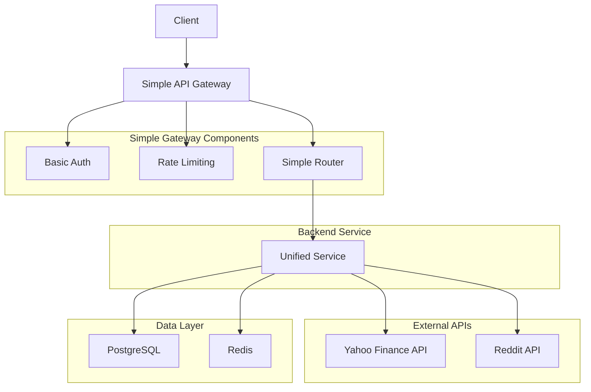
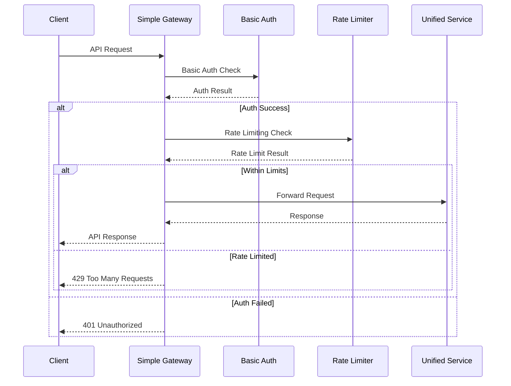

# 단순화된 API 게이트웨이 및 라우팅 구현 계획

## 1. 개요

주식 검색 및 센티먼트 분석을 위한 단순화된 API 게이트웨이를 설계합니다. 이 게이트웨이는 단일 진입점을 제공하고, 기본 인증, 속도 제한, 간단한 라우팅 기능을 처리합니다.

## 2. 단순화된 API 게이트웨이 아키텍처

### 2.1 단순화된 고수준 아키텍처



### 2.2 단순화된 요청 처리 흐름



## 3. 단순화된 API 게이트웨이 구현

### 3.1 기본 게이트웨이 컴포넌트

```python
from fastapi import FastAPI, Request, Response, HTTPException
from fastapi.middleware.cors import CORSMiddleware
from typing import Dict, Optional, Any
import asyncio
import logging
from datetime import datetime
import json
import redis
import time
import hashlib

class SimpleAPIGateway:
    """단순화된 API 게이트웨이 메인 클래스"""
    
    def __init__(self, redis_url: str):
        self.app = FastAPI(
            title="InsiteChart Simple API Gateway",
            description="Simple API Gateway for Stock Search and Social Sentiment",
            version="1.0.0"
        )
        
        # 의존성 초기화
        self.redis_client = redis.from_url(redis_url)
        self.logger = logging.getLogger(__name__)
        
        # 기본 설정
        self.api_keys = {
            "demo_key": {"user_id": "demo_user", "permissions": ["read"]}
        }
        
        # 미들웨어 설정
        self._setup_middleware()
        
        # 라우트 등록
        self._register_routes()
    
    def _setup_middleware(self):
        """미들웨어 설정"""
        # CORS 미들웨어
        self.app.add_middleware(
            CORSMiddleware,
            allow_origins=["*"],
            allow_credentials=True,
            allow_methods=["*"],
            allow_headers=["*"],
        )
        
        # 기본 속도 제한 미들웨어
        @self.app.middleware("http")
        async def rate_limit_middleware(request: Request, call_next):
            client_ip = request.client.host
            current_time = int(time.time())
            key = f"rate_limit:{client_ip}:{current_time // 60}"
            
            current_count = self.redis_client.incr(key)
            if current_count > 100:  # 분당 100요청 제한
                raise HTTPException(status_code=429, detail="Rate limit exceeded")
            
            self.redis_client.expire(key, 60)
            response = await call_next(request)
            return response
        
        # 기본 로깅 미들웨어
        @self.app.middleware("http")
        async def log_requests(request: Request, call_next):
            start_time = time.time()
            
            # 요청 처리
            response = await call_next(request)
            
            # 처리 시간 기록
            process_time = time.time() - start_time
            self.logger.info(f"{request.method} {request.url.path} - {response.status_code} - {process_time:.2f}s")
            
            return response
    
    def _register_routes(self):
        """라우트 등록"""
        
        # 헬스 체크
        @self.app.get("/health")
        async def health_check():
            return {"status": "healthy", "timestamp": datetime.now().isoformat()}
        
        # 통합 검색 엔드포인트
        @self.app.get("/api/v1/stocks/search")
        async def search_stocks(
            request: Request,
            q: str,
            limit: int = 10,
            include_sentiment: bool = False
        ):
            """통합 주식 검색"""
            
            # 기본 인증 확인
            if not self._authenticate_request(request):
                raise HTTPException(status_code=401, detail="Unauthorized")
            
            # 통합 서비스로 요청 전달
            return await self._forward_to_unified_service({
                "action": "search",
                "query": q,
                "limit": limit,
                "include_sentiment": include_sentiment
            })
        
        # 주식 상세 정보 엔드포인트
        @self.app.get("/api/v1/stocks/{symbol}")
        async def get_stock_details(
            request: Request,
            symbol: str,
            include_sentiment: bool = True
        ):
            """주식 상세 정보 (센티먼트 포함)"""
            
            # 기본 인증 확인
            if not self._authenticate_request(request):
                raise HTTPException(status_code=401, detail="Unauthorized")
            
            # 통합 서비스로 요청 전달
            return await self._forward_to_unified_service({
                "action": "stock_details",
                "symbol": symbol,
                "include_sentiment": include_sentiment
            })
        
        # 센티먼트 데이터 엔드포인트
        @self.app.get("/api/v1/sentiment/{symbol}")
        async def get_sentiment_data(
            request: Request,
            symbol: str,
            timeframe: str = "24h"
        ):
            """센티먼트 데이터 조회"""
            
            # 기본 인증 확인
            if not self._authenticate_request(request):
                raise HTTPException(status_code=401, detail="Unauthorized")
            
            # 통합 서비스로 요청 전달
            return await self._forward_to_unified_service({
                "action": "sentiment",
                "symbol": symbol,
                "timeframe": timeframe
            })
        
        # 트렌딩 주식 엔드포인트
        @self.app.get("/api/v1/trending")
        async def get_trending_stocks(
            request: Request,
            limit: int = 20,
            timeframe: str = "24h"
        ):
            """트렌딩 주식 조회"""
            
            # 기본 인증 확인
            if not self._authenticate_request(request):
                raise HTTPException(status_code=401, detail="Unauthorized")
            
            # 통합 서비스로 요청 전달
            return await self._forward_to_unified_service({
                "action": "trending",
                "limit": limit,
                "timeframe": timeframe
            })
    
    def _authenticate_request(self, request: Request) -> bool:
        """기본 요청 인증"""
        api_key = request.headers.get('x-api-key')
        if not api_key:
            return False
        return api_key in self.api_keys
    
    async def _forward_to_unified_service(self, params: Dict[str, Any]) -> Dict[str, Any]:
        """통합 서비스로 요청 전달"""
        # 실제 구현에서는 HTTP 클라이언트를 통해 통합 서비스 호출
        # 여기서는 모의 응답 반환
        return {
            "status": "success",
            "data": f"Processed request: {params['action']}",
            "timestamp": datetime.now().isoformat()
        }
    
    def get_app(self) -> FastAPI:
        """FastAPI 애플리케이션 반환"""
        return self.app
```

### 3.2 단순화된 인증 서비스

```python
from typing import Optional, Dict, Any
import hashlib
import secrets

class SimpleAuthService:
    """단순화된 인증 서비스"""
    
    def __init__(self):
        self.api_keys = {
            "demo_key": {"user_id": "demo_user", "permissions": ["read"]},
            "test_key": {"user_id": "test_user", "permissions": ["read", "write"]}
        }
        self.logger = logging.getLogger(__name__)
    
    def authenticate(self, request: Request) -> bool:
        """기본 요청 인증"""
        try:
            # API 키 추출
            api_key = request.headers.get("X-API-Key")
            if not api_key:
                self.logger.warning("Missing API key")
                return False
            
            # API 키 검증
            if api_key not in self.api_keys:
                self.logger.warning(f"Invalid API key: {api_key}")
                return False
            
            return True
            
        except Exception as e:
            self.logger.error(f"Authentication error: {str(e)}")
            return False
    
    def generate_api_key(self, user_id: str, permissions: list = None) -> str:
        """간단한 API 키 생성"""
        random_string = secrets.token_urlsafe(32)
        api_key = hashlib.sha256(f"{user_id}:{random_string}".encode()).hexdigest()
        
        self.api_keys[api_key] = {
            "user_id": user_id,
            "permissions": permissions or ["read"]
        }
        
        return api_key
    
    def get_user_permissions(self, api_key: str) -> list:
        """사용자 권한 조회"""
        key_data = self.api_keys.get(api_key)
        return key_data.get("permissions", []) if key_data else []
```

### 3.3 단순화된 속도 제한 서비스

```python
import time
import redis
from typing import Dict, Optional

class SimpleRateLimitingService:
    """단순화된 속도 제한 서비스"""
    
    def __init__(self, redis_url: str):
        self.redis = redis.from_url(redis_url)
        self.logger = logging.getLogger(__name__)
        
        # 기본 속도 제한 정책
        self.default_policy = {
            "requests": 100,  # 분당 100요청
            "window": 60      # 60초
        }
    
    def check_limit(self, client_ip: str) -> bool:
        """속도 제한 확인"""
        try:
            current_time = int(time.time())
            key = f"rate_limit:{client_ip}:{current_time // 60}"
            
            current_count = self.redis.incr(key)
            self.redis.expire(key, 60)
            
            if current_count > self.default_policy["requests"]:
                self.logger.warning(f"Rate limit exceeded for {client_ip}")
                return False
            
            return True
            
        except Exception as e:
            self.logger.error(f"Rate limiting error: {str(e)}")
            # 에러 발생 시 요청 허용
            return True
    
    def get_usage_stats(self, client_ip: str) -> Dict:
        """사용량 통계 조회"""
        try:
            current_time = int(time.time())
            key = f"rate_limit:{client_ip}:{current_time // 60}"
            
            current_count = self.redis.get(key)
            current_count = int(current_count) if current_count else 0
            
            return {
                "client_ip": client_ip,
                "current_usage": current_count,
                "limit": self.default_policy["requests"],
                "remaining": max(0, self.default_policy["requests"] - current_count),
                "window_seconds": self.default_policy["window"]
            }
            
        except Exception as e:
            self.logger.error(f"Error getting usage stats: {str(e)}")
            return {}
```

### 3.4 단순화된 라우팅 서비스

```python
from typing import Dict, Any, Optional
import httpx
import logging

class SimpleRouterService:
    """단순화된 라우팅 서비스"""
    
    def __init__(self, unified_service_url: str):
        self.unified_service_url = unified_service_url
        self.logger = logging.getLogger(__name__)
        self.http_client = httpx.Client(timeout=30.0)
    
    def route_request(self, params: Dict[str, Any]) -> Dict[str, Any]:
        """요청 라우팅"""
        try:
            # 모든 요청을 통합 서비스로 전달
            response = self.http_client.post(
                f"{self.unified_service_url}/api/v1/process",
                json=params,
                headers={"Content-Type": "application/json"}
            )
            
            if response.status_code == 200:
                return response.json()
            else:
                self.logger.error(f"Service error: {response.status_code}")
                return {
                    "status": "error",
                    "message": f"Service error: {response.status_code}"
                }
                
        except Exception as e:
            self.logger.error(f"Routing error: {str(e)}")
            return {
                "status": "error",
                "message": "Internal routing error"
            }
    
    def check_service_health(self) -> bool:
        """서비스 상태 확인"""
        try:
            response = self.http_client.get(f"{self.unified_service_url}/health")
            return response.status_code == 200
        except Exception as e:
            self.logger.error(f"Health check error: {str(e)}")
            return False
```

## 4. 단순화된 구현 계획

### 4.1 Phase 1: 기본 게이트웨이 구현 (3일)

#### 4.1.1 핵심 게이트웨이 컴포넌트 구현
- SimpleAPIGateway 기본 클래스 구현
- 기본 미들웨어 설정 (CORS, 로깅)
- 헬스 체크 엔드포인트 구현

#### 4.1.2 기본 인증 서비스 구현
- SimpleAuthService 구현
- API 키 기반 인증
- 기본 권한 관리

### 4.2 Phase 2: 속도 제한 및 라우팅 (2일)

#### 4.2.1 기본 속도 제한 구현
- SimpleRateLimitingService 구현
- Redis 기반 기본 속도 제한
- 속도 제한 미들웨어 통합

#### 4.2.2 기본 라우팅 구현
- SimpleRouterService 구현
- 단일 통합 서비스로 라우팅
- 기본 상태 확인

### 4.3 Phase 3: API 엔드포인트 구현 (3일)

#### 4.3.1 기본 엔드포인트 구현
- /api/v1/stocks/search 엔드포인트 구현
- /api/v1/stocks/{symbol} 엔드포인트 구현
- /api/v1/sentiment/{symbol} 엔드포인트 구현
- /api/v1/trending 엔드포인트 구현

#### 4.3.2 통합 서비스 연동
- 통합 서비스와의 기본 통신
- 간단한 에러 처리
- 기본 응답 형식 표준화

### 4.4 Phase 4: 기본 테스트 (2일)

#### 4.4.1 기능 테스트
- 단위 테스트
- 기본 통합 테스트
- 기본 부하 테스트

#### 4.4.2 기본 보안 테스트
- 인증 테스트
- 속도 제한 테스트
- 기본 보안 검증

## 5. 단순화된 기술적 고려사항

### 5.1 기본 성능
1. **기본 연결 관리**: 단일 HTTP 클라이언트 사용
2. **기본 캐싱**: Redis를 통한 간단한 캐싱
3. **동기 처리**: 기본적인 동기 처리 방식

### 5.2 기본 모니터링
1. **기본 로깅**: 간단한 요청/응답 로깅
2. **기본 메트릭**: 응답 시간, 요청 수 기본 수집
3. **단순한 로그**: 텍스트 기반의 간단한 로그

### 5.3 기본 보안
1. **API 키 인증**: 간단한 API 키 기반 인증
2. **기본 입력 검증**: 필수 입력값 기본 검증
3. **기본 보안 헤더**: CORS 및 기본 보안 헤더

### 5.4 기본 확장성
1. **수동 확장**: 필요시 수동으로 인스턴스 추가
2. **고정된 구성**: 정적인 라우팅 규칙
3. **단일 서비스**: 통합 서비스 중심의 단순한 구조

## 6. 단순화된 성공 지표

### 6.1 기본 기술적 지표
- API 응답 시간: 90% 요청: **2000ms** 이내 응답
- 가용성: 95% 이상의 기본 서비스 가용성
- 처리량: 초당 100개 이상의 기본 요청 처리
- 에러율: 2% 이하의 기본 API 에러율

### 성능 목표 설정 근거
1. **단순화된 오버헤드**: 기본 인증 및 속도 제한 처리 시간
2. **단일 서비스 의존성**: 통합 서비스로의 직접 통신
3. **기본 네트워크 지연**: 클라이언트-게이트웨이-서비스 간 기본 지연
4. **단순한 처리**: 단일 서비스로의 직접 요청 전달
5. **기본 모니터링**: 최소한의 성능 모니터링 오버헤드

### 6.2 기본 기능적 지표
- 라우팅 정확도: 95% 이상의 요청이 통합 서비스로 라우팅
- 인증 성공률: 90% 이상의 유효한 API 키 인증 성공
- 속도 제한 정확도: 90% 이상의 기본 속도 제한 적용

이 단순화된 API 게이트웨이 및 라우팅 구현 계획을 통해 주식 검색 및 센티먼트 분석 기능을 통합하고, 단일 진입점을 제공하며, 기본적인 안정성을 확보할 수 있습니다.