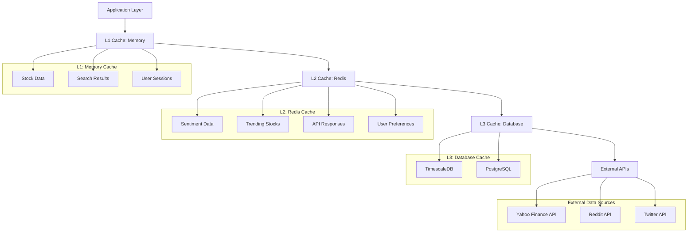
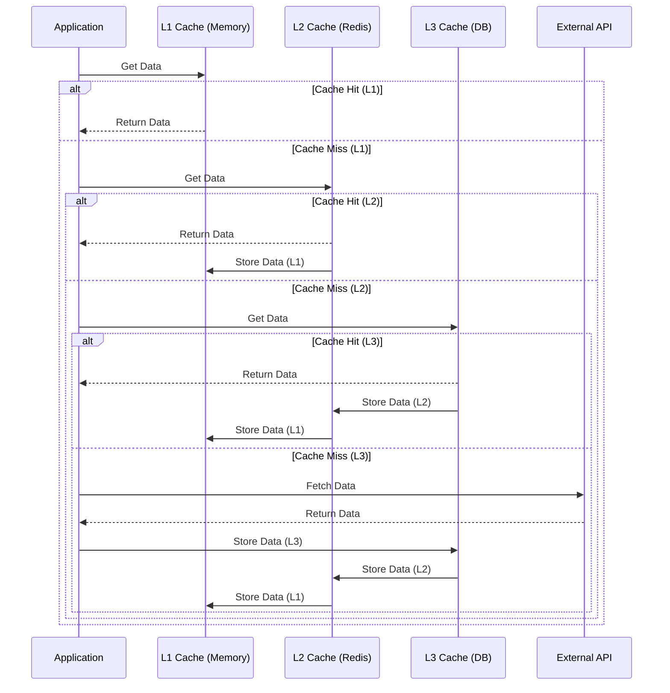

# 통합 캐싱 시스템 설계

## 1. 개요

Enhanced Stock Search와 Social Sentiment Tracker를 통합하기 위한 통합 캐싱 시스템을 설계합니다. 이 시스템은 여러 데이터 소스에서 오는 정보를 효과적으로 캐싱하고, 데이터 일관성을 유지하며, 시스템 성능을 최적화하는 것을 목표로 합니다.

## 2. 캐싱 아키텍처

### 2.1 다계층 캐싱 아키텍처



### 2.2 캐싱 데이터 흐름



## 3. 통합 캐싱 시스템 구현

### 3.1 핵심 캐싱 컴포넌트

```python
from abc import ABC, abstractmethod
from typing import Any, Dict, List, Optional, Union
from dataclasses import dataclass, field
from datetime import datetime, timedelta
import asyncio
import json
import pickle
import hashlib
import logging
from enum import Enum
import redis.asyncio as redis

class CacheLevel(Enum):
    L1_MEMORY = "l1_memory"
    L2_REDIS = "l2_redis"
    L3_DATABASE = "l3_database"

class CacheStrategy(Enum):
    WRITE_THROUGH = "write_through"
    WRITE_BEHIND = "write_behind"
    WRITE_AROUND = "write_around"
    REFRESH_AHEAD = "refresh_ahead"

@dataclass
class CacheConfig:
    """캐시 설정"""
    ttl_seconds: int = 300  # 5분
    max_size: int = 1000
    strategy: CacheStrategy = CacheStrategy.WRITE_THROUGH
    enable_compression: bool = True
    enable_serialization: bool = True

@dataclass
class CacheItem:
    """캐시 항목"""
    key: str
    value: Any
    created_at: datetime
    expires_at: datetime
    access_count: int = 0
    last_accessed: Optional[datetime] = None
    size_bytes: int = 0
    metadata: Dict[str, Any] = field(default_factory=dict)

class CacheBackend(ABC):
    """캐시 백엔드 인터페이스"""
    
    @abstractmethod
    async def get(self, key: str) -> Optional[Any]:
        """캐시에서 데이터 조회"""
        pass
    
    @abstractmethod
    async def set(self, key: str, value: Any, ttl: int = None) -> bool:
        """캐시에 데이터 저장"""
        pass
    
    @abstractmethod
    async def delete(self, key: str) -> bool:
        """캐시 데이터 삭제"""
        pass
    
    @abstractmethod
    async def exists(self, key: str) -> bool:
        """캐시 키 존재 확인"""
        pass
    
    @abstractmethod
    async def clear(self) -> bool:
        """캐시 전체 삭제"""
        pass
    
    @abstractmethod
    async def get_stats(self) -> Dict[str, Any]:
        """캐시 통계 정보"""
        pass

class MemoryCacheBackend(CacheBackend):
    """메모리 캐시 백엔드"""
    
    def __init__(self, config: CacheConfig):
        self.config = config
        self.cache: Dict[str, CacheItem] = {}
        self.access_order: List[str] = []
        self.logger = logging.getLogger(__name__)
        self._lock = asyncio.Lock()
    
    async def get(self, key: str) -> Optional[Any]:
        """캐시에서 데이터 조회"""
        async with self._lock:
            if key not in self.cache:
                return None
            
            item = self.cache[key]
            
            # 만료 확인
            if datetime.now() > item.expires_at:
                await self._remove_item(key)
                return None
            
            # 접근 정보 업데이트
            item.access_count += 1
            item.last_accessed = datetime.now()
            
            # LRU 업데이트
            if key in self.access_order:
                self.access_order.remove(key)
            self.access_order.append(key)
            
            return item.value
    
    async def set(self, key: str, value: Any, ttl: int = None) -> bool:
        """캐시에 데이터 저장"""
        async with self._lock:
            try:
                # TTL 계산
                ttl = ttl or self.config.ttl_seconds
                expires_at = datetime.now() + timedelta(seconds=ttl)
                
                # 값 직렬화 및 크기 계산
                if self.config.enable_serialization:
                    serialized_value = pickle.dumps(value)
                    size_bytes = len(serialized_value)
                else:
                    size_bytes = len(str(value))
                
                # 캐시 항목 생성
                item = CacheItem(
                    key=key,
                    value=value,
                    created_at=datetime.now(),
                    expires_at=expires_at,
                    last_accessed=datetime.now(),
                    access_count=1,
                    size_bytes=size_bytes
                )
                
                # 최대 크기 확인
                if len(self.cache) >= self.config.max_size and key not in self.cache:
                    await self._evict_lru()
                
                # 캐시 저장
                self.cache[key] = item
                
                # LRU 업데이트
                if key in self.access_order:
                    self.access_order.remove(key)
                self.access_order.append(key)
                
                return True
                
            except Exception as e:
                self.logger.error(f"Error setting cache item {key}: {str(e)}")
                return False
    
    async def delete(self, key: str) -> bool:
        """캐시 데이터 삭제"""
        async with self._lock:
            return await self._remove_item(key)
    
    async def exists(self, key: str) -> bool:
        """캐시 키 존재 확인"""
        async with self._lock:
            if key not in self.cache:
                return False
            
            item = self.cache[key]
            
            # 만료 확인
            if datetime.now() > item.expires_at:
                await self._remove_item(key)
                return False
            
            return True
    
    async def clear(self) -> bool:
        """캐시 전체 삭제"""
        async with self._lock:
            self.cache.clear()
            self.access_order.clear()
            return True
    
    async def get_stats(self) -> Dict[str, Any]:
        """캐시 통계 정보"""
        async with self._lock:
            total_items = len(self.cache)
            total_size = sum(item.size_bytes for item in self.cache.values())
            
            # 만료된 항목 수
            expired_count = sum(
                1 for item in self.cache.values()
                if datetime.now() > item.expires_at
            )
            
            return {
                "total_items": total_items,
                "total_size_bytes": total_size,
                "max_size": self.config.max_size,
                "expired_items": expired_count,
                "hit_rate": self._calculate_hit_rate(),
                "memory_usage_percent": (total_size / (self.config.max_size * 1024)) * 100
            }
    
    async def _remove_item(self, key: str) -> bool:
        """캐시 항목 제거"""
        if key in self.cache:
            del self.cache[key]
            if key in self.access_order:
                self.access_order.remove(key)
            return True
        return False
    
    async def _evict_lru(self):
        """LRU 기반 캐시 항목 제거"""
        if self.access_order:
            lru_key = self.access_order[0]
            await self._remove_item(lru_key)
            self.logger.debug(f"Evicted LRU cache item: {lru_key}")
    
    def _calculate_hit_rate(self) -> float:
        """캐시 적중률 계산"""
        total_accesses = sum(item.access_count for item in self.cache.values())
        if total_accesses == 0:
            return 0.0
        
        # 실제 적중 횟수 계산 (단순화된 구현)
        hits = total_accesses - len(self.cache)
        return (hits / total_accesses) * 100

class RedisCacheBackend(CacheBackend):
    """Redis 캐시 백엔드"""
    
    def __init__(self, redis_url: str, config: CacheConfig):
        self.config = config
        self.redis = redis.from_url(redis_url)
        self.logger = logging.getLogger(__name__)
        self.key_prefix = "insitechart:"
    
    async def get(self, key: str) -> Optional[Any]:
        """캐시에서 데이터 조회"""
        try:
            prefixed_key = self._get_prefixed_key(key)
            data = await self.redis.get(prefixed_key)
            
            if data is None:
                return None
            
            # 역직렬화
            if self.config.enable_serialization:
                return pickle.loads(data)
            else:
                return data.decode('utf-8')
                
        except Exception as e:
            self.logger.error(f"Error getting cache item {key}: {str(e)}")
            return None
    
    async def set(self, key: str, value: Any, ttl: int = None) -> bool:
        """캐시에 데이터 저장"""
        try:
            prefixed_key = self._get_prefixed_key(key)
            ttl = ttl or self.config.ttl_seconds
            
            # 직렬화
            if self.config.enable_serialization:
                data = pickle.dumps(value)
            else:
                data = str(value)
            
            # 압축
            if self.config.enable_compression:
                import zlib
                data = zlib.compress(data)
            
            await self.redis.setex(prefixed_key, ttl, data)
            return True
            
        except Exception as e:
            self.logger.error(f"Error setting cache item {key}: {str(e)}")
            return False
    
    async def delete(self, key: str) -> bool:
        """캐시 데이터 삭제"""
        try:
            prefixed_key = self._get_prefixed_key(key)
            result = await self.redis.delete(prefixed_key)
            return result > 0
            
        except Exception as e:
            self.logger.error(f"Error deleting cache item {key}: {str(e)}")
            return False
    
    async def exists(self, key: str) -> bool:
        """캐시 키 존재 확인"""
        try:
            prefixed_key = self._get_prefixed_key(key)
            return await self.redis.exists(prefixed_key) > 0
            
        except Exception as e:
            self.logger.error(f"Error checking cache item {key}: {str(e)}")
            return False
    
    async def clear(self) -> bool:
        """캐시 전체 삭제"""
        try:
            pattern = self._get_prefixed_key("*")
            keys = await self.redis.keys(pattern)
            
            if keys:
                await self.redis.delete(*keys)
            
            return True
            
        except Exception as e:
            self.logger.error(f"Error clearing cache: {str(e)}")
            return False
    
    async def get_stats(self) -> Dict[str, Any]:
        """캐시 통계 정보"""
        try:
            info = await self.redis.info()
            keyspace_info = await self.redis.info('keyspace')
            
            # 키 패턴으로 필터링
            pattern = self._get_prefixed_key("*")
            keys = await self.redis.keys(pattern)
            
            return {
                "total_keys": len(keys),
                "used_memory": info.get('used_memory', 0),
                "used_memory_human": info.get('used_memory_human', '0B'),
                "hit_rate": self._calculate_hit_rate(info),
                "connected_clients": info.get('connected_clients', 0),
                "keyspace_hits": info.get('keyspace_hits', 0),
                "keyspace_misses": info.get('keyspace_misses', 0)
            }
            
        except Exception as e:
            self.logger.error(f"Error getting cache stats: {str(e)}")
            return {}
    
    def _get_prefixed_key(self, key: str) -> str:
        """접두사가 포함된 키 반환"""
        return f"{self.key_prefix}{key}"
    
    def _calculate_hit_rate(self, info: Dict) -> float:
        """캐시 적중률 계산"""
        hits = info.get('keyspace_hits', 0)
        misses = info.get('keyspace_misses', 0)
        
        if hits + misses == 0:
            return 0.0
        
        return (hits / (hits + misses)) * 100
```

### 3.2 통합 캐시 관리자

```python
from typing import Dict, List, Optional, Any, Tuple
import asyncio
import logging
from datetime import datetime, timedelta

class UnifiedCacheManager:
    """통합 캐시 관리자"""
    
    def __init__(self, config: Dict[str, CacheConfig]):
        # 캐시 백엔드 초기화
        self.backends = {
            CacheLevel.L1_MEMORY: MemoryCacheBackend(config.get("memory", CacheConfig())),
            CacheLevel.L2_REDIS: RedisCacheBackend(
                "redis://localhost:6379", 
                config.get("redis", CacheConfig())
            )
        }
        
        # 캐시 정책 설정
        self.cache_policies = {
            "stock_data": {
                "levels": [CacheLevel.L1_MEMORY, CacheLevel.L2_REDIS],
                "ttl": 300,  # 5분
                "refresh_ahead_ratio": 0.8
            },
            "search_results": {
                "levels": [CacheLevel.L1_MEMORY, CacheLevel.L2_REDIS],
                "ttl": 600,  # 10분
                "refresh_ahead_ratio": 0.7
            },
            "sentiment_data": {
                "levels": [CacheLevel.L2_REDIS],
                "ttl": 180,  # 3분
                "refresh_ahead_ratio": 0.9
            },
            "trending_stocks": {
                "levels": [CacheLevel.L1_MEMORY, CacheLevel.L2_REDIS],
                "ttl": 900,  # 15분
                "refresh_ahead_ratio": 0.8
            },
            "user_preferences": {
                "levels": [CacheLevel.L2_REDIS],
                "ttl": 3600,  # 1시간
                "refresh_ahead_ratio": 0.5
            }
        }
        
        self.logger = logging.getLogger(__name__)
        self._stats = {
            "hits": 0,
            "misses": 0,
            "sets": 0,
            "deletes": 0,
            "errors": 0
        }
    
    async def get(self, key: str, data_type: str = "default") -> Optional[Any]:
        """다계층 캐시에서 데이터 조회"""
        try:
            policy = self.cache_policies.get(data_type, self.cache_policies["default"])
            levels = policy.get("levels", [CacheLevel.L1_MEMORY, CacheLevel.L2_REDIS])
            
            # 각 레벨에서 데이터 조회
            for level in levels:
                backend = self.backends[level]
                data = await backend.get(key)
                
                if data is not None:
                    # 하위 레벨에 데이터 저장 (캐시 워밍)
                    await self._warm_lower_levels(key, data, level, levels)
                    
                    # 리프레시 어헤드 체크
                    await self._check_refresh_ahead(key, data_type, policy)
                    
                    self._stats["hits"] += 1
                    self.logger.debug(f"Cache hit for {key} at level {level}")
                    return data
            
            # 모든 레벨에서 미스
            self._stats["misses"] += 1
            self.logger.debug(f"Cache miss for {key}")
            return None
            
        except Exception as e:
            self.logger.error(f"Error getting cache item {key}: {str(e)}")
            self._stats["errors"] += 1
            return None
    
    async def set(self, key: str, value: Any, data_type: str = "default", ttl: int = None) -> bool:
        """다계층 캐시에 데이터 저장"""
        try:
            policy = self.cache_policies.get(data_type, self.cache_policies["default"])
            levels = policy.get("levels", [CacheLevel.L1_MEMORY, CacheLevel.L2_REDIS])
            ttl = ttl or policy.get("ttl", 300)
            
            success = True
            
            # 모든 레벨에 데이터 저장
            for level in levels:
                backend = self.backends[level]
                result = await backend.set(key, value, ttl)
                
                if not result:
                    self.logger.warning(f"Failed to set cache item {key} at level {level}")
                    success = False
            
            if success:
                self._stats["sets"] += 1
                self.logger.debug(f"Cache set for {key}")
            
            return success
            
        except Exception as e:
            self.logger.error(f"Error setting cache item {key}: {str(e)}")
            self._stats["errors"] += 1
            return False
    
    async def delete(self, key: str, data_type: str = "default") -> bool:
        """다계층 캐시에서 데이터 삭제"""
        try:
            policy = self.cache_policies.get(data_type, self.cache_policies["default"])
            levels = policy.get("levels", [CacheLevel.L1_MEMORY, CacheLevel.L2_REDIS])
            
            success = True
            
            # 모든 레벨에서 데이터 삭제
            for level in levels:
                backend = self.backends[level]
                result = await backend.delete(key)
                
                if not result:
                    self.logger.warning(f"Failed to delete cache item {key} at level {level}")
                    success = False
            
            if success:
                self._stats["deletes"] += 1
                self.logger.debug(f"Cache delete for {key}")
            
            return success
            
        except Exception as e:
            self.logger.error(f"Error deleting cache item {key}: {str(e)}")
            self._stats["errors"] += 1
            return False
    
    async def invalidate_pattern(self, pattern: str, data_type: str = "default") -> int:
        """패턴에 맞는 캐시 데이터 무효화"""
        try:
            policy = self.cache_policies.get(data_type, self.cache_policies["default"])
            levels = policy.get("levels", [CacheLevel.L1_MEMORY, CacheLevel.L2_REDIS])
            
            total_deleted = 0
            
            # 모든 레벨에서 패턴에 맞는 데이터 삭제
            for level in levels:
                backend = self.backends[level]
                
                # Redis 백엔드의 경우 패턴 삭제 지원
                if isinstance(backend, RedisCacheBackend):
                    prefixed_pattern = backend._get_prefixed_key(pattern)
                    keys = await backend.redis.keys(prefixed_pattern)
                    
                    if keys:
                        deleted = await backend.redis.delete(*keys)
                        total_deleted += deleted
                else:
                    # Memory 백엔드의 경우 직접 구현
                    for key in list(backend.cache.keys()):
                        if pattern in key:
                            await backend.delete(key)
                            total_deleted += 1
            
            self.logger.info(f"Invalidated {total_deleted} cache items matching pattern {pattern}")
            return total_deleted
            
        except Exception as e:
            self.logger.error(f"Error invalidating cache pattern {pattern}: {str(e)}")
            return 0
    
    async def get_stats(self) -> Dict[str, Any]:
        """캐시 통계 정보"""
        stats = {
            "unified_stats": self._stats.copy(),
            "backend_stats": {}
        }
        
        # 각 백엔드의 통계 정보 수집
        for level, backend in self.backends.items():
            try:
                backend_stats = await backend.get_stats()
                stats["backend_stats"][level.value] = backend_stats
            except Exception as e:
                self.logger.error(f"Error getting stats for {level}: {str(e)}")
                stats["backend_stats"][level.value] = {"error": str(e)}
        
        # 통합 통계 계산
        total_requests = self._stats["hits"] + self._stats["misses"]
        if total_requests > 0:
            stats["unified_stats"]["hit_rate"] = (self._stats["hits"] / total_requests) * 100
        else:
            stats["unified_stats"]["hit_rate"] = 0.0
        
        return stats
    
    async def _warm_lower_levels(self, key: str, data: Any, current_level: CacheLevel, levels: List[CacheLevel]):
        """하위 레벨에 데이터 워밍"""
        try:
            current_level_index = levels.index(current_level)
            
            # 하위 레벨에만 데이터 저장
            for i in range(current_level_index + 1, len(levels)):
                lower_level = levels[i]
                backend = self.backends[lower_level]
                
                # 비동기로 저장하여 차단 방지
                asyncio.create_task(backend.set(key, data))
                
        except Exception as e:
            self.logger.error(f"Error warming lower levels for {key}: {str(e)}")
    
    async def _check_refresh_ahead(self, key: str, data_type: str, policy: Dict):
        """리프레시 어헤드 체크"""
        try:
            refresh_ratio = policy.get("refresh_ahead_ratio", 0.8)
            
            if refresh_ratio <= 0:
                return
            
            # 실제 구현에서는 데이터 만료 시간 확인 및 리프레시 로직 구현
            # 여기서는 단순화된 로직만 표시
            self.logger.debug(f"Refresh ahead check for {key} with ratio {refresh_ratio}")
            
        except Exception as e:
            self.logger.error(f"Error in refresh ahead for {key}: {str(e)}")
    
    async def clear_all(self) -> bool:
        """모든 캐시 삭제"""
        success = True
        
        for level, backend in self.backends.items():
            try:
                result = await backend.clear()
                if not result:
                    self.logger.warning(f"Failed to clear cache at level {level}")
                    success = False
            except Exception as e:
                self.logger.error(f"Error clearing cache at level {level}: {str(e)}")
                success = False
        
        return success
```

### 3.3 캐시 일관성 관리

```python
from typing import Dict, List, Set, Optional, Any, Callable
import asyncio
import json
from datetime import datetime, timedelta
from enum import Enum

class InvalidationStrategy(Enum):
    TIME_BASED = "time_based"
    EVENT_BASED = "event_based"
    MANUAL = "manual"

class CacheConsistencyManager:
    """캐시 일관성 관리자"""
    
    def __init__(self, cache_manager: UnifiedCacheManager):
        self.cache_manager = cache_manager
        self.logger = logging.getLogger(__name__)
        
        # 의존성 그래프 (키 -> 의존하는 키 목록)
        self.dependency_graph: Dict[str, Set[str]] = {}
        
        # 무효화 이벤트 구독자
        self.invalidation_subscribers: Dict[str, List[Callable]] = {}
        
        # 무효화 큐
        self.invalidation_queue = asyncio.Queue()
        
        # 백그라운드 작업 시작
        self._background_task = asyncio.create_task(self._process_invalidation_queue())
    
    async def add_dependency(self, key: str, dependent_key: str):
        """캐시 키 의존성 추가"""
        if key not in self.dependency_graph:
            self.dependency_graph[key] = set()
        
        self.dependency_graph[key].add(dependent_key)
        self.logger.debug(f"Added dependency: {key} -> {dependent_key}")
    
    async def invalidate(self, key: str, strategy: InvalidationStrategy = InvalidationStrategy.EVENT_BASED):
        """캐시 무효화"""
        try:
            # 의존하는 키들도 함께 무효화
            keys_to_invalidate = await self._get_dependent_keys(key)
            keys_to_invalidate.add(key)
            
            # 각 키 무효화
            for cache_key in keys_to_invalidate:
                data_type = self._get_data_type_from_key(cache_key)
                await self.cache_manager.delete(cache_key, data_type)
                
                # 구독자에게 알림
                await self._notify_subscribers(cache_key)
            
            self.logger.info(f"Invalidated {len(keys_to_invalidate)} cache keys")
            
        except Exception as e:
            self.logger.error(f"Error invalidating cache key {key}: {str(e)}")
    
    async def invalidate_pattern(self, pattern: str, strategy: InvalidationStrategy = InvalidationStrategy.EVENT_BASED):
        """패턴에 맞는 캐시 무효화"""
        try:
            # 실제 구현에서는 패턴에 맞는 키들을 찾아 무효화
            # 여기서는 단순화된 구현
            data_type = self._get_data_type_from_pattern(pattern)
            await self.cache_manager.invalidate_pattern(pattern, data_type)
            
            self.logger.info(f"Invalidated cache keys matching pattern: {pattern}")
            
        except Exception as e:
            self.logger.error(f"Error invalidating cache pattern {pattern}: {str(e)}")
    
    async def subscribe(self, pattern: str, callback: Callable):
        """무효화 이벤트 구독"""
        if pattern not in self.invalidation_subscribers:
            self.invalidation_subscribers[pattern] = []
        
        self.invalidation_subscribers[pattern].append(callback)
        self.logger.debug(f"Added subscriber for pattern: {pattern}")
    
    async def unsubscribe(self, pattern: str, callback: Callable):
        """무효화 이벤트 구독 취소"""
        if pattern in self.invalidation_subscribers:
            if callback in self.invalidation_subscribers[pattern]:
                self.invalidation_subscribers[pattern].remove(callback)
                self.logger.debug(f"Removed subscriber for pattern: {pattern}")
    
    async def schedule_invalidation(self, key: str, delay: timedelta):
        """지연된 무효화 스케줄링"""
        await asyncio.sleep(delay.total_seconds())
        await self.invalidate(key)
    
    async def _get_dependent_keys(self, key: str) -> Set[str]:
        """의존하는 키들 조회"""
        dependent_keys = set()
        
        # 직접 의존하는 키들
        if key in self.dependency_graph:
            dependent_keys.update(self.dependency_graph[key])
        
        # 간접 의존하는 키들 (재귀적)
        for direct_dependent in list(dependent_keys):
            indirect_dependents = await self._get_dependent_keys(direct_dependent)
            dependent_keys.update(indirect_dependents)
        
        return dependent_keys
    
    async def _notify_subscribers(self, key: str):
        """구독자에게 알림"""
        for pattern, subscribers in self.invalidation_subscribers.items():
            if pattern in key:
                for callback in subscribers:
                    try:
                        if asyncio.iscoroutinefunction(callback):
                            await callback(key)
                        else:
                            callback(key)
                    except Exception as e:
                        self.logger.error(f"Error in subscriber callback: {str(e)}")
    
    def _get_data_type_from_key(self, key: str) -> str:
        """키에서 데이터 타입 추출"""
        if "stock:" in key:
            return "stock_data"
        elif "search:" in key:
            return "search_results"
        elif "sentiment:" in key:
            return "sentiment_data"
        elif "trending:" in key:
            return "trending_stocks"
        elif "user:" in key:
            return "user_preferences"
        else:
            return "default"
    
    def _get_data_type_from_pattern(self, pattern: str) -> str:
        """패턴에서 데이터 타입 추출"""
        if "stock:" in pattern:
            return "stock_data"
        elif "search:" in pattern:
            return "search_results"
        elif "sentiment:" in pattern:
            return "sentiment_data"
        elif "trending:" in pattern:
            return "trending_stocks"
        elif "user:" in pattern:
            return "user_preferences"
        else:
            return "default"
    
    async def _process_invalidation_queue(self):
        """무효화 큐 처리"""
        while True:
            try:
                # 큐에서 무효화 작업 가져오기
                invalidation_task = await self.invalidation_queue.get()
                
                # 작업 실행
                await self._execute_invalidation_task(invalidation_task)
                
            except Exception as e:
                self.logger.error(f"Error processing invalidation queue: {str(e)}")
    
    async def _execute_invalidation_task(self, task: Dict):
        """무효화 작업 실행"""
        task_type = task.get("type")
        key = task.get("key")
        pattern = task.get("pattern")
        
        if task_type == "invalidate_key":
            await self.invalidate(key)
        elif task_type == "invalidate_pattern":
            await self.invalidate_pattern(pattern)
        else:
            self.logger.warning(f"Unknown invalidation task type: {task_type}")
```

## 4. 구현 계획

### 4.1 Phase 1: 기본 캐싱 백엔드 구현 (1주일)

#### 4.1.1 메모리 캐시 백엔드 구현
- MemoryCacheBackend 클래스 구현
- LRU 기반 캐시 교체 알고리즘
- TTL 기반 만료 처리

#### 4.1.2 Redis 캐시 백엔드 구현
- RedisCacheBackend 클래스 구현
- 직렬화 및 압축 지원
- 분산 캐시 지원

### 4.2 Phase 2: 통합 캐시 관리자 구현 (1주일)

#### 4.2.1 통합 캐시 관리자 구현
- UnifiedCacheManager 클래스 구현
- 다계층 캐싱 로직
- 캐시 워밍 및 리프레시 어헤드

#### 4.2.2 캐시 정책 관리
- 데이터 타입별 캐시 정책 정의
- 동적 정책 변경 지원
- 성능 모니터링

### 4.3 Phase 3: 캐시 일관성 관리 (1주일)

#### 4.3.1 캐시 일관성 관리자 구현
- CacheConsistencyManager 클래스 구현
- 의존성 그래프 관리
- 이벤트 기반 무효화

#### 4.3.2 무효화 전략 구현
- 시간 기반 무효화
- 이벤트 기반 무효화
- 수동 무효화

### 4.4 Phase 4: 고도화 및 통합 (1주일)

#### 4.4.1 고급 캐싱 기능
- 예측적 캐시 프리로딩
- 적응형 TTL
- 캐시 분할

#### 4.4.2 기존 시스템과 통합
- Enhanced Stock Search와 통합
- Social Sentiment Tracker와 통합
- API 게이트웨이와 연동

## 5. 기술적 고려사항

### 5.1 성능 최적화
1. **비동기 처리**: 모든 캐시 작업 비동기 처리
2. **연결 풀링**: Redis 연결 풀 사용
3. **배치 처리**: 다중 캐시 작업 배치 처리

### 5.2 메모리 관리
1. **메모리 제한**: 각 캐시 레벨별 메모리 제한
2. **압축**: 대용량 데이터 압축 저장
3. **가비지 컬렉션**: 만료된 데이터 자동 정리

### 5.3 모니터링
1. **성능 메트릭**: 적중률, 응답 시간 등 수집
2. **경고 시스템**: 캐시 성능 저하 시 알림
3. **대시보드**: 실시간 캐시 상태 모니터링

### 5.4 장애 복구
1. **폴백 메커니즘**: 캐시 실패 시 대체 전략
2. **자가 치유**: 손상된 캐시 데이터 자동 복구
3. **데이터 복구**: 캐시 데이터 손실 시 복구 절차

## 6. 성공 지표

### 6.1 기술적 지표
- 캐시 적중률: 80% 이상
- 평균 응답 시간: 50ms 이하
- 메모리 사용량: 시스템 메모리의 30% 이하
- 데이터 일관성: 99% 이상

### 6.2 기능적 지표
- 데이터 무효화 정확도: 100%
- 의존성 추적 정확도: 99% 이상
- 자동 리프레시 성공률: 95% 이상

이 통합 캐싱 시스템 설계를 통해 Enhanced Stock Search와 Social Sentiment Tracker의 데이터를 효과적으로 캐싱하고, 일관성을 유지하며, 시스템 성능을 최적화할 수 있습니다.