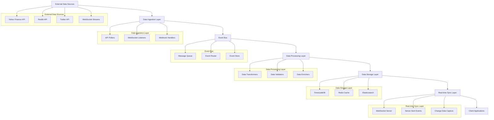
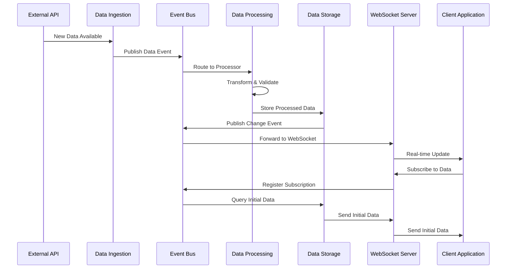

# 실시간 데이터 동기화 전략

## 1. 개요

Enhanced Stock Search와 Social Sentiment Tracker를 통합하기 위한 실시간 데이터 동기화 전략을 설계합니다. 이 전략은 주식 데이터와 소셜 센티먼트 데이터를 실시간으로 동기화하고, 일관성을 유지하며, 사용자에게 최신 정보를 제공하는 것을 목표로 합니다.

## 2. 실시간 데이터 동기화 아키텍처

### 2.1 고수준 아키텍처



### 2.2 데이터 동기화 흐름



## 3. 실시간 데이터 동기화 구현

### 3.1 이벤트 기반 아키텍처

```python
from abc import ABC, abstractmethod
from typing import Dict, List, Optional, Any, Callable
from dataclasses import dataclass, field
from datetime import datetime
import asyncio
import json
import logging
from enum import Enum
import uuid
import redis.asyncio as redis
from aiokafka import AIOKafkaProducer, AIOKafkaConsumer
import websockets
from websockets.server import WebSocketServerProtocol

class EventType(Enum):
    STOCK_PRICE_UPDATE = "stock_price_update"
    SENTIMENT_UPDATE = "sentiment_update"
    TRENDING_UPDATE = "trending_update"
    MENTION_UPDATE = "mention_update"
    SYSTEM_STATUS = "system_status"

class EventPriority(Enum):
    LOW = 1
    NORMAL = 2
    HIGH = 3
    CRITICAL = 4

@dataclass
class DataEvent:
    """데이터 이벤트"""
    event_id: str = field(default_factory=lambda: str(uuid.uuid4()))
    event_type: EventType = EventType.STOCK_PRICE_UPDATE
    priority: EventPriority = EventPriority.NORMAL
    timestamp: datetime = field(default_factory=datetime.now)
    source: str = ""
    data: Dict[str, Any] = field(default_factory=dict)
    metadata: Dict[str, Any] = field(default_factory=dict)
    
    def to_dict(self) -> Dict[str, Any]:
        """딕셔너리로 변환"""
        return {
            "event_id": self.event_id,
            "event_type": self.event_type.value,
            "priority": self.priority.value,
            "timestamp": self.timestamp.isoformat(),
            "source": self.source,
            "data": self.data,
            "metadata": self.metadata
        }
    
    @classmethod
    def from_dict(cls, data: Dict[str, Any]) -> 'DataEvent':
        """딕셔너리에서 이벤트 생성"""
        return cls(
            event_id=data.get("event_id", str(uuid.uuid4())),
            event_type=EventType(data.get("event_type", "stock_price_update")),
            priority=EventPriority(data.get("priority", 2)),
            timestamp=datetime.fromisoformat(data.get("timestamp", datetime.now().isoformat())),
            source=data.get("source", ""),
            data=data.get("data", {}),
            metadata=data.get("metadata", {})
        )

class EventBus(ABC):
    """이벤트 버스 인터페이스"""
    
    @abstractmethod
    async def publish(self, event: DataEvent) -> bool:
        """이벤트 발행"""
        pass
    
    @abstractmethod
    async def subscribe(self, event_type: EventType, callback: Callable) -> str:
        """이벤트 구독"""
        pass
    
    @abstractmethod
    async def unsubscribe(self, subscription_id: str) -> bool:
        """구독 취소"""
        pass

class KafkaEventBus(EventBus):
    """Kafka 기반 이벤트 버스"""
    
    def __init__(self, bootstrap_servers: str, topic: str = "insitechart-events"):
        self.bootstrap_servers = bootstrap_servers
        self.topic = topic
        self.producer = None
        self.consumer = None
        self.subscriptions: Dict[str, Dict] = {}
        self.logger = logging.getLogger(__name__)
        self._running = False
    
    async def start(self):
        """이벤트 버스 시작"""
        try:
            # 프로듀서 초기화
            self.producer = AIOKafkaProducer(
                bootstrap_servers=self.bootstrap_servers,
                value_serializer=lambda v: json.dumps(v).encode('utf-8')
            )
            await self.producer.start()
            
            # 컨슈머 초기화
            self.consumer = AIOKafkaConsumer(
                self.topic,
                bootstrap_servers=self.bootstrap_servers,
                value_deserializer=lambda v: json.loads(v.decode('utf-8'))
            )
            await self.consumer.start()
            
            self._running = True
            
            # 메시지 처리 시작
            asyncio.create_task(self._process_messages())
            
            self.logger.info("Kafka event bus started")
            
        except Exception as e:
            self.logger.error(f"Error starting Kafka event bus: {str(e)}")
            raise
    
    async def stop(self):
        """이벤트 버스 중지"""
        self._running = False
        
        if self.producer:
            await self.producer.stop()
        
        if self.consumer:
            await self.consumer.stop()
        
        self.logger.info("Kafka event bus stopped")
    
    async def publish(self, event: DataEvent) -> bool:
        """이벤트 발행"""
        try:
            if not self.producer:
                self.logger.error("Producer not initialized")
                return False
            
            # 이벤트 발행
            await self.producer.send_and_wait(
                topic=self.topic,
                value=event.to_dict()
            )
            
            self.logger.debug(f"Published event {event.event_id} of type {event.event_type}")
            return True
            
        except Exception as e:
            self.logger.error(f"Error publishing event {event.event_id}: {str(e)}")
            return False
    
    async def subscribe(self, event_type: EventType, callback: Callable) -> str:
        """이벤트 구독"""
        subscription_id = str(uuid.uuid4())
        
        self.subscriptions[subscription_id] = {
            "event_type": event_type,
            "callback": callback,
            "created_at": datetime.now()
        }
        
        self.logger.debug(f"Subscribed to {event_type} with ID {subscription_id}")
        return subscription_id
    
    async def unsubscribe(self, subscription_id: str) -> bool:
        """구독 취소"""
        if subscription_id in self.subscriptions:
            del self.subscriptions[subscription_id]
            self.logger.debug(f"Unsubscribed {subscription_id}")
            return True
        
        return False
    
    async def _process_messages(self):
        """메시지 처리"""
        try:
            async for message in self.consumer:
                try:
                    # 이벤트 디코딩
                    event = DataEvent.from_dict(message.value)
                    
                    # 구독자에게 알림
                    await self._notify_subscribers(event)
                    
                except Exception as e:
                    self.logger.error(f"Error processing message: {str(e)}")
                    
        except Exception as e:
            self.logger.error(f"Error in message processing loop: {str(e)}")
    
    async def _notify_subscribers(self, event: DataEvent):
        """구독자에게 알림"""
        for subscription_id, subscription in self.subscriptions.items():
            if subscription["event_type"] == event.event_type:
                try:
                    callback = subscription["callback"]
                    
                    if asyncio.iscoroutinefunction(callback):
                        await callback(event)
                    else:
                        callback(event)
                        
                except Exception as e:
                    self.logger.error(f"Error in subscriber callback: {str(e)}")

class RedisEventBus(EventBus):
    """Redis 기반 이벤트 버스"""
    
    def __init__(self, redis_url: str):
        self.redis = redis.from_url(redis_url)
        self.subscriptions: Dict[str, Dict] = {}
        self.logger = logging.getLogger(__name__)
        self._running = False
        self._pubsub = None
    
    async def start(self):
        """이벤트 버스 시작"""
        try:
            self._pubsub = self.redis.pubsub()
            await self._pubsub.subscribe("insitechart-events")
            
            self._running = True
            
            # 메시지 처리 시작
            asyncio.create_task(self._process_messages())
            
            self.logger.info("Redis event bus started")
            
        except Exception as e:
            self.logger.error(f"Error starting Redis event bus: {str(e)}")
            raise
    
    async def stop(self):
        """이벤트 버스 중지"""
        self._running = False
        
        if self._pubsub:
            await self._pubsub.unsubscribe("insitechart-events")
            await self._pubsub.close()
        
        await self.redis.close()
        
        self.logger.info("Redis event bus stopped")
    
    async def publish(self, event: DataEvent) -> bool:
        """이벤트 발행"""
        try:
            # 이벤트 발행
            await self.redis.publish(
                "insitechart-events",
                json.dumps(event.to_dict())
            )
            
            self.logger.debug(f"Published event {event.event_id} of type {event.event_type}")
            return True
            
        except Exception as e:
            self.logger.error(f"Error publishing event {event.event_id}: {str(e)}")
            return False
    
    async def subscribe(self, event_type: EventType, callback: Callable) -> str:
        """이벤트 구독"""
        subscription_id = str(uuid.uuid4())
        
        self.subscriptions[subscription_id] = {
            "event_type": event_type,
            "callback": callback,
            "created_at": datetime.now()
        }
        
        self.logger.debug(f"Subscribed to {event_type} with ID {subscription_id}")
        return subscription_id
    
    async def unsubscribe(self, subscription_id: str) -> bool:
        """구독 취소"""
        if subscription_id in self.subscriptions:
            del self.subscriptions[subscription_id]
            self.logger.debug(f"Unsubscribed {subscription_id}")
            return True
        
        return False
    
    async def _process_messages(self):
        """메시지 처리"""
        try:
            async for message in self._pubsub.listen():
                if message["type"] == "message":
                    try:
                        # 이벤트 디코딩
                        event = DataEvent.from_dict(json.loads(message["data"]))
                        
                        # 구독자에게 알림
                        await self._notify_subscribers(event)
                        
                    except Exception as e:
                        self.logger.error(f"Error processing message: {str(e)}")
                        
        except Exception as e:
            self.logger.error(f"Error in message processing loop: {str(e)}")
    
    async def _notify_subscribers(self, event: DataEvent):
        """구독자에게 알림"""
        for subscription_id, subscription in self.subscriptions.items():
            if subscription["event_type"] == event.event_type:
                try:
                    callback = subscription["callback"]
                    
                    if asyncio.iscoroutinefunction(callback):
                        await callback(event)
                    else:
                        callback(event)
                        
                except Exception as e:
                    self.logger.error(f"Error in subscriber callback: {str(e)}")
```

### 3.2 데이터 수집 및 처리

```python
from abc import ABC, abstractmethod
from typing import Dict, List, Optional, Any
import asyncio
import aiohttp
import websockets
from datetime import datetime, timedelta
import logging

class DataCollector(ABC):
    """데이터 수집기 인터페이스"""
    
    @abstractmethod
    async def start_collection(self) -> bool:
        """데이터 수집 시작"""
        pass
    
    @abstractmethod
    async def stop_collection(self) -> bool:
        """데이터 수집 중지"""
        pass
    
    @abstractmethod
    async def get_status(self) -> Dict[str, Any]:
        """수집 상태 조회"""
        pass

class StockPriceCollector(DataCollector):
    """주식 가격 데이터 수집기"""
    
    def __init__(self, symbols: List[str], event_bus: EventBus):
        self.symbols = symbols
        self.event_bus = event_bus
        self.logger = logging.getLogger(__name__)
        self._running = False
        self._collection_task = None
    
    async def start_collection(self) -> bool:
        """데이터 수집 시작"""
        try:
            if self._running:
                return False
            
            self._running = True
            self._collection_task = asyncio.create_task(self._collect_loop())
            
            self.logger.info(f"Started stock price collection for {len(self.symbols)} symbols")
            return True
            
        except Exception as e:
            self.logger.error(f"Error starting stock price collection: {str(e)}")
            return False
    
    async def stop_collection(self) -> bool:
        """데이터 수집 중지"""
        try:
            self._running = False
            
            if self._collection_task:
                self._collection_task.cancel()
                try:
                    await self._collection_task
                except asyncio.CancelledError:
                    pass
            
            self.logger.info("Stopped stock price collection")
            return True
            
        except Exception as e:
            self.logger.error(f"Error stopping stock price collection: {str(e)}")
            return False
    
    async def get_status(self) -> Dict[str, Any]:
        """수집 상태 조회"""
        return {
            "running": self._running,
            "symbols_count": len(self.symbols),
            "last_collection": getattr(self, '_last_collection', None)
        }
    
    async def _collect_loop(self):
        """데이터 수집 루프"""
        while self._running:
            try:
                # 주식 가격 데이터 수집
                await self._collect_stock_prices()
                
                # 30초 대기
                await asyncio.sleep(30)
                
            except asyncio.CancelledError:
                break
            except Exception as e:
                self.logger.error(f"Error in collection loop: {str(e)}")
                await asyncio.sleep(5)  # 에러 발생 시 5초 대기
    
    async def _collect_stock_prices(self):
        """주식 가격 데이터 수집"""
        try:
            # 실제 구현에서는 Yahoo Finance API 등에서 데이터 수집
            # 여기서는 시뮬레이션 데이터 사용
            
            for symbol in self.symbols:
                # 시뮬레이션된 가격 데이터
                price_data = await self._fetch_price_data(symbol)
                
                if price_data:
                    # 이벤트 생성 및 발행
                    event = DataEvent(
                        event_type=EventType.STOCK_PRICE_UPDATE,
                        priority=EventPriority.NORMAL,
                        source="yahoo_finance",
                        data={
                            "symbol": symbol,
                            "price": price_data["price"],
                            "change": price_data["change"],
                            "change_percent": price_data["change_percent"],
                            "volume": price_data["volume"]
                        }
                    )
                    
                    await self.event_bus.publish(event)
            
            self._last_collection = datetime.now()
            
        except Exception as e:
            self.logger.error(f"Error collecting stock prices: {str(e)}")
    
    async def _fetch_price_data(self, symbol: str) -> Optional[Dict[str, Any]]:
        """주식 가격 데이터 조회"""
        try:
            # 실제 구현에서는 Yahoo Finance API 호출
            # 여기서는 시뮬레이션 데이터 반환
            
            import random
            
            base_price = 100.0 + random.uniform(-50, 200)
            change = random.uniform(-5, 5)
            change_percent = (change / base_price) * 100
            
            return {
                "price": base_price + change,
                "change": change,
                "change_percent": change_percent,
                "volume": random.randint(100000, 10000000)
            }
            
        except Exception as e:
            self.logger.error(f"Error fetching price data for {symbol}: {str(e)}")
            return None

class SentimentDataCollector(DataCollector):
    """센티먼트 데이터 수집기"""
    
    def __init__(self, event_bus: EventBus):
        self.event_bus = event_bus
        self.logger = logging.getLogger(__name__)
        self._running = False
        self._collection_task = None
    
    async def start_collection(self) -> bool:
        """데이터 수집 시작"""
        try:
            if self._running:
                return False
            
            self._running = True
            self._collection_task = asyncio.create_task(self._collect_loop())
            
            self.logger.info("Started sentiment data collection")
            return True
            
        except Exception as e:
            self.logger.error(f"Error starting sentiment collection: {str(e)}")
            return False
    
    async def stop_collection(self) -> bool:
        """데이터 수집 중지"""
        try:
            self._running = False
            
            if self._collection_task:
                self._collection_task.cancel()
                try:
                    await self._collection_task
                except asyncio.CancelledError:
                    pass
            
            self.logger.info("Stopped sentiment data collection")
            return True
            
        except Exception as e:
            self.logger.error(f"Error stopping sentiment collection: {str(e)}")
            return False
    
    async def get_status(self) -> Dict[str, Any]:
        """수집 상태 조회"""
        return {
            "running": self._running,
            "last_collection": getattr(self, '_last_collection', None)
        }
    
    async def _collect_loop(self):
        """데이터 수집 루프"""
        while self._running:
            try:
                # 센티먼트 데이터 수집
                await self._collect_sentiment_data()
                
                # 5분 대기
                await asyncio.sleep(300)
                
            except asyncio.CancelledError:
                break
            except Exception as e:
                self.logger.error(f"Error in collection loop: {str(e)}")
                await asyncio.sleep(30)  # 에러 발생 시 30초 대기
    
    async def _collect_sentiment_data(self):
        """센티먼트 데이터 수집"""
        try:
            # 실제 구현에서는 Reddit, Twitter API에서 데이터 수집
            # 여기서는 시뮬레이션 데이터 사용
            
            # 시뮬레이션된 센티먼트 데이터
            sentiment_data = await self._fetch_sentiment_data()
            
            if sentiment_data:
                # 이벤트 생성 및 발행
                event = DataEvent(
                    event_type=EventType.SENTIMENT_UPDATE,
                    priority=EventPriority.NORMAL,
                    source="reddit_twitter",
                    data=sentiment_data
                )
                
                await self.event_bus.publish(event)
            
            self._last_collection = datetime.now()
            
        except Exception as e:
            self.logger.error(f"Error collecting sentiment data: {str(e)}")
    
    async def _fetch_sentiment_data(self) -> Optional[Dict[str, Any]]:
        """센티먼트 데이터 조회"""
        try:
            # 실제 구현에서는 Reddit, Twitter API 호출
            # 여기서는 시뮬레이션 데이터 반환
            
            import random
            
            symbols = ["AAPL", "TSLA", "GME", "AMC", "NVDA"]
            selected_symbols = random.sample(symbols, random.randint(1, 3))
            
            sentiment_updates = []
            
            for symbol in selected_symbols:
                sentiment_score = random.uniform(-100, 100)
                mention_count = random.randint(10, 1000)
                
                sentiment_updates.append({
                    "symbol": symbol,
                    "sentiment_score": sentiment_score,
                    "mention_count": mention_count,
                    "trending": mention_count > 500
                })
            
            return {
                "updates": sentiment_updates,
                "timestamp": datetime.now().isoformat()
            }
            
        except Exception as e:
            self.logger.error(f"Error fetching sentiment data: {str(e)}")
            return None
```

### 3.3 실시간 데이터 전송

```python
from typing import Dict, List, Set, Optional, Any
import asyncio
import json
import logging
from datetime import datetime
import websockets
from websockets.server import WebSocketServerProtocol
from websockets.exceptions import ConnectionClosed

class RealtimeDataManager:
    """실시간 데이터 관리자"""
    
    def __init__(self, event_bus: EventBus):
        self.event_bus = event_bus
        self.connections: Dict[str, WebSocketServerProtocol] = {}
        self.subscriptions: Dict[str, Set[str]] = {}  # event_type -> connection_ids
        self.logger = logging.getLogger(__name__)
        self._running = False
    
    async def start(self):
        """실시간 데이터 관리자 시작"""
        try:
            # 이벤트 버스 구독
            await self.event_bus.subscribe(EventType.STOCK_PRICE_UPDATE, self._handle_stock_price_update)
            await self.event_bus.subscribe(EventType.SENTIMENT_UPDATE, self._handle_sentiment_update)
            await self.event_bus.subscribe(EventType.TRENDING_UPDATE, self._handle_trending_update)
            
            self._running = True
            
            # WebSocket 서버 시작
            server = await websockets.serve(
                self._handle_websocket_connection,
                "localhost",
                8765
            )
            
            self.logger.info("Realtime data manager started on ws://localhost:8765")
            
        except Exception as e:
            self.logger.error(f"Error starting realtime data manager: {str(e)}")
            raise
    
    async def stop(self):
        """실시간 데이터 관리자 중지"""
        self._running = False
        
        # 모든 연결 종료
        for connection_id, connection in self.connections.items():
            try:
                await connection.close()
            except Exception as e:
                self.logger.error(f"Error closing connection {connection_id}: {str(e)}")
        
        self.connections.clear()
        self.subscriptions.clear()
        
        self.logger.info("Realtime data manager stopped")
    
    async def _handle_websocket_connection(self, websocket: WebSocketServerProtocol, path: str):
        """WebSocket 연결 처리"""
        connection_id = str(uuid.uuid4())
        self.connections[connection_id] = websocket
        
        self.logger.info(f"New WebSocket connection: {connection_id}")
        
        try:
            # 연결 유지 및 메시지 처리
            async for message in websocket:
                await self._handle_client_message(connection_id, message)
                
        except ConnectionClosed:
            self.logger.info(f"WebSocket connection closed: {connection_id}")
        except Exception as e:
            self.logger.error(f"Error in WebSocket connection {connection_id}: {str(e)}")
        finally:
            # 연결 정리
            await self._cleanup_connection(connection_id)
    
    async def _handle_client_message(self, connection_id: str, message: str):
        """클라이언트 메시지 처리"""
        try:
            data = json.loads(message)
            message_type = data.get("type")
            
            if message_type == "subscribe":
                # 구독 요청 처리
                event_types = data.get("event_types", [])
                await self._handle_subscription(connection_id, event_types)
                
            elif message_type == "unsubscribe":
                # 구독 취소 요청 처리
                event_types = data.get("event_types", [])
                await self._handle_unsubscription(connection_id, event_types)
                
            elif message_type == "ping":
                # 핑/퐁 처리
                await self._send_pong(connection_id)
                
            else:
                self.logger.warning(f"Unknown message type: {message_type}")
                
        except Exception as e:
            self.logger.error(f"Error handling client message: {str(e)}")
    
    async def _handle_subscription(self, connection_id: str, event_types: List[str]):
        """구독 처리"""
        try:
            for event_type_str in event_types:
                try:
                    event_type = EventType(event_type_str)
                    
                    if event_type not in self.subscriptions:
                        self.subscriptions[event_type] = set()
                    
                    self.subscriptions[event_type].add(connection_id)
                    
                    self.logger.debug(f"Connection {connection_id} subscribed to {event_type}")
                    
                except ValueError:
                    self.logger.warning(f"Invalid event type: {event_type_str}")
            
            # 구독 확인 응답
            await self._send_subscription_confirmation(connection_id, event_types)
            
        except Exception as e:
            self.logger.error(f"Error handling subscription: {str(e)}")
    
    async def _handle_unsubscription(self, connection_id: str, event_types: List[str]):
        """구독 취소 처리"""
        try:
            for event_type_str in event_types:
                try:
                    event_type = EventType(event_type_str)
                    
                    if event_type in self.subscriptions:
                        self.subscriptions[event_type].discard(connection_id)
                        
                        # 구독자가 없으면 정리
                        if not self.subscriptions[event_type]:
                            del self.subscriptions[event_type]
                    
                    self.logger.debug(f"Connection {connection_id} unsubscribed from {event_type}")
                    
                except ValueError:
                    self.logger.warning(f"Invalid event type: {event_type_str}")
            
            # 구독 취소 확인 응답
            await self._send_unsubscription_confirmation(connection_id, event_types)
            
        except Exception as e:
            self.logger.error(f"Error handling unsubscription: {str(e)}")
    
    async def _send_subscription_confirmation(self, connection_id: str, event_types: List[str]):
        """구독 확인 응답 전송"""
        try:
            websocket = self.connections.get(connection_id)
            if websocket:
                message = {
                    "type": "subscription_confirmed",
                    "event_types": event_types,
                    "timestamp": datetime.now().isoformat()
                }
                
                await websocket.send(json.dumps(message))
                
        except Exception as e:
            self.logger.error(f"Error sending subscription confirmation: {str(e)}")
    
    async def _send_unsubscription_confirmation(self, connection_id: str, event_types: List[str]):
        """구독 취소 확인 응답 전송"""
        try:
            websocket = self.connections.get(connection_id)
            if websocket:
                message = {
                    "type": "unsubscription_confirmed",
                    "event_types": event_types,
                    "timestamp": datetime.now().isoformat()
                }
                
                await websocket.send(json.dumps(message))
                
        except Exception as e:
            self.logger.error(f"Error sending unsubscription confirmation: {str(e)}")
    
    async def _send_pong(self, connection_id: str):
        """퐁 응답 전송"""
        try:
            websocket = self.connections.get(connection_id)
            if websocket:
                message = {
                    "type": "pong",
                    "timestamp": datetime.now().isoformat()
                }
                
                await websocket.send(json.dumps(message))
                
        except Exception as e:
            self.logger.error(f"Error sending pong: {str(e)}")
    
    async def _cleanup_connection(self, connection_id: str):
        """연결 정리"""
        try:
            # 연결 목록에서 제거
            if connection_id in self.connections:
                del self.connections[connection_id]
            
            # 구독 목록에서 제거
            for event_type, subscribers in self.subscriptions.items():
                subscribers.discard(connection_id)
            
            self.logger.info(f"Cleaned up connection {connection_id}")
            
        except Exception as e:
            self.logger.error(f"Error cleaning up connection {connection_id}: {str(e)}")
    
    async def _handle_stock_price_update(self, event: DataEvent):
        """주식 가격 업데이트 처리"""
        await self._broadcast_event(EventType.STOCK_PRICE_UPDATE, event)
    
    async def _handle_sentiment_update(self, event: DataEvent):
        """센티먼트 업데이트 처리"""
        await self._broadcast_event(EventType.SENTIMENT_UPDATE, event)
    
    async def _handle_trending_update(self, event: DataEvent):
        """트렌딩 업데이트 처리"""
        await self._broadcast_event(EventType.TRENDING_UPDATE, event)
    
    async def _broadcast_event(self, event_type: EventType, event: DataEvent):
        """이벤트 브로드캐스트"""
        try:
            if event_type not in self.subscriptions:
                return
            
            # 구독자에게 이벤트 전송
            message = {
                "type": event_type.value,
                "event": event.to_dict(),
                "timestamp": datetime.now().isoformat()
            }
            
            message_json = json.dumps(message)
            
            # 비동기로 모든 구독자에게 전송
            tasks = []
            for connection_id in self.subscriptions[event_type]:
                if connection_id in self.connections:
                    websocket = self.connections[connection_id]
                    task = asyncio.create_task(self._send_to_websocket(websocket, message_json))
                    tasks.append(task)
            
            if tasks:
                await asyncio.gather(*tasks, return_exceptions=True)
            
            self.logger.debug(f"Broadcasted {event_type} event to {len(tasks)} subscribers")
            
        except Exception as e:
            self.logger.error(f"Error broadcasting event {event_type}: {str(e)}")
    
    async def _send_to_websocket(self, websocket: WebSocketServerProtocol, message: str):
        """WebSocket으로 메시지 전송"""
        try:
            await websocket.send(message)
        except ConnectionClosed:
            # 연결이 이미 닫힌 경우 무시
            pass
        except Exception as e:
            self.logger.error(f"Error sending to WebSocket: {str(e)}")
    
    async def get_stats(self) -> Dict[str, Any]:
        """통계 정보 조회"""
        return {
            "active_connections": len(self.connections),
            "subscriptions": {
                event_type.value: len(subscribers)
                for event_type, subscribers in self.subscriptions.items()
            },
            "running": self._running
        }
```

## 4. 구현 계획

### 4.1 Phase 1: 이벤트 버스 구현 (1주일)

#### 4.1.1 이벤트 버스 인터페이스 정의
- DataEvent 클래스 구현
- EventBus 인터페이스 정의
- EventType, EventPriority 열거형 정의

#### 4.1.2 Kafka 기반 이벤트 버스 구현
- KafkaEventBus 클래스 구현
- 이벤트 발행 및 구독 기능
- 메시지 처리 루프

### 4.2 Phase 2: 데이터 수집기 구현 (1주일)

#### 4.2.1 주식 가격 데이터 수집기
- StockPriceCollector 클래스 구현
- Yahoo Finance API 연동
- 주기적 데이터 수집

#### 4.2.2 센티먼트 데이터 수집기
- SentimentDataCollector 클래스 구현
- Reddit, Twitter API 연동
- 실시간 데이터 수집

### 4.3 Phase 3: 실시간 데이터 전송 (1주일)

#### 4.3.1 WebSocket 서버 구현
- RealtimeDataManager 클래스 구현
- WebSocket 연결 처리
- 클라이언트 구독 관리

#### 4.3.2 이벤트 브로드캐스트
- 이벤트 구독 및 브로드캐스트
- 연결 상태 관리
- 에러 처리 및 재연결

### 4.4 Phase 4: 통합 및 최적화 (1주일)

#### 4.4.1 시스템 통합
- 데이터 수집기와 이벤트 버스 통합
- 실시간 데이터 관리자와 이벤트 버스 연동
- 기존 시스템과의 통합

#### 4.4.2 성능 최적화
- 배치 처리 최적화
- 메모리 사용량 최적화
- 네트워크 통신 최적화

## 5. 기술적 고려사항

### 5.1 성능 최적화
1. **비동기 처리**: 모든 I/O 작업 비동기 처리
2. **배치 처리**: 다수의 이벤트 배치 처리
3. **연결 풀링**: 데이터베이스 및 외부 API 연결 풀 사용

### 5.2 신뢰성
1. **재연결 메커니즘**: 연결 끊김 시 자동 재연결
2. **에러 처리**: 견고한 에러 처리 및 복구
3. **상태 관리**: 시스템 상태 지속적 관리

### 5.3 확장성
1. **수평적 확장**: 여러 인스턴스에서 실행 가능한 구조
2. **분산 처리**: 이벤트 분산 처리 지원
3. **동적 구성**: 런타임에 구성 변경 가능

### 5.4 모니터링
1. **실시간 모니터링**: 시스템 상태 실시간 모니터링
2. **성능 메트릭**: 처리량, 지연 시간 등 수집
3. **경고 시스템**: 이상 상태 발생 시 알림

## 6. 성공 지표

### 6.1 기술적 지표
- 이벤트 처리 지연 시간: 100ms 이하
- 데이터 동기화 지연 시간: 500ms 이하
- WebSocket 연결 안정성: 99.9% 이상
- 시스템 가용성: 99.9% 이상

### 6.2 기능적 지표
- 실시간 데이터 정확도: 99% 이상
- 이벤트 유실률: 0.1% 이하
- 구독자 알림 지연 시간: 200ms 이하
- 동기화 일관성: 99% 이상

이 실시간 데이터 동기화 전략을 통해 Enhanced Stock Search와 Social Sentiment Tracker의 데이터를 실시간으로 동기화하고, 사용자에게 최신 정보를 제공하며, 시스템의 반응성을 크게 향상시킬 수 있습니다.