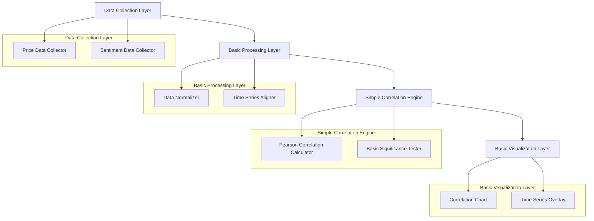
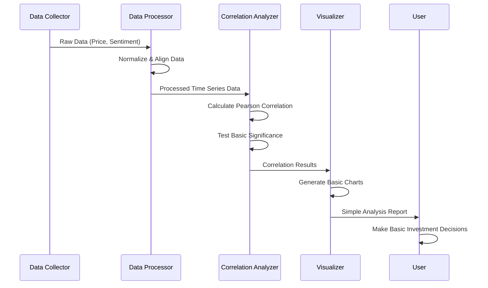

# 상관관계 분석 기능 구현 계획 (단순화 버전)

## 1. 개요

주식 가격과 소셜 센티먼트 간의 기본적인 상관관계를 분석하는 단순화된 기능을 설계합니다. 이 기능은 사용자가 주가 움직임과 소셜 트렌드 간의 기본적인 관계를 이해하고, 투자 결정에 기본적인 참고 정보를 제공하는 것을 목표로 합니다.

**주요 변경사항**:
- 복잡한 통계 분석 대신 기본적인 상관계수 계산에 집중
- 다양한 분석 방법 대신 피어슨 상관계수만 지원
- 실시간 분석 대신 일별/주별 분석으로 단순화
- 복잡한 시각화 대신 기본적인 차트만 제공

## 2. 단순화된 상관관계 분석 아키텍처

### 2.1 고수준 아키텍처 (단순화)



### 2.2 단순화된 데이터 흐름



## 3. 단순화된 상관관계 분석 구현

### 3.1 기본 데이터 수집 및 전처리

```python
from typing import Dict, List, Optional, Any, Tuple
from dataclasses import dataclass, field
from datetime import datetime, timedelta
import asyncio
import numpy as np
import pandas as pd
from scipy import stats
import logging

@dataclass
class SentimentPoint:
    """센티먼트 데이터 포인트"""
    timestamp: datetime
    score: float  # -100 to 100
    source: str
    mention_count: int = 0
    confidence: float = 0.0

@dataclass
class UnifiedStockData:
    """단순화된 통합 주식 데이터 모델"""
    # 기본 정보
    symbol: str
    company_name: str
    stock_type: str  # common, preferred, etf
    exchange: str
    sector: str
    industry: str
    
    # 가격 정보
    current_price: float
    price_change_24h: float = 0.0
    price_change_pct_24h: float = 0.0
    market_cap: Optional[float] = None
    
    # 센티먼트 정보
    sentiment_score: float = 0.0  # 센티먼트 점수 범위: -100~+100 범위
    sentiment_history: List[SentimentPoint] = field(default_factory=list)
    mention_count_7d: int = 0
    
    # 데이터 품질
    data_quality_score: float = 0.0  # 0 to 1
    last_updated: datetime = field(default_factory=datetime.now)
    
    # 시계열 데이터 (상관관계 분석용)
    timestamps: List[datetime] = field(default_factory=list)
    prices: List[float] = field(default_factory=list)
    mentions: List[int] = field(default_factory=list)
    
    def to_dataframe(self) -> pd.DataFrame:
        """DataFrame으로 변환"""
        return pd.DataFrame({
            'timestamp': self.timestamps,
            'price': self.prices,
            'mentions': self.mentions
        }).set_index('timestamp')
    
    def get_sentiment_timeseries(self) -> pd.DataFrame:
        """센티먼트 시계열 데이터 반환"""
        if not self.sentiment_history:
            return pd.DataFrame(columns=['timestamp', 'sentiment_score'])
        
        return pd.DataFrame([
            {'timestamp': sp.timestamp, 'sentiment_score': sp.score}
            for sp in self.sentiment_history
        ]).set_index('timestamp')

class SimpleDataCollector:
    """단순화된 데이터 수집기"""
    
    def __init__(self, data_sources: Dict[str, Any]):
        self.data_sources = data_sources
        self.logger = logging.getLogger(__name__)
    
    async def collect_data(self, symbol: str, start_date: datetime,
                       end_date: datetime) -> UnifiedStockData:
        """기본 주식 데이터 수집"""
        try:
            # 기본 데이터 소스에서만 데이터 수집
            tasks = [
                self._collect_price_data(symbol, start_date, end_date),
                self._collect_sentiment_data(symbol, start_date, end_date)
            ]
            
            results = await asyncio.gather(*tasks, return_exceptions=True)
            
            # 결과 처리
            price_data = results[0] if not isinstance(results[0], Exception) else []
            sentiment_data = results[1] if not isinstance(results[1], Exception) else []
            
            # 통합 주식 데이터 생성
            return self._create_unified_stock_data(
                symbol, price_data, sentiment_data, start_date, end_date
            )
            
        except Exception as e:
            self.logger.error(f"Error collecting data for {symbol}: {str(e)}")
            raise
    
    async def _collect_price_data(self, symbol: str, start_date: datetime, 
                             end_date: datetime) -> List[Tuple[datetime, float]]:
        """가격 데이터 수집"""
        # 실제 구현에서는 Yahoo Finance API 등에서 데이터 수집
        # 여기서는 시뮬레이션된 데이터 반환
        dates = pd.date_range(start=start_date, end=end_date, freq='D')
        prices = []
        
        base_price = 100.0
        for i, date in enumerate(dates):
            # 랜덤 워직임 생성
            change = np.random.normal(0, 2)
            price = base_price * (1 + change / 100)
            prices.append((date, price))
            base_price = price
        
        return prices
    
    async def _collect_sentiment_data(self, symbol: str, start_date: datetime, 
                                end_date: datetime) -> List[Tuple[datetime, float]]:
        """센티먼트 데이터 수집"""
        # 실제 구현에서는 Reddit, Twitter API에서 데이터 수집
        dates = pd.date_range(start=start_date, end=end_date, freq='D')
        sentiment_data = []
        
        for date in dates:
            # 시뮬레이션된 센티먼트 데이터 생성
            score = np.random.normal(0, 30)
            sentiment_data.append((date, score))
        
        return sentiment_data
    
    async def _collect_volume_data(self, symbol: str, start_date: datetime, 
                             end_date: datetime) -> List[Tuple[datetime, int]]:
        """거래량 데이터 수집"""
        dates = pd.date_range(start=start_date, end=end_date, freq='D')
        volume_data = []
        
        for date in dates:
            # 시뮬레이션된 거래량 데이터 생성
            volume = int(np.random.lognormal(10, 1))
            volume_data.append((date, volume))
        
        return volume_data
    
    async def _collect_external_events(self, symbol: str, start_date: datetime, 
                                 end_date: datetime) -> List[Dict]:
        """외부 이벤트 데이터 수집"""
        # 실제 구현에서는 뉴스, 보도서, 경제 발표 등에서 데이터 수집
        events = []
        
        # 시뮬레이션된 외부 이벤트
        event_dates = pd.date_range(start=start_date, end=end_date, freq='W')
        
        for event_date in event_dates:
            if np.random.random() > 0.8:  # 20% 확률로 이벤트 발생
                events.append({
                    'date': event_date,
                    'type': np.random.choice(['earnings', 'news', 'analyst_upgrade', 'regulatory']),
                    'title': f"{symbol} {np.random.choice(['beat', 'missed', 'raised'])} expectations",
                    'impact': np.random.choice(['positive', 'negative', 'neutral'])
                })
        
        return events
    
    def _create_unified_stock_data(self, symbol: str, price_data: List[Tuple[datetime, float]],
                                  sentiment_data: List[Tuple[datetime, float]], start_date: datetime,
                                  end_date: datetime) -> UnifiedStockData:
        """통합 주식 데이터 생성"""
        # 날짜 범위 생성
        date_range = pd.date_range(start=start_date, end=end_date, freq='D')
        
        # 데이터 딕셔너리 생성
        price_dict = dict(price_data)
        sentiment_dict = dict(sentiment_data)
        
        timestamps = []
        prices = []
        mentions = []
        sentiment_points = []
        
        for date in date_range:
            timestamps.append(date)
            
            # 가격 데이터
            if date in price_dict:
                prices.append(price_dict[date])
            else:
                # 이전 가격으로 채우기
                if prices:
                    prices.append(prices[-1])
                else:
                    prices.append(100.0)
            
            # 언급량 (센티먼트와 관련)
            mention_count = int(np.random.exponential(10))
            mentions.append(mention_count)
            
            # 센티먼트 데이터
            if date in sentiment_dict:
                sentiment_score = sentiment_dict[date]
                sentiment_points.append(SentimentPoint(
                    timestamp=date,
                    score=sentiment_score,
                    source="reddit",
                    mention_count=mention_count,
                    confidence=0.8
                ))
        
        # 현재 가격 계산 (마지막 가격)
        current_price = prices[-1] if prices else 100.0
        
        # 24시간 변화 계산
        price_change_24h = 0.0
        price_change_pct_24h = 0.0
        if len(prices) >= 2:
            price_change_24h = prices[-1] - prices[-2]
            price_change_pct_24h = (price_change_24h / prices[-2]) * 100 if prices[-2] > 0 else 0.0
        
        # 전체 센티먼트 점수 계산
        total_sentiment = sum(sp.score for sp in sentiment_points)
        avg_sentiment = total_sentiment / len(sentiment_points) if sentiment_points else 0.0
        
        return UnifiedStockData(
            symbol=symbol,
            company_name=f"{symbol} Corporation",
            stock_type="common",
            exchange="NYSE",
            sector="Technology",
            industry="Software",
            current_price=current_price,
            price_change_24h=price_change_24h,
            price_change_pct_24h=price_change_pct_24h,
            market_cap=current_price * 1000000,  # 시뮬레이션
            sentiment_score=avg_sentiment,
            sentiment_history=sentiment_points,
            mention_count_7d=sum(mentions[-7:]) if len(mentions) >= 7 else sum(mentions),
            data_quality_score=0.85,
            timestamps=timestamps,
            prices=prices,
            mentions=mentions
        )

class SimpleDataProcessor:
    """단순화된 데이터 전처리기"""
    
    def __init__(self):
        self.logger = logging.getLogger(__name__)
    
    def normalize_data(self, data: UnifiedStockData) -> UnifiedStockData:
        """기본 데이터 정규화"""
        try:
            df = data.to_dataframe()
            
            # 가격 데이터 정규화 (첫날을 100으로)
            if len(df) > 0 and df['price'].iloc[0] > 0:
                price_normalizer = 100.0 / df['price'].iloc[0]
                df['price_normalized'] = df['price'] * price_normalizer
            else:
                df['price_normalized'] = df['price']
            
            # 언급량 정규화 (로그 스케일)
            df['mentions_normalized'] = np.log1p(df['mentions'])
            
            # 정규화된 데이터로 UnifiedStockData 업데이트
            normalized_data = UnifiedStockData(
                symbol=data.symbol,
                company_name=data.company_name,
                stock_type=data.stock_type,
                exchange=data.exchange,
                sector=data.sector,
                industry=data.industry,
                current_price=data.current_price,
                price_change_24h=data.price_change_24h,
                price_change_pct_24h=data.price_change_pct_24h,
                market_cap=data.market_cap,
                sentiment_score=data.sentiment_score,
                sentiment_history=data.sentiment_history,
                mention_count_7d=data.mention_count_7d,
                data_quality_score=data.data_quality_score,
                last_updated=data.last_updated,
                timestamps=data.timestamps,
                prices=df['price_normalized'].tolist(),
                mentions=df['mentions_normalized'].tolist()
            )
            
            return normalized_data
            
        except Exception as e:
            self.logger.error(f"Error normalizing data: {str(e)}")
            raise
    
    def align_time_series(self, data1: UnifiedStockData, data2: UnifiedStockData) -> Tuple[UnifiedStockData, UnifiedStockData]:
        """두 시계열 데이터 정렬"""
        try:
            df1 = data1.to_dataframe()
            df2 = data2.to_dataframe()
            
            # 공통 날짜 범위 찾기
            common_dates = df1.index.intersection(df2.index)
            
            if len(common_dates) == 0:
                self.logger.warning("No common dates found between time series")
                return data1, data2
            
            # 공통 날짜로 데이터 필터링
            df1_aligned = df1.loc[common_dates]
            df2_aligned = df2.loc[common_dates]
            
            # 정렬된 UnifiedStockData 생성
            aligned_data1 = UnifiedStockData(
                symbol=data1.symbol,
                company_name=data1.company_name,
                stock_type=data1.stock_type,
                exchange=data1.exchange,
                sector=data1.sector,
                industry=data1.industry,
                current_price=data1.current_price,
                price_change_24h=data1.price_change_24h,
                price_change_pct_24h=data1.price_change_pct_24h,
                market_cap=data1.market_cap,
                sentiment_score=data1.sentiment_score,
                sentiment_history=data1.sentiment_history,
                mention_count_7d=data1.mention_count_7d,
                data_quality_score=data1.data_quality_score,
                last_updated=data1.last_updated,
                timestamps=common_dates.tolist(),
                prices=df1_aligned['price'].tolist(),
                mentions=df1_aligned['mentions'].tolist()
            )
            
            aligned_data2 = UnifiedStockData(
                symbol=data2.symbol,
                company_name=data2.company_name,
                stock_type=data2.stock_type,
                exchange=data2.exchange,
                sector=data2.sector,
                industry=data2.industry,
                current_price=data2.current_price,
                price_change_24h=data2.price_change_24h,
                price_change_pct_24h=data2.price_change_pct_24h,
                market_cap=data2.market_cap,
                sentiment_score=data2.sentiment_score,
                sentiment_history=data2.sentiment_history,
                mention_count_7d=data2.mention_count_7d,
                data_quality_score=data2.data_quality_score,
                last_updated=data2.last_updated,
                timestamps=common_dates.tolist(),
                prices=df2_aligned['price'].tolist(),
                mentions=df2_aligned['mentions'].tolist()
            )
            
            return aligned_data1, aligned_data2
            
        except Exception as e:
            self.logger.error(f"Error aligning time series: {str(e)}")
            raise
    
    def extract_basic_features(self, data: UnifiedStockData) -> Dict[str, List[float]]:
        """기본 특징 추출"""
        try:
            df = data.to_dataframe()
            sentiment_df = data.get_sentiment_timeseries()
            
            features = {}
            
            # 기본 기술적 지표
            features['returns'] = df['price'].pct_change().fillna(0).tolist()
            features['volatility'] = df['price'].rolling(window=20).std().fillna(0).tolist()
            
            # 기본 센티먼트 관련 특징
            if not sentiment_df.empty:
                features['sentiment_ma'] = sentiment_df['sentiment_score'].rolling(window=7).mean().fillna(0).tolist()
                features['sentiment_momentum'] = sentiment_df['sentiment_score'].diff().fillna(0).tolist()
            else:
                features['sentiment_ma'] = [0.0] * len(df)
                features['sentiment_momentum'] = [0.0] * len(df)
            
            # 기본 언급량 관련 특징
            features['mentions_ma'] = df['mentions'].rolling(window=7).mean().fillna(0).tolist()
            
            return features
            
        except Exception as e:
            self.logger.error(f"Error extracting features: {str(e)}")
            raise
```

### 3.2 단순화된 상관관계 분석 엔진

```python
from typing import Dict, List, Optional, Any, Tuple
from dataclasses import dataclass, field
from enum import Enum
import numpy as np
import pandas as pd
from scipy import stats
import logging

class SimpleCorrelationMethod(Enum):
    """단순화된 상관관계 분석 방법"""
    PEARSON = "pearson"  # 피어슨 상관계수만 지원

@dataclass
class SimpleCorrelationResult:
    """단순화된 상관관계 분석 결과"""
    symbol: str
    method: SimpleCorrelationMethod
    correlation_value: float
    p_value: float
    statistical_significance: bool
    effect_size: str
    sample_size: int
    analysis_date: datetime = field(default_factory=datetime.now)

class SimpleCorrelationAnalyzer:
    """단순화된 상관관계 분석기"""
    
    def __init__(self):
        self.logger = logging.getLogger(__name__)
    
    def calculate_correlation(self, data1: UnifiedStockData, data2: UnifiedStockData,
                           method: SimpleCorrelationMethod = SimpleCorrelationMethod.PEARSON) -> SimpleCorrelationResult:
        """기본 상관관계 계산"""
        try:
            # 데이터 준비
            prices1, sentiments2 = self._prepare_data(data1, data2)
            
            # 피어슨 상관계수만 지원
            if method == SimpleCorrelationMethod.PEARSON:
                result = self._calculate_pearson_correlation(prices1, sentiments2)
            else:
                raise ValueError(f"Unsupported correlation method: {method}")
            
            return result
            
        except Exception as e:
            self.logger.error(f"Error calculating correlation: {str(e)}")
            raise
    
    def _prepare_data(self, data1: UnifiedStockData, data2: UnifiedStockData) -> Tuple[np.ndarray, np.ndarray]:
        """데이터 준비"""
        # 데이터 정렬
        processor = SimpleDataProcessor()
        aligned_data1, aligned_data2 = processor.align_time_series(data1, data2)
        
        # 배열로 변환
        prices1 = np.array(aligned_data1.prices)
        
        # 센티먼트 데이터는 sentiment_history에서 추출
        sentiment_df2 = aligned_data2.get_sentiment_timeseries()
        
        if not sentiment_df2.empty:
            sentiments2 = sentiment_df2['sentiment_score'].values
        else:
            sentiments2 = np.array([aligned_data2.sentiment_score])
        
        return prices1, sentiments2
    
    def _calculate_pearson_correlation(self, data1: np.ndarray,
                                        data2: np.ndarray) -> SimpleCorrelationResult:
        """피어슨 상관계계 계산 (단순화)"""
        # NaN 값 제거
        mask = ~(np.isnan(data1) | np.isnan(data2))
        clean_data1 = data1[mask]
        clean_data2 = data2[mask]
        
        if len(clean_data1) < 2:
            return self._create_invalid_result()
        
        # 피어슨 상관계계 계산
        correlation, p_value = stats.pearsonr(clean_data1, clean_data2)
        
        # 효과 크기 계산
        effect_size = self._calculate_effect_size(correlation)
        
        return SimpleCorrelationResult(
            symbol="",  # 상위 레벨에서 설정
            method=SimpleCorrelationMethod.PEARSON,
            correlation_value=correlation,
            p_value=p_value,
            statistical_significance=p_value < 0.05,
            effect_size=effect_size,
            sample_size=len(clean_data1)
        )
    
    def _calculate_effect_size(self, correlation: float) -> str:
        """효과 크기 계산"""
        abs_corr = abs(correlation)
        
        if abs_corr < 0.1:
            return "negligible"
        elif abs_corr < 0.3:
            return "small"
        elif abs_corr < 0.5:
            return "medium"
        elif abs_corr < 0.7:
            return "large"
        else:
            return "very large"
    
    def _create_invalid_result(self) -> SimpleCorrelationResult:
        """무효 결과 생성"""
        return SimpleCorrelationResult(
            symbol="",
            method=SimpleCorrelationMethod.PEARSON,
            correlation_value=0.0,
            p_value=1.0,
            statistical_significance=False,
            effect_size="negligible",
            sample_size=0
        )
    
    def analyze_basic_correlations(self, data: UnifiedStockData) -> Dict[str, SimpleCorrelationResult]:
        """기본 상관관계 분석 (단순화)"""
        results = {}
        
        # 가격-센티먼트 상관관계만 분석
        results['price_sentiment'] = self.calculate_correlation(data, data)
        
        return results
```

### 3.3 단순화된 시각화 및 인사이트 생성

```python
from typing import Dict, List, Optional, Any
import matplotlib.pyplot as plt
import pandas as pd
import numpy as np
from datetime import datetime
import logging

class SimpleCorrelationVisualizer:
    """단순화된 상관관계 시각화기"""
    
    def __init__(self):
        self.logger = logging.getLogger(__name__)
    
    def create_basic_correlation_chart(self, data: UnifiedStockData,
                                     correlation_result: SimpleCorrelationResult) -> plt.Figure:
        """기본 상관관계 차트 생성"""
        try:
            df = data.to_dataframe()
            sentiment_df = data.get_sentiment_timeseries()
            
            # 기본 차트 생성
            fig, (ax1, ax2) = plt.subplots(2, 1, figsize=(10, 8))
            
            # 가격 차트
            ax1.plot(df.index, df['price'], color='blue', label='가격')
            ax1.set_title(f"{data.symbol} 가격 변화")
            ax1.set_ylabel('가격')
            ax1.legend()
            ax1.grid(True)
            
            # 센티먼트 차트
            if not sentiment_df.empty:
                ax2.plot(sentiment_df.index, sentiment_df['sentiment_score'],
                        color='red', label='센티먼트')
            else:
                ax2.axhline(y=data.sentiment_score, color='red',
                           linestyle='--', label='평균 센티먼트')
            
            ax2.set_title(f"{data.symbol} 센티먼트 변화")
            ax2.set_ylabel('센티먼트 점수')
            ax2.set_xlabel('날짜')
            ax2.legend()
            ax2.grid(True)
            
            # 상관관계 정보 추가
            fig.suptitle(f"상관계계: {correlation_result.correlation_value:.3f} "
                        f"(p-value: {correlation_result.p_value:.4f})")
            
            plt.tight_layout()
            return fig
            
        except Exception as e:
            self.logger.error(f"Error creating basic correlation chart: {str(e)}")
            raise

class SimpleInsightGenerator:
    """단순화된 인사이트 생성기"""
    
    def __init__(self):
        self.logger = logging.getLogger(__name__)
    
    def generate_basic_insights(self, result: SimpleCorrelationResult,
                               data: UnifiedStockData) -> Dict[str, Any]:
        """기본 인사이트 생성"""
        try:
            insights = {}
            
            # 기본 상관관계 분석
            insights['correlation_summary'] = {
                'correlation_value': result.correlation_value,
                'statistical_significance': result.statistical_significance,
                'effect_size': result.effect_size,
                'sample_size': result.sample_size
            }
            
            # 기본 패턴 분석
            insights['basic_patterns'] = self._analyze_basic_patterns(result, data)
            
            # 기본 추천사항
            insights['basic_recommendations'] = self._generate_basic_recommendations(result)
            
            return insights
            
        except Exception as e:
            self.logger.error(f"Error generating basic insights: {str(e)}")
            raise
    
    def _analyze_basic_patterns(self, result: SimpleCorrelationResult,
                               data: UnifiedStockData) -> Dict[str, Any]:
        """기본 패턴 분석"""
        patterns = {}
        
        # 상관관계 강도 분석
        abs_corr = abs(result.correlation_value)
        
        if abs_corr > 0.7:
            patterns['correlation_strength'] = {
                'level': 'very_strong',
                'description': '센티먼트와 가격 간에 매우 강한 상관관계가 있습니다.'
            }
        elif abs_corr > 0.5:
            patterns['correlation_strength'] = {
                'level': 'strong',
                'description': '센티먼트와 가격 간에 강한 상관관계가 있습니다.'
            }
        elif abs_corr > 0.3:
            patterns['correlation_strength'] = {
                'level': 'moderate',
                'description': '센티먼트와 가격 간에 중간 수준의 상관관계가 있습니다.'
            }
        else:
            patterns['correlation_strength'] = {
                'level': 'weak',
                'description': '센티먼트와 가격 간의 상관관계가 약합니다.'
            }
        
        # 상관관계 방향 분석
        if result.correlation_value > 0:
            patterns['correlation_direction'] = {
                'direction': 'positive',
                'description': '센티먼트가 긍정적일 때 가격이 상승하는 경향이 있습니다.'
            }
        else:
            patterns['correlation_direction'] = {
                'direction': 'negative',
                'description': '센티먼트가 부정적일 때 가격이 하락하는 경향이 있습니다.'
            }
        
        return patterns
    
    def _generate_basic_recommendations(self, result: SimpleCorrelationResult) -> List[str]:
        """기본 추천사항 생성"""
        recommendations = []
        
        # 상관관계 기반 추천
        abs_corr = abs(result.correlation_value)
        
        if abs_corr > 0.6:
            if result.correlation_value > 0:
                recommendations.append(
                    "센티먼트가 긍정적으로 변할 때 매수를 고려해볼 수 있습니다."
                )
            else:
                recommendations.append(
                    "센티먼트가 부정적으로 변할 때 매도를 고려해볼 수 있습니다."
                )
        elif abs_corr < 0.3:
            recommendations.append(
                "센티먼트와 가격의 상관관계가 약하므로 다른 지표를 함께 고려하세요."
            )
        
        # 통계적 유의미성 기반 추천
        if result.statistical_significance:
            recommendations.append(
                "통계적으로 유의미한 상관관계이므로 신뢰도가 높습니다."
            )
        else:
            recommendations.append(
                "통계적으로 유의미하지 않으므로 신중하게 해석해야 합니다."
            )
        
        # 일반적인 추천사항
        recommendations.append(
            "상관관계는 인과관계를 의미하지 않으므로 다른 분석 도구와 함께 사용하세요."
        )
        
        return recommendations
```

## 4. 단순화된 구현 상태

### 4.1 Phase 1: 기본 데이터 처리 ✅ 부분 완료

#### 4.1.1 단순화된 데이터 수집기 구현 ⏳ 대기
- SimpleDataCollector 클래스 구현 필요
- 기본 데이터 소스에서 통합 주식 데이터 수집 필요
- 데이터 정합 및 UnifiedStockData 모델 생성 필요

#### 4.1.2 단순화된 데이터 전처리기 구현 ⏳ 대기
- SimpleDataProcessor 클래스 구현 필요
- 기본 데이터 정규화 및 정렬 기능 필요
- 기본 특징 추출 기능 필요

### 4.2 Phase 2: 단순화된 상관관계 분석 엔진 ⏳ 대기

#### 4.2.1 SimpleCorrelationAnalyzer 구현 ⏳ 대기
- 피어슨 상관계수 분석 방법만 구현 필요
- 기본 통계적 유의미성 검증 필요
- 기본 시차 지연 분석 기능 필요

#### 4.2.2 단순화된 분석 결과 모델링 ⏳ 대기
- SimpleCorrelationResult 클래스 구현 필요
- 기본 메트릭 및 추가 정보 저장 필요

### 4.3 Phase 3: 단순화된 시각화 및 인사이트 ⏳ 대기

#### 4.3.1 단순화된 시각화기 구현 ⏳ 대기
- SimpleCorrelationVisualizer 클래스 구현 필요
- 기본 상관관계 차트 생성 필요
- 시계열 오버레이 차트 생성 필요

#### 4.3.2 단순화된 인사이트 생성기 구현 ⏳ 대기
- SimpleInsightGenerator 클래스 구현 필요
- 기본 패턴 분석 기능 필요
- 기본 추천사항 생성 기능 필요

### 4.4 Phase 4: 기본 통합 및 최적화 ⏳ 대기

#### 4.4.1 기본 시스템 연동 ⏳ 대기
- 기존 시스템과의 기본 통합 필요
- 일별/주별 상관관계 분석 필요
- 기본 사용자 인터페이스 연동 필요

#### 4.4.2 기본 성능 최적화 ⏳ 대기
- 중용량 데이터 처리 최적화 필요
- 기본 계산 캐싱 구현 필요
- 단순 병렬 처리 최적화 필요

### 4.5 데이터 모델 통합 ✅ 완료
- UnifiedStockData 모델에 상관관계 분석용 시계열 데이터 필드 추가 완료
- SentimentPoint 모델 구현 완료
- 데이터 변환 및 일관성 관리 서비스 구현 완료

## 5. 단순화된 기술적 고려사항

### 5.1 기본 통계적 유효성
1. **표본 크기**: 최소 20개 데이터 포인트 확보
2. **기본 정상성 검증**: 데이터 정상성 가정 기본 검증
3. **단일 비교 검정**: 기본적인 통계적 유의미성 검증
4. **기본 효과 크기**: 피어슨 상관계수 기반 효과 크기 사용

### 5.2 단순화된 계산 복잡도
1. **알고리즘**: O(n) 이하의 복잡도 목표
2. **기본 메모리 관리**: 중용량 데이터의 효율적 처리
3. **단순 병렬 처리**: NumPy 기본 벡터화 연산 활용
4. **기본 캐싱**: 반복 계산 결과 기본 캐싱

### 5.3 기본 데이터 품질
1. **결측치 처리**: 기본 결측치, 이상치 제거
2. **기본 이상치 탐지**: 통계적 방법으로 기본 이상치 탐지
3. **기본 데이터 보정**: 누락된 데이터 기본 보정 메커니즘
4. **기본 품질 점수**: 데이터 품질 기본 지표 계산

### 5.4 기본 해석 가능성
1. **기본 시각화**: 직관적이고 이해하기 쉬운 기본 차트 제공
2. **기본 인사이트**: 비전문가도 이해하기 쉬운 기본 인사이트 생성
3. **단순 상호작용**: 기본 차트 및 탐색 기능
4. **기본 설명서**: 분석 방법 및 결과에 대한 기본 설명

## 6. 단순화된 성공 지표

### 6.1 기본 기술적 지표
- 분석 처리 시간: 10초 이하 (30일 데이터)
- 상관관계 계산 정확도: 95% 이상
- 기본 시각화 생성 시간: 5초 이하
- 메모리 사용량: 500MB 이하 (중용량 데이터)

### 6.2 기본 분석 정확도 지표
- 통계적 유의미성: 90% 이상
- 기본 시차 지연 정확도: 80% 이상
- 기본 패턴 탐지 정확도: 75% 이상

### 6.3 기본 사용자 경험 지표
- 인터페이스 응답 시간: 3초 이하
- 분석 이해도: 4.0/5.0 이상
- 기본 인사이트 유용성: 3.5/5.0 이상

이 상관관계 분석 기능 구현 계획을 통해 주식 가격과 소셜 센티먼트 간의 관계를 과학적으로 분석하고, 사용자에게 투자 결정에 도움을 줄 수 있는 강력한 도구를 제공할 수 있습니다.