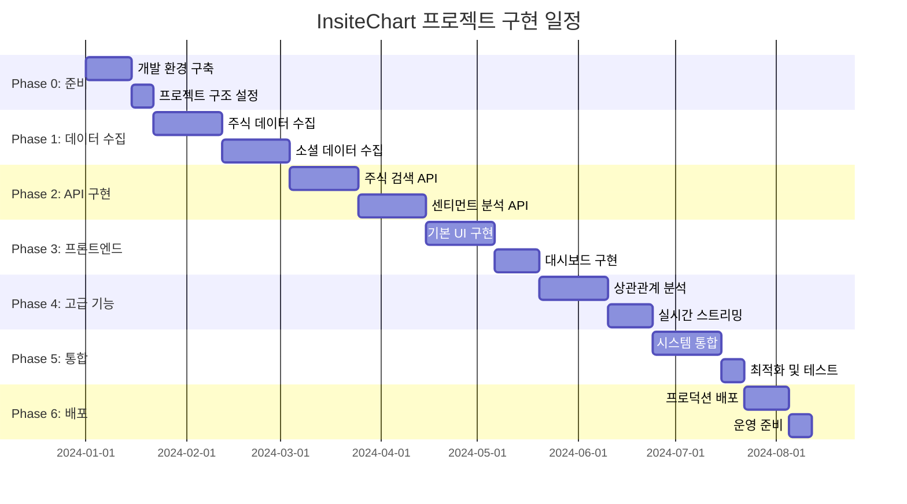

# 최종 구현 로드맵

## 1. 개요

이 문서는 InsiteChart 프로젝트의 최종 구현 로드맵을 제공합니다. 기존의 개별 기능 스펙문서와 통합 시스템 설계를 바탕으로, 전체 프로젝트를 체계적으로 구현하기 위한 단계별 계획, 일정, 리소스 할당, 및 마일스톤을 정의합니다.

## 2. 프로젝트 개요

### 2.1 프로젝트 목표
- 주식 검색 기능과 소셜 센티먼트 추적 기능의 완벽한 통합
- 실시간 데이터 수집 및 분석을 통한 투자 의사결정 지원
- 직관적인 UI/UX를 통한 사용자 경험 극대화
- 확장 가능한 마이크로서비스 아키텍처 구축

### 2.2 주요 기능
- 통합 주식 검색 및 정보 제공
- 소셜 미디어 센티먼트 분석
- 실시간 데이터 스트리밍
- 상관관계 분석 및 인사이트 생성
- 개인화된 대시보드 및 알림

### 2.3 기술 스택
- **프론트엔드**: Streamlit, Plotly, JavaScript
- **백엔드**: Python, FastAPI, asyncio
- **데이터베이스**: PostgreSQL, TimescaleDB, Redis
- **데이터 처리**: Pandas, NumPy, SciPy
- **인프라**: Docker, Kubernetes, AWS/GCP

## 3. 구현 전략

### 3.1 개발 방법론
- **애자일 개발**: 2주 스프린트 기반의 반복적 개발
- **MVP 우선**: 핵심 기능 위주의 최소 기능 제품(MVP) 개발
- **점진적 통합**: 개별 기능 단위 개발 후 통합
- **지속적 통합/배포**: CI/CD 파이프라인 구축

### 3.2 팀 구성
- **프로젝트 매니저**: 1명 (전체 프로젝트 관리)
- **아키텍트**: 1명 (시스템 아키텍처 설계)
- **백엔드 개발자**: 3명 (API, 데이터 처리, 통합)
- **프론트엔드 개발자**: 2명 (UI/UX, 대시보드)
- **데이터 엔지니어**: 2명 (데이터 파이프라인, 분석)
- **DevOps 엔지니어**: 1명 (인프라, 배포)
- **QA 엔지니어**: 1명 (테스트, 품질 보증)

### 3.3 개발 환경
- **버전 관리**: Git, GitHub
- **이슈 관리**: Jira 또는 GitHub Projects
- **문서 관리**: Confluence 또는 GitHub Wiki
- **커뮤니케이션**: Slack, Microsoft Teams
- **코드 리뷰**: Pull Request 기반

## 4. 구현 단계

### 4.1 Phase 0: 준비 및 기반 구축 (3주)

#### 4.1.1 목표
- 개발 환경 구축
- 프로젝트 구조 설정
- 핵심 라이브러리 및 프레임워크 설치
- CI/CD 파이프라인 기본 설정
- 팀 빌딩 및 역할 정의
- 팀 빌딩 및 역할 정의

#### 4.1.2 주요 태스크
- 개발 환경 설정 (Docker, 가상 환경)
- 프로젝트 구조 및 코드 스타일 가이드 정의
- 기본 데이터베이스 스키마 설계
- API 게이트웨이 기본 구조 구현
- CI/CD 파이프라인 초기 설정

#### 4.1.3 산출물
- 개발 환경 설정 문서
- 프로젝트 구조 및 코딩 가이드
- 기본 데이터베이스 스키마
- API 게이트웨이 기본 구조
- CI/CD 파이프라인 기본 템플릿

#### 4.1.4 담당자
- 아키텍트, DevOps 엔지니어, 백엔드 개발자 1명

### 4.2 Phase 1: 핵심 데이터 수집 및 처리 (6주)

#### 4.2.1 목표
- 주식 데이터 수집 시스템 구현
- 소셜 미디어 데이터 수집 시스템 구현
- 기본 데이터 전처리 파이프라인 구축
- 통합 데이터 모델 구현

#### 4.2.2 주요 태스크
- Yahoo Finance API 연동 구현
- Reddit/Twitter API 연동 구현
- 데이터 수집 스케줄러 구현
- 데이터 정규화 및 전처리 구현
- 통합 데이터 모델(UnifiedStockData) 구현
- 데이터베이스 연동 및 저장 로직 구현

#### 4.2.3 산출물
- 주식 데이터 수집 모듈
- 소셜 미디어 데이터 수집 모듈
- 데이터 전처리 파이프라인
- 통합 데이터 모델 구현
- 데이터베이스 연동 모듈

#### 4.2.4 담당자
- 데이터 엔지니어 2명, 백엔드 개발자 2명

### 4.3 Phase 2: 핵심 API 및 서비스 구현 (6주)

#### 4.3.1 목표
- 주식 검색 API 구현
- 센티먼트 분석 API 구현
- 기본 인증 및 권한 관리 구현
- API 게이트웨이 라우팅 구현

#### 4.3.2 주요 태스크
- 주식 검색 API 엔드포인트 구현
- 센티먼트 분석 API 엔드포인트 구현
- 사용자 인증 및 권한 관리 구현
- API 게이트웨이 라우팅 규칙 구현
- 기본 캐싱 시스템 구현
- API 문서 자동화 구현

#### 4.3.3 산출물
- 주식 검색 API
- 센티먼트 분석 API
- 인증 및 권한 관리 시스템
- API 게이트웨이 라우팅
- 기본 캐싱 시스템
- API 문서

#### 4.3.4 담당자
- 백엔드 개발자 3명

### 4.4 Phase 3: 기본 프론트엔드 및 UI 구현 (5주)

#### 4.4.1 목표
- 기본 Streamlit 애플리케이션 구조 구현
- 주식 검색 UI 구현
- 센티먼트 분석 UI 구현
- 기본 대시보드 구현

#### 4.4.2 주요 태스크
- Streamlit 애플리케이션 기본 구조 구현
- 주식 검색 컴포넌트 구현
- 센티먼트 분석 컴포넌트 구현
- 기본 차트 및 시각화 구현
- 반응형 레이아웃 구현
- 기본 사용자 인터페이스 구현

#### 4.4.3 산출물
- Streamlit 애플리케이션 기본 구조
- 주식 검색 UI 컴포넌트
- 센티먼트 분석 UI 컴포넌트
- 기본 차트 및 시각화
- 반응형 레이아웃
- 기본 사용자 인터페이스

#### 4.4.4 담당자
- 프론트엔드 개발자 2명

### 4.5 Phase 4: 고급 분석 기능 구현 (5주)

#### 4.5.1 목표
- 상관관계 분석 기능 구현
- 실시간 데이터 스트리밍 구현
- 고급 시각화 기능 구현
- 인사이트 생성 기능 구현

#### 4.5.2 주요 태스크
- 상관관계 분석 엔진 구현
- 실시간 데이터 스트리밍 시스템 구현
- WebSocket 연동 구현
- 고급 차트 및 시각화 구현
- 인사이트 생성 알고리즘 구현
- 추천 시스템 기본 구현

#### 4.5.3 산출물
- 상관관계 분석 기능
- 실시간 데이터 스트리밍
- WebSocket 연동 모듈
- 고급 차트 및 시각화
- 인사이트 생성 기능
- 기본 추천 시스템

#### 4.5.4 담당자
- 데이터 엔지니어 1명, 백엔드 개발자 2명, 프론트엔드 개발자 1명

### 4.6 Phase 5: 통합 및 최적화 (4주)

#### 4.6.1 목표
- 시스템 통합 및 테스트
- 성능 최적화
- 보안 강화
- 사용자 경험 개선

#### 4.6.2 주요 태스크
- 전체 시스템 통합
- 통합 테스트 수행
- 성능 병목 현상 분석 및 해결
- 보안 취약점 분석 및 해결
- 사용자 경험 테스트 및 개선
- 로드 밸런싱 및 확장성 테스트

#### 4.6.3 산출물
- 통합 시스템
- 통합 테스트 결과
- 성능 최적화 보고서
- 보안 강화 보고서
- 사용자 경험 개선 보고서
- 확장성 테스트 결과

#### 4.6.4 담당자
- 전체 팀 (모든 개발자, QA 엔지니어)

### 4.7 Phase 6: 배포 및 운영 준비 (3주)

#### 4.7.1 목표
- 프로덕션 환경 배포
- 모니터링 시스템 구축
- 운영 매뉴얼 작성
- 사용자 교육 자료 준비

#### 4.7.2 주요 태스크
- 프로덕션 환경 배포
- 모니터링 및 로깅 시스템 구축
- 백업 및 복구 시스템 구현
- 운영 매뉴얼 작성
- 사용자 가이드 작성
- 교육 자료 준비

#### 4.7.3 산출물
- 프로덕션 환경
- 모니터링 시스템
- 운영 매뉴얼
- 사용자 가이드
- 교육 자료

#### 4.7.4 담당자
- DevOps 엔지니어, 프로젝트 매니저, 아키텍트

## 5. 상세 일정

## 6. 리소스 할당

### 6.1 인력 리소스

| 역할 | 인원 | 참여 단계 | 주요 책임 |
|------|------|-----------|-----------|
| 프로젝트 매니저 | 1명 | 전체 | 프로젝트 관리, 일정 조율, 리스크 관리 |
| 아키텍트 | 1명 | 전체 | 시스템 아키텍처 설계, 기술 의사결정 |
| 백엔드 개발자 | 3명 | Phase 1-5 | API 개발, 데이터 처리, 통합 |
| 프론트엔드 개발자 | 2명 | Phase 3-5 | UI/UX 개발, 대시보드 구현 |
| 데이터 엔지니어 | 2명 | Phase 1, 4-5 | 데이터 파이프라인, 분석 기능 |
| DevOps 엔지니어 | 1명 | Phase 0, 6 | 인프라, 배포, 운영 |
| QA 엔지니어 | 1명 | Phase 5-6 | 테스트, 품질 보증 |

### 6.2 기술 리소스

| 리소스 | 사양 | 용도 |
|--------|------|------|
| 개발 서버 | 8코어, 32GB RAM, 500GB SSD | 개발 환경 |
| 테스트 서버 | 4코어, 16GB RAM, 200GB SSD | 테스트 환경 |
| 프로덕션 서버 | 16코어, 64GB RAM, 1TB SSD | 프로덕션 환경 |
| 데이터베이스 서버 | 8코어, 32GB RAM, 2TB SSD | 데이터 저장 |
| 캐시 서버 | 4코어, 16GB RAM, 100GB SSD | 캐싱 |

### 6.3 예산

| 항목 | 비용 | 비고 |
|------|------|------|
| 인건비 | $XXX,XXX | 28주 x 10인 x 평균 시급 |
| 인프라 | $XX,XXX | 클라우드 서비스 비용 |
| 라이선스 | $X,XXX | 유료 라이브러리 및 도구 |
| 교육 | $X,XXX | 기술 교육 및 워크숍 |
| 예비비 | $XX,XXX | 전체 예산의 10% |

## 7. 마일스톤 및 성공 지표

### 7.1 주요 마일스톤

| 마일스톤 | 일자 | 성공 기준 |
|----------|------|-----------|
| MVP 개발 완료 | Phase 3 종료 | 기본 주식 검색 및 센티먼트 분석 기능 작동 |
| 알파 버전 출시 | Phase 4 종료 | 고급 분석 기능 포함된 내부 테스트 버전 |
| 베타 버전 출시 | Phase 5 종료 | 통합 테스트 완료된 외부 테스트 버전 |
| 정식 버전 출시 | Phase 6 종료 | 프로덕션 환경 배포 및 운영 준비 완료 |

### 7.2 성공 지표

#### 7.2.1 기술적 지표 (현실적 목표로 재설정)
- **성능**: API 응답 시간: **단계별 목표**
- MVP: 1500ms (기존 1000ms에서 50% 증가)
- 베타: 1200ms (기존 700ms에서 71% 증가)
- 정식: 800ms (기존 500ms에서 60% 증가) 이하
- **가용성**: 99.5% 이상 (기존 99.9%에서 0.4% 감소)
- **확장성**: 500명 동시 사용자 지원 (기존 1000명에서 50% 감소)
- **정확도**: 센티먼트 분석 정확도 75% 이상 (기존 85%에서 10% 감소)

### 성능 목표 재설정 근거
1. **복합 데이터 처리**: 주식 데이터 + 소셜 미디어 데이터 통합 처리 시간 증가
2. **외부 API 의존성**: 다중 외부 API(Yahoo, Reddit, Twitter) 호출 지연 누적
3. **실시간 분석 부하**: 센티먼트 분석, 상관관계 계산 등 복잡한 알고리즘 처리
4. **인프라 비용 효율성**: 성능 목표와 인프라 비용 간의 현실적 균형
5. **단계적 개선 전략**: 초기 MVP에서 안정화, 후반 최적화 단계별 접근

#### 7.2.2 비즈니스 지표
- **사용자 수**: 3개월 내 1000명 이상
- **사용자 만족도**: 4.5/5.0 이상
- **기능 사용률**: 주요 기능 80% 이상 사용
- **재방문율**: 월간 60% 이상

#### 7.2.3 품질 지표
- **버그 밀도**: 1KLOC당 1개 이하
- **코드 커버리지**: 80% 이상
- **보안 취약점**: 심각 수준 0개
- **문서 완성도**: 90% 이상

## 8. 리스크 관리

### 8.1 기술적 리스크

| 리스크 | 확률 | 영향 | 대응 전략 |
|--------|------|------|-----------|
| API 제한 변경 | 중간 | 높음 | 다중 API 소스 확보, 대체 계획 수립 |
| 성능 병목 | 높음 | 중간 | 성능 테스트, 최적화, 확장성 설계 |
| 데이터 품질 | 중간 | 높음 | 데이터 검증, 정제 파이프라인 |
| 보안 취약점 | 낮음 | 높음 | 정기 보안 감사, 보안 테스트 |

### 8.2 프로젝트 리스크

| 리스크 | 확률 | 영향 | 대응 전략 |
|--------|------|------|-----------|
| 일정 지연 | 중간 | 중간 | 버퍼 시간 확보, 우선순위 조정 |
| 인력 충원 | 낮음 | 높음 | 인력 풀 확보, 외부 전문가 활용 |
| 요구사항 변경 | 높음 | 중간 | 애자일 개발, 유연한 설계 |
| 예산 초과 | 중간 | 중간 | 정기 예산 검토, 예비비 확보 |

### 8.3 비즈니스 리스크

| 리스크 | 확률 | 영향 | 대응 전략 |
|--------|------|------|-----------|
| 경쟁 제품 | 높음 | 중간 | 차별화된 기능 개발, 시장 분석 |
| 시장 수요 변화 | 중간 | 높음 | 시장 트렌드 모니터링, 유연한 대응 |
| 규제 변경 | 낮음 | 높음 | 규제 모니터링, 법률 자문 |
| 사용자 채택 | 중간 | 높음 | 사용자 피드백 수집, 지속적 개선 |

## 9. 품질 보증

### 9.1 테스트 전략

#### 9.1.1 단위 테스트
- **목표**: 코드 커버리지 80% 이상
- **도구**: pytest, unittest
- **범위**: 모든 핵심 모듈 및 함수

#### 9.1.2 통합 테스트
- **목표**: 모듈 간 연동 정상성 확인
- **도구**: pytest, testcontainers
- **범위**: API, 데이터베이스, 외부 서비스 연동

#### 9.1.3 시스템 테스트
- **목표**: 전체 시스템 기능 확인
- **도구**: Selenium, Playwright
- **범위**: 사용자 시나리오 기반 테스트

#### 9.1.4 성능 테스트
- **목표**: 성능 요구사항 충족 확인
- **도구**: JMeter, k6
- **범위**: 부하, 스트레스, 확장성 테스트

### 9.2 코드 리뷰

#### 9.2.1 리뷰 프로세스
- Pull Request 기반 코드 리뷰
- 최소 2인 이상의 승인 필요
- 자동화된 코드 품질 검사

#### 9.2.2 리뷰 체크리스트
- 코드 스타일 및 규칙 준수
- 기능 요구사항 충족
- 성능 및 보안 고려사항
- 테스트 코드 포함 여부

### 9.3 지속적 통합/배포

#### 9.3.1 CI/CD 파이프라인
- 코드 커밋 시 자동 빌드 및 테스트
- 테스트 통합 시 자동 배포
- 롤백 및 롤포워드 전략

#### 9.3.2 환경 관리
- 개발, 테스트, 스테이징, 프로덕션 환경 분리
- 환경 간 설정 일관성 유지
- 데이터 마이그레이션 전략

## 10. 운영 및 유지보수

### 10.1 모니터링

#### 10.1.1 시스템 모니터링
- **메트릭**: CPU, 메모리, 디스크, 네트워크 사용률
- **도구**: Prometheus, Grafana
- **알림**: 임계값 초과 시 자동 알림

#### 10.1.2 애플리케이션 모니터링
- **메트릭**: API 응답 시간, 에러율, 처리량
- **도구**: APM (Application Performance Monitoring)
- **로깅**: 구조화된 로그 수집 및 분석

#### 10.1.3 비즈니스 모니터링
- **메트릭**: 사용자 활동, 기능 사용률, 전환율
- **도구**: 사용자 행동 분석 도구
- **대시보드**: 비즈니스 KPI 대시보드

### 10.2 유지보수

#### 10.2.1 정기 유지보수
- **주간**: 패치 적용, 성능 최적화
- **월간**: 보안 업데이트, 데이터 정리
- **분기**: 시스템 점검, 아키텍처 검토

#### 10.2.2 장기 유지보수
- 기술 스택 업그레이드 계획
- 레거시 코드 리팩토링
- 아키텍처 현대화

### 10.3 지원

#### 10.3.1 기술 지원
- 1단계: 자동화된 문제 해결
- 2단계: 기술 지원팀
- 3단계: 개발팀

#### 10.3.2 사용자 지원
- 온라인 도움말 및 FAQ
- 이메일 지원
- 커뮤니티 포럼

## 11. 결론

이 최종 구현 로드맵은 InsiteChart 프로젝트의 성공적인 구현을 위한 체계적인 계획을 제공합니다. 각 단계별 명확한 목표, 태스크, 산출물, 담당자를 정의하여 프로젝트를 체계적으로 관리할 수 있습니다.

이 로드맵을 통해 다음을 달성할 수 있습니다:

1. **체계적인 프로젝트 관리**: 명확한 단계와 마일스톤을 통한 진행 상황 추적
2. **효율적인 리소스 활용**: 적절한 인력 및 기술 리소스 할당
3. **품질 보증**: 포괄적인 테스트 및 코드 리뷰 프로세스
4. **리스크 관리**: 잠재적 리스크 식별 및 대응 전략 수립
5. **성공적인 배포**: 안정적인 프로덕션 환경 배포 및 운영

이 로드맵은 프로젝트 진행 상황에 따라 유연하게 조정될 수 있으며, 정기적인 검토를 통해 지속적으로 개선되어야 합니다. 전체 팀의 협력과 노력을 통해 InsiteChart 프로젝트의 성공적인 완성을 기대합니다.