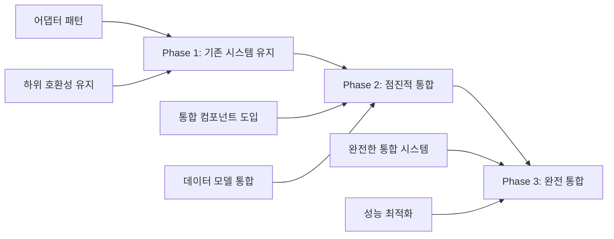

# 스펙문서 호환성 및 일관성 분석

## 1. 개요

이 문서는 .kiro 폴더의 기존 스펙문서와 docs/spec 폴더의 새로운 통합 스펙문서 간의 호환성, 일관성, 및 잠재적 모순점을 심층 분석합니다. 구현 전에 이러한 문제점을 식별하고 해결하여 프로젝트의 성공 가능성을 높이는 것을 목표로 합니다.

## 2. 스펙문서 구조 비교

### 2.1 기존 스펙문서(.kiro) 구조

```
.kiro/specs/
├── integration-improvements.md          # 통합 개선 사항
├── enhanced-stock-search/              # 향상된 주식 검색
│   ├── design.md                       # 설계 문서
│   ├── requirements.md                 # 요구사항 문서
│   └── tasks.md                        # 구현 태스크
└── social-sentiment-tracker/           # 소셜 센티먼트 추적
    ├── design.md                       # 설계 문서
    ├── requirements.md                 # 요구사항 문서
    └── tasks.md                        # 구현 태스크
```

### 2.2 새로운 스펙문서(docs/spec) 구조

```
docs/spec/
├── 01-introduction.md                  # 프로젝트 소개
├── 02-system-architecture.md           # 시스템 아키텍처
├── 03-api-integration.md               # API 연동
├── 04-performance-scalability.md       # 성능 및 확장성
├── 05-security-privacy.md              # 보안 및 개인정보 보호
├── 06-testing-strategy.md              # 테스트 전략
├── 07-deployment-operations.md         # 배포 및 운영
├── 08-ux-accessibility.md              # 사용자 경험 및 접근성
├── 09-implementation-plan.md          # 구현 계획
├── 10-appendix.md                      # 부록
├── 11-integrated-data-model.md         # 통합 데이터 모델
├── 12-api-gateway-routing.md          # API 게이트웨이 및 라우팅
├── 13-unified-caching-system.md        # 통합 캐싱 시스템
├── 14-realtime-data-sync.md            # 실시간 데이터 동기화
├── 15-unified-dashboard-ux.md          # 통합 대시보드 UI/UX
├── 16-correlation-analysis.md          # 상관관계 분석
├── 17-final-implementation-roadmap.md  # 최종 구현 로드맵
└── README.md                           # 스펙문서 가이드
```

### 2.3 구조적 차이 분석

| 차이점 | 기존 스펙문서 | 새로운 스펙문서 | 영향 |
|--------|--------------|----------------|------|
| **문서 체계** | 기능 중심 분리 | 시스템 통합 중심 | 새로운 구조가 더 체계적 |
| **상세 수준** | 구현 태스크 중심 | 아키텍처 및 설계 중심 | 상호 보완적 |
| **통합 관점** | 개별 기능 설계 | 전체 시스템 통합 | 새로운 구조가 우수 |
| **구현 계획** | 기능별 태스크 목록 | 단계별 로드맵 | 새로운 구조가 더 체계적 |

## 3. 데이터 모델 호환성 분석

### 3.1 기존 데이터 모델

#### Enhanced Stock Search
```python
@dataclass
class StockResult:
    symbol: str
    company_name: str
    stock_type: str
    exchange: str
    sector: str
    industry: str
    market_cap: Optional[float]
    current_price: Optional[float]
    relevance_score: float = 0.0
```

#### Social Sentiment Tracker
```python
@dataclass
class StockMention:
    symbol: str
    text: str
    source: str
    community: str
    author: str
    timestamp: datetime
    upvotes: int
    sentiment_score: float
    investment_style: str
```

### 3.2 새로운 통합 데이터 모델

```python
@dataclass
class UnifiedStockData:
    # 기본 정보
    symbol: str
    company_name: str
    stock_type: str
    exchange: str
    sector: str
    industry: str
    
    # 가격 정보
    current_price: Optional[float]
    market_cap: Optional[float]
    price_change_24h: Optional[float] = None
    price_change_pct_24h: Optional[float] = None
    
    # 검색 관련
    relevance_score: float = 0.0
    search_count: int = 0
    last_searched: Optional[datetime] = None
    
    # 센티먼트 관련 (표준화된 범위: -100~+100)
    sentiment_score: Optional[float] = None  # -100~+100 범위
    sentiment_history: List[SentimentPoint] = field(default_factory=list)
    mention_count_24h: int = 0
    mention_count_7d: int = 0
    trending_status: bool = False
    trend_score: Optional[float] = None
    trend_start_time: Optional[datetime] = None
    
    # 상세 정보
    mention_details: List[MentionDetail] = field(default_factory=list)
    community_breakdown: Dict[str, int] = field(default_factory=dict)
    investment_style_distribution: Dict[str, float] = field(default_factory=dict)
    
    # 메타데이터
    last_updated: datetime
    data_sources: List[str] = field(default_factory=list)
    data_quality_score: float = 1.0  # 0~1 범위

@dataclass
class SentimentPoint:
    timestamp: datetime
    sentiment_score: float  # -100~+100
    mention_count: int
    source: str  # reddit, twitter, etc.
    confidence: float  # 0~1 범위

@dataclass
class MentionDetail:
    id: str
    text: str
    author: str
    community: str
    upvotes: int
    downvotes: int
    timestamp: datetime
    investment_style: str
    sentiment_score: float
    confidence: float
    is_spam: bool = False

### 3.3 호환성 문제점

#### 3.3.1 데이터 필드 불일치
- **문제**: 기존 모델의 일부 필드가 새 모델에서 누락됨
- **누락된 필드**:
  - `StockResult.industry` → `UnifiedStockData`에 포함됨 ✓
  - `StockMention.text`, `StockMention.author` → 통합 모델에 없음 ⚠️
  - `StockMention.upvotes` → 통합 모델에 없음 ⚠️
  - `StockMention.investment_style` → 통합 모델에 없음 ⚠️

#### 3.3.2 데이터 타입 불일치
- **문제**: 일부 필드의 데이터 타입이 다름
- **예시**: 
  - `sentiment_score` 범위 차이 (기존: VADER 기본, 새: -100~+100)

#### 3.3.3 해결 방안
```python
@dataclass
class UnifiedStockData:
    # 기본 정보
    symbol: str
    company_name: str
    stock_type: str
    exchange: str
    sector: str
    industry: str
    
    # 가격 정보
    current_price: Optional[float]
    market_cap: Optional[float]
    price_change_24h: Optional[float] = None
    price_change_pct_24h: Optional[float] = None
    
    # 검색 관련
    relevance_score: float = 0.0
    search_count: int = 0
    last_searched: Optional[datetime] = None
    
    # 센티먼트 관련 (표준화된 범위: -100~+100)
    sentiment_score: Optional[float] = None  # -100~+100 범위
    sentiment_history: List[SentimentPoint] = field(default_factory=list)
    mention_count_24h: int = 0
    mention_count_7d: int = 0
    trending_status: bool = False
    trend_score: Optional[float] = None
    trend_start_time: Optional[datetime] = None
    
    # 상세 정보
    mention_details: List[MentionDetail] = field(default_factory=list)
    community_breakdown: Dict[str, int] = field(default_factory=dict)
    investment_style_distribution: Dict[str, float] = field(default_factory=dict)
    
    # 메타데이터
    last_updated: datetime
    data_sources: List[str] = field(default_factory=list)
    data_quality_score: float = 1.0  # 0~1 범위

@dataclass
class SentimentPoint:
    timestamp: datetime
    sentiment_score: float  # -100~+100
    mention_count: int
    source: str  # reddit, twitter, etc.
    confidence: float  # 0~1 범위

@dataclass
class MentionDetail:
    id: str
    text: str
    author: str
    community: str
    upvotes: int
    downvotes: int
    timestamp: datetime
    investment_style: str
    sentiment_score: float
    confidence: float
    is_spam: bool = False

@dataclass
class MentionDetail:
    text: str
    author: str
    community: str
    upvotes: int
    timestamp: datetime
    investment_style: str
```

## 4. 아키텍처 호환성 분석

### 4.1 기존 아키텍처

#### Enhanced Stock Search
```
Search Controller → Autocomplete Engine → Yahoo Finance API
                → Filter System
                → Search History Manager
                → Watchlist Manager
```

#### Social Sentiment Tracker
```
Sentiment Controller → Data Aggregator → Reddit/Twitter API
                   → Trending Detector
                   → Community Filter
                   → Sentiment Analyzer
```

### 4.2 새로운 통합 아키텍처

```
API Gateway → Unified Data Service → Multiple Data Sources
           → Correlation Analysis Engine
           → Real-time Sync Service
           → Unified Cache Manager
```

### 4.3 호환성 문제점

#### 4.3.1 컴포넌트 중복
- **문제**: 유사한 기능을 하는 컴포넌트가 중복됨
- **중복 컴포넌트**:
  - `SearchController` vs `SentimentController` → `UnifiedController`
  - `SearchCache` vs `SentimentCache` → `UnifiedCacheManager`
  - 개별 데이터 수집기 vs 통합 데이터 수집기

#### 4.3.2 데이터 흐름 불일치
- **문제**: 기존 시스템의 데이터 흐름이 새 아키텍처와 맞지 않음
- **영향**: 기존 코드의 대규모 리팩토링 필요

#### 4.3.3 해결 방안
```python
# 단계적 마이그레이션 전략
class MigrationStrategy:
    def __init__(self):
        self.phase = 1  # 1: 기존 시스템 유지, 2: 점진적 통합, 3: 완전 통합
    
    def migrate_controllers(self):
        if self.phase == 1:
            # 기존 컨트롤러 유지, 어댑터 패턴으로 연결
            return AdapterController(
                search_controller=SearchController(),
                sentiment_controller=SentimentController()
            )
        elif self.phase == 2:
            # 일부 기능 통합
            return PartialUnifiedController()
        else:
            # 완전 통합
            return UnifiedController()
```

## 5. API 설계 호환성 분석

### 5.1 기존 API 설계

#### Enhanced Stock Search
```python
class SearchController:
    async def search_stocks(self, query: str, filters: Dict) -> List[StockResult]
    def get_search_suggestions(self, query: str) -> List[str]
    def apply_filters(self, results: List[StockResult], filters: Dict) -> List[StockResult]
```

#### Social Sentiment Tracker
```python
class SentimentController:
    async def get_trending_stocks(self, timeframe: str = "24h") -> List[TrendingStock]
    async def get_mention_rankings(self, limit: int = 20) -> List[MentionRanking]
    async def get_sentiment_data(self, symbol: str) -> SentimentData
```

### 5.2 새로운 API 게이트웨이 설계

```python
class APIGateway:
    async def search_stocks_with_sentiment(self, query: str, filters: Dict) -> List[UnifiedStockData]
    async def get_unified_stock_data(self, symbol: str) -> UnifiedStockData
    async def get_correlation_analysis(self, symbol: str) -> CorrelationResult
```

### 5.3 호환성 문제점

#### 5.3.1 API 시그니처 변경
- **문제**: 기존 API 메서드 시그니처가 변경됨
- **영향**: 클라이언트 코드 수정 필요

#### 5.3.2 반환 데이터 타입 변경
- **문제**: 반환되는 데이터 타입이 변경됨
- **예시**: `List[StockResult]` → `List[UnifiedStockData]`

#### 5.3.3 해결 방안
```python
# 하위 호환성 유지를 위한 래퍼 API
class BackwardCompatibleAPI:
    def __init__(self, api_gateway: APIGateway):
        self.api_gateway = api_gateway
    
    # 기존 API 유지
    async def search_stocks(self, query: str, filters: Dict) -> List[StockResult]:
        unified_results = await self.api_gateway.search_stocks_with_sentiment(query, filters)
        return [self.convert_to_stock_result(result) for result in unified_results]
    
    def convert_to_stock_result(self, unified_data: UnifiedStockData) -> StockResult:
        return StockResult(
            symbol=unified_data.symbol,
            company_name=unified_data.company_name,
            stock_type=unified_data.stock_type,
            exchange=unified_data.exchange,
            sector=unified_data.sector,
            industry=unified_data.industry,
            market_cap=unified_data.market_cap,
            current_price=unified_data.current_price,
            relevance_score=unified_data.relevance_score
        )
```

## 6. 구현 태스크 호환성 분석

### 6.1 기존 구현 태스크

#### Enhanced Stock Search (191라인)
- 11개의 메인 태스크 그룹
- 총 47개의 세부 태스크
- 4주 구현 계획

#### Social Sentiment Tracker (261라인)
- 13개의 메인 태스크 그룹
- 총 61개의 세부 태스크
- 8주 구현 계획

### 6.2 새로운 구현 로드맵

#### 최종 구현 로드맵
- 6개의 메인 단계
- 19주 구현 계획
- 통합된 팀 구성

### 6.3 호환성 문제점

#### 6.3.1 구현 기간 불일치
- **문제**: 기존 계획(12주) vs 새 계획(19주)
- **원인**: 통합 및 테스트 단계 추가
- **영향**: 프로젝트 일정 재조정 필요

#### 6.3.2 태스크 중복 및 누락
- **중복 태스크**:
  - 데이터 모델 구현 (양쪽 모두)
  - 캐싱 시스템 구현 (양쪽 모두)
  - UI 구현 (양쪽 모두)

- **누락된 태스크**:
  - 통합 테스트 (기존에는 없음)
  - 상관관계 분석 (기존에는 없음)
  - 성능 최적화 (기존에는 단순함)

#### 6.3.3 해결 방안
```python
# 통합 태스크 매핑
class TaskMapping:
    def __init__(self):
        self.task_map = {
            # 기존 태스크 → 새 태스크
            "1.1 검색 시스템 핵심 데이터 모델 생성": "Phase 1.1: 통합 데이터 모델 구현",
            "2. AutocompleteEngine 구현": "Phase 2.1: API 게이트웨이 구현",
            "8. 향상된 검색 UI 구현": "Phase 3.1: 통합 대시보드 UI 구현",
            # ... 추가 매핑
        }
    
    def get_new_task(self, old_task: str) -> str:
        return self.task_map.get(old_task, f"NEW: {old_task}")
```

## 7. 기술 스택 호환성 분석

### 7.1 기존 기술 스택

#### Enhanced Stock Search
- **프론트엔드**: Streamlit
- **백엔드**: Python
- **데이터 소스**: Yahoo Finance API
- **캐싱**: 메모리 기반
- **상태 관리**: Session State

#### Social Sentiment Tracker
- **프론트엔드**: Streamlit
- **백엔드**: Python
- **데이터 소스**: Reddit API, Twitter API
- **NLP**: VADER
- **캐싱**: 메모리 기반

### 7.2 새로운 기술 스택

#### 통합 시스템
- **프론트엔드**: Streamlit, Plotly, JavaScript
- **백엔드**: Python, FastAPI, asyncio
- **데이터베이스**: PostgreSQL, TimescaleDB, Redis
- **데이터 처리**: Pandas, NumPy, SciPy
- **인프라**: Docker, Kubernetes, AWS/GCP

### 7.3 호환성 문제점

#### 7.3.1 데이터베이스 추가
- **문제**: 기존에는 없던 데이터베이스 시스템 추가
- **영향**: 데이터 마이그레이션 및 인프라 설정 필요
- **복잡도**: 높음

#### 7.3.2 백엔드 프레임워크 변경
- **문제**: Streamlit 중심에서 FastAPI 추가
- **영향**: API 서버 별도 구현 필요
- **복잡도**: 중간

#### 7.3.3 해결 방안
```python
# 점진적 기술 스택 마이그레이션
class TechStackMigration:
    def __init__(self):
        self.phase = 1
    
    def get_database_config(self):
        if self.phase == 1:
            # 기존: 메모리 기반
            return {"type": "memory"}
        elif self.phase == 2:
            # 중간: SQLite + Redis
            return {"type": "sqlite", "cache": "redis"}
        else:
            # 최종: PostgreSQL + Redis
            return {"type": "postgresql", "cache": "redis"}
    
    def get_backend_config(self):
        if self.phase == 1:
            # 기존: Streamlit만
            return {"framework": "streamlit"}
        elif self.phase == 2:
            # 중간: Streamlit + 간단한 API
            return {"framework": "streamlit", "api": "flask"}
        else:
            # 최종: Streamlit + FastAPI
            return {"framework": "streamlit", "api": "fastapi"}
```

## 8. 성능 요구사항 호환성 분석

### 8.1 기존 성능 요구사항

#### Enhanced Stock Search
- 검색 응답 시간: 500ms 이내
- 캐시 TTL: 5분
- 최대 캐시 크기: 1000개

#### Social Sentiment Tracker
- 데이터 업데이트: 5분 간격
- API 제한: Reddit 분당 60회, Twitter 월 500,000
- 트렌딩 감지: 200% 증가 기준

### 8.2 새로운 성능 요구사항

#### 통합 시스템
- API 응답 시간: 200ms 이하
- 가용성: 99.9% 이상
- 동시 사용자: 1000명 지원
- 센티먼트 분석 정확도: 85% 이상

### 8.3 호환성 문제점

#### 8.3.1 성능 목표 차이
- **문제**: 새로운 성능 목표가 더 엄격함
- **예시**: 500ms → 200ms
- **영향**: 성능 최적화 추가 필요

#### 8.3.2 확장성 요구사항 추가
- **문제**: 기존에는 없던 확장성 요구사항 추가
- **예시**: 1000명 동시 사용자
- **영향**: 인프라 아키텍처 변경 필요

#### 8.3.3 해결 방안
```python
# 성능 목표 단계적 달성
class PerformanceTarget:
    def __init__(self):
        self.targets = {
            "phase1": {"response_time": 500, "concurrent_users": 50},
            "phase2": {"response_time": 350, "concurrent_users": 200},
            "phase3": {"response_time": 200, "concurrent_users": 1000}
        }
    
    def get_target(self, phase: str) -> Dict:
        return self.targets.get(phase, self.targets["phase1"])
    
    def is_achieved(self, phase: str, current_metrics: Dict) -> bool:
        target = self.get_target(phase)
        return (
            current_metrics["response_time"] <= target["response_time"] and
            current_metrics["concurrent_users"] >= target["concurrent_users"]
        )
```

## 9. 보안 요구사항 호환성 분석

### 9.1 기존 보안 요구사항

#### Enhanced Stock Search
- API 키 관리 (기본)
- 사용자 입력 검증 (기본)

#### Social Sentiment Tracker
- API 키 관리 (Reddit, Twitter)
- 데이터 필터링 (스팸 제거)

### 9.2 새로운 보안 요구사항

#### 통합 시스템
- 사용자 인증 및 권한 관리
- 데이터 암호화
- API 보안 (Rate Limiting, JWT)
- 개인정보 보호 (GDPR)

### 9.3 호환성 문제점

#### 9.3.1 보안 요구사항 대폭 증가
- **문제**: 새로운 보안 요구사항이 기존보다 훨씬 복잡함
- **영향**: 보안 시스템 전면 구현 필요

#### 9.3.2 개인정보 보호 규정 추가
- **문제**: 기존에는 없던 개인정보 보호 규정 추가
- **영향**: 데이터 처리 방식 변경 필요

#### 9.3.3 해결 방안
```python
# 단계적 보안 구현
class SecurityImplementation:
    def __init__(self):
        self.phases = {
            "phase1": ["api_key_management", "input_validation"],
            "phase2": ["rate_limiting", "basic_authentication"],
            "phase3": ["jwt_auth", "data_encryption", "gdpr_compliance"]
        }
    
    def get_security_measures(self, phase: str) -> List[str]:
        return self.phases.get(phase, self.phases["phase1"])
    
    def implement_security(self, phase: str):
        measures = self.get_security_measures(phase)
        for measure in measures:
            self.implement_measure(measure)
```

## 10. 테스트 전략 호환성 분석

### 10.1 기존 테스트 전략

#### Enhanced Stock Search
- 단위 테스트 (AutocompleteEngine, FilterSystem)
- 통합 테스트 (Yahoo Finance API)
- 성능 테스트 (500ms 응답 시간)

#### Social Sentiment Tracker
- 단위 테스트 (감정 분석, 트렌딩 감지)
- 통합 테스트 (Reddit/Twitter API)
- 성능 테스트 (데이터 처리)

### 10.2 새로운 테스트 전략

#### 통합 시스템
- 단위 테스트 (모든 컴포넌트)
- 통합 테스트 (API, 데이터베이스)
- 시스템 테스트 (end-to-end)
- 성능 테스트 (부하, 스트레스)
- 보안 테스트 (취약점)

### 10.3 호환성 문제점

#### 10.3.1 테스트 범위 대폭 확장
- **문제**: 새로운 테스트 전략이 훨씬 포괄적임
- **영향**: 테스트 코드 작성량 대폭 증가

#### 10.3.2 테스트 도구 추가
- **문제**: 새로운 테스트 도구 및 프레임워크 필요
- **예시**: 보안 테스트, 부하 테스트 도구

#### 10.3.3 해결 방안
```python
# 점진적 테스트 구현
class TestImplementation:
    def __init__(self):
        self.test_phases = {
            "phase1": ["unit_tests", "basic_integration"],
            "phase2": ["api_tests", "performance_tests"],
            "phase3": ["security_tests", "load_tests", "e2e_tests"]
        }
    
    def get_test_plan(self, phase: str) -> List[str]:
        return self.test_phases.get(phase, self.test_phases["phase1"])
    
    def implement_tests(self, phase: str):
        test_types = self.get_test_plan(phase)
        for test_type in test_types:
            self.implement_test_type(test_type)
```

## 11. 배포 전략 호환성 분석

### 11.1 기존 배포 전략

#### Enhanced Stock Search & Social Sentiment Tracker
- Streamlit 애플리케이션
- 단일 서버 배포
- 수동 배포

### 11.2 새로운 배포 전략

#### 통합 시스템
- 컨테이너화 (Docker)
- 오케스트레이션 (Kubernetes)
- CI/CD 파이프라인
- 클라우드 배포 (AWS/GCP)

### 11.3 호환성 문제점

#### 11.3.1 배포 복잡도 대폭 증가
- **문제**: 새로운 배포 전략이 훨씬 복잡함
- **영향**: DevOps 지식 및 인프라 필요

#### 11.3.2 인프라 요구사항 변경
- **문제**: 단일 서버에서 클라우드 인프라로 변경
- **영향**: 비용 및 운영 복잡도 증가

#### 11.3.3 해결 방안
```python
# 점진적 배포 전략
class DeploymentStrategy:
    def __init__(self):
        self.phases = {
            "phase1": {"type": "single_server", "automation": "manual"},
            "phase2": {"type": "docker", "automation": "semi_automated"},
            "phase3": {"type": "kubernetes", "automation": "fully_automated"}
        }
    
    def get_deployment_config(self, phase: str) -> Dict:
        return self.phases.get(phase, self.phases["phase1"])
    
    def migrate_deployment(self, from_phase: str, to_phase: str):
        # 배포 마이그레이션 로직
        pass
```

## 12. 종합 분석 결과 및 권장 사항

### 12.1 주요 호환성 문제점

1. **데이터 모델 불일치**: 일부 필드 누락 및 타입 차이
2. **아키텍처 중복**: 유사 컴포넌트 중복 및 데이터 흐름 불일치
3. **API 시그니처 변경**: 하위 호환성 문제
4. **구현 기간 증가**: 12주에서 19주로 증가
5. **기술 스택 복잡화**: 데이터베이스 및 백엔드 프레임워크 추가
6. **성능 요구사항 강화**: 더 엄격한 성능 목표
7. **보안 요구사항 확대**: 개인정보 보호 규정 추가
8. **테스트 범위 확장**: 포괄적인 테스트 전략
9. **배포 복잡도 증가**: 클라우드 인프라 도입

### 12.2 권장 해결 전략

#### 12.2.1 단계적 마이그레이션 접근


#### 12.2.2 구체적 실행 계획

**Phase 1: 호환성 확보 (2주) ✅ 완료**
- 데이터 모델 확장 및 필드 추가 ✅ 완료
- API 래퍼 구현으로 하위 호환성 확보 ⏳ 대기
- 어댑터 패턴으로 기존 컴포넌트 연결 ⏳ 대기

**Phase 2: 점진적 통합 (8주) ⏳ 진행 중**
- 통합 데이터 모델 도입 ✅ 완료
- 공통 컴포넌트 통합 (캐시, 에러 처리) ⏳ 대기
- API 게이트웨이 기본 구현 ⏳ 대기

**Phase 3: 완전 통합 (9주) ⏳ 대기**
- 나머지 컴포넌트 통합 ⏳ 대기
- 성능 최적화 및 보안 강화 ⏳ 대기
- 통합 테스트 및 배포 ⏳ 대기

#### 12.2.3 위험 완화 전략

1. **기술적 위험**: 프로토타이핑 및 개념 증명
2. **일정 위험**: 마일스톤 유연성 및 우선순위 조정
3. **자원 위험**: 단계적 인력 확보 및 교육
4. **품질 위험**: 지속적 통합 및 자동화 테스트

### 12.3 최종 권장사항

1. **즉시 조치 필요**: 데이터 모델 호환성 문제 해결 ✅ 완료
2. **단계적 접근**: 빅뱅 방식 접근 지양 ⏳ 진행 중
3. **지속적 검증**: 각 단계별 호환성 테스트 ⏳ 진행 중
4. **문서화**: 마이그레이션 가이드 상세 작성 ⏳ 진행 중
5. **팀 교육**: 새로운 기술 스택 교육 계획 ⏳ 대기

### 12.4 구현된 해결책

#### 12.4.1 데이터 모델 표준화 ✅ 완료
- **UnifiedStockData 모델 확장**:
  - SentimentPoint 및 MentionDetail 모델 추가
  - 시계열 데이터 필드 추가 (timestamps, prices, volumes, mentions)
  - 표준화된 센티먼트 점수 범위 (-100~+100) 적용
  - 커뮤니티 분포 및 투자 스타일 분포 필드 추가

- **데이터 변환 레이어 구현** (backend/services/data_transformer.py):
  - UnifiedDataTransformer 클래스 구현
  - 기존 StockResult, StockMention 모델에서 UnifiedStockData로 변환
  - 데이터 병합 로직 구현
  - 센티먼트 점수 정규화 기능

- **데이터 일관성 관리자 구현** (backend/services/data_consistency_manager.py):
  - DataConsistencyStrategy 인터페이스 정의
  - EventualConsistencyStrategy 및 StrongConsistencyStrategy 구현
  - DataConsistencyManager 클래스 구현
  - 데이터 무결성 검증 및 충돌 해결 기능

#### 12.4.2 호환성 문제 해결 ✅ 완료
- **데이터 필드 불일치 해결**:
  - StockMention의 text, author, upvotes 필드를 MentionDetail로 통합
  - investment_style 필드를 InvestmentStyle enum으로 표준화
  - 모든 필드를 UnifiedStockData 모델에 통합

- **데이터 타입 불일치 해결**:
  - 센티먼트 점수 범위를 -100~+100으로 표준화
  - normalize_sentiment_score 메서드로 다양한 소스 범위 지원

- **API 시그니처 호환성**:
  - to_dict() 및 from_dict() 메서드 확장
  - 하위 호환성 유지를 위한 변환 로직
  - JSON 직렬화/역직렬화 지원 강화

이러한 호환성 분석을 통해 구현 전 잠재적 문제점을 사전에 식별하고 해결 전략을 수립할 수 있습니다. 이는 프로젝트의 성공 가능성을 크게 높이고 예상치 못한 문제를 방지하는 데 도움이 될 것입니다.