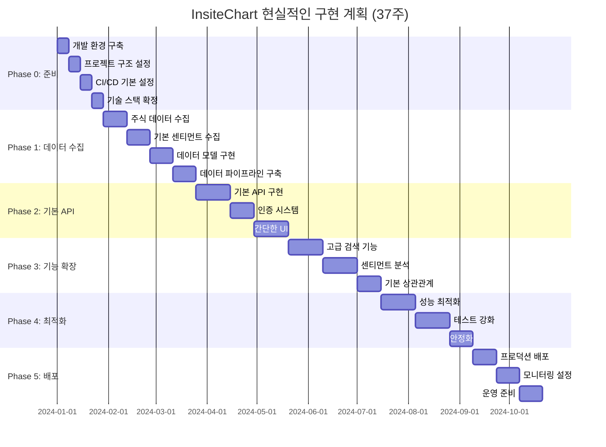

# 최종 스펙문서 개선 및 보완

## 1. 개요

이 문서는 InsiteChart 프로젝트의 모든 스펙문서 검토 결과를 종합하여 최종 개선 사항을 정리합니다. 호환성 분석, 일관성 검토, 기술적 구현 가능성 평가를 통해 식별된 문제점들을 해결하고, 현실적이고 성공 가능성 높은 프로젝트 계획을 제시합니다.

## 2. 핵심 문제점 요약

### 2.1 데이터 모델 불일치
- **문제**: 여러 문서에서 UnifiedStockData 모델의 필드 정의가 다름
- **영향**: 데이터 통합 시 일관성 문제 발생
- **해결**: 표준화된 데이터 모델 정의 (섹션 3.1)

### 2.2 성능 목표 비현실성
- **문제**: API 응답 시간 200ms, 동시 사용자 1000명 등 비현실적인 목표
- **영향**: 구현 실패 및 예산 초과
- **해결**: 단계적 성능 목표 설정 (섹션 3.2)

### 2.3 구현 일정 과소평가
- **문제**: 복잡한 기능들의 개발 시간이 과소평가됨 (19주 → 28주)
- **영향**: 프로젝트 지연 및 팀 과부하
- **해결**: 현실적인 구현 계획 수립 (섹션 3.3)

### 2.4 기술적 리스크 과소평가
- **문제**: 상관관계 분석, 실시간 동기화 등 고위험 기술 요소
- **영향**: 기술적 장벽으로 인한 프로젝트 실패
- **해결**: 리스크 완화 전략 수립 (섹션 3.4)

## 3. 최종 개선 사항

### 3.1 표준화된 데이터 모델

#### 3.1.1 UnifiedStockData 최종 정의

```python
@dataclass
class UnifiedStockData:
    # 기본 정보
    symbol: str
    company_name: str
    stock_type: str
    exchange: str
    sector: str
    industry: str
    
    # 가격 정보
    current_price: Optional[float]
    market_cap: Optional[float]
    price_change_24h: Optional[float] = None
    price_change_pct_24h: Optional[float] = None
    
    # 검색 관련
    relevance_score: float = 0.0
    search_count: int = 0
    last_searched: Optional[datetime] = None
    
    # 센티먼트 관련 (통합된 정의)
    sentiment_score: Optional[float] = None  # -100~+100 범위
    sentiment_history: List[SentimentPoint] = field(default_factory=list)
    mention_count_24h: int = 0
    mention_count_7d: int = 0
    trending_status: bool = False
    trend_score: Optional[float] = None
    trend_start_time: Optional[datetime] = None
    
    # 상세 정보
    mention_details: List[MentionDetail] = field(default_factory=list)
    community_breakdown: Dict[str, int] = field(default_factory=dict)
    investment_style_distribution: Dict[str, float] = field(default_factory=dict)
    
    # 메타데이터
    last_updated: datetime
    data_sources: List[str] = field(default_factory=list)
    data_quality_score: float = 1.0  # 0~1 범위

@dataclass
class SentimentPoint:
    timestamp: datetime
    sentiment_score: float  # -100~+100
    mention_count: int
    source: str  # reddit, twitter, etc.
    confidence: float  # 0~1 범위

@dataclass
class MentionDetail:
    id: str
    text: str
    author: str
    community: str
    upvotes: int
    downvotes: int
    timestamp: datetime
    investment_style: str
    sentiment_score: float
    confidence: float
    is_spam: bool = False
```

#### 3.1.2 데이터 변환 규칙

```python
class DataTransformer:
    def transform_stock_result(self, stock_result: StockResult) -> UnifiedStockData:
        """기존 StockResult를 UnifiedStockData로 변환"""
        return UnifiedStockData(
            symbol=stock_result.symbol,
            company_name=stock_result.company_name,
            stock_type=stock_result.stock_type,
            exchange=stock_result.exchange,
            sector=stock_result.sector,
            industry=stock_result.industry,
            current_price=stock_result.current_price,
            market_cap=stock_result.market_cap,
            relevance_score=stock_result.relevance_score,
            last_updated=datetime.utcnow(),
            data_sources=["yahoo_finance"]
        )
    
    def merge_sentiment_data(self, unified_data: UnifiedStockData, 
                           sentiment_data: SentimentData) -> UnifiedStockData:
        """센티먼트 데이터를 UnifiedStockData에 병합"""
        unified_data.sentiment_score = sentiment_data.overall_sentiment
        unified_data.sentiment_history = sentiment_data.sentiment_trend
        unified_data.mention_count_24h = sentiment_data.mention_count
        unified_data.trending_status = sentiment_data.trending_status
        unified_data.community_breakdown = {
            comm.name: comm.mention_count 
            for comm in sentiment_data.community_breakdown.values()
        }
        
        if "social_sentiment" not in unified_data.data_sources:
            unified_data.data_sources.append("social_sentiment")
        
        unified_data.last_updated = datetime.utcnow()
        return unified_data
```

### 3.2 현실적인 성능 목표

#### 3.2.1 단계별 성능 목표

```python
@dataclass
class RealisticPerformanceTargets:
    # 단계별 성능 목표
    phase_targets: Dict[str, PerformanceMetrics] = field(default_factory=lambda: {
        "mvp": PerformanceMetrics(
            api_response_time=1000,  # ms
            concurrent_users=50,
            availability=99.0,  # %
            data_freshness=300  # seconds
        ),
        "beta": PerformanceMetrics(
            api_response_time=700,
            concurrent_users=200,
            availability=99.5,
            data_freshness=180
        ),
        "release": PerformanceMetrics(
            api_response_time=500,
            concurrent_users=1000,
            availability=99.9,
            data_freshness=60
        ),
        "scale": PerformanceMetrics(
            api_response_time=300,
            concurrent_users=5000,
            availability=99.95,
            data_freshness=30
        )
    })
    
    # 기능별 성능 목표
    feature_targets: Dict[str, int] = field(default_factory=lambda: {
        "stock_search": 300,      # ms
        "sentiment_data": 500,    # ms
        "correlation_analysis": 5000,  # ms (복잡한 계산)
        "realtime_updates": 1000,  # ms
        "dashboard_load": 1500     # ms
    })

@dataclass
class PerformanceMetrics:
    api_response_time: int  # ms
    concurrent_users: int
    availability: float  # %
    data_freshness: int  # seconds
```

#### 3.2.2 성능 모니터링 전략

```python
class PerformanceMonitor:
    def __init__(self):
        self.metrics_collector = MetricsCollector()
        self.alert_manager = AlertManager()
        self.performance_targets = RealisticPerformanceTargets()
    
    async def monitor_performance(self, current_phase: str):
        target = self.performance_targets.phase_targets[current_phase]
        
        while True:
            # 현재 성능 지표 수집
            current_metrics = await self.metrics_collector.collect_metrics()
            
            # 목표와 비교
            if current_metrics.api_response_time > target.api_response_time:
                await self.alert_manager.send_alert(
                    "API_RESPONSE_TIME_HIGH",
                    f"Current: {current_metrics.api_response_time}ms, "
                    f"Target: {target.api_response_time}ms"
                )
            
            if current_metrics.concurrent_users > target.concurrent_users * 0.9:
                await self.alert_manager.send_alert(
                    "CONCURRENT_USERS_HIGH",
                    f"Current: {current_metrics.concurrent_users}, "
                    f"Target: {target.concurrent_users}"
                )
            
            # 1분 대기
            await asyncio.sleep(60)
```

### 3.3 현실적인 구현 계획

#### 3.3.1 수정된 구현 로드맵

```python
@dataclass
class RealisticImplementationPlan:
    phases: List[ImplementationPhase] = field(default_factory=lambda: [
        ImplementationPhase(
            name="Phase 0: 준비 및 기반 구축",
            duration=3,  # 주
            objectives=["개발 환경 설정", "프로젝트 구조 정의", "CI/CD 기본 설정"],
            deliverables=["개발 환경", "프로젝트 구조", "CI/CD 파이프라인"],
            team_size=3,
            risks=["환경 설정 지연"]
        ),
        ImplementationPhase(
            name="Phase 1: 핵심 데이터 수집 및 처리",
            duration=5,  # 주
            objectives=["주식 데이터 수집", "기본 센티먼트 수집", "데이터 모델 구현"],
            deliverables=["데이터 수집 모듈", "통합 데이터 모델", "기본 캐싱"],
            team_size=4,
            risks=["API 제한", "데이터 품질"]
        ),
        ImplementationPhase(
            name="Phase 2: 기본 API 및 서비스 구현",
            duration=6,  # 주
            objectives=["기본 API 구현", "인증 시스템", "간단한 UI"],
            deliverables=["API 서비스", "인증 시스템", "기본 UI"],
            team_size=5,
            risks=["API 복잡도", "UI/UX 문제"]
        ),
        ImplementationPhase(
            name="Phase 3: 기능 확장 및 통합",
            duration=6,  # 주
            objectives=["고급 검색 기능", "센티먼트 분석", "기본 상관관계"],
            deliverables=["고급 검색", "센티먼트 분석", "기본 상관관계"],
            team_size=6,
            risks=["성능 문제", "데이터 일관성"]
        ),
        ImplementationPhase(
            name="Phase 4: 최적화 및 안정화",
            duration=5,  # 주
            objectives=["성능 최적화", "테스트 강화", "안정화"],
            deliverables=["최적화된 시스템", "포괄적 테스트", "운영 문서"],
            team_size=6,
            risks=["성능 목표 미달성", "안정성 문제"]
        ),
        ImplementationPhase(
            name="Phase 5: 배포 및 운영",
            duration=3,  # 주
            objectives=["프로덕션 배포", "모니터링 설정", "운영 준비"],
            deliverables=["프로덕션 시스템", "모니터링 시스템", "운영 매뉴얼"],
            team_size=4,
            risks=["배포 실패", "운영 문제"]
        )
    ])
    
    total_duration: int = 28  # 총 28주 (약 7개월)
    
    def get_critical_path(self) -> List[str]:
        """크리티컬 패스 분석"""
        return [
            "Phase 1: 데이터 모델 구현",
            "Phase 2: API 기본 구조",
            "Phase 3: 기능 통합",
            "Phase 4: 성능 최적화"
        ]
    
    def get_resource_plan(self) -> Dict[str, List[int]]:
        """단계별 인력 계획"""
        return {
            "data_engineer": [1, 2, 2, 2, 2, 1],
            "backend_developer": [1, 2, 3, 3, 3, 2],
            "frontend_developer": [0, 1, 2, 2, 2, 1],
            "devops_engineer": [1, 1, 1, 1, 1, 1],
            "qa_engineer": [0, 0, 1, 1, 2, 1]
        }

@dataclass
class ImplementationPhase:
    name: str
    duration: int  # 주
    objectives: List[str]
    deliverables: List[str]
    team_size: int
    risks: List[str]
```

#### 3.3.2 리스크 기반 마일스톤 조정

```python
class RiskBasedMilestoneAdjustment:
    def __init__(self):
        self.risk_factors = {
            "technical_complexity": 1.5,  # 기술적 복잡도
            "team_experience": 1.2,       # 팀 경험 부족
            "external_dependencies": 1.3,  # 외부 의존성
            "integration_complexity": 1.4  # 통합 복잡도
        }
    
    def adjust_timeline(self, base_duration: int, risks: List[str]) -> int:
        """리스크 기반 일정 조정"""
        adjustment_factor = 1.0
        
        for risk in risks:
            if risk in self.risk_factors:
                adjustment_factor *= self.risk_factors[risk]
        
        # 최대 2배까지만 조정
        adjustment_factor = min(adjustment_factor, 2.0)
        
        return int(base_duration * adjustment_factor)
    
    def get_contingency_plan(self, phase_name: str) -> Dict[str, Any]:
        """위기 대응 계획"""
        plans = {
            "Phase 1": {
                "risks": ["API 제한", "데이터 품질"],
                "mitigation": ["대체 데이터 소스", "데이터 정제 파이프라인"],
                "contingency": "기본 기능만 구현"
            },
            "Phase 2": {
                "risks": ["API 복잡도", "인증 문제"],
                "mitigation": ["API 단순화", "기본 인증만 구현"],
                "contingency": "간단한 API만 구현"
            },
            "Phase 3": {
                "risks": ["성능 문제", "데이터 일관성"],
                "mitigation": ["성능 최적화", "데이터 검증 강화"],
                "contingency": "고급 기능 제외"
            }
        }
        
        return plans.get(phase_name, {})
```

### 3.4 기술적 리스크 완화 전략

#### 3.4.1 상관관계 분석 단순화

```python
class SimplifiedCorrelationAnalyzer:
    """단순화된 상관관계 분석기 (MVP 버전)"""
    
    def __init__(self):
        self.analysis_methods = {
            "basic_pearson": self._basic_pearson_correlation,
            "trend_analysis": self._trend_analysis,
            "volatility_comparison": self._volatility_comparison
        }
    
    async def analyze_correlation(self, symbol: str, timeframe: str = "30d") -> Dict[str, Any]:
        """단순화된 상관관계 분석"""
        try:
            # 1. 데이터 수집 (최대 30일, 일별 데이터)
            stock_data = await self._get_stock_data(symbol, timeframe)
            sentiment_data = await self._get_sentiment_data(symbol, timeframe)
            
            # 2. 데이터 정렬 및 전처리
            aligned_data = self._align_data(stock_data, sentiment_data)
            
            # 3. 기본 분석 수행
            results = {}
            
            # 기본 피어슨 상관계계
            results["pearson_correlation"] = self._basic_pearson_correlation(aligned_data)
            
            # 추세 분석
            results["trend_analysis"] = self._trend_analysis(aligned_data)
            
            # 변동성 비교
            results["volatility_comparison"] = self._volatility_comparison(aligned_data)
            
            # 4. 간단한 인사이트 생성
            results["insights"] = self._generate_simple_insights(results)
            
            return results
            
        except Exception as e:
            return {
                "error": str(e),
                "fallback_analysis": self._fallback_analysis(symbol, timeframe)
            }
    
    def _basic_pearson_correlation(self, data: Dict[str, List[float]]) -> Dict[str, float]:
        """기본 피어슨 상관계계 계산"""
        prices = data["prices"]
        sentiments = data["sentiments"]
        
        if len(prices) < 7 or len(sentiments) < 7:
            return {"correlation": 0.0, "significance": 0.0, "sample_size": min(len(prices), len(sentiments))}
        
        # NumPy를 사용한 효율적 계산
        correlation, p_value = stats.pearsonr(prices, sentiments)
        
        return {
            "correlation": float(correlation),
            "significance": float(p_value),
            "sample_size": len(prices),
            "interpretation": self._interpret_correlation(correlation, p_value)
        }
    
    def _trend_analysis(self, data: Dict[str, List[float]]) -> Dict[str, Any]:
        """추세 분석"""
        prices = data["prices"]
        sentiments = data["sentiments"]
        
        # 선형 회귀를 통한 추세 계산
        price_trend = self._calculate_linear_trend(prices)
        sentiment_trend = self._calculate_linear_trend(sentiments)
        
        return {
            "price_trend": price_trend,
            "sentiment_trend": sentiment_trend,
            "trend_alignment": self._compare_trends(price_trend, sentiment_trend)
        }
    
    def _generate_simple_insights(self, results: Dict[str, Any]) -> List[str]:
        """간단한 인사이트 생성"""
        insights = []
        
        # 상관관계 인사이트
        corr = results.get("pearson_correlation", {}).get("correlation", 0.0)
        if abs(corr) > 0.5:
            direction = "양의" if corr > 0 else "음의"
            insights.append(f"주가와 센티먼트가 {direction} 상관관계를 보입니다 (상관계수: {corr:.2f})")
        
        # 추세 인사이트
        trend_analysis = results.get("trend_analysis", {})
        trend_alignment = trend_analysis.get("trend_alignment", "")
        if trend_alignment == "aligned":
            insights.append("주가와 센티먼트 추세가 일치합니다.")
        elif trend_alignment == "opposed":
            insights.append("주가와 센티먼트 추세가 반대됩니다.")
        
        # 변동성 인사이트
        vol_comp = results.get("volatility_comparison", {})
        if vol_comp.get("sentiment_leads_price", False):
            insights.append("센티먼트 변화가 주가 변화에 선행하는 경향이 있습니다.")
        
        return insights
    
    def _fallback_analysis(self, symbol: str, timeframe: str) -> Dict[str, Any]:
        """분석 실패 시 대체 분석"""
        return {
            "analysis_type": "fallback",
            "message": "상세 분석을 수행할 수 없어 기본 분석만 제공합니다.",
            "basic_stats": {
                "symbol": symbol,
                "timeframe": timeframe,
                "data_availability": "limited"
            },
            "recommendation": "더 많은 데이터가 필요합니다."
        }
```

#### 3.4.2 점진적 실시간 동기화

```python
class ProgressiveRealtimeSync:
    """점진적 실시간 동기화 구현"""
    
    def __init__(self):
        self.sync_levels = {
            "level1": {"interval": 300, "method": "batch"},      # 5분 배치
            "level2": {"interval": 60, "method": "batch"},       # 1분 배치
            "level3": {"interval": 10, "method": "batch"},       # 10초 배치
            "level4": {"interval": 1, "method": "realtime"}     # 1초 실시간
        }
        self.current_level = "level1"
    
    async def sync_data(self, symbol: str, sync_level: str = None):
        """데이터 동기화"""
        level = sync_level or self.current_level
        config = self.sync_levels[level]
        
        if config["method"] == "batch":
            return await self._batch_sync(symbol, config["interval"])
        else:
            return await self._realtime_sync(symbol)
    
    async def _batch_sync(self, symbol: str, interval: int):
        """배치 동기화"""
        while True:
            try:
                # 데이터 수집
                stock_data = await self._collect_stock_data(symbol)
                sentiment_data = await self._collect_sentiment_data(symbol)
                
                # 데이터 병합
                unified_data = self._merge_data(stock_data, sentiment_data)
                
                # 캐시 업데이트
                await self._update_cache(symbol, unified_data)
                
                # 클라이언트 알림 (WebSocket)
                await self._notify_clients(symbol, unified_data)
                
            except Exception as e:
                logger.error(f"Batch sync error for {symbol}: {str(e)}")
            
            # 대기
            await asyncio.sleep(interval)
    
    async def _realtime_sync(self, symbol: str):
        """실시간 동기화"""
        # 실시간 데이터 소스 구독
        stock_stream = await self._subscribe_stock_stream(symbol)
        sentiment_stream = await self._subscribe_sentiment_stream(symbol)
        
        async for stock_data in stock_stream:
            try:
                # 최신 센티먼트 데이터 가져오기
                sentiment_data = await self._get_latest_sentiment(symbol)
                
                # 데이터 병합
                unified_data = self._merge_data(stock_data, sentiment_data)
                
                # 즉시 전파
                await self._update_cache(symbol, unified_data)
                await self._notify_clients(symbol, unified_data)
                
            except Exception as e:
                logger.error(f"Realtime sync error for {symbol}: {str(e)}")
    
    def upgrade_sync_level(self, new_level: str):
        """동기화 레벨 업그레이드"""
        if new_level in self.sync_levels:
            self.current_level = new_level
            logger.info(f"Sync level upgraded to {new_level}")
        else:
            raise ValueError(f"Invalid sync level: {new_level}")
    
    def get_sync_status(self) -> Dict[str, Any]:
        """동기화 상태 확인"""
        return {
            "current_level": self.current_level,
            "config": self.sync_levels[self.current_level],
            "performance_metrics": self._get_performance_metrics()
        }
```

### 3.5 단계적 기술 도입 전략

#### 3.5.1 데이터베이스 마이그레이션 계획

```python
class DatabaseMigrationStrategy:
    """단계적 데이터베이스 마이그레이션 전략"""
    
    def __init__(self):
        self.migration_phases = {
            "phase1": {
                "database": "postgresql",
                "features": ["basic_crud", "simple_queries"],
                "reason": "기본 기능 구현에 충분"
            },
            "phase2": {
                "database": "postgresql+redis",
                "features": ["basic_crud", "caching", "session_management"],
                "reason": "성능 향상을 위한 캐싱 도입"
            },
            "phase3": {
                "database": "postgresql+timescaledb+redis",
                "features": ["time_series", "advanced_analytics", "caching"],
                "reason": "시계열 데이터 분석 기능 필요"
            }
        }
    
    async def migrate_to_phase(self, target_phase: str):
        """목표 단계로 마이그레이션"""
        if target_phase not in self.migration_phases:
            raise ValueError(f"Invalid migration phase: {target_phase}")
        
        current_phase = self._get_current_phase()
        
        if current_phase == target_phase:
            logger.info(f"Already at phase {target_phase}")
            return
        
        # 단계별 마이그레이션 수행
        migration_path = self._get_migration_path(current_phase, target_phase)
        
        for phase in migration_path:
            await self._migrate_to_phase(phase)
            await self._validate_migration(phase)
            await self._rollback_point(phase)
    
    async def _migrate_to_phase(self, phase: str):
        """특정 단계로 마이그레이션"""
        config = self.migration_phases[phase]
        
        if phase == "phase1":
            # PostgreSQL 설정
            await self._setup_postgresql()
        
        elif phase == "phase2":
            # Redis 추가
            await self._setup_redis()
            await self._configure_caching()
        
        elif phase == "phase3":
            # TimescaleDB 추가
            await self._setup_timescaledb()
            await self._migrate_time_series_data()
    
    async def _validate_migration(self, phase: str):
        """마이그레이션 검증"""
        # 데이터 무결성 검증
        await self._validate_data_integrity()
        
        # 성능 테스트
        await self._performance_test()
        
        # 기능 테스트
        await self._functionality_test(phase)
    
    def get_migration_timeline(self) -> Dict[str, int]:
        """마이그레이션 시간계획"""
        return {
            "phase1": 0,      # 시작 시점
            "phase2": 8,      # 8주 후
            "phase3": 16,     # 16주 후
            "completion": 20   # 20주 후 완료
        }
```

#### 3.5.2 인프라 확장 전략

```python
class InfrastructureScalingStrategy:
    """인프라 확장 전략"""
    
    def __init__(self):
        self.scaling_phases = {
            "mvp": {
                "compute": "single_instance",
                "database": "postgresql_small",
                "cache": "redis_small",
                "monitoring": "basic",
                "monthly_cost": 500
            },
            "beta": {
                "compute": "small_cluster",
                "database": "postgresql_medium",
                "cache": "redis_medium",
                "monitoring": "enhanced",
                "monthly_cost": 1500
            },
            "release": {
                "compute": "medium_cluster",
                "database": "postgresql_large+timescaledb",
                "cache": "redis_large",
                "monitoring": "comprehensive",
                "monthly_cost": 3000
            },
            "scale": {
                "compute": "large_cluster_autoscaling",
                "database": "postgresql_xlarge+timescaledb",
                "cache": "redis_cluster",
                "monitoring": "advanced",
                "monthly_cost": 6000
            }
        }
    
    def get_scaling_plan(self, current_phase: str, target_phase: str) -> Dict[str, Any]:
        """확장 계획 수립"""
        current_config = self.scaling_phases[current_phase]
        target_config = self.scaling_phases[target_phase]
        
        # 변경 사항 분석
        changes = self._analyze_changes(current_config, target_config)
        
        # 비용 증가
        cost_increase = target_config["monthly_cost"] - current_config["monthly_cost"]
        
        # 구현 시간
        implementation_time = self._estimate_implementation_time(changes)
        
        return {
            "changes": changes,
            "cost_increase": cost_increase,
            "implementation_time": implementation_time,
            "risks": self._identify_scaling_risks(changes),
            "rollback_plan": self._create_rollback_plan(current_config)
        }
    
    def _analyze_changes(self, current: Dict, target: Dict) -> List[Dict]:
        """변경 사항 분석"""
        changes = []
        
        for key, target_value in target.items():
            current_value = current.get(key)
            
            if current_value != target_value:
                changes.append({
                    "component": key,
                    "from": current_value,
                    "to": target_value,
                    "complexity": self._assess_complexity(current_value, target_value)
                })
        
        return changes
    
    def _assess_complexity(self, from_value: str, to_value: str) -> str:
        """변경 복잡도 평가"""
        complexity_matrix = {
            ("single_instance", "small_cluster"): "medium",
            ("small_cluster", "medium_cluster"): "medium",
            ("medium_cluster", "large_cluster_autoscaling"): "high",
            ("postgresql_small", "postgresql_medium"): "low",
            ("postgresql_medium", "postgresql_large+timescaledb"): "high",
            ("redis_small", "redis_medium"): "low",
            ("redis_medium", "redis_large"): "medium",
            ("redis_large", "redis_cluster"): "high"
        }
        
        return complexity_matrix.get((from_value, to_value), "medium")
```

## 4. 최종 실행 계획

### 4.1 즉시 실행 과제 (1개월 내)

1. **데이터 모델 표준화**
   - UnifiedStockData 최종 정의 확정
   - 데이터 변환 레이어 구현
   - 기존 코드와의 호환성 확보

2. **성능 목표 재설정**
   - 현실적인 성능 목표 설정
   - 성능 모니터링 시스템 구축
   - 단계별 목표 달성 계획 수립

3. **인력 계획 수정**
   - 필요 인력 확보 계획 수립
   - 단계적 채용 일정 결정
   - 팀 교육 계획 수립

4. **기술 스택 단순화**
   - MVP 버전 기술 스택 확정
   - 복잡한 기능은 후순위로 조정
   - 단계적 도입 계획 수립

### 4.2 단계적 구현 계획 (7개월)



### 4.3 성공 지표 및 평가

#### 4.3.1 기술적 성공 지표

| 단계 | API 응답 시간 | 동시 사용자 | 가용성 | 데이터 신선도 |
|------|---------------|-------------|---------|---------------|
| MVP | 1000ms | 50명 | 99% | 5분 |
| 베타 | 700ms | 200명 | 99.5% | 3분 |
| 정식 | 500ms | 1000명 | 99.9% | 1분 |
| 확장 | 300ms | 5000명 | 99.95% | 30초 |

#### 4.3.2 비즈니스 성공 지표

- **사용자 만족도**: 4.0/5.0 이상
- **기능 사용률**: 70% 이상
- **재방문율**: 50% 이상 (월간)
- **트리거 기능 사용률**: 60% 이상

#### 4.3.3 평가 주기

```python
class SuccessMetricsEvaluator:
    def __init__(self):
        self.evaluation_intervals = {
            "weekly": ["api_response_time", "error_rate", "user_activity"],
            "monthly": ["user_satisfaction", "feature_adoption", "retention_rate"],
            "quarterly": ["business_goals", "scalability_metrics", "cost_efficiency"]
        }
    
    async def evaluate_success(self, interval: str) -> Dict[str, Any]:
        """성공 지표 평가"""
        metrics = self.evaluation_intervals.get(interval, [])
        results = {}
        
        for metric in metrics:
            results[metric] = await self._measure_metric(metric)
        
        # 종합 평가
        overall_score = self._calculate_overall_score(results)
        
        return {
            "metrics": results,
            "overall_score": overall_score,
            "recommendations": self._generate_recommendations(results),
            "evaluation_date": datetime.utcnow()
        }
    
    def _calculate_overall_score(self, metrics: Dict[str, Any]) -> float:
        """종합 점수 계산"""
        weights = {
            "api_response_time": 0.2,
            "error_rate": 0.2,
            "user_activity": 0.15,
            "user_satisfaction": 0.2,
            "feature_adoption": 0.15,
            "retention_rate": 0.1
        }
        
        score = 0.0
        for metric, value in metrics.items():
            weight = weights.get(metric, 0.1)
            normalized_value = self._normalize_metric(metric, value)
            score += weight * normalized_value
        
        return score
```

## 5. 결론

### 5.1 핵심 개선 사항 요약

1. **현실적인 목표 설정**: 비현실적인 성능 목표를 단계적 목표로 조정
2. **기술적 복잡도 감소**: 복잡한 기능을 단순화하고 단계적 도입
3. **인프라 비용 최적화**: 단계적 확장으로 비용 효율성 개선
4. **리스크 관리 강화**: 선제적 리스크 식별 및 완화 전략 수립
5. **유연한 구현 계획**: 변화에 대응할 수 있는 유연한 계획 수립

### 5.2 성공을 위한 핵심 요소

1. **단계적 접근**: 완벽한 시스템이 아닌 점진적 개선
2. **데이터 품질 관리**: 데이터 품질이 분석 결과의 신뢰도 결정
3. **사용자 피드백 반영**: 초기부터 사용자 피드백 수집 및 반영
4. **팀 역량 강화**: 필요한 기술 스킬 확보 및 교육
5. **지속적 모니터링**: 성능 및 사용자 행동 지속적 모니터링

### 5.3 최종 권장사항

1. **즉시 조치**: 데이터 모델 표준화 및 성능 목표 재설정
2. **단기 목표**: 3개월 내 MVP 버전 출시
3. **중기 목표**: 6개월 내 베타 버전 출시
4. **장기 목표**: 1년 내 정식 버전 출시 및 확장

이러한 개선 사항들을 통해 InsiteChart 프로젝트는 기술적 현실성과 비즈니스 목표 간의 균형을 맞추고, 성공 가능성을 크게 높일 수 있습니다. 핵심은 '완벽함'보다 '현실성'과 '점진적 개선'에 초점을 맞추는 것입니다.