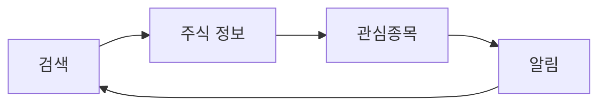
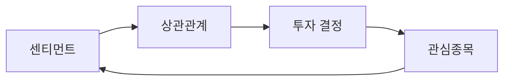
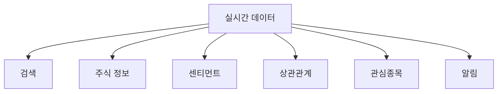
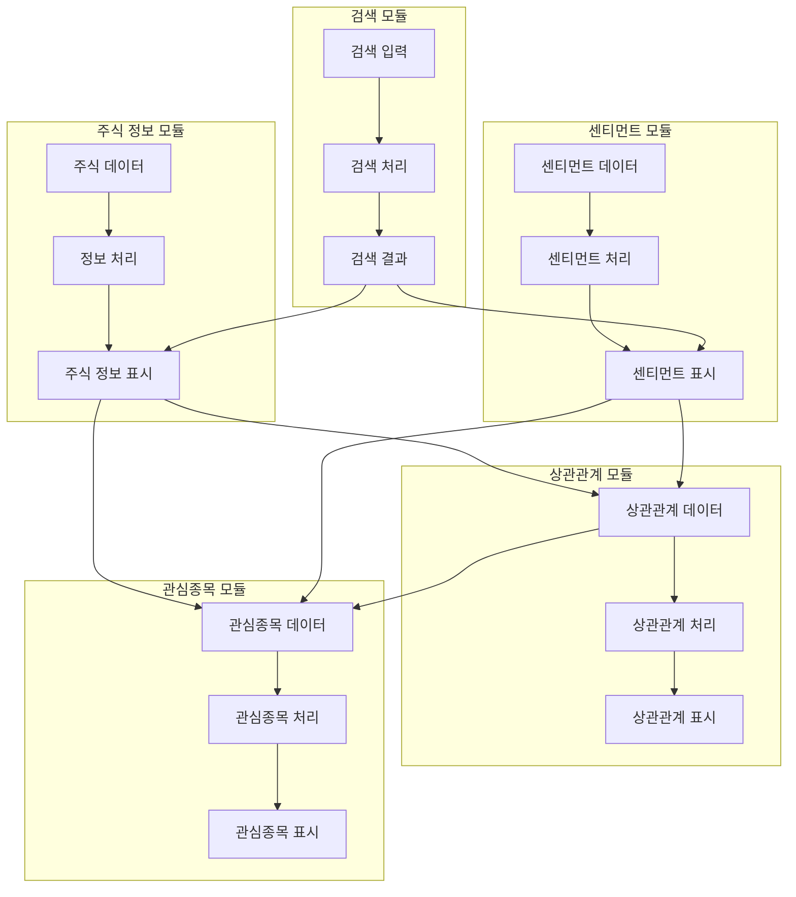

# UI/UX 기능별 상세 분석

## 1. 개요

이 문서는 InsiteChart 프로젝트의 UI/UX 기능을 기능별로 세분화하여 각 기능 간의 연결성과 사용자 흐름을 상세히 분석합니다. 이를 통해 사용자 경험의 일관성을 확보하고 구현 우선순위를 명확히 정의합니다.

## 2. 기능별 UI/UX 항목 분류

### 2.1 핵심 검색 기능

#### 2.1.1 기본 검색 인터페이스
- **검색창 컴포넌트**: 자동완성, 실시간 제안, 키보드 네비게이션
- **검색 필터**: 주식 유형, 섹터, 거래소, 시가총액, 가격 범위
- **검색 히스토리**: 최근 검색 기록, 자주 검색한 주식, 검색 빈도 표시
- **검색 결과 표시**: 카드 형태, 정렬 옵션, 페이징

#### 2.1.2 고급 검색 기능
- **센티먼트 기반 필터링**: 긍정/부정 센티먼트, 센티먼트 강도별 필터
- **트렌딩 기반 검색**: 현재 트렌딩 중인 주식 우선 표시
- **소셜 인기도 정렬**: 언급량 기반 검색 결과 정렬
- **실시간 검색 제안**: 인기 검색어, 트렌딩 키워드 자동 완성

### 2.2 주식 정보 표시 기능

#### 2.2.1 기본 주식 정보
- **주식 요약 카드**: 심볼, 회사명, 현재가, 변동률, 시가총액
- **가격 차트**: 일별, 주별, 월별 가격 차트, 기간 선택
- **기본 재무 정보**: PER, PBR, 배당수익률, 시가총액
- **거래 정보**: 거래량, 거래대금, 52주 최고/최저가

#### 2.2.2 상세 주식 정보
- **재무 제표**: 손익계산서, 재무상태표, 현금흐름표
- **업종 분석**: 섹터 내 순위, 동종업체 비교
- **뉴스 피드**: 관련 뉴스, 공시 정보, 분석 리포트
- **애널리스트 의견**: 매수/매도/보유 의견, 목표가

### 2.3 소셜 센티먼트 기능

#### 2.3.1 센티먼트 대시보드
- **트렌딩 주식**: 실시간 트렌딩 목록, 변화율 표시, 트렌딩 지속시간
- **언급 랭킹**: 상위 언급 주식, 언급량 변화, 커뮤니티별 분포
- **센티먼트 지표**: 전체 시장 센티먼트, 긍정/부정 비율, 변화 추이
- **실시간 업데이트**: 자동 새로고침, 변경 알림, 라이브 데이터

#### 2.3.2 상세 센티먼트 분석
- **개별 주식 센티먼트**: 심볼별 센티먼트 점수, 시간별 변화, 추세선
- **커뮤니티 분석**: 커뮤니티별 언급 비중, 투자 성향별 분포
- **감정 분석**: 긍정/중립/부정 비율, 감정 강도, 신뢰도 점수
- **언급 내용**: 주요 언급 내용, 영향력 있는 게시물, 핵심 키워드

### 2.4 상관관계 분석 기능

#### 2.4.1 상관관계 대시보드
- **상관관계 히트맵**: 주식 간 상관관계 시각화, 강도별 색상 표시
- **시차 분석**: 센티먼트와 주가의 시간적 선후 관계 분석
- **상관관계 순위**: 높은 상관관계를 보이는 주식 쌍, 변화 추이
- **인사이트 요약**: 주요 발견 사항, 투자 시사점, 위험 요인

#### 2.4.2 상세 상관관계 분석
- **다중 상관관계**: 3개 이상 주식 간 복합 상관관계 분석
- **시계열 상관관계**: 시간에 따른 상관관계 변화, 구간별 분석
- **인과관계 분석**: 센티먼트 변화가 주가에 미치는 영향 분석
- **예측 모델**: 상관관계 기반 주가 예측, 신뢰도 구간

### 2.5 관심종목 관리 기능

#### 2.5.1 관심종목 기본 기능
- **관심종목 추가/삭제**: 검색 결과에서 바로 추가, 일괄 관리
- **관심종목 목록**: 심볼, 현재가, 변동률, 센티먼트 상태
- **그룹 관리**: 카테고리별 그룹화, 그룹별 색상 구분
- **정렬 및 필터링**: 여러 기준으로 정렬, 그룹별 필터링

#### 2.5.2 고급 관심종목 기능
- **개인 메모**: 각 주식별 메모 추가, 메모 검색, 태그 관리
- **가격 알림**: 목표가 도달 시 알림, 변동률 기반 알림
- **센티먼트 알림**: 센티먼트 급변 시 알림, 트렌딩 진입 알림
- **포트폴리오 분석**: 관심종목 포트폴리오 성과, 리스크 분석

### 2.6 실시간 데이터 기능

#### 2.6.1 실시간 데이터 스트리밍
- **실시간 가격 업데이트**: WebSocket을 통한 실시간 가격 정보
- **실시간 센티먼트**: 실시간 센티먼트 변화, 새로운 언급 알림
- **라이브 차트**: 실시간 업데이트되는 인터랙티브 차트
- **실시간 알림**: 중요한 변화 발생 시 즉시 알림

#### 2.6.2 실시간 상호작용
- **실시간 필터링**: 실시간으로 필터 적용, 결과 즉시 반영
- **실시간 검색**: 입력 중 실시간 검색 결과 표시
- **실시간 정렬**: 데이터 변경 시 정렬 즉시 업데이트
- **실시간 비교**: 여러 주식 실시간 비교 분석

### 2.7 사용자 설정 및 개인화

#### 2.7.1 기본 설정
- **테마 설정**: 라이트/다크 모드, 색상 테마 선택
- **언어 설정**: 한국어/영어 지원, 용어 설명
- **표준 시간대**: 사용자 시간대 설정, 시간 표시 통일
- **알림 설정**: 알림 종류별 설정, 알림 방법 선택

#### 2.7.2 고급 개인화
- **대시보드 레이아웃**: 위젯 위치 조정, 크기 조절
- **기본 검색 조건**: 자주 사용하는 필터 기본값 설정
- **차트 기본 설정**: 차트 종류, 기간, 표시 방식 기본값
- **데이터 새로고침**: 데이터 업데이트 주기 설정

## 3. 기능 간 연결성 분석

### 3.1 검색 → 주식 정보 → 관심종목 흐름

**연결점**:
1. **검색 결과에서 관심종목 추가**: 검색 결과 카드에서 바로 관심종목 추가 버튼
2. **관심종목에서 상세 정보 접근**: 관심종목 목록에서 주식 정보 페이지로 이동
3. **관심종목 알림**: 관심종목의 가격/센티먼트 변화 시 알림
4. **알림에서 검색으로 복귀**: 알림 클릭 시 관련 검색 결과 표시

### 3.2 센티먼트 → 상관관계 → 투자 결정 흐름

**연결점**:
1. **센티먼트에서 상관관계 분석**: 센티먼트 분석 페이지에서 상관관계 분석으로 이동
2. **상관관계 기반 추천**: 높은 상관관계를 보이는 주식 추천
3. **투자 결정 지원**: 상관관계 분석 결과를 투자 결정에 활용
4. **관심종목에 추가**: 분석 결과 기반으로 관심종목에 추가

### 3.3 실시간 데이터 → 모든 기능 통합 흐름

**연결점**:
1. **실시간 검색 결과**: 실시간 데이터 기반 검색 결과 업데이트
2. **실시간 주식 정보**: 가격 정보 실시간 업데이트
3. **실시간 센티먼트**: 센티먼트 정보 실시간 업데이트
4. **실시간 상관관계**: 상관관계 분석 결과 실시간 업데이트
5. **실시간 관심종목**: 관심종목 실시간 상태 업데이트
6. **실시간 알림**: 중요한 변화 실시간 알림

## 4. 사용자 시나리오별 UI/UX 흐름

### 4.1 신규 사용자 시나리오

**시나리오**: 처음 접속하는 사용자가 주식을 검색하고 관심종목을 추가하는 과정

1. **초기 화면**: 인트로 화면, 주요 기능 소개, 빠른 시작 가이드
2. **검색 화면**: 검색창에 자동완성 기능 안내, 인기 검색어 표시
3. **검색 결과**: 검색 결과 카드, 상세 정보 미리보기, 관심종목 추가 버튼
4. **주식 상세**: 상세 정보 페이지, 차트, 센티먼트 정보, 관련 주식 추천
5. **관심종목**: 관심종목 관리, 그룹화, 알림 설정 안내
6. **설정**: 개인화 설정 안내, 알림 설정, 테마 선택

### 4.2 경험 사용자 시나리오

**시나리오**: 매일 접속하여 시장 동향을 확인하고 투자 결정을 내리는 과정

1. **대시보드**: 오늘의 시장 요약, 트렌딩 주식, 시장 센티먼트
2. **관심종목**: 관심종목 현황, 변동률, 센티먼트 변화
3. **상세 분석**: 관심 주식 상세 분석, 차트, 센티먼트, 뉴스
4. **상관관계**: 관심 주식과 다른 주식 간 상관관계 분석
5. **투자 결정**: 분석 결과 기반 투자 결정, 매수/매도 계획
6. **알림 확인**: 중요한 변화 알림 확인, 대응

### 4.3 전문가 사용자 시나리오

**시나리오**: 깊이 있는 분석을 통해 투자 전략을 수립하는 과정

1. **고급 검색**: 복합 조건 검색, 센티먼트 기반 필터링
2. **상세 분석**: 재무 제표, 업종 분석, 기술적 분석
3. **센티먼트 분석**: 커뮤니티별 분석, 감정 분석, 영향력 분석
4. **상관관계 분석**: 다중 상관관계, 시계열 분석, 인과관계 분석
5. **포트폴리오 분석**: 관심종목 포트폴리오 성과, 리스크 분석
6. **맞춤 설정**: 개인화된 대시보드, 맞춤 알림, 맞춤 분석

## 5. 기능별 우선순위 및 구현 단계

### 5.1 Phase 1: 핵심 기능 (MVP)

**우선순위 1**: 기본 검색 및 주식 정보
- 검색창 및 자동완성
- 기본 검색 결과 표시
- 주식 요약 정보
- 기본 가격 차트

**우선순위 2**: 기본 관심종목
- 관심종목 추가/삭제
- 관심종목 목록 표시
- 기본 그룹 관리

**우선순위 3**: 기본 센티먼트
- 전체 시장 센티먼트
- 기본 트렌딩 목록
- 간단한 센티먼트 표시

### 5.2 Phase 2: 고급 기능 (베타)

**우선순위 1**: 고급 검색
- 검색 필터 확장
- 센티먼트 기반 검색
- 검색 히스토리

**우선순위 2**: 상세 센티먼트 분석
- 개별 주식 센티먼트
- 커뮤니티 분석
- 감정 분석

**우선순위 3**: 기본 상관관계
- 단순 상관관계 분석
- 기본 히트맵
- 간단한 인사이트

### 5.3 Phase 3: 전문가 기능 (정식)

**우선순위 1**: 실시간 기능
- 실시간 데이터 스트리밍
- 실시간 알림
- 라이브 차트

**우선순위 2**: 고급 상관관계
- 다중 상관관계 분석
- 시계열 상관관계
- 인과관계 분석

**우선순위 3**: 개인화 기능
- 대시보드 레이아웃
- 고급 설정
- 맞춤 알림

## 6. 기능 간 데이터 흐름 및 상호작용

### 6.1 데이터 흐름 다이어그램

### 6.2 상호작용 규칙

#### 6.2.1 검색 ↔ 주식 정보
- **검색 결과 클릭**: 주식 정보 페이지로 이동, 해당 주식 상세 정보 표시
- **주식 정보에서 검색**: 관련 주식 검색, 검색 결과 표시
- **데이터 동기화**: 검색 결과와 주식 정보 데이터 일관성 유지

#### 6.2.2 주식 정보 ↔ 센티먼트
- **주식 정보에서 센티먼트**: 해당 주식 센티먼트 정보 표시
- **센티먼트에서 주식 정보**: 센티먼트 높은 주식 정보 표시
- **통합 표시**: 주식 정보와 센티먼트 정보 통합 표시

#### 6.2.3 센티먼트 ↔ 상관관계
- **센티먼트 기반 상관관계**: 센티먼트 데이터 기반 상관관계 분석
- **상관관계에서 센티먼트**: 상관관계 높은 주식 센티먼트 정보 표시
- **상호 보완**: 두 데이터의 상호 보완적 표시

#### 6.2.4 상관관계 ↔ 관심종목
- **상관관계 기반 추천**: 상관관계 분석 결과 기반 관심종목 추천
- **관심종목 상관관계**: 관심종목 간 상관관계 분석
- **포트폴리오 최적화**: 상관관계 기반 포트폴리오 최적화 제안

## 7. 기능별 UI/UX 디자인 원칙

### 7.1 일관성 원칙

#### 7.1.1 시각적 일관성
- **색상 체계**: 전체 시스템에서 일관된 색상 사용
- **타이포그래피**: 일관된 폰트, 크기, 간격 사용
- **아이콘 디자인**: 일관된 아이콘 스타일, 크기, 색상
- **레이아웃**: 일관된 레이아웃 구조, 간격, 정렬

#### 7.1.2 상호작용 일관성
- **버튼 스타일**: 일관된 버튼 디자인, 상태, 애니메이션
- **입력 필드**: 일관된 입력 필드 디자인, 검증, 에러 표시
- **네비게이션**: 일관된 네비게이션 패턴, 이동 방식
- **피드백**: 일관된 피드백 제공, 로딩, 성공, 실패 표시

### 7.2 사용성 원칙

#### 7.2.1 직관성
- **명확한 라벨**: 모든 기능에 명확한 라벨 제공
- **직관적인 아이콘**: 기능을 직관적으로 표현하는 아이콘
- **일관된 용어**: 일관된 용어 사용, 전문 용어 설명
- **예측 가능성**: 사용자가 다음 동작을 예측할 수 있는 디자인

#### 7.2.2 효율성
- **최소 클릭**: 목표 달성까지 최소 클릭으로 도달
- **단축키**: 자주 사용하는 기능에 단축키 제공
- **빠른 접근**: 자주 사용하는 기능에 빠른 접근 경로 제공
- **자동화**: 반복 작업 자동화, 스마트 제안

### 7.3 접근성 원칙

#### 7.3.1 웹 접근성
- **키보드 접근성**: 모든 기능 키보드로 접근 가능
- **스크린 리더**: 스크린 리더 호환성 확보
- **색각 대비**: 색각 대비 준수, 색상만으로 정보 전달 금지
- **폰트 크기**: 조절 가능한 폰트 크기, 확대/축소 기능

#### 7.3.2 모바일 접근성
- **반응형 디자인**: 모든 기기에서 최적의 사용 경험 제공
- **터치 최적화**: 터치 인터페이스 최적화
- **화면 회전**: 화면 회전 지원, 가로/세로 모드
- **오프라인 기능**: 오프라인에서도 기본 기능 사용 가능

## 8. 기능별 테스트 계획

### 8.1 단위 테스트

#### 8.1.1 검색 기능 테스트
- **자동완성 기능**: 검색어 입력 시 자동완성 정확성 테스트
- **검색 결과**: 검색 결과 정확성, 정렬, 필터링 테스트
- **검색 성능**: 검색 응답 시간, 대용량 처리 테스트
- **검색 UI**: 검색창 동작, 키보드 네비게이션 테스트

#### 8.1.2 주식 정보 기능 테스트
- **정보 정확성**: 주식 정보 정확성, 최신성 테스트
- **차트 표시**: 차트 정확성, 인터랙티브 기능 테스트
- **데이터 로딩**: 데이터 로딩 속도, 오류 처리 테스트
- **정보 업데이트**: 실시간 업데이트 정확성 테스트

### 8.2 통합 테스트

#### 8.2.1 기능 간 연동 테스트
- **검색 → 주식 정보**: 검색 결과에서 주식 정보로 이동 테스트
- **주식 정보 → 센티먼트**: 주식 정보에서 센티먼트로 이동 테스트
- **센티먼트 → 상관관계**: 센티먼트에서 상관관계로 이동 테스트
- **상관관계 → 관심종목**: 상관관계에서 관심종목으로 이동 테스트

#### 8.2.2 데이터 일관성 테스트
- **데이터 동기화**: 기능 간 데이터 일관성 테스트
- **실시간 업데이트**: 실시간 데이터 업데이트 정확성 테스트
- **캐시 일관성**: 캐시 데이터 일관성 테스트
- **오류 처리**: 오류 발생 시 일관적인 처리 테스트

### 8.3 사용자 테스트

#### 8.3.1 사용성 테스트
- **사용자 시나리오**: 다양한 사용자 시나리오 기반 테스트
- **작업 완료율**: 주요 작업 완료율 측정
- **학습 곡선**: 신규 사용자 학습 곡선 측정
- **만족도 조사**: 사용자 만족도 조사, 피드백 수집

#### 8.3.2 성능 테스트
- **로딩 속도**: 페이지 로딩 속도, 기능 로딩 속도 테스트
- **반응 속도**: 사용자 입력에 대한 반응 속도 테스트
- **메모리 사용**: 메모리 사용량, 메모리 누수 테스트
- **네트워크 사용**: 네트워크 사용량, 최적화 테스트

## 9. 결론

이 기능별 UI/UX 상세 분석을 통해 다음 사항을 확인했습니다:

1. **기능 간 연결성 명확화**: 각 기능 간의 데이터 흐름과 상호작용 규칙 정의
2. **사용자 시나리오 구체화**: 다양한 사용자 유형별 시나리오 정의
3. **구현 우선순위 설정**: MVP부터 전문가 기능까지 단계적 구현 계획
4. **일관성 원칙 수립**: 시각적, 상호작용, 사용성, 접근성 원칙
5. **테스트 계획 수립**: 단위, 통합, 사용자 테스트 계획

이 분석을 바탕으로 개발팀은 각 기능을 체계적으로 구현하고, 사용자 경험의 일관성을 확보할 수 있습니다. 또한 기능 간의 연결성을 고려하여 자연스러운 사용자 흐름을 제공할 수 있습니다.