# UI 엘리먼트 흐름 분석

## 1. 개요

이 문서는 InsiteChart 프로젝트의 UI 엘리먼트별 흐름(Workflow)을 상세히 분석합니다. 사용자가 각 기능을 어떻게 순서대로 사용하는지, 각 단계에서 어떤 정보가 필요하며, 어떤 상호작용이 발생하는지 분석하여 자연스러운 사용자 경험을 설계합니다.

## 2. 엘리먼트 흐름 분석 방법론

### 2.1 사용자 시나리오 기반 분석
- **사용자 유형별 시나리오**: 신규 사용자, 경험 사용자, 전문가 사용자
- **목표 기반 시나리오**: 정보 탐색, 투자 결정, 포트폴리오 관리
- **상황 기반 시나리오**: 일반 시장, 변동성 높은 시장, 뉴스 발생 시

### 2.2 엘리먼트 추적 방법
- **사용자 행동 로그**: 클릭, 스크롤, 체류 시간 분석
- **페이지 전환 경로**: A/B 테스트를 통한 최적 경로 발견
- **기능 사용 빈도**: 어떤 기능이 얼마나 자주 사용되는지 분석
- **이탈 지점 분석**: 사용자가 어디서 이탈하는지 식별

## 3. 핵심 엘리먼트 흐름 분석

### 3.1 주식 검색 엘리먼트 흐름

#### 3.1.1 기본 검색 흐름

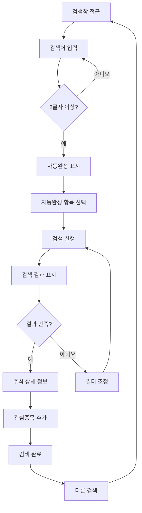

**흐름 분석**:
1. **진입점**: 검색창에 초점 또는 클릭
2. **입력 단계**: 사용자가 검색어 입력 시작
3. **자동완성**: 2글자 이상 입력 시 자동완성 목록 표시
4. **선택 단계**: 자동완성 목록에서 항목 선택 또는 직접 입력 완료
5. **실행 단계**: 검색 실행 및 결과 표시
6. **평가 단계**: 결과 만족도 평가
7. **후속 조치**: 상세 정보 확인, 필터 조정, 관심종목 추가

#### 3.1.2 고급 검색 흐름

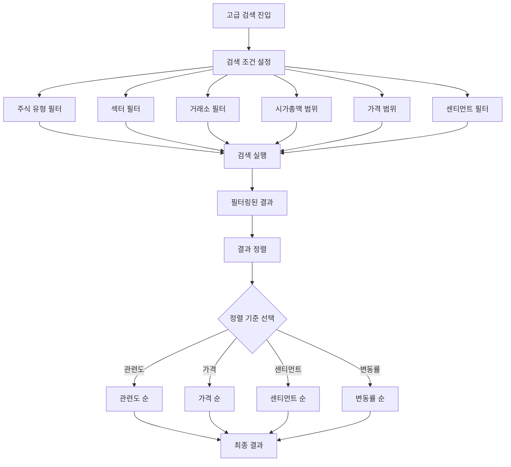

**흐름 분석**:
1. **필터 설정**: 다양한 필터 조건 설정
2. **검색 실행**: 설정된 필터 적용하여 검색
3. **결과 정렬**: 사용자가 원하는 기준으로 결과 정렬
4. **최종 선택**: 정렬된 결과에서 최종 선택

### 3.2 주식 정보 확인 엘리먼트 흐름

#### 3.2.1 기본 정보 흐름

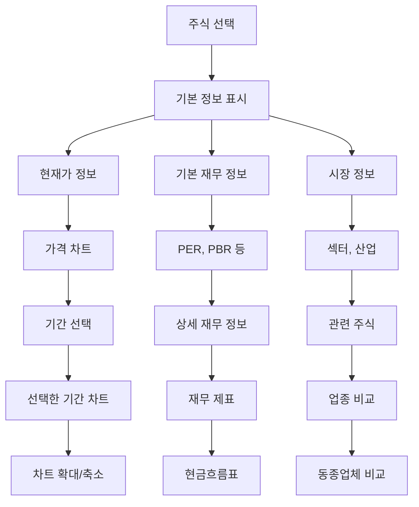

**흐름 분석**:
1. **기본 정보**: 현재가, 기본 재무 정보, 시장 정보 동시 표시
2. **차트 상호작용**: 가격 차트와 기간 선택 상호작용
3. **상세 정보 확장**: 재무 정보, 관련 주식, 업종 비교 확장
4. **차트 인터랙션**: 차트 확대/축소, 마우스 오버 정보 표시

#### 3.2.2 상세 정보 흐름

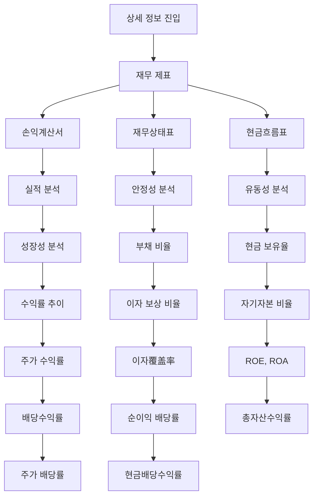

**흐름 분석**:
1. **재무 정보 접근**: 재무 제표, 손익계산서, 재무상태표, 현금흐름표
2. **실적 분석**: 성장성, 안정성, 유동성 분석
3. **투자 지표**: ROE, ROA, PER, PBR 등 주요 투자 지표 계산
4. **배당 정보**: 배당수익률, 현금배당수익률 등 배당 관련 정보

### 3.3 소셜 센티먼트 엘리먼트 흐름

#### 3.3.1 센티먼트 대시보드 흐름

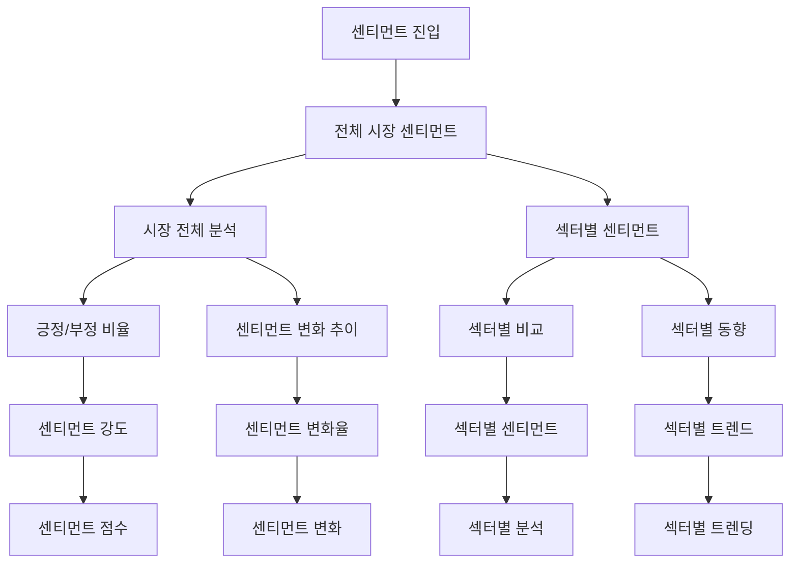

**흐름 분석**:
1. **시장 개요**: 전체 시장 센티먼트 현황 표시
2. **분석 차원**: 시간별, 섹터별, 강도별 분석
3. **시각화**: 다양한 차원의 센티먼트 정보 시각화
4. **인터랙션**: 각 차원간 상호작용 및 연관 정보 표시

#### 3.3.2 개별 주식 센티먼트 흐름

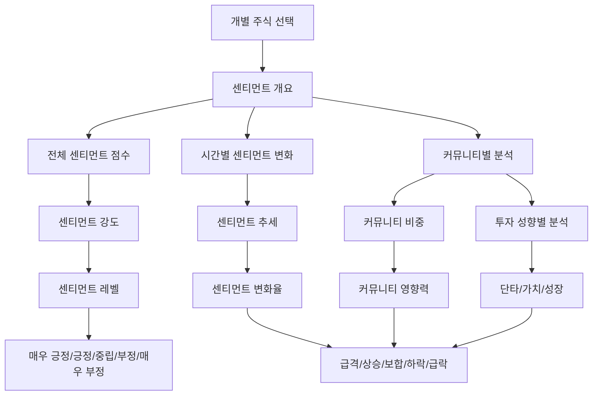

**흐름 분석**:
1. **센티먼트 개요**: 전체 점수, 시간별 변화, 커뮤니티 분석
2. **상세 분석**: 센티먼트 강도, 추세, 변화율 분석
3. **커뮤니티 분석**: 커뮤니티별 비중, 영향력, 투자 성향 분석
4. **시각적 표현**: 다양한 차원의 센티먼트 정보를 직관적으로 표시

#### 3.3.3 센티먼트 상세 분석 흐름

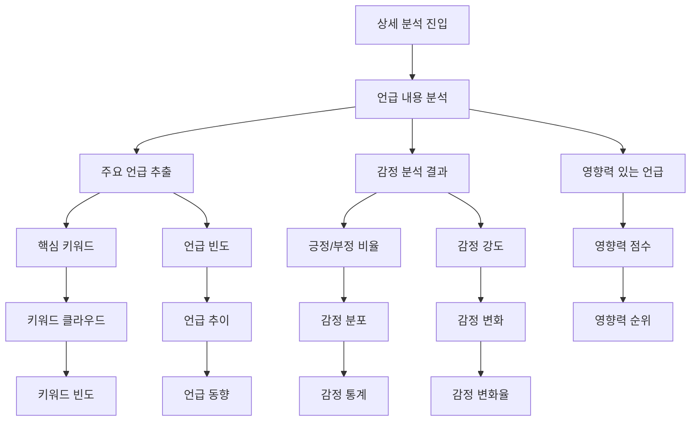

**흐름 분석**:
1. **언급 분석**: 주요 언급 추출, 언급 빈도, 언급 동향 분석
2. **감정 분석**: 긍정/부정 비율, 감정 강도, 감정 분포 분석
3. **영향력 평가**: 영향력 있는 언급 식별, 영향력 점수 계산
4. **시각적 표현**: 키워드 클라우드, 언급 추이, 감정 통계 시각화

### 3.4 상관관계 분석 엘리먼트 흐름

#### 3.4.1 상관관계 대시보드 흐름

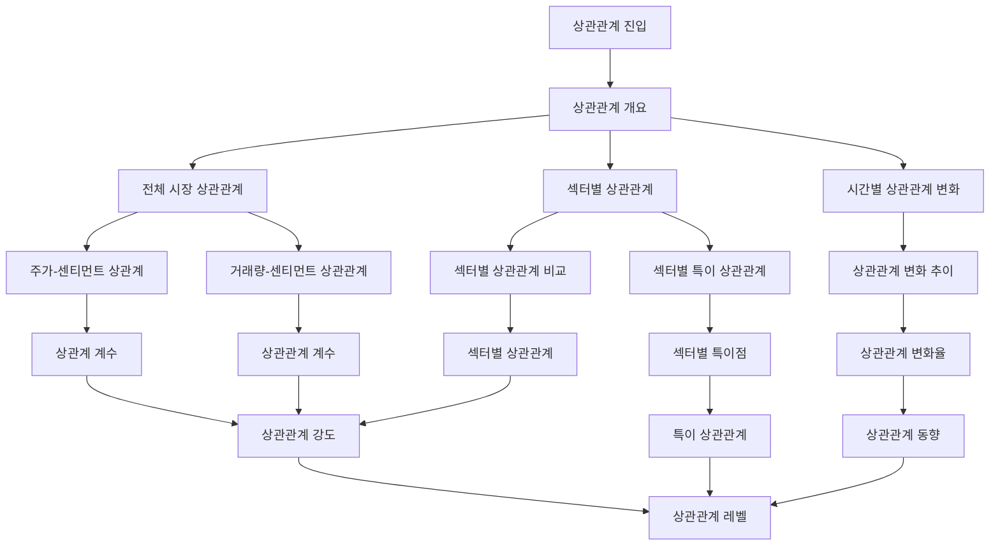

**흐름 분석**:
1. **상관관계 개요**: 전체 시장, 섹터별, 시간별 상관관계 분석
2. **상관관계 계산**: 주가-센티먼트, 거래량-센티먼트 상관관계 계산
3. **특이점 분석**: 섹터별 특이 상관관계 식별
4. **시각적 표현**: 상관관계 강도, 변화 추이, 특이점 시각화

#### 3.4.2 상세 상관관계 분석 흐름

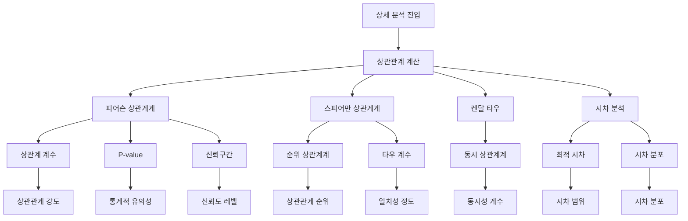

**흐름 분석**:
1. **상관관계 계산**: 다양한 상관계계수 계산
2. **통계적 검증**: P-value, 신뢰구간, 통계적 유의성 검증
3. **시차 분석**: 최적 시차, 시차 분포 분석
4. **결과 해석**: 상관관계 강도, 통계적 유의성, 실질적 의미 해석

### 3.5 관심종목 관리 엘리먼트 흐름

#### 3.5.1 관심종목 기본 흐름

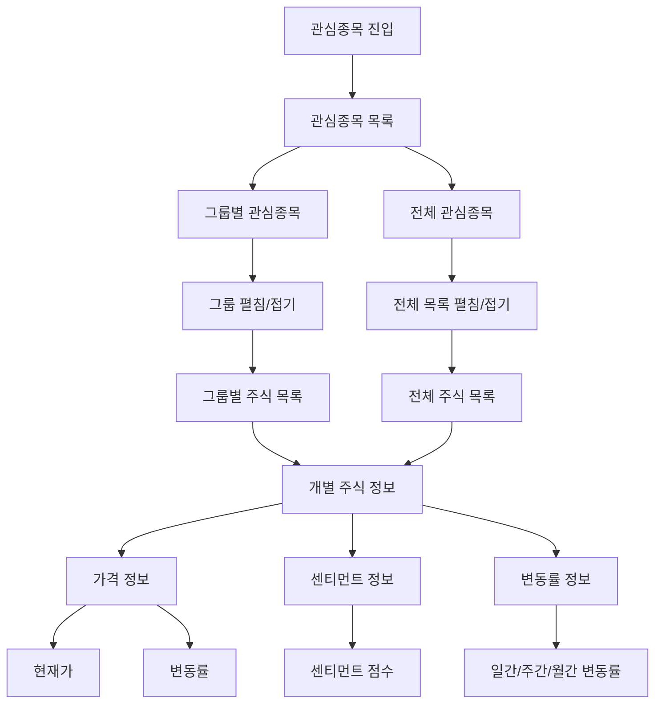

**흐름 분석**:
1. **목록 표시**: 그룹별, 전체 관심종목 목록 표시
2. **그룹 관리**: 그룹 펼침/접기, 그룹별 주식 목록 표시
3. **개별 정보**: 각 주식별 가격, 센티먼트, 변동률 정보 표시
4. **실시간 업데이트**: 모든 정보 실시간으로 업데이트

#### 3.5.2 관심종목 고급 흐름

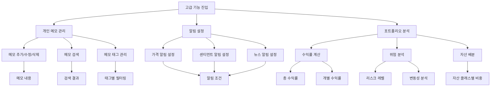

**흐름 분석**:
1. **메모 관리**: 메모 추가/수정/삭제, 검색, 태그 관리
2. **알림 설정**: 가격, 센티먼트, 뉴스 알림 조건 설정
3. **포트폴리오 분석**: 수익률 계산, 위험 분석, 자산 배분
4. **고급 기능**: 태그별 필터링, 자산 클래스별 비중 분석

### 3.6 실시간 데이터 엘리먼트 흐름

#### 3.6.1 실시간 데이터 스트리밍 흐름

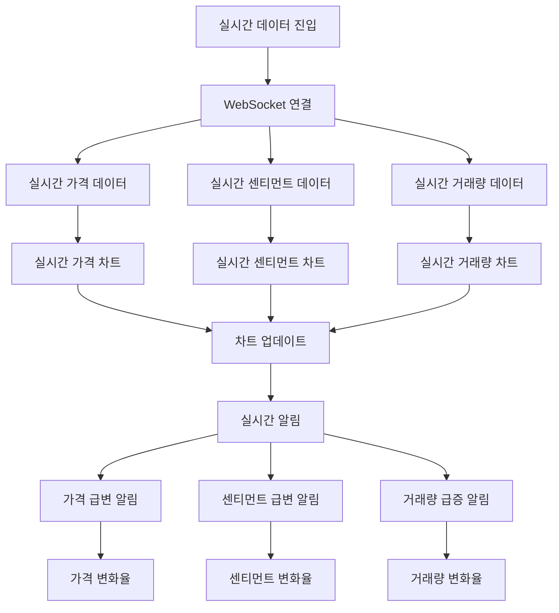

**흐름 분석**:
1. **데이터 스트리밍**: WebSocket을 통한 실시간 데이터 수신
2. **실시간 차트**: 가격, 센티먼트, 거래량 실시간 차트 업데이트
3. **변화 감지**: 급격한 가격, 센티먼트, 거래량 변화 감지
4. **실시간 알림**: 중요한 변화 발생 시 실시간 알림

#### 3.6.2 실시간 상호작용 흐름

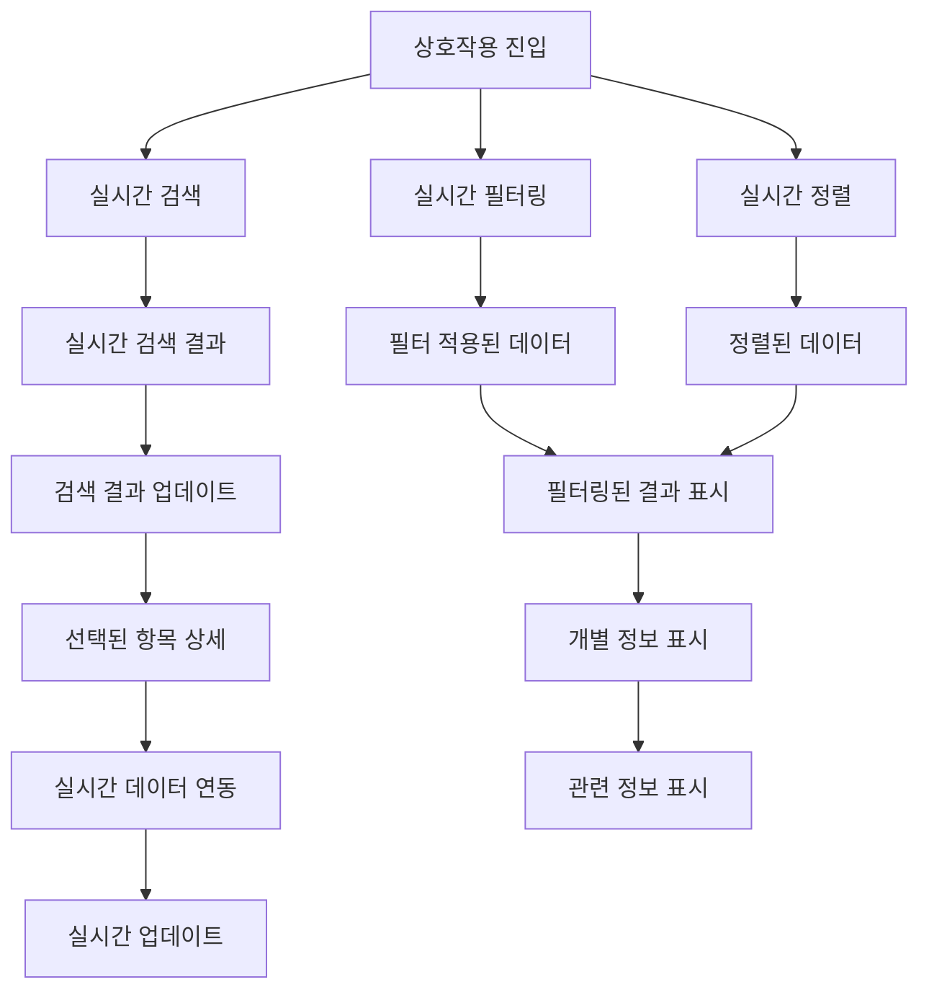

**흐름 분석**:
1. **실시간 검색**: 실시간으로 검색 기능 제공
2. **실시간 필터링**: 실시간으로 필터 적용 및 결과 업데이트
3. **실시간 정렬**: 실시간으로 데이터 정렬 기능 제공
4. **실시간 연동**: 선택된 항목과 실시간 데이터 연동

## 4. 사용자 시나리오별 엘리먼트 흐름

### 4.1 신규 사용자 시나리오

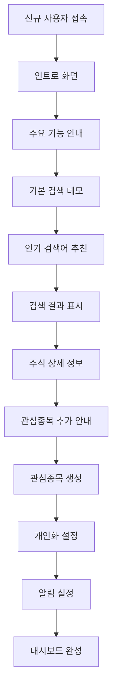

**흐름 분석**:
1. **온보딩**: 신규 사용자를 위한 인트로 화면 제공
2. **기능 안내**: 주요 기능 사용법 안내 및 데모 제공
3. **가이드된 탐색**: 인기 검색어 추천, 검색 결과 안내
4. **개인화 시작**: 관심종목 생성, 개인화 설정, 알림 설정

### 4.2 경험 사용자 시나리오

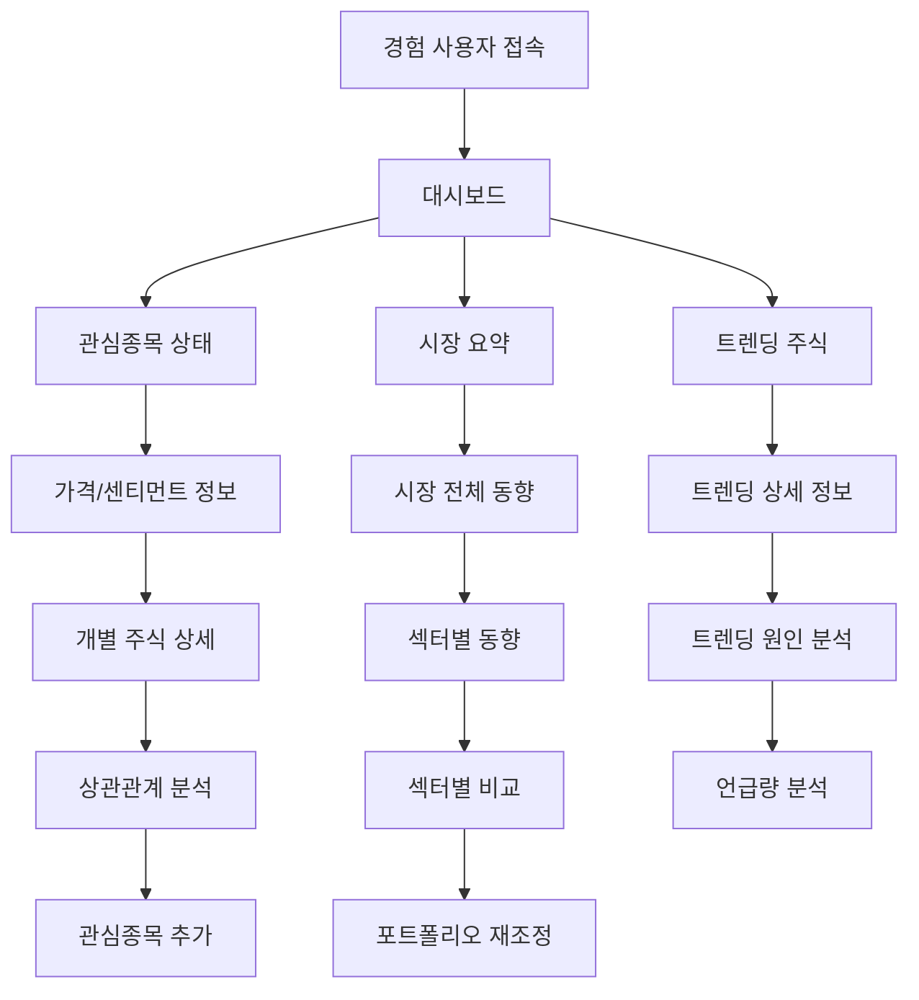

**흐름 분석**:
1. **빠른 현황**: 관심종목 상태, 시장 요약, 트렌딩 주식 표시
2. **상세 분석**: 개별 주식 상세 정보, 상관관계 분석
3. **시장 분석**: 시장 전체 동향, 섹터별 비교, 언급량 분석
4. **포트폴리오 관리**: 관심종목 추가, 포트폴리오 재조정

### 4.3 전문가 사용자 시나리오

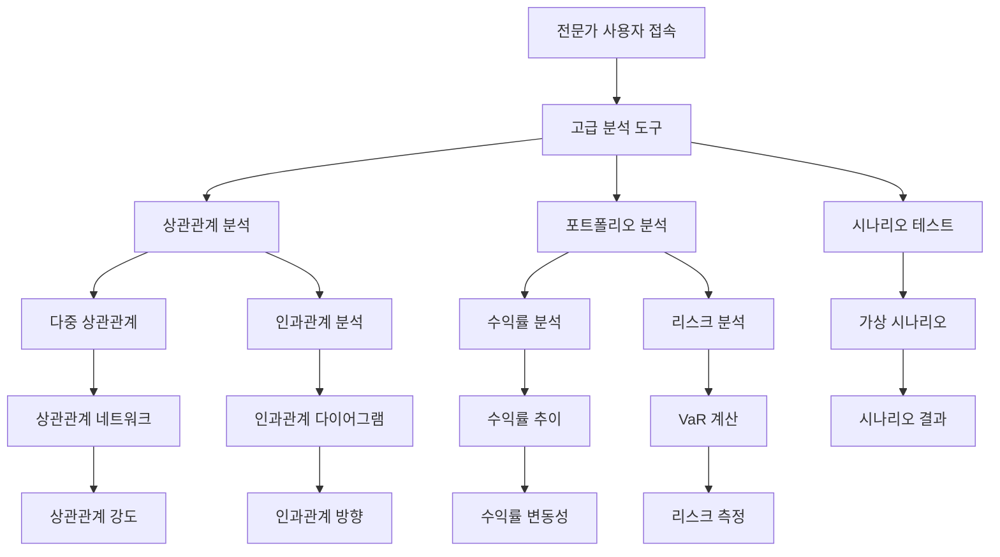

**흐름 분석**:
1. **고급 분석**: 다중 상관관계, 인과관계 분석
2. **포트폴리오 분석**: 수익률 분석, 리스크 분석, VaR 계산
3. **시나리오 테스트**: 가상 시나리오를 통한 전략 테스트
4. **전문가 도구**: 상관관계 네트워크, 인과관계 다이어그램

## 5. 엘리먼트 흐름 최적화 전략

### 5.1 사용자 행동 기반 최적화

#### 5.1.1 클릭 스트림 최적화
- **A/B 테스트**: 다른 엘리먼트 흐름 비교 테스트
- **클릭스트림 분석**: 사용자 클릭 패턴 분석
- **이탈 지점 개선**: 이탈률이 높은 단계 개선
- **단축 경로**: 목표 달성까지 최소 클릭 경로

#### 5.1.2 시간 기반 최적화
- **체류 시간 분석**: 각 단계별 체류 시간 측정
- **빠른 경로 제공**: 자주 사용하는 기능 빠른 접근
- **지연 로딩**: 예상되는 다음 단계 미리 로딩
- **비동기 처리**: 시간이 오래 걸리는 작업 비동기 처리

### 5.2 개인화된 엘리먼트 흐름

#### 5.2.1 사용자 패턴 학습
- **사용 빈도 분석**: 자주 사용하는 기능 순서 학습
- **선호도 기반 정렬**: 사용자 선호도 기반 메뉴 정렬
- **개인화된 추천**: 사용자 패턴 기반 추천 시스템
- **적응형 인터페이스**: 사용자 습관에 맞는 인터페이스

#### 5.2.2 상황 인식 흐름
- **시간대별 인터페이스**: 개장/장마/야간에 따른 인터페이스
- **시장 상황 인식**: 시장 변동성에 따른 인터페이스
- **사용자 상태 인식**: 초보/숙련/전문가 레벨에 따른 인터페이스
- **목적 기반 흐름**: 사용자 목적에 따른 엘리먼트 흐름

### 5.3 오류 처리 및 복구 흐름

#### 5.3.1 오류 예방 흐름
- **입력 검증**: 실시간 입력 검증 및 오류 예방
- **안전장치**: 데이터 로딩 실패 시 대체 데이터 제공
- **네트워크 상태 확인**: 네트워크 상태에 따른 기능 제어
- **데이터 무결성**: 데이터 무결성 검증 및 오류 방지

#### 5.3.2 오류 복구 흐름
- **자동 복구**: 일시적인 오류 자동 복구
- **수동 복구**: 사용자가 직접 복구할 수 있는 옵션
- **부분 기능 제공**: 전체 기능 실패 시 부분 기능 제공
- **오류 로깅**: 오류 발생 시 상세 로깅 및 분석

## 6. 엘리먼트 흐름 성공 지표

### 6.1 사용자 경험 지표

#### 6.1.1 효율성 지표
- **목표 달성 시간**: 특정 목표 달성까지 평균 시간
- **클릭 횟수**: 목표 달성까지 평균 클릭 횟수
- **기능 사용률**: 전체 기능 대비 사용률
- **이탈률**: 각 단계별 이탈률

#### 6.1.2 만족도 지표
- **사용자 만족도**: 사용자 만족도 조사 점수
- **기능 유용성**: 기능 유용성 평가 점수
- **학습 곡선**: 사용자 숙련도 향상 곡선
- **재방문율**: 일정 기간 내 재방문율

### 6.2 기술적 지표

#### 6.2.1 성능 지표
- **페이지 로딩 속도**: 각 페이지 로딩 속도
- **API 응답 시간**: API 호출 응답 시간
- **실시간 업데이트 지연**: 실시간 데이터 업데이트 지연 시간
- **오류 발생률**: 기능별 오류 발생률

#### 6.2.2 안정성 지표
- **시스템 가용성**: 시스템 전체 가용성
- **데이터 일관성**: 데이터 일관성 유지율
- **실시간 연결 안정성**: WebSocket 연결 안정성
- **복구 성공률**: 오류 복구 성공률

## 7. 결론

이 엘리먼트 흐름 분석을 통해 다음 사항을 확인했습니다:

1. **자연스러운 흐름**: 각 기능 간 자연스러운 사용자 흐름 설계
2. **효율성 최적화**: 불필요한 단계 제거, 빠른 경로 제공
3. **개인화된 경험**: 사용자 패턴에 맞는 개인화된 흐름
4. **오류 처리 강화**: 오류 예방 및 복구 흐름 강화

이러한 엘리먼트 흐름 분석을 바탕으로 사용자 경험을 최적화하고, 비즈니스 목표 달성에 기여할 수 있습니다.