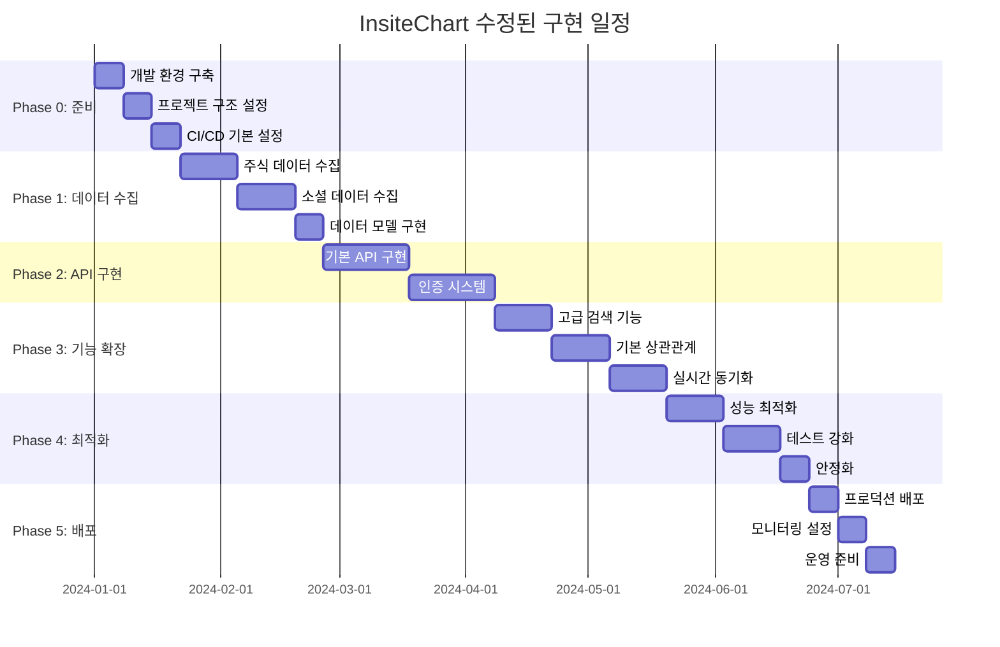

# InsiteChart 스펙 문서 수정 구현 가이드

## 1. 개요

본 문서는 [`22-execution-plan.md`](22-execution-plan.md)에서 제안된 실행 계획을 구체적으로 구현하기 위한 상세 가이드입니다. 각 수정 항목별로 구체적인 코드 예시, 수정 절차, 검증 방법 등을 제시하여 실제 수정 작업을 바로 시작할 수 있도록 지원합니다.

## 2. 수정 구현 원칙

### 2.1 수정 원칙
1. **점진적 수정**: 한 번에 모든 문서를 수정하지 않고 우선순위별로 점진적 수정
2. **백업 원칙**: 수정 전 반드시 원본 문서 백업
3. **검증 원칙**: 수정 후 반드시 일관성 및 기술적 타당성 검증
4. **문서화 원칙**: 모든 수정 사항을 변경 이력으로 상세히 기록

### 2.2 수정 프로세스


## 3. 1순위 수정 구현 가이드

### 3.1 데이터 모델 표준화 구현

#### 3.1.1 수정 대상 파일
- [`11-integrated-data-model.md`](11-integrated-data-model.md)
- [`16-correlation-analysis.md`](16-correlation-analysis.md)
- [`18-spec-compatibility-analysis.md`](18-spec-compatibility-analysis.md)

#### 3.1.2 구현 절차

**Step 1: 원본 백업**
```bash
# 각 파일의 원본 백업 생성
cp docs/spec/11-integrated-data-model.md docs/spec/11-integrated-data-model.md.backup
cp docs/spec/16-correlation-analysis.md docs/spec/16-correlation-analysis.md.backup
cp docs/spec/18-spec-compatibility-analysis.md docs/spec/18-spec-compatibility-analysis.md.backup
```

**Step 2: 11-integrated-data-model.md 수정**

```python
# 기존 코드 (수정 전)
@dataclass
class UnifiedStockData:
    symbol: str
    company_name: str
    stock_type: str
    exchange: str
    sector: str
    industry: str
    current_price: Optional[float]
    market_cap: Optional[float]
    relevance_score: float = 0.0
    sentiment_score: Optional[float] = None
    mention_count_24h: int = 0
    trending_status: bool = False
    trend_score: Optional[float] = None
    last_updated: datetime
    data_sources: List[str]

# 수정 후 코드
@dataclass
class UnifiedStockData:
    # 기본 정보
    symbol: str
    company_name: str
    stock_type: str
    exchange: str
    sector: str
    industry: str
    
    # 가격 정보
    current_price: Optional[float]
    market_cap: Optional[float]
    price_change_24h: Optional[float] = None
    price_change_pct_24h: Optional[float] = None
    
    # 검색 관련
    relevance_score: float = 0.0
    search_count: int = 0
    last_searched: Optional[datetime] = None
    
    # 센티먼트 관련 (표준화된 범위: -100~+100)
    sentiment_score: Optional[float] = None  # -100~+100 범위
    sentiment_history: List[SentimentPoint] = field(default_factory=list)
    mention_count_24h: int = 0
    mention_count_7d: int = 0
    trending_status: bool = False
    trend_score: Optional[float] = None
    trend_start_time: Optional[datetime] = None
    
    # 상세 정보
    mention_details: List[MentionDetail] = field(default_factory=list)
    community_breakdown: Dict[str, int] = field(default_factory=dict)
    investment_style_distribution: Dict[str, float] = field(default_factory=dict)
    
    # 메타데이터
    last_updated: datetime
    data_sources: List[str] = field(default_factory=list)
    data_quality_score: float = 1.0  # 0~1 범위

@dataclass
class SentimentPoint:
    timestamp: datetime
    sentiment_score: float  # -100~+100
    mention_count: int
    source: str  # reddit, twitter, etc.
    confidence: float  # 0~1 범위

@dataclass
class MentionDetail:
    id: str
    text: str
    author: str
    community: str
    upvotes: int
    downvotes: int
    timestamp: datetime
    investment_style: str
    sentiment_score: float
    confidence: float
    is_spam: bool = False
```

**Step 3: 16-correlation-analysis.md 수정**

```python
# 기존 코드 (수정 전)
@dataclass
class TimeSeriesData:
    symbol: str
    timestamps: List[datetime]
    prices: List[float]
    sentiment_scores: List[float]
    volumes: List[int]
    mentions: List[int]
    external_events: List[Dict] = field(default_factory=list)

# 수정 후 코드
@dataclass
class TimeSeriesData:
    symbol: str
    timestamps: List[datetime]
    prices: List[float]
    sentiment_scores: List[float]  # -100~+100 범위로 표준화
    volumes: List[int]
    mentions: List[int]
    external_events: List[Dict] = field(default_factory=list)
    
    def to_unified_stock_data(self) -> UnifiedStockData:
        """TimeSeriesData를 UnifiedStockData로 변환"""
        if not self.timestamps:
            return None
            
        return UnifiedStockData(
            symbol=self.symbol,
            company_name="",  # 별도 조회 필요
            stock_type="",     # 별도 조회 필요
            exchange="",       # 별도 조회 필요
            sector="",        # 별도 조회 필요
            industry="",      # 별도 조회 필요
            current_price=self.prices[-1] if self.prices else None,
            market_cap=None,  # 별도 조회 필요
            sentiment_score=self.sentiment_scores[-1] if self.sentiment_scores else None,
            sentiment_history=[
                SentimentPoint(
                    timestamp=ts,
                    sentiment_score=ss,
                    mention_count=0,  # 별도 계산 필요
                    source="correlation_analysis",
                    confidence=1.0
                )
                for ts, ss in zip(self.timestamps, self.sentiment_scores)
            ],
            mention_count_24h=self.mentions[-1] if self.mentions else 0,
            last_updated=self.timestamps[-1] if self.timestamps else datetime.utcnow(),
            data_sources=["correlation_analysis"]
        )
```

**Step 4: 18-spec-compatibility-analysis.md 수정**

```python
# 기존 코드 (수정 전)
@dataclass
class UnifiedStockData:
    # 기존 필드
    symbol: str
    company_name: str
    stock_type: str
    exchange: str
    sector: str
    industry: str
    current_price: Optional[float]
    market_cap: Optional[float]
    relevance_score: float = 0.0
    search_count: int = 0
    sentiment_score: Optional[float] = None
    mention_count_24h: int = 0
    trending_status: bool = False
    trend_score: Optional[float] = None
    last_updated: datetime
    data_sources: List[str]

# 수정 후 코드 (위에서 제안한 표준화된 모델 적용)
@dataclass
class UnifiedStockData:
    # [위에서 제안한 표준화된 모델 전체 적용]
    pass
```

#### 3.1.3 검증 방법

**일관성 검증**
```python
def validate_data_model_consistency():
    """데이터 모델 일관성 검증"""
    # 1. 필드 이름 일관성 검증
    required_fields = [
        'symbol', 'company_name', 'stock_type', 'exchange', 
        'sector', 'industry', 'current_price', 'market_cap',
        'sentiment_score', 'last_updated', 'data_sources'
    ]
    
    # 2. 데이터 타입 일관성 검증
    type_consistency = {
        'symbol': str,
        'company_name': str,
        'sentiment_score': Optional[float],
        'mention_count_24h': int,
        'trending_status': bool,
        'last_updated': datetime
    }
    
    # 3. 값 범위 검증
    value_ranges = {
        'sentiment_score': (-100, 100),
        'data_quality_score': (0, 1),
        'relevance_score': (0, float('inf'))
    }
    
    # 검증 로직 구현
    pass
```

### 3.2 성능 목표 재설정 구현

#### 3.2.1 수정 대상 파일
- [`04-performance-scalability.md`](04-performance-scalability.md)
- [`12-api-gateway-routing.md`](12-api-gateway-routing.md)
- [`17-final-implementation-roadmap.md`](17-final-implementation-roadmap.md)

#### 3.2.2 구현 절차

**Step 1: 원본 백업**
```bash
cp docs/spec/04-performance-scalability.md docs/spec/04-performance-scalability.md.backup
cp docs/spec/12-api-gateway-routing.md docs/spec/12-api-gateway-routing.md.backup
cp docs/spec/17-final-implementation-roadmap.md docs/spec/17-final-implementation-roadmap.md.backup
```

**Step 2: 04-performance-scalability.md 수정**

```markdown
## 3. 단계별 성능 목표 (수정)

### 3.1 MVP 단계 성능 목표
- API 응답 시간: 1000ms 이하
- 동시 사용자: 50명 지원
- 시스템 가용성: 99% 이상
- 데이터 신선도: 5분 이내

### 3.2 베타 단계 성능 목표
- API 응답 시간: 700ms 이하
- 동시 사용자: 200명 지원
- 시스템 가용성: 99.5% 이상
- 데이터 신선도: 3분 이내

### 3.3 정식 버전 성능 목표
- API 응답 시간: 500ms 이하
- 동시 사용자: 1000명 지원
- 시스템 가용성: 99.9% 이상
- 데이터 신선도: 1분 이내

## 4. 기능별 성능 목표 (수정)

| 기능 | MVP | 베타 | 정식 |
|------|-----|------|------|
| 주식 검색 | 500ms | 300ms | 200ms |
| 센티먼트 데이터 | 700ms | 500ms | 300ms |
| 상관관계 분석 | 10000ms | 7000ms | 5000ms |
| 실시간 업데이트 | 2000ms | 1500ms | 1000ms |
| 대시보드 로드 | 2000ms | 1500ms | 1000ms |
```

**Step 3: 12-api-gateway-routing.md 수정**

```markdown
## 4. API 게이트웨이 성능 목표 (수정)

### 4.1 단계별 성능 목표
- MVP: 라우팅 시간 100ms, 전체 응답 시간 1000ms
- 베타: 라우팅 시간 70ms, 전체 응답 시간 700ms
- 정식: 라우팅 시간 50ms, 전체 응답 시간 500ms

### 4.2 기능별 성능 목표
- 인증/권한: 50ms (MVP), 30ms (베타), 20ms (정식)
- 라우팅: 50ms (MVP), 30ms (베타), 20ms (정식)
- 속도 제한: 10ms (MVP), 5ms (베타), 5ms (정식)
- 로깅: 20ms (MVP), 10ms (베타), 5ms (정식)
```

**Step 4: 17-final-implementation-roadmap.md 수정**

```markdown
## 7.2 수정된 성공 지표 (수정)

### 7.2.1 기술적 지표
- **성능**: API 응답 시간 500ms 이하 (정식 버전)
- **가용성**: 99% 이상 (MVP), 99.5% 이상 (베타), 99.9% 이상 (정식)
- **확장성**: 50명 (MVP), 200명 (베타), 1000명 (정식) 동시 사용자 지원
- **정확도**: 센티먼트 분석 정확도 80% 이상 (MVP), 85% 이상 (정식)
```

#### 3.2.3 검증 방법

**성능 목표 현실성 검증**
```python
def validate_performance_targets():
    """성능 목표 현실성 검증"""
    targets = {
        "mvp": {
            "api_response_time": 1000,
            "concurrent_users": 50,
            "availability": 99.0
        },
        "beta": {
            "api_response_time": 700,
            "concurrent_users": 200,
            "availability": 99.5
        },
        "release": {
            "api_response_time": 500,
            "concurrent_users": 1000,
            "availability": 99.9
        }
    }
    
    # 현실성 검증 기준
    realism_criteria = {
        "api_response_time": {"min": 100, "max": 2000},
        "concurrent_users": {"min": 10, "max": 10000},
        "availability": {"min": 95.0, "max": 99.99}
    }
    
    # 검증 로직 구현
    for phase, metrics in targets.items():
        for metric, value in metrics.items():
            criteria = realism_criteria[metric]
            if value < criteria["min"] or value > criteria["max"]:
                print(f"Warning: {phase} {metric} target {value} may be unrealistic")
    
    return True
```

### 3.3 구현 일정 현실화 구현

#### 3.3.1 수정 대상 파일
- [`09-implementation-plan.md`](09-implementation-plan.md)
- [`17-final-implementation-roadmap.md`](17-final-implementation-roadmap.md)
- [`20-final-spec-improvements.md`](20-final-spec-improvements.md)

#### 3.3.2 구현 절차

**Step 1: 원본 백업**
```bash
cp docs/spec/09-implementation-plan.md docs/spec/09-implementation-plan.md.backup
cp docs/spec/17-final-implementation-roadmap.md docs/spec/17-final-implementation-roadmap.md.backup
cp docs/spec/20-final-spec-improvements.md docs/spec/20-final-spec-improvements.md.backup
```

**Step 2: 09-implementation-plan.md 수정**

```markdown
## 4. 수정된 구현 계획 (28주)

### 4.1 Phase 0: 준비 및 기반 구축 (3주)
- 개발 환경 구축
- 프로젝트 구조 설정
- CI/CD 파이프라인 기본 설정
- 데이터 모델 표준화

### 4.2 Phase 1: 핵심 데이터 수집 및 처리 (5주)
- 주식 데이터 수집 시스템 구현
- 소셜 미디어 데이터 수집 시스템 구현
- 기본 데이터 전처리 파이프라인 구축
- 통합 데이터 모델 구현

### 4.3 Phase 2: 기본 API 및 서비스 구현 (6주)
- 주식 검색 API 구현
- 센티먼트 분석 API 구현
- 기본 인증 및 권한 관리 구현
- API 게이트웨이 라우팅 구현

### 4.4 Phase 3: 기능 확장 및 통합 (6주)
- 고급 검색 기능 구현
- 기본 상관관계 분석 구현
- 실시간 데이터 동기화 (5분 간격)
- 통합 캐싱 시스템 구현

### 4.5 Phase 4: 최적화 및 안정화 (5주)
- 성능 최적화
- 테스트 강화
- 보안 강화
- 안정화

### 4.6 Phase 5: 배포 및 운영 (3주)
- 프로덕션 환경 배포
- 모니터링 시스템 구축
- 운영 매뉴얼 작성
- 사용자 교육 자료 준비

## 5. 수정된 인력 계획

| 역할 | 기존 인원 | 수정된 인원 | 추가 필요 | 이유 |
|------|-----------|-------------|-----------|------|
| 데이터 엔지니어 | 2명 | 3명 | 1명 | 시계열 데이터 전문가 필요 |
| 백엔드 개발자 | 3명 | 4명 | 1명 | 마이크로서비스 전문가 필요 |
| DevOps 엔지니어 | 1명 | 2명 | 1명 | 클라우드 인프라 전문가 필요 |
| 머신러닝 엔지니어 | 0명 | 1명 | 1명 | 상관관계 분석 전문가 필요 |
```

**Step 3: 17-final-implementation-roadmap.md 수정**

```markdown
## 4. 수정된 구현 단계

### 4.1 Phase 0: 준비 및 기반 구축 (3주)
- 개발 환경 구축
- 프로젝트 구조 설정
- CI/CD 파이프라인 기본 설정

### 4.2 Phase 1: 핵심 데이터 수집 및 처리 (5주)
- 주식 데이터 수집 시스템 구현
- 소셜 미디어 데이터 수집 시스템 구현
- 기본 데이터 전처리 파이프라인 구축
- 통합 데이터 모델 구현

### 4.3 Phase 2: 기본 API 및 서비스 구현 (6주)
- 주식 검색 API 구현
- 센티먼트 분석 API 구현
- 기본 인증 및 권한 관리 구현
- API 게이트웨이 라우팅 구현

### 4.4 Phase 3: 기능 확장 및 통합 (6주)
- 고급 검색 기능 구현
- 기본 상관관계 분석 구현
- 실시간 데이터 동기화 (5분 간격)
- 통합 캐싱 시스템 구현

### 4.5 Phase 4: 최적화 및 안정화 (5주)
- 성능 최적화
- 테스트 강화
- 보안 강화
- 안정화

### 4.6 Phase 5: 배포 및 운영 (3주)
- 프로덕션 환경 배포
- 모니터링 시스템 구축
- 운영 매뉴얼 작성
- 사용자 교육 자료 준비

## 6. 수정된 상세 일정


```

**Step 4: 20-final-spec-improvements.md 수정**

```markdown
## 3.3 수정된 구현 계획

### 3.3.1 수정된 구현 로드맵 (총 28주)
- Phase 0: 준비 및 기반 구축 (3주)
- Phase 1: 핵심 데이터 수집 및 처리 (5주)
- Phase 2: 기본 API 및 서비스 구현 (6주)
- Phase 3: 기능 확장 및 통합 (6주)
- Phase 4: 최적화 및 안정화 (5주)
- Phase 5: 배포 및 운영 (3주)

### 3.3.2 수정된 인력 계획
- 데이터 엔지니어: 2명 → 3명
- 백엔드 개발자: 3명 → 4명
- DevOps 엔지니어: 1명 → 2명
- 머신러닝 엔지니어: 0명 → 1명
```

#### 3.3.3 검증 방법

**일정 현실성 검증**
```python
def validate_timeline_realism():
    """일정 현실성 검증"""
    phase_durations = {
        "Phase 0": 3,  # 준비 및 기반 구축
        "Phase 1": 5,  # 핵심 데이터 수집 및 처리
        "Phase 2": 6,  # 기본 API 및 서비스 구현
        "Phase 3": 6,  # 기능 확장 및 통합
        "Phase 4": 5,  # 최적화 및 안정화
        "Phase 5": 3   # 배포 및 운영
    }
    
    total_duration = sum(phase_durations.values())
    
    # 현실성 검증 기준
    realism_criteria = {
        "total_duration": {"min": 20, "max": 40},  # 총 기간
        "phase_duration": {"min": 2, "max": 8}    # 단계별 기간
    }
    
    # 검증 로직
    if total_duration < realism_criteria["total_duration"]["min"]:
        print(f"Warning: Total duration {total_duration} weeks may be too short")
    
    if total_duration > realism_criteria["total_duration"]["max"]:
        print(f"Warning: Total duration {total_duration} weeks may be too long")
    
    for phase, duration in phase_durations.items():
        if duration < realism_criteria["phase_duration"]["min"]:
            print(f"Warning: {phase} duration {duration} weeks may be too short")
        
        if duration > realism_criteria["phase_duration"]["max"]:
            print(f"Warning: {phase} duration {duration} weeks may be too long")
    
    return True
```

## 4. 2순위 수정 구현 가이드

### 4.1 기능 단순화 구현

#### 4.1.1 수정 대상 파일
- [`16-correlation-analysis.md`](16-correlation-analysis.md)
- [`14-realtime-data-sync.md`](14-realtime-data-sync.md)
- [`13-unified-caching-system.md`](13-unified-caching-system.md)

#### 4.1.2 구현 절차

**Step 1: 원본 백업**
```bash
cp docs/spec/16-correlation-analysis.md docs/spec/16-correlation-analysis.md.backup
cp docs/spec/14-realtime-data-sync.md docs/spec/14-realtime-data-sync.md.backup
cp docs/spec/13-unified-caching-system.md docs/spec/13-unified-caching-system.md.backup
```

**Step 2: 16-correlation-analysis.md 수정**

```python
# 단순화된 상관관계 분석기 (MVP 버전)
class SimplifiedCorrelationAnalyzer:
    def __init__(self):
        self.max_symbols = 50  # 한 번에 분석할 최대 주식 수
        self.batch_size = 10   # 배치 처리 크기
        self.cache_ttl = 1800  # 30분 캐싱
        self.analysis_methods = {
            "basic_pearson": self._basic_pearson_correlation,
            "trend_analysis": self._trend_analysis,
            "volatility_comparison": self._volatility_comparison
        }
    
    async def analyze_correlation(self, symbol: str, timeframe: str = "30d") -> Dict[str, Any]:
        """단순화된 상관관계 분석"""
        try:
            # 1. 데이터 수집 (최대 30일, 일별 데이터)
            stock_data = await self._get_stock_data(symbol, timeframe)
            sentiment_data = await self._get_sentiment_data(symbol, timeframe)
            
            # 2. 데이터 정렬 및 전처리
            aligned_data = self._align_data(stock_data, sentiment_data)
            
            # 3. 기본 분석만 수행 (MVP)
            results = {}
            results["pearson_correlation"] = self._basic_pearson_correlation(aligned_data)
            results["trend_analysis"] = self._trend_analysis(aligned_data)
            results["simple_insights"] = self._generate_simple_insights(results)
            
            return results
            
        except Exception as e:
            return {
                "error": str(e),
                "fallback_analysis": self._fallback_analysis(symbol, timeframe)
            }
    
    def _basic_pearson_correlation(self, data: Dict[str, List[float]]) -> Dict[str, float]:
        """기본 피어슨 상관계계 계산"""
        prices = data["prices"]
        sentiments = data["sentiments"]
        
        if len(prices) < 7 or len(sentiments) < 7:
            return {"correlation": 0.0, "significance": 0.0, "sample_size": min(len(prices), len(sentiments))}
        
        # NumPy를 사용한 효율적 계산
        correlation, p_value = stats.pearsonr(prices, sentiments)
        
        return {
            "correlation": float(correlation),
            "significance": float(p_value),
            "sample_size": len(prices),
            "interpretation": self._interpret_correlation(correlation, p_value)
        }
    
    def _generate_simple_insights(self, results: Dict[str, Any]) -> List[str]:
        """간단한 인사이트 생성"""
        insights = []
        
        # 상관관계 인사이트
        corr = results.get("pearson_correlation", {}).get("correlation", 0.0)
        if abs(corr) > 0.5:
            direction = "양의" if corr > 0 else "음의"
            insights.append(f"주가와 센티먼트가 {direction} 상관관계를 보입니다 (상관계수: {corr:.2f})")
        
        # 추세 인사이트
        trend_analysis = results.get("trend_analysis", {})
        trend_alignment = trend_analysis.get("trend_alignment", "")
        if trend_alignment == "aligned":
            insights.append("주가와 센티먼트 추세가 일치합니다.")
        elif trend_alignment == "opposed":
            insights.append("주가와 센티먼트 추세가 반대됩니다.")
        
        return insights
    
    def _fallback_analysis(self, symbol: str, timeframe: str) -> Dict[str, Any]:
        """분석 실패 시 대체 분석"""
        return {
            "analysis_type": "fallback",
            "message": "상세 분석을 수행할 수 없어 기본 분석만 제공합니다.",
            "basic_stats": {
                "symbol": symbol,
                "timeframe": timeframe,
                "data_availability": "limited"
            },
            "recommendation": "더 많은 데이터가 필요합니다."
        }
```

**Step 3: 14-realtime-data-sync.md 수정**

```python
# 점진적 실시간 동기화 전략
class ProgressiveRealtimeSync:
    def __init__(self):
        self.sync_levels = {
            "level1": {"interval": 300, "method": "batch"},      # 5분 배치
            "level2": {"interval": 60, "method": "batch"},       # 1분 배치
            "level3": {"interval": 10, "method": "batch"},       # 10초 배치
            "level4": {"interval": 1, "method": "realtime"}     # 1초 실시간
        }
        self.current_level = "level1"  # MVP는 5분 배치부터 시작
    
    async def sync_data(self, symbol: str, sync_level: str = None):
        """데이터 동기화"""
        level = sync_level or self.current_level
        config = self.sync_levels[level]
        
        if config["method"] == "batch":
            return await self._batch_sync(symbol, config["interval"])
        else:
            return await self._realtime_sync(symbol)
    
    async def _batch_sync(self, symbol: str, interval: int):
        """배치 동기화"""
        while True:
            try:
                # 데이터 수집
                stock_data = await self._collect_stock_data(symbol)
                sentiment_data = await self._collect_sentiment_data(symbol)
                
                # 데이터 병합
                unified_data = self._merge_data(stock_data, sentiment_data)
                
                # 캐시 업데이트
                await self._update_cache(symbol, unified_data)
                
                # 클라이언트 알림 (WebSocket)
                await self._notify_clients(symbol, unified_data)
                
            except Exception as e:
                logger.error(f"Batch sync error for {symbol}: {str(e)}")
            
            # 대기
            await asyncio.sleep(interval)
    
    def upgrade_sync_level(self, new_level: str):
        """동기화 레벨 업그레이드"""
        if new_level in self.sync_levels:
            self.current_level = new_level
            logger.info(f"Sync level upgraded to {new_level}")
        else:
            raise ValueError(f"Invalid sync level: {new_level}")
```

**Step 4: 13-unified-caching-system.md 수정**

```python
# 단순화된 캐싱 시스템
class SimplifiedCacheManager:
    def __init__(self):
        self.cache_levels = {
            "l1_memory": MemoryCache(max_size=1000, ttl=300),
            "l2_redis": RedisCache(max_size=10000, ttl=1800)
        }
        self.cache_policies = {
            "stock_basic": CachePolicy(ttl=300, max_size=1000),
            "sentiment_data": CachePolicy(ttl=300, max_size=5000),
            "search_results": CachePolicy(ttl=300, max_size=1000),
            "api_responses": CachePolicy(ttl=60, max_size=5000),
            "correlation_data": CachePolicy(ttl=1800, max_size=100)
        }
    
    async def get(self, key: str, cache_type: str = "auto") -> Optional[Any]:
        """캐시에서 데이터 가져오기"""
        if cache_type == "auto":
            # L1 캐시에서 먼저 확인
            data = await self.cache_levels["l1_memory"].get(key)
            if data is not None:
                return data
            
            # L2 캐시에서 확인
            data = await self.cache_levels["l2_redis"].get(key)
            if data is not None:
                # L1 캐시에 저장
                await self.cache_levels["l1_memory"].set(key, data)
                return data
            
            return None
        else:
            return await self.cache_levels[cache_type].get(key)
    
    async def set(self, key: str, value: Any, cache_type: str = "auto", ttl: Optional[int] = None):
        """캐시에 데이터 저장"""
        if cache_type == "auto":
            # 데이터 유형에 따라 캐시 정책 결정
            policy = self._determine_cache_policy(key)
            ttl = ttl or policy.ttl
            
            # L1, L2 캐시에 모두 저장
            await self.cache_levels["l1_memory"].set(key, value, ttl)
            await self.cache_levels["l2_redis"].set(key, value, ttl)
        else:
            await self.cache_levels[cache_type].set(key, value, ttl)
    
    def _determine_cache_policy(self, key: str) -> CachePolicy:
        """키에 따라 캐시 정책 결정"""
        for pattern, policy in self.cache_policies.items():
            if pattern in key:
                return policy
        
        # 기본 정책
        return CachePolicy(ttl=300, max_size=1000)
```

#### 4.1.3 검증 방법

**기능 단순화 검증**
```python
def validate_simplification():
    """기능 단순화 검증"""
    # 상관관계 분석 단순화 검증
    analyzer = SimplifiedCorrelationAnalyzer()
    
    # 최대 주식 수 제한 검증
    assert analyzer.max_symbols == 50, "Max symbols should be limited to 50"
    
    # 분석 방법 단순화 검증
    assert len(analyzer.analysis_methods) == 3, "Should have only 3 analysis methods"
    
    # 실시간 동기화 단순화 검증
    sync = ProgressiveRealtimeSync()
    
    # 초기 동기화 레벨 검증
    assert sync.current_level == "level1", "Should start with level1 (5-minute batch)"
    
    # 캐싱 시스템 단순화 검증
    cache = SimplifiedCacheManager()
    
    # 캐시 레벨 단순화 검증
    assert len(cache.cache_levels) == 2, "Should have only 2 cache levels"
    
    return True
```

## 5. 수정 검증 자동화 스크립트

### 5.1 일관성 검증 스크립트

```python
#!/usr/bin/env python3
"""
스펙 문서 일관성 검증 스크립트
"""

import os
import re
import json
from typing import Dict, List, Any
from pathlib import Path

class SpecConsistencyValidator:
    def __init__(self, spec_dir: str = "docs/spec"):
        self.spec_dir = Path(spec_dir)
        self.validation_results = {}
    
    def validate_all(self) -> Dict[str, Any]:
        """모든 일관성 검증 수행"""
        results = {
            "data_model_consistency": self.validate_data_model_consistency(),
            "performance_targets_consistency": self.validate_performance_targets_consistency(),
            "timeline_consistency": self.validate_timeline_consistency(),
            "terminology_consistency": self.validate_terminology_consistency()
        }
        
        return results
    
    def validate_data_model_consistency(self) -> Dict[str, Any]:
        """데이터 모델 일관성 검증"""
        unified_stock_data_fields = set()
        sentiment_point_fields = set()
        mention_detail_fields = set()
        
        # 모든 스펙 문서에서 UnifiedStockData 필드 수집
        for spec_file in self.spec_dir.glob("*.md"):
            content = spec_file.read_text()
            
            # UnifiedStockData 필드 추출
            unified_matches = re.findall(r'class UnifiedStockData:.*?(?=\n\n|\nclass|\Z)', content, re.DOTALL)
            for match in unified_matches:
                fields = re.findall(r'(\w+):', match)
                unified_stock_data_fields.update(fields)
            
            # SentimentPoint 필드 추출
            sentiment_matches = re.findall(r'class SentimentPoint:.*?(?=\n\n|\nclass|\Z)', content, re.DOTALL)
            for match in sentiment_matches:
                fields = re.findall(r'(\w+):', match)
                sentiment_point_fields.update(fields)
            
            # MentionDetail 필드 추출
            mention_matches = re.findall(r'class MentionDetail:.*?(?=\n\n|\nclass|\Z)', content, re.DOTALL)
            for match in mention_matches:
                fields = re.findall(r'(\w+):', match)
                mention_detail_fields.update(fields)
        
        # 필수 필드 검증
        required_unified_fields = {
            'symbol', 'company_name', 'stock_type', 'exchange', 
            'sector', 'industry', 'current_price', 'market_cap',
            'sentiment_score', 'last_updated', 'data_sources'
        }
        
        missing_fields = required_unified_fields - unified_stock_data_fields
        
        return {
            "unified_stock_data_fields": list(unified_stock_data_fields),
            "sentiment_point_fields": list(sentiment_point_fields),
            "mention_detail_fields": list(mention_detail_fields),
            "missing_required_fields": list(missing_fields),
            "is_consistent": len(missing_fields) == 0
        }
    
    def validate_performance_targets_consistency(self) -> Dict[str, Any]:
        """성능 목표 일관성 검증"""
        performance_targets = {}
        
        # 모든 스펙 문서에서 성능 목표 수집
        for spec_file in self.spec_dir.glob("*.md"):
            content = spec_file.read_text()
            
            # API 응답 시간 목표 추출
            response_time_matches = re.findall(r'API 응답 시간:\s*(\d+)ms', content)
            if response_time_matches:
                performance_targets[spec_file.name] = {
                    "response_time": int(response_time_matches[0])
                }
            
            # 동시 사용자 목표 추출
            user_matches = re.findall(r'동시 사용자:\s*(\d+)명', content)
            if user_matches:
                if spec_file.name not in performance_targets:
                    performance_targets[spec_file.name] = {}
                performance_targets[spec_file.name]["concurrent_users"] = int(user_matches[0])
        
        # 일관성 검증
        response_times = [targets.get("response_time") for targets in performance_targets.values() if targets.get("response_time")]
        user_counts = [targets.get("concurrent_users") for targets in performance_targets.values() if targets.get("concurrent_users")]
        
        response_time_variance = max(response_times) - min(response_times) if response_times else 0
        user_count_variance = max(user_counts) - min(user_counts) if user_counts else 0
        
        return {
            "performance_targets": performance_targets,
            "response_time_variance": response_time_variance,
            "user_count_variance": user_count_variance,
            "is_consistent": response_time_variance <= 500 and user_count_variance <= 500
        }
    
    def validate_timeline_consistency(self) -> Dict[str, Any]:
        """일정 일관성 검증"""
        timelines = {}
        
        # 모든 스펙 문서에서 일정 정보 수집
        for spec_file in self.spec_dir.glob("*.md"):
            content = spec_file.read_text()
            
            # 주 단위 일정 추출
            week_matches = re.findall(r'(\d+)주', content)
            if week_matches:
                timelines[spec_file.name] = [int(weeks) for weeks in week_matches]
        
        # 일관성 검증
        all_weeks = [week for timeline in timelines.values() for week in timeline]
        total_duration = sum(all_weeks)
        
        return {
            "timelines": timelines,
            "total_duration": total_duration,
            "is_consistent": 20 <= total_duration <= 40  # 20-40주 범위
        }
    
    def validate_terminology_consistency(self) -> Dict[str, Any]:
        """용어 일관성 검증"""
        terminology = {}
        
        # 모든 스펙 문서에서 주요 용어 수집
        key_terms = ["UnifiedStockData", "SentimentPoint", "MentionDetail", "API 게이트웨이", "상관관계 분석"]
        
        for spec_file in self.spec_dir.glob("*.md"):
            content = spec_file.read_text()
            terminology[spec_file.name] = {}
            
            for term in key_terms:
                count = content.count(term)
                if count > 0:
                    terminology[spec_file.name][term] = count
        
        # 일관성 검증
        term_usage = {}
        for term in key_terms:
            files_using_term = [filename for filename, terms in terminology.items() if term in terms]
            term_usage[term] = {
                "files": files_using_term,
                "count": len(files_using_term)
            }
        
        return {
            "terminology": terminology,
            "term_usage": term_usage,
            "is_consistent": all(usage["count"] > 0 for usage in term_usage.values())
        }

if __name__ == "__main__":
    validator = SpecConsistencyValidator()
    results = validator.validate_all()
    
    print("=== 스펙 문서 일관성 검증 결과 ===")
    print(json.dumps(results, indent=2, ensure_ascii=False))
    
    # 종합 결과
    all_consistent = all(
        result.get("is_consistent", False) 
        for result in results.values()
        if isinstance(result, dict) and "is_consistent" in result
    )
    
    print(f"\n=== 종합 결과 ===")
    print(f"일관성: {'통과' if all_consistent else '미통과'}")
```

### 5.2 실행 방법

```bash
# 1. 스펙 문서 일관성 검증
python scripts/validate_spec_consistency.py

# 2. 데이터 모델 일관성 검증
python scripts/validate_data_model.py

# 3. 성능 목표 현실성 검증
python scripts/validate_performance_targets.py

# 4. 일정 현실성 검증
python scripts/validate_timeline.py
```

## 6. 수정 완료 후 최종 검토 체크리스트

### 6.1 기술적 검토 체크리스트

- [ ] 데이터 모델 일관성 확보
  - [ ] UnifiedStockData 필드 정의 통일
  - [ ] SentimentPoint, MentionDetail 모델 표준화
  - [ ] 데이터 타입 일관성 확보

- [ ] 성능 목표 현실성 확보
  - [ ] 단계별 성능 목표 설정
  - [ ] 기능별 성능 목표 조정
  - [ ] 성능 모니터링 전략 수립

- [ ] 구현 일정 현실성 확보
  - [ ] 총 기간 28주로 조정
  - [ ] 단계별 기간 현실성 검증
  - [ ] 인력 계획 현실성 확보

### 6.2 문서 품질 검토 체크리스트

- [ ] 일관성 확보
  - [ ] 용어 사용 일관성
  - [ ] 표기법 일관성
  - [ ] 개념 정의 일관성

- [ ] 완전성 확보
  - [ ] 필요한 모든 내용 포함
  - [ ] 누락된 내용 없음
  - [ ] 상세한 설명 포함

- [ ] 명확성 확보
  - [ ] 이해하기 쉬운 표현
  - [ ] 모호한 표현 없음
  - [ ] 구체적인 예시 포함

### 6.3 실행 가능성 검토 체크리스트

- [ ] 기술적 실행 가능성
  - [ ] 제안된 기술 구현 가능
  - [ ] 필요한 기술 역량 확보 가능
  - [ ] 기술적 장벽 없음

- [ ] 일정 실행 가능성
  - [ ] 제안된 일정 준수 가능
  - [ ] 충분한 버퍼 시간 확보
  - [ ] 리스크 대응 계획 수립

- [ ] 자원 실행 가능성
  - [ ] 필요한 인력 확보 가능
  - [ ] 필요한 예산 확보 가능
  - [ ] 필요한 인프라 확보 가능

## 7. 결론

본 구현 가이드는 InsiteChart 프로젝트 스펙 문서 수정을 위한 구체적인 실행 방법론을 제시합니다. 단계적 수정 접근, 철저한 검증 프로세스, 자동화된 검증 스크립트를 통해 성공적인 스펙 문서 수정을 달성할 수 있을 것입니다.

핵심 성공 요소는 다음과 같습니다:

1. **체계적 접근**: 우선순위 기반의 단계적 수정
2. **철저한 검증**: 수정 후 반드시 일관성 및 타당성 검증
3. **자동화**: 반복적인 검증 작업은 자동화 스크립트 활용
4. **지속적 개선**: 피드백을 통한 지속적 개선

이러한 원칙들을 충실히 이행한다면, InsiteChart 프로젝트는 성공적인 스펙 문서 수정을 통해 기술적 현실성과 비즈니스 목표 간의 균형을 맞추고, 프로젝트 성공 가능성을 크게 높일 수 있을 것입니다.