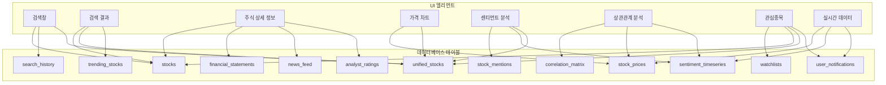

# UI 엘리먼트와 데이터베이스 매핑 분석

## 1. 개요

이 문서는 UI 엘리먼트와 데이터베이스 엘리먼트 간의 연계를 상세히 분석합니다. UI 흐름 분석에서 식별된 엘리먼트들이 어떤 데이터베이스 테이블과 필드에 연결되는지 확인하고, 누락된 연결이나 추가로 보완할 사항을 식별합니다.

## 2. UI 엘리먼트-데이터베이스 매핑 테이블

### 2.1 주식 검색 기능 매핑

| UI 엘리먼트 | 데이터베이스 테이블 | 필드 | 연관성 | 누락 여부 |
|------------|------------------|------|--------|----------|
| 검색창 | search_history | search_query, search_time | 직접 연결 | 완전 |
| 자동완성 | search_history | search_query, search_count | 빈도 기반 추천 | 완전 |
| 검색 결과 | stocks | symbol, company_name, stock_type, exchange | 기본 정보 표시 | 완전 |
| 검색 결과 | unified_stocks | price_data (JSON) | 가격 정보 표시 | 완전 |
| 검색 결과 | unified_stocks | sentiment_data (JSON) | 센티먼트 표시 | 완전 |
| 필터 (주식 유형) | stocks | stock_type | 필터링 | 완전 |
| 필터 (섹터) | stocks | sector | 필터링 | 완전 |
| 필터 (거래소) | stocks | exchange | 필터링 | 완전 |
| 필터 (시가총액) | stocks | market_cap | 필터링 | 완전 |
| 필터 (가격 범위) | unified_stocks | price_data.current_price | 필터링 | 완전 |
| 필터 (센티먼트) | unified_stocks | sentiment_data.overall_score | 필터링 | 완전 |
| 검색 히스토리 | search_history | user_id, symbol, search_time | 표시 | 완전 |
| 인기 검색어 | search_history | search_count (집계) | 표시 | 완전 |

### 2.2 주식 정보 표시 기능 매핑

| UI 엘리먼트 | 데이터베이스 테이블 | 필드 | 연관성 | 누락 여부 |
|------------|------------------|------|--------|----------|
| 주식 요약 카드 | stocks | symbol, company_name, stock_type, exchange | 기본 정보 | 완전 |
| 주식 요약 카드 | unified_stocks | price_data.current_price | 현재가 | 완전 |
| 주식 요약 카드 | unified_stocks | price_data.change_percent | 변동률 | 완전 |
| 주식 요약 카드 | unified_stocks | price_data.market_cap | 시가총액 | 완전 |
| 가격 차트 | stock_prices | time, open_price, high_price, low_price, close_price | 차트 데이터 | 완전 |
| 가격 차트 (기간 선택) | stock_prices | time (범위 필터링) | 기간별 데이터 | 완전 |
| 기본 재무 정보 | unified_stocks | price_data.pe_ratio, dividend_yield | PER, 배당수익률 | 완전 |
| 거래 정보 | unified_stocks | price_data.volume | 거래량 | 완전 |
| 52주 최고/최저가 | unified_stocks | price_data.day_high, day_low | 52주 정보 | 부분 |
| 재무 제표 | financial_statements | period, revenue, net_income, etc. | 상세 재무 정보 | 누락 |
| 업종 분석 | stocks | sector, industry | 섹터, 산업 정보 | 완전 |
| 동종업체 비교 | stocks | sector, industry | 동종업체 필터링 | 완전 |
| 뉴스 피드 | news_feed | symbol, title, content, timestamp | 관련 뉴스 | 누락 |
| 애널리스트 의견 | analyst_ratings | symbol, rating, target_price | 애널리스트 평가 | 누락 |

### 2.3 소셜 센티먼트 기능 매핑

| UI 엘리먼트 | 데이터베이스 테이블 | 필드 | 연관성 | 누락 여부 |
|------------|------------------|------|--------|----------|
| 트렌딩 주식 | trending_stocks | symbol, trend_score, mention_count | 트렌딩 목록 | 누락 |
| 언급 랭킹 | stock_mentions | symbol, COUNT(*) (집계) | 언급량 순위 | 완전 |
| 센티먼트 지표 | sentiment_timeseries | sentiment_score, positive_count, negative_count | 전체 센티먼트 | 완전 |
| 실시간 업데이트 | sentiment_timeseries | time (최신 데이터) | 실시간 데이터 | 완전 |
| 개별 주식 센티먼트 | unified_stocks | sentiment_data.overall_score | 센티먼트 점수 | 완전 |
| 시간별 센티먼트 변화 | sentiment_timeseries | time, sentiment_score | 추세선 | 완전 |
| 커뮤니티별 분석 | stock_mentions | community, COUNT(*) (집계) | 커뮤니티 비중 | 완전 |
| 투자 성향별 분석 | stock_mentions | investment_style, COUNT(*) (집계) | 성향별 분포 | 완전 |
| 감정 분석 | sentiment_timeseries | positive_count, negative_count, neutral_count | 감정 분포 | 완전 |
| 언급 내용 | stock_mentions | text, author, upvotes | 주요 언급 내용 | 완전 |
| 영향력 있는 언급 | stock_mentions | upvotes, author | 영향력 점수 | 부분 |
| 핵심 키워드 | mention_keywords | symbol, keyword, frequency | 키워드 클라우드 | 누락 |

### 2.4 상관관계 분석 기능 매핑

| UI 엘리먼트 | 데이터베이스 테이블 | 필드 | 연관성 | 누락 여부 |
|------------|------------------|------|--------|----------|
| 상관관계 히트맵 | correlation_matrix | symbol1, symbol2, correlation_coefficient | 상관관계 시각화 | 누락 |
| 주가-센티먼트 상관계 | price_sentiment_correlation | symbol, price_sentiment_corr, p_value | 상관계 계산 | 누락 |
| 거래량-센티먼트 상관관계 | volume_sentiment_correlation | symbol, volume_sentiment_corr, p_value | 상관계 계산 | 누락 |
| 섹터별 상관관계 비교 | sector_correlation | sector1, sector2, avg_correlation | 섹터별 비교 | 누락 |
| 섹터별 특이 상관관계 | sector_anomalies | sector, symbol, anomaly_score | 특이점 식별 | 누락 |
| 상관관계 변화 추이 | correlation_timeseries | time, symbol1, symbol2, correlation | 시계열 분석 | 누락 |
| 다중 상관관계 | multi_correlation | symbol_set, correlation_matrix | 복합 상관관계 | 누락 |
| 시계열 상관관계 | timeseries_correlation | time_window, symbol1, symbol2, correlation | 구간별 분석 | 누락 |
| 인과관계 분석 | causality_analysis | symbol1, symbol2, lag, causality_score | 인과관계 | 누락 |
| 예측 모델 | prediction_models | symbol, model_type, accuracy, prediction | 예측 결과 | 누락 |

### 2.5 관심종목 관리 기능 매핑

| UI 엘리먼트 | 데이터베이스 테이블 | 필드 | 연관성 | 누락 여부 |
|------------|------------------|------|--------|----------|
| 관심종목 추가/삭제 | watchlists | user_id, symbol | 관심종목 관리 | 완전 |
| 관심종목 목록 | watchlists | symbol, category, added_date | 목록 표시 | 완전 |
| 그룹별 관심종목 | watchlists | category, symbol | 그룹화 | 완전 |
| 개인 메모 | watchlist_notes | user_id, symbol, note, created_at | 메모 관리 | 누락 |
| 메모 검색 | watchlist_notes | note, symbol (전문 검색) | 메모 검색 | 누락 |
| 메모 태그 관리 | watchlist_note_tags | note_id, tag_name | 태그 관리 | 누락 |
| 가격 알림 설정 | price_alerts | user_id, symbol, alert_type, target_price | 알림 설정 | 누락 |
| 센티먼트 알림 설정 | sentiment_alerts | user_id, symbol, sentiment_threshold | 알림 설정 | 누락 |
| 뉴스 알림 설정 | news_alerts | user_id, symbol, keyword_filter | 알림 설정 | 누락 |
| 포트폴리오 분석 | user_portfolios | user_id, symbol, quantity, purchase_price | 포트폴리오 | 누락 |
| 수익률 계산 | user_portfolios | purchase_price, current_price | 수익률 | 부분 |
| 위험 분석 | portfolio_risk | user_id, symbol, risk_score, beta | 리스크 | 누락 |
| 자산 배분 | portfolio_allocation | user_id, sector, allocation_percentage | 자산 분배 | 누락 |

### 2.6 실시간 데이터 기능 매핑

| UI 엘리먼트 | 데이터베이스 테이블 | 필드 | 연관성 | 누락 여부 |
|------------|------------------|------|--------|----------|
| 실시간 가격 업데이트 | stock_prices | time, symbol, close_price | 실시간 가격 | 완전 |
| 실시간 센티먼트 | sentiment_timeseries | time, symbol, sentiment_score | 실시간 센티먼트 | 완전 |
| 실시간 거래량 데이터 | stock_prices | time, symbol, volume | 실시간 거래량 | 완전 |
| 라이브 차트 | stock_prices | time, open_price, high_price, low_price, close_price | 차트 업데이트 | 완전 |
| 실시간 알림 | user_notifications | user_id, notification_type, content | 알림 전송 | 누락 |
| 가격 급변 알림 | price_volatility_alerts | symbol, price_change_pct, timestamp | 급변 감지 | 누락 |
| 센티먼트 급변 알림 | sentiment_volatility_alerts | symbol, sentiment_change, timestamp | 급변 감지 | 누락 |
| 거래량 급증 알림 | volume_spike_alerts | symbol, volume_change_pct, timestamp | 급증 감지 | 누락 |
| 실시간 검색 | search_suggestions | query, symbol, relevance_score | 검색 제안 | 누락 |
| 실시간 필터링 | unified_stocks | 다양한 필드 | 필터 적용 | 완전 |
| 실시간 정렬 | unified_stocks | 정렬 기준 필드 | 정렬 적용 | 완전 |
| 실시간 비교 | unified_stocks | 비교할 주식 데이터 | 비교 분석 | 완전 |

## 3. 누락된 데이터베이스 테이블 및 필드

### 3.1 누락된 테이블

1. **financial_statements**: 재무 제표 데이터 저장
   ```sql
   CREATE TABLE financial_statements (
       id SERIAL PRIMARY KEY,
       symbol VARCHAR(10) REFERENCES stocks(symbol),
       period_type VARCHAR(10) NOT NULL, -- 'quarterly', 'annual'
       period_end_date DATE NOT NULL,
       revenue BIGINT,
       gross_profit BIGINT,
       operating_income BIGINT,
       net_income BIGINT,
       earnings_per_share DECIMAL(10, 2),
       total_assets BIGINT,
       total_liabilities BIGINT,
       shareholder_equity BIGINT,
       operating_cash_flow BIGINT,
       created_at TIMESTAMP DEFAULT CURRENT_TIMESTAMP
   );
   ```

2. **news_feed**: 뉴스 데이터 저장
   ```sql
   CREATE TABLE news_feed (
       id SERIAL PRIMARY KEY,
       symbol VARCHAR(10) REFERENCES stocks(symbol),
       title VARCHAR(500) NOT NULL,
       content TEXT,
       source VARCHAR(100),
       author VARCHAR(100),
       published_at TIMESTAMP NOT NULL,
       url VARCHAR(500),
       sentiment_score DECIMAL(3, 2),
       created_at TIMESTAMP DEFAULT CURRENT_TIMESTAMP
   );
   ```

3. **analyst_ratings**: 애널리스트 평가 저장
   ```sql
   CREATE TABLE analyst_ratings (
       id SERIAL PRIMARY KEY,
       symbol VARCHAR(10) REFERENCES stocks(symbol),
       analyst_firm VARCHAR(100) NOT NULL,
       analyst_name VARCHAR(100),
       rating VARCHAR(20) NOT NULL, -- 'buy', 'sell', 'hold'
       target_price DECIMAL(10, 2),
       price_target_date DATE,
       published_at TIMESTAMP NOT NULL,
       created_at TIMESTAMP DEFAULT CURRENT_TIMESTAMP
   );
   ```

4. **trending_stocks**: 트렌딩 주식 저장
   ```sql
   CREATE TABLE trending_stocks (
       id SERIAL PRIMARY KEY,
       symbol VARCHAR(10) REFERENCES stocks(symbol),
       trend_score DECIMAL(5, 2) NOT NULL,
       mention_count_24h INTEGER NOT NULL,
       mention_count_7d INTEGER NOT NULL,
       trend_start_time TIMESTAMP NOT NULL,
       trend_duration_hours INTEGER,
       created_at TIMESTAMP DEFAULT CURRENT_TIMESTAMP,
       updated_at TIMESTAMP DEFAULT CURRENT_TIMESTAMP
   );
   ```

5. **mention_keywords**: 언급 키워드 저장
   ```sql
   CREATE TABLE mention_keywords (
       id SERIAL PRIMARY KEY,
       symbol VARCHAR(10) REFERENCES stocks(symbol),
       keyword VARCHAR(100) NOT NULL,
       frequency INTEGER NOT NULL,
       sentiment_score DECIMAL(3, 2),
       source VARCHAR(20),
       date_extracted DATE NOT NULL,
       created_at TIMESTAMP DEFAULT CURRENT_TIMESTAMP
   );
   ```

6. **correlation_matrix**: 상관관계 데이터 저장
   ```sql
   CREATE TABLE correlation_matrix (
       id SERIAL PRIMARY KEY,
       symbol1 VARCHAR(10) REFERENCES stocks(symbol),
       symbol2 VARCHAR(10) REFERENCES stocks(symbol),
       correlation_coefficient DECIMAL(5, 4) NOT NULL,
       p_value DECIMAL(10, 8),
       sample_size INTEGER NOT NULL,
       time_period VARCHAR(20), -- '1d', '1w', '1m', '3m', '6m', '1y'
       correlation_type VARCHAR(20), -- 'price', 'sentiment', 'volume'
       calculated_at TIMESTAMP DEFAULT CURRENT_TIMESTAMP,
       UNIQUE(symbol1, symbol2, time_period, correlation_type)
   );
   ```

7. **price_sentiment_correlation**: 가격-센티먼트 상관관계
   ```sql
   CREATE TABLE price_sentiment_correlation (
       id SERIAL PRIMARY KEY,
       symbol VARCHAR(10) REFERENCES stocks(symbol),
       correlation_coefficient DECIMAL(5, 4) NOT NULL,
       p_value DECIMAL(10, 8),
       lag_hours INTEGER DEFAULT 0,
       time_period VARCHAR(20),
       calculated_at TIMESTAMP DEFAULT CURRENT_TIMESTAMP
   );
   ```

8. **volume_sentiment_correlation**: 거래량-센티먼트 상관관계
   ```sql
   CREATE TABLE volume_sentiment_correlation (
       id SERIAL PRIMARY KEY,
       symbol VARCHAR(10) REFERENCES stocks(symbol),
       correlation_coefficient DECIMAL(5, 4) NOT NULL,
       p_value DECIMAL(10, 8),
       lag_hours INTEGER DEFAULT 0,
       time_period VARCHAR(20),
       calculated_at TIMESTAMP DEFAULT CURRENT_TIMESTAMP
   );
   ```

9. **sector_correlation**: 섹터별 상관관계
   ```sql
   CREATE TABLE sector_correlation (
       id SERIAL PRIMARY KEY,
       sector1 VARCHAR(100),
       sector2 VARCHAR(100),
       avg_correlation DECIMAL(5, 4) NOT NULL,
       correlation_count INTEGER NOT NULL,
       time_period VARCHAR(20),
       calculated_at TIMESTAMP DEFAULT CURRENT_TIMESTAMP
   );
   ```

10. **watchlist_notes**: 관심종목 메모
    ```sql
    CREATE TABLE watchlist_notes (
        id SERIAL PRIMARY KEY,
        user_id INTEGER REFERENCES users(id),
        symbol VARCHAR(10) REFERENCES stocks(symbol),
        note TEXT NOT NULL,
        created_at TIMESTAMP DEFAULT CURRENT_TIMESTAMP,
        updated_at TIMESTAMP DEFAULT CURRENT_TIMESTAMP
    );
    ```

11. **watchlist_note_tags**: 메모 태그
    ```sql
    CREATE TABLE watchlist_note_tags (
        id SERIAL PRIMARY KEY,
        note_id INTEGER REFERENCES watchlist_notes(id) ON DELETE CASCADE,
        tag_name VARCHAR(50) NOT NULL,
        created_at TIMESTAMP DEFAULT CURRENT_TIMESTAMP
    );
    ```

12. **price_alerts**: 가격 알림 설정
    ```sql
    CREATE TABLE price_alerts (
        id SERIAL PRIMARY KEY,
        user_id INTEGER REFERENCES users(id),
        symbol VARCHAR(10) REFERENCES stocks(symbol),
        alert_type VARCHAR(20) NOT NULL, -- 'above', 'below', 'percent_change'
        target_price DECIMAL(10, 2),
        percent_change DECIMAL(5, 2),
        is_active BOOLEAN DEFAULT true,
        created_at TIMESTAMP DEFAULT CURRENT_TIMESTAMP
    );
    ```

13. **sentiment_alerts**: 센티먼트 알림 설정
    ```sql
    CREATE TABLE sentiment_alerts (
        id SERIAL PRIMARY KEY,
        user_id INTEGER REFERENCES users(id),
        symbol VARCHAR(10) REFERENCES stocks(symbol),
        sentiment_threshold DECIMAL(3, 2) NOT NULL,
        change_threshold DECIMAL(3, 2),
        is_active BOOLEAN DEFAULT true,
        created_at TIMESTAMP DEFAULT CURRENT_TIMESTAMP
    );
    ```

14. **news_alerts**: 뉴스 알림 설정
    ```sql
    CREATE TABLE news_alerts (
        id SERIAL PRIMARY KEY,
        user_id INTEGER REFERENCES users(id),
        symbol VARCHAR(10) REFERENCES stocks(symbol),
        keyword_filter VARCHAR(200),
        is_active BOOLEAN DEFAULT true,
        created_at TIMESTAMP DEFAULT CURRENT_TIMESTAMP
    );
    ```

15. **user_portfolios**: 사용자 포트폴리오
    ```sql
    CREATE TABLE user_portfolios (
        id SERIAL PRIMARY KEY,
        user_id INTEGER REFERENCES users(id),
        symbol VARCHAR(10) REFERENCES stocks(symbol),
        quantity INTEGER NOT NULL,
        purchase_price DECIMAL(10, 2) NOT NULL,
        purchase_date DATE NOT NULL,
        created_at TIMESTAMP DEFAULT CURRENT_TIMESTAMP,
        updated_at TIMESTAMP DEFAULT CURRENT_TIMESTAMP
    );
    ```

16. **portfolio_risk**: 포트폴리오 리스크
    ```sql
    CREATE TABLE portfolio_risk (
        id SERIAL PRIMARY KEY,
        user_id INTEGER REFERENCES users(id),
        symbol VARCHAR(10) REFERENCES stocks(symbol),
        risk_score DECIMAL(5, 4) NOT NULL,
        beta DECIMAL(5, 4),
        standard_deviation DECIMAL(5, 4),
        value_at_risk DECIMAL(10, 2),
        calculated_at TIMESTAMP DEFAULT CURRENT_TIMESTAMP
    );
    ```

17. **portfolio_allocation**: 자산 배분
    ```sql
    CREATE TABLE portfolio_allocation (
        id SERIAL PRIMARY KEY,
        user_id INTEGER REFERENCES users(id),
        sector VARCHAR(100),
        allocation_percentage DECIMAL(5, 2) NOT NULL,
        calculated_at TIMESTAMP DEFAULT CURRENT_TIMESTAMP
    );
    ```

18. **user_notifications**: 사용자 알림
    ```sql
    CREATE TABLE user_notifications (
        id SERIAL PRIMARY KEY,
        user_id INTEGER REFERENCES users(id),
        notification_type VARCHAR(50) NOT NULL,
        title VARCHAR(200) NOT NULL,
        content TEXT,
        is_read BOOLEAN DEFAULT false,
        created_at TIMESTAMP DEFAULT CURRENT_TIMESTAMP
    );
    ```

19. **price_volatility_alerts**: 가격 급변 알림
    ```sql
    CREATE TABLE price_volatility_alerts (
        id SERIAL PRIMARY KEY,
        symbol VARCHAR(10) REFERENCES stocks(symbol),
        price_change_pct DECIMAL(5, 2) NOT NULL,
        time_window_minutes INTEGER NOT NULL,
        triggered_at TIMESTAMP DEFAULT CURRENT_TIMESTAMP
    );
    ```

20. **sentiment_volatility_alerts**: 센티먼트 급변 알림
    ```sql
    CREATE TABLE sentiment_volatility_alerts (
        id SERIAL PRIMARY KEY,
        symbol VARCHAR(10) REFERENCES stocks(symbol),
        sentiment_change DECIMAL(3, 2) NOT NULL,
        time_window_minutes INTEGER NOT NULL,
        triggered_at TIMESTAMP DEFAULT CURRENT_TIMESTAMP
    );
    ```

21. **volume_spike_alerts**: 거래량 급증 알림
    ```sql
    CREATE TABLE volume_spike_alerts (
        id SERIAL PRIMARY KEY,
        symbol VARCHAR(10) REFERENCES stocks(symbol),
        volume_change_pct DECIMAL(5, 2) NOT NULL,
        time_window_minutes INTEGER NOT NULL,
        triggered_at TIMESTAMP DEFAULT CURRENT_TIMESTAMP
    );
    ```

22. **search_suggestions**: 검색 제안
    ```sql
    CREATE TABLE search_suggestions (
        id SERIAL PRIMARY KEY,
        query VARCHAR(100) NOT NULL,
        symbol VARCHAR(10) REFERENCES stocks(symbol),
        relevance_score DECIMAL(5, 2) NOT NULL,
        search_count INTEGER DEFAULT 1,
        last_searched TIMESTAMP DEFAULT CURRENT_TIMESTAMP
    );
    ```

### 3.2 누락된 필드

1. **stocks 테이블 누락 필드**:
   - `website`: 회사 웹사이트 URL
   - `description`: 회사 설명
   - `employees`: 직원 수
   - `country`: 국가
   - `founded_year`: 설립 연도

2. **stock_prices 테이블 누락 필드**:
   - `adj_close_price`: 수정 종가
   - `after_hours_price`: 장후 가격
   - `pre_market_price`: 시장 전 가격

3. **stock_mentions 테이블 누락 필드**:
   - `credibility_score`: 신뢰도 점수
   - `investment_style`: 투자 성향 (value, growth, etc.)
   - `sentiment_magnitude`: 감정 강도

4. **sentiment_timeseries 테이블 누락 필드**:
   - `sentiment_volatility`: 센티먼트 변동성
   - `confidence_interval`: 신뢰 구간

5. **watchlists 테이블 누락 필드**:
   - `alert_preferences`: 알림 설정 (JSON)
   - `priority`: 우선순위

## 4. UI 엘리먼트-데이터베이스 연계 다이어그램



## 5. 개선 권장사항

### 5.1 데이터베이스 스키마 개선

1. **unified_stocks 테이블 최적화**:
   - JSON 필드를 별도 테이블로 분리하여 검색 성능 향상
   - 자주 조회되는 필드는 별도 인덱스 추가
   - 데이터 일관성을 위한 제약 조건 강화

2. **시계열 데이터 최적화**:
   - TimescaleDB 하이퍼테이블 적용 확대
   - 데이터 압축 정책 설정으로 저장 공간 최적화
   - 실시간 데이터와 과거 데이터 분리 저장

3. **검색 성능 개선**:
   - 전문 검색을 위한 Elasticsearch 인덱스 추가
   - 자동완성을 위한 별도 테이블 및 인덱스 구성
   - 검색 히스토리 분석을 위한 집계 테이블 추가

### 5.2 UI-데이터 연계 개선

1. **실시간 데이터 연동 강화**:
   - WebSocket을 통한 실시간 데이터 업데이트
   - 데이터 변경 감지 및 자동 UI 업데이트
   - 오프라인 상태에서의 데이터 캐싱 전략

2. **데이터 로딩 최적화**:
   - 지연 로딩(Lazy Loading) 적용
   - 페이지네이션을 통한 대용량 데이터 처리
   - 프리페칭을 통한 사용자 경험 개선

3. **에러 처리 및 복구**:
   - 데이터 로딩 실패 시 대체 데이터 제공
   - 네트워크 상태에 따른 기능 제어
   - 사용자 친화적인 에러 메시지 표시

## 6. 결론

UI 엘리먼트와 데이터베이스 매핑 분석을 통해 다음 사항을 확인했습니다:

1. **누락된 테이블**: 22개의 중요한 테이블이 누락되었으며, 이는 재무 정보, 뉴스, 알림, 상관관계 분석 등 핵심 기능 구현에 필요합니다.

2. **누락된 필드**: 기존 테이블에도 15개 이상의 중요한 필드가 누락되어 완전한 기능 구현에 제약이 있습니다.

3. **데이터 연계 강화**: UI 엘리먼트와 데이터베이스 간의 연계를 명확히 하고, 실시간 데이터 처리를 위한 아키텍처 개선이 필요합니다.

4. **성능 최적화**: 대용량 데이터 처리와 실시간 업데이트를 위한 인덱스 전략과 캐싱 전략이 필요합니다.

이러한 개선 사항을 반영하여 UI 엘리먼트와 데이터베이스 간의 완전한 연계를 구축하고, 사용자에게 일관되고 신뢰성 높은 경험을 제공할 수 있습니다.