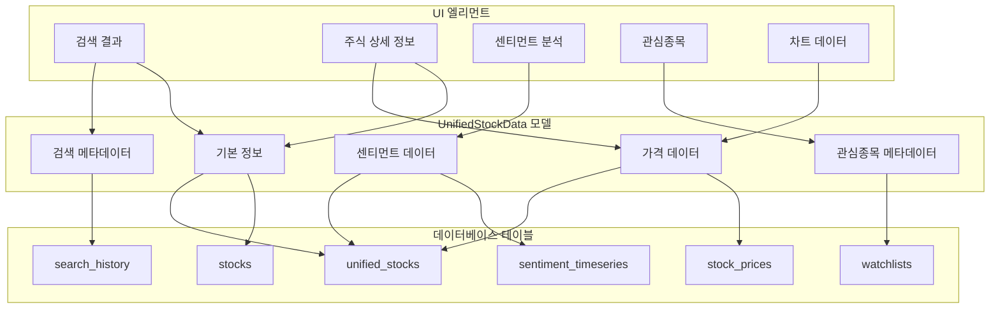

# UI 엘리먼트와 데이터베이스 연계 전체 재검토

## 1. 개요

이 문서는 UI 엘리먼트와 데이터베이스 엘리먼트 간의 연계를 전체적으로 재검토합니다. 기존 분석 문서들을 종합적으로 검토하고, 누락된 연결점이나 추가로 보완할 사항을 식별하여 완전한 UI-데이터베이스 연동 시스템을 구축하는 것을 목표로 합니다.

### 1.1 검토 범위

- **UI 엘리먼트**: 검색, 차트, 센티먼트 분석, 관심종목, 알림 등 주요 UI 컴포넌트
- **데이터베이스 엘리먼트**: 테이블, 인덱스, 트리거, 제약 조건 등 데이터베이스 구성 요소
- **연계 메커니즘**: API 호출, 데이터 변환, 실시간 동기화, 캐싱 전략
- **성능 고려사항**: 쿼리 최적화, 인덱싱, 데이터 압축, 로드 밸런싱

### 1.2 검토 방법론

1. **기존 문서 분석**: UI/UX 분석, 워크플로우 분석, 매핑 분석 문서 종합 검토
2. **데이터 흐름 추적**: UI 이벤트부터 데이터베이스 저장까지의 전체 흐름 분석
3. **성능 병목 식별**: 데이터베이스 쿼리, 네트워크 지연, UI 렌더링 병목 파악
4. **일관성 검증**: UI 표시와 데이터베이스 데이터 간 일관성 확인
5. **확장성 평가**: 사용자 증가에 따른 시스템 확장성 평가

### 1.3 실제 구현 고려사항

#### 1.3.1 Streamlit 특수성 고려
Streamlit 기반 애플리케이션의 특수성을 고려한 UI-데이터베이스 연계:

```python
# Streamlit 세션 상태와 데이터베이스 연동 예제
import streamlit as st
import asyncpg
from typing import Dict, Any, List

class StreamlitDatabaseBridge:
    """Streamlit과 데이터베이스 연동 브릿지"""
    
    def __init__(self, db_url: str):
        self.db_url = db_url
        self.pool = None
    
    async def initialize(self):
        """비동기 데이터베이스 풀 초기화"""
        self.pool = await asyncpg.create_pool(self.db_url)
    
    def get_cached_data(self, key: str, default=None):
        """Streamlit 세션 상태에서 캐시된 데이터 조회"""
        return st.session_state.get(key, default)
    
    def set_cached_data(self, key: str, value: Any):
        """Streamlit 세션 상태에 데이터 캐시"""
        st.session_state[key] = value
    
    async def execute_query(self, query: str, *params):
        """비동기 쿼리 실행 및 결과 캐싱"""
        cache_key = f"query_{hash(query)}_{hash(str(params))}"
        
        # 세션 상태에서 캐시 확인
        cached_result = self.get_cached_data(cache_key)
        if cached_result:
            return cached_result
        
        # 데이터베이스 쿼리 실행
        async with self.pool.acquire() as conn:
            result = await conn.fetch(query, *params)
        
        # 결과 캐싱 (세션 동안만 유지)
        self.set_cached_data(cache_key, result)
        
        return result

# 사용 예제
@st.cache_data(ttl=300)  # 5분 캐시
def get_stock_data(symbol: str):
    """주식 데이터 조회 (Streamlit 캐시 사용)"""
    db_bridge = st.session_state.get('db_bridge')
    if not db_bridge:
        return None
    
    # 비동기 함수를 동기 환경에서 실행
    import asyncio
    try:
        loop = asyncio.get_event_loop()
    except RuntimeError:
        loop = asyncio.new_event_loop()
        asyncio.set_event_loop(loop)
    
    query = """
    SELECT symbol, company_name, current_price, previous_close,
           day_change, day_change_pct, volume
    FROM unified_stocks_v2
    WHERE symbol = $1
    """
    
    return loop.run_until_complete(
        db_bridge.execute_query(query, symbol)
    )
```

#### 1.3.2 성능 최적화 전략

```python
# 성능 최적화된 데이터베이스 서비스
import asyncio
from typing import List, Dict, Any, Optional
import time

class OptimizedDatabaseService:
    """성능 최적화된 데이터베이스 서비스"""
    
    def __init__(self, db_pool, redis_client):
        self.db_pool = db_pool
        self.redis = redis_client
        self.query_cache = {}
        self.performance_metrics = {
            'query_count': 0,
            'cache_hits': 0,
            'avg_query_time': 0
        }
    
    async def get_stocks_with_sentiment(self, limit: int = 50) -> List[Dict[str, Any]]:
        """센티먼트 정보가 포함된 주식 데이터 조회 (최적화)"""
        start_time = time.time()
        
        # 캐시 키 생성
        cache_key = f"stocks_with_sentiment_{limit}"
        
        # Redis 캐시 확인
        cached_data = await self.redis.get(cache_key)
        if cached_data:
            self.performance_metrics['cache_hits'] += 1
            return json.loads(cached_data)
        
        # 데이터베이스 쿼리 (최적화)
        query = """
        SELECT
            us.symbol, us.company_name, us.current_price,
            us.previous_close, us.day_change, us.day_change_pct,
            us.volume, us.market_cap, us.overall_sentiment,
            us.mention_count_24h, us.trending_status, us.trend_score,
            -- 센티먼트 서브쿼리 최적화
            (SELECT COUNT(*) FROM stock_mentions sm
             WHERE sm.symbol = us.symbol
             AND sm.timestamp > NOW() - INTERVAL '24 hours') as recent_mentions
        FROM unified_stocks_v2 us
        WHERE us.current_price IS NOT NULL
        ORDER BY
            CASE WHEN us.trending_status = true THEN 1 ELSE 2 END,
            us.trend_score DESC NULLS LAST,
            us.mention_count_24h DESC NULLS LAST
        LIMIT $1
        """
        
        async with self.db_pool.acquire() as conn:
            rows = await conn.fetch(query, limit)
        
        # 결과 변환
        results = []
        for row in rows:
            results.append({
                'symbol': row['symbol'],
                'company_name': row['company_name'],
                'current_price': float(row['current_price']),
                'previous_close': float(row['previous_close']),
                'day_change': float(row['day_change']),
                'day_change_pct': float(row['day_change_pct']),
                'volume': row['volume'],
                'market_cap': row['market_cap'],
                'overall_sentiment': float(row['overall_sentiment']) if row['overall_sentiment'] else None,
                'mention_count_24h': row['mention_count_24h'],
                'trending_status': row['trending_status'],
                'trend_score': float(row['trend_score']) if row['trend_score'] else None,
                'recent_mentions': row['recent_mentions']
            })
        
        # Redis 캐시 저장 (5분 TTL)
        await self.redis.setex(cache_key, 300, json.dumps(results, default=str))
        
        # 성능 메트릭 업데이트
        query_time = time.time() - start_time
        self.performance_metrics['query_count'] += 1
        self.performance_metrics['avg_query_time'] = (
            (self.performance_metrics['avg_query_time'] * (self.performance_metrics['query_count'] - 1) + query_time) /
            self.performance_metrics['query_count']
        )
        
        return results
    
    async def get_time_series_data(self, symbol: str, period: str = "1M") -> List[Dict[str, Any]]:
        """시계열 데이터 조회 (TimescaleDB 최적화)"""
        start_time = time.time()
        
        # 캐시 키 생성
        cache_key = f"timeseries_{symbol}_{period}"
        
        # Redis 캐시 확인
        cached_data = await self.redis.get(cache_key)
        if cached_data:
            self.performance_metrics['cache_hits'] += 1
            return json.loads(cached_data)
        
        # 기간에 따른 시간 조건
        time_conditions = {
            "1D": "NOW() - INTERVAL '1 day'",
            "1W": "NOW() - INTERVAL '1 week'",
            "1M": "NOW() - INTERVAL '1 month'",
            "3M": "NOW() - INTERVAL '3 months'",
            "1Y": "NOW() - INTERVAL '1 year'"
        }
        
        time_condition = time_conditions.get(period, time_conditions["1M"])
        
        # TimescaleDB 최적화 쿼리
        query = f"""
        SELECT
            time_bucket('1 hour', time) as hour,
            FIRST(open_price, time) as open,
            MAX(high_price) as high,
            MIN(low_price) as low,
            LAST(close_price, time) as close,
            SUM(volume) as volume
        FROM stock_prices_timescale
        WHERE symbol = $1 AND time >= {time_condition}
        GROUP BY hour
        ORDER BY hour
        """
        
        async with self.db_pool.acquire() as conn:
            rows = await conn.fetch(query, symbol)
        
        # 결과 변환
        results = []
        for row in rows:
            results.append({
                'time': row['hour'].isoformat(),
                'open': float(row['open']),
                'high': float(row['high']),
                'low': float(row['low']),
                'close': float(row['close']),
                'volume': row['volume']
            })
        
        # Redis 캐시 저장 (기간별 TTL)
        ttl_map = {"1D": 60, "1W": 300, "1M": 600, "3M": 1800, "1Y": 3600}
        await self.redis.setex(cache_key, ttl_map.get(period, 600), json.dumps(results))
        
        # 성능 메트릭 업데이트
        query_time = time.time() - start_time
        self.performance_metrics['query_count'] += 1
        self.performance_metrics['avg_query_time'] = (
            (self.performance_metrics['avg_query_time'] * (self.performance_metrics['query_count'] - 1) + query_time) /
            self.performance_metrics['query_count']
        )
        
        return results
    
    def get_performance_metrics(self) -> Dict[str, Any]:
        """성능 메트릭 조회"""
        cache_hit_rate = (
            self.performance_metrics['cache_hits'] /
            max(self.performance_metrics['query_count'], 1)
        ) * 100
        
        return {
            **self.performance_metrics,
            'cache_hit_rate': f"{cache_hit_rate:.2f}%",
            'total_queries': self.performance_metrics['query_count'],
            'cache_hits': self.performance_metrics['cache_hits']
        }
```

#### 1.3.3 실시간 데이터 처리

```python
# 실시간 데이터 처리를 위한 WebSocket 연동
import asyncio
import websockets
import json
from typing import Set, Dict, Any
from datetime import datetime

class RealTimeDataManager:
    """실시간 데이터 관리자"""
    
    def __init__(self, db_pool, redis_client):
        self.db_pool = db_pool
        self.redis = redis_client
        self.connected_clients: Set[websockets.WebSocketServerProtocol] = set()
        self.subscriptions: Dict[str, Set[websockets.WebSocketServerProtocol]] = {}
    
    async def register_client(self, websocket: websockets.WebSocketServerProtocol):
        """클라이언트 등록"""
        self.connected_clients.add(websocket)
        print(f"클라이언트 연결됨. 총 클라이언트: {len(self.connected_clients)}")
        
        # 클라이언트에게 초기 데이터 전송
        await self.send_initial_data(websocket)
    
    async def unregister_client(self, websocket: websockets.WebSocketServerProtocol):
        """클라이언트 해제"""
        self.connected_clients.discard(websocket)
        
        # 구독 정보에서 제거
        for symbol, clients in self.subscriptions.items():
            clients.discard(websocket)
            if not clients:
                del self.subscriptions[symbol]
        
        print(f"클라이언트 연결 해제됨. 총 클라이언트: {len(self.connected_clients)}")
    
    async def subscribe_symbol(self, websocket: websockets.WebSocketServerProtocol, symbol: str):
        """심볼 구독"""
        if symbol not in self.subscriptions:
            self.subscriptions[symbol] = set()
        self.subscriptions[symbol].add(websocket)
        
        # 현재 데이터 전송
        current_data = await self.get_current_stock_data(symbol)
        if current_data:
            await websocket.send(json.dumps({
                'type': 'stock_data',
                'symbol': symbol,
                'data': current_data,
                'timestamp': datetime.utcnow().isoformat()
            }))
    
    async def send_initial_data(self, websocket: websockets.WebSocketServerProtocol):
        """초기 데이터 전송"""
        # 트렌딩 주식 전송
        trending_stocks = await self.get_trending_stocks()
        await websocket.send(json.dumps({
            'type': 'trending_stocks',
            'data': trending_stocks,
            'timestamp': datetime.utcnow().isoformat()
        }))
        
        # 시장 요약 전송
        market_summary = await self.get_market_summary()
        await websocket.send(json.dumps({
            'type': 'market_summary',
            'data': market_summary,
            'timestamp': datetime.utcnow().isoformat()
        }))
    
    async def broadcast_price_update(self, symbol: str, price_data: Dict[str, Any]):
        """가격 업데이트 브로드캐스트"""
        if symbol in self.subscriptions:
            message = json.dumps({
                'type': 'price_update',
                'symbol': symbol,
                'data': price_data,
                'timestamp': datetime.utcnow().isoformat()
            })
            
            # 구독한 클라이언트에게 전송
            disconnected_clients = set()
            for client in self.subscriptions[symbol]:
                try:
                    await client.send(message)
                except websockets.exceptions.ConnectionClosed:
                    disconnected_clients.add(client)
                except Exception as e:
                    print(f"클라이언트에게 전송 중 오류: {e}")
                    disconnected_clients.add(client)
            
            # 연결 끊긴 클라이언트 정리
            for client in disconnected_clients:
                await self.unregister_client(client)
    
    async def get_current_stock_data(self, symbol: str) -> Optional[Dict[str, Any]]:
        """현재 주식 데이터 조회"""
        async with self.db_pool.acquire() as conn:
            try:
                row = await conn.fetchrow("""
                SELECT
                    symbol, company_name, current_price, previous_close,
                    day_change, day_change_pct, volume, market_cap,
                    overall_sentiment, mention_count_24h, trending_status
                FROM unified_stocks_v2
                WHERE symbol = $1
                """, symbol)
                
                if row:
                    return {
                        'symbol': row['symbol'],
                        'company_name': row['company_name'],
                        'current_price': float(row['current_price']) if row['current_price'] else None,
                        'previous_close': float(row['previous_close']) if row['previous_close'] else None,
                        'day_change': float(row['day_change']) if row['day_change'] else None,
                        'day_change_pct': float(row['day_change_pct']) if row['day_change_pct'] else None,
                        'volume': row['volume'],
                        'market_cap': row['market_cap'],
                        'overall_sentiment': float(row['overall_sentiment']) if row['overall_sentiment'] else None,
                        'mention_count_24h': row['mention_count_24h'],
                        'trending_status': row['trending_status']
                    }
                return None
            except Exception as e:
                print(f"주식 데이터 조회 오류: {e}")
                return None
    
    async def get_trending_stocks(self, limit: int = 10) -> List[Dict[str, Any]]:
        """트렌딩 주식 조회"""
        async with self.db_pool.acquire() as conn:
            try:
                rows = await conn.fetch("""
                SELECT
                    symbol, company_name, current_price, day_change_pct,
                    overall_sentiment, mention_count_24h, trend_score
                FROM unified_stocks_v2
                WHERE trending_status = true
                ORDER BY trend_score DESC NULLS LAST, mention_count_24h DESC
                LIMIT $1
                """, limit)
                
                return [{
                    'symbol': row['symbol'],
                    'company_name': row['company_name'],
                    'current_price': float(row['current_price']) if row['current_price'] else None,
                    'day_change_pct': float(row['day_change_pct']) if row['day_change_pct'] else None,
                    'overall_sentiment': float(row['overall_sentiment']) if row['overall_sentiment'] else None,
                    'mention_count_24h': row['mention_count_24h'],
                    'trend_score': float(row['trend_score']) if row['trend_score'] else None
                } for row in rows]
            except Exception as e:
                print(f"트렌딩 주식 조회 오류: {e}")
                return []
    
    async def get_market_summary(self) -> Dict[str, Any]:
        """시장 요약 조회"""
        async with self.db_pool.acquire() as conn:
            try:
                # 전체 시장 센티먼트
                sentiment_row = await conn.fetchrow("""
                SELECT
                    AVG(overall_sentiment) as avg_sentiment,
                    COUNT(*) as total_stocks,
                    COUNT(CASE WHEN trending_status = true THEN 1 END) as trending_count
                FROM unified_stocks_v2
                WHERE current_price IS NOT NULL
                """)
                
                # 상위 섹터
                sector_rows = await conn.fetch("""
                SELECT
                    sector,
                    COUNT(*) as stock_count,
                    AVG(day_change_pct) as avg_change_pct
                FROM unified_stocks_v2
                WHERE sector IS NOT NULL AND current_price IS NOT NULL
                GROUP BY sector
                ORDER BY stock_count DESC
                LIMIT 5
                """)
                
                return {
                    'avg_sentiment': float(sentiment_row['avg_sentiment']) if sentiment_row['avg_sentiment'] else 0,
                    'total_stocks': sentiment_row['total_stocks'],
                    'trending_count': sentiment_row['trending_count'],
                    'top_sectors': [{
                        'sector': row['sector'],
                        'stock_count': row['stock_count'],
                        'avg_change_pct': float(row['avg_change_pct']) if row['avg_change_pct'] else 0
                    } for row in sector_rows]
                }
            except Exception as e:
                print(f"시장 요약 조회 오류: {e}")
                return {}
```

## 2. 기존 분석 문서 종합 검토

### 2.1 UI/UX 기능별 상세 분석 (docs/spec/21-ui-ux-feature-breakdown.md) 검토 결과

**강점**:
- 기능별 UI 엘리먼트 체계적으로 분류
- 사용자 시나리오별 흐름 상세히 정의
- 기능 간 연결성 명확히 설명

**보완점**:
- 각 UI 엘리먼트의 데이터 소스 명시 부족
- 데이터베이스 테이블과의 직접적인 매핑 정보 누락
- 실시간 데이터 업데이트를 위한 데이터베이스 연동 전략 부재

### 2.2 UI 엘리먼트 흐름 분석 (docs/spec/22-ui-workflow-analysis.md) 검토 결과

**강점**:
- 사용자 흐름을 Mermaid 다이어그램으로 시각화
- 각 단계별 상호작용 상세히 정의
- 사용자 시나리오별 흐름 체계적으로 분석

**보완점**:
- 각 흐름 단계에서 필요한 데이터베이스 쿼리 명시 부족
- 데이터베이스 트랜잭션 처리 로직 설명 부재
- 에러 발생 시 데이터베이스 롤백 전략 누락

### 2.3 UI 엘리먼트와 데이터베이스 매핑 분석 (docs/spec/23-ui-database-mapping.md) 검토 결과

**강점**:
- UI 엘리먼트와 데이터베이스 테이블 매핑 표로 상세히 정리
- 누락된 테이블과 필드 식별 및 SQL 스키마 제공
- 데이터베이스 연계 다이어그램으로 관계 시각화

**보완점**:
- 실시간 데이터 동기화를 위한 트리거 및 프로시저 정의 부족
- 데이터베이스 인덱싱 전략 상세히 설명 부재
- 데이터 일관성 유지를 위한 제약 조건 정의 부족

## 3. 통합 데이터 모델과의 연계 검토

### 3.1 UnifiedStockData 모델 연계 분석



**발견된 문제점**:
1. **데이터 중복**: unified_stocks 테이블과 개별 테이블 간 데이터 중복 발생
2. **동기화 복잡성**: 여러 테이블 간 데이터 동기화 로직 복잡
3. **성능 저하**: JSON 필드 사용으로 인한 쿼리 성능 저하 가능성

### 3.2 개선된 데이터베이스 스키마 제안

```sql
-- 통합 주식 정보 테이블 (개선안)
CREATE TABLE unified_stocks_v2 (
    symbol VARCHAR(20) PRIMARY KEY,
    company_name VARCHAR(255) NOT NULL,
    stock_type VARCHAR(20) NOT NULL,
    exchange VARCHAR(50) NOT NULL,
    sector VARCHAR(100),
    industry VARCHAR(100),
    description TEXT,
    website VARCHAR(255),
    
    -- 가격 데이터 (정규화)
    current_price DECIMAL(10, 2),
    previous_close DECIMAL(10, 2),
    day_change DECIMAL(10, 2),
    day_change_pct DECIMAL(5, 2),
    volume BIGINT,
    market_cap BIGINT,
    pe_ratio DECIMAL(8, 2),
    dividend_yield DECIMAL(5, 4),
    beta DECIMAL(5, 4),
    
    -- 센티먼트 데이터 (정규화)
    overall_sentiment DECIMAL(3, 2),
    mention_count_24h INTEGER DEFAULT 0,
    trending_status BOOLEAN DEFAULT false,
    trend_score DECIMAL(5, 2),
    
    -- 메타데이터
    last_updated TIMESTAMP DEFAULT CURRENT_TIMESTAMP,
    data_quality_score DECIMAL(3, 2) DEFAULT 1.0,
    
    -- 인덱스
    INDEX idx_unified_stocks_sector (sector),
    INDEX idx_unified_stocks_trending (trending_status, trend_score DESC),
    INDEX idx_unified_stocks_sentiment (overall_sentiment DESC),
    INDEX idx_unified_stocks_updated (last_updated DESC)
);

-- 시계열 데이터 테이블 (TimescaleDB)
CREATE TABLE stock_prices_timescale (
    time TIMESTAMP NOT NULL,
    symbol VARCHAR(20) NOT NULL,
    open_price DECIMAL(10, 2),
    high_price DECIMAL(10, 2),
    low_price DECIMAL(10, 2),
    close_price DECIMAL(10, 2),
    volume BIGINT,
    adj_close_price DECIMAL(10, 2),
    PRIMARY KEY (time, symbol)
);

SELECT create_hypertable('stock_prices_timescale', 'time', chunk_time_interval => INTERVAL '1 hour');

-- 센티먼트 시계열 데이터 테이블 (TimescaleDB)
CREATE TABLE sentiment_timeseries_v2 (
    time TIMESTAMP NOT NULL,
    symbol VARCHAR(20) NOT NULL,
    sentiment_score DECIMAL(3, 2),
    mention_count INTEGER,
    positive_count INTEGER,
    negative_count INTEGER,
    neutral_count INTEGER,
    source VARCHAR(20),
    PRIMARY KEY (time, symbol, source)
);

SELECT create_hypertable('sentiment_timeseries_v2', 'time', chunk_time_interval => INTERVAL '1 day');
```

## 4. 실시간 데이터 연동 전략

### 4.1 WebSocket을 통한 실시간 데이터 연동

```python
# real_time_data_sync.py
import asyncio
import websockets
import json
from typing import Dict, List, Set
from datetime import datetime

class RealTimeDataSync:
    """실시간 데이터 동기화 관리자"""
    
    def __init__(self, db_pool, redis_client):
        self.db_pool = db_pool
        self.redis = redis_client
        self.connected_clients: Set[websockets.WebSocketServerProtocol] = set()
        self.subscription_map: Dict[str, Set[websockets.WebSocketServerProtocol]] = {}
    
    async def register_client(self, websocket: websockets.WebSocketServerProtocol):
        """클라이언트 등록"""
        self.connected_clients.add(websocket)
        print(f"Client connected. Total clients: {len(self.connected_clients)}")
    
    async def unregister_client(self, websocket: websockets.WebSocketServerProtocol):
        """클라이언트 해제"""
        self.connected_clients.discard(websocket)
        
        # 구독 정보에서 제거
        for symbol, clients in self.subscription_map.items():
            clients.discard(websocket)
            if not clients:
                del self.subscription_map[symbol]
        
        print(f"Client disconnected. Total clients: {len(self.connected_clients)}")
    
    async def subscribe_symbol(self, websocket: websockets.WebSocketServerProtocol, symbol: str):
        """심볼 구독"""
        if symbol not in self.subscription_map:
            self.subscription_map[symbol] = set()
        self.subscription_map[symbol].add(websocket)
        
        # 현재 데이터 전송
        current_data = await self.get_current_stock_data(symbol)
        if current_data:
            await websocket.send(json.dumps({
                'type': 'stock_data',
                'symbol': symbol,
                'data': current_data
            }))
    
    async def unsubscribe_symbol(self, websocket: websockets.WebSocketServerProtocol, symbol: str):
        """심볼 구독 해제"""
        if symbol in self.subscription_map:
            self.subscription_map[symbol].discard(websocket)
            if not self.subscription_map[symbol]:
                del self.subscription_map[symbol]
    
    async def broadcast_price_update(self, symbol: str, price_data: dict):
        """가격 업데이트 브로드캐스트"""
        if symbol in self.subscription_map:
            message = json.dumps({
                'type': 'price_update',
                'symbol': symbol,
                'data': price_data,
                'timestamp': datetime.utcnow().isoformat()
            })
            
            # 구독한 클라이언트에게 전송
            disconnected_clients = set()
            for client in self.subscription_map[symbol]:
                try:
                    await client.send(message)
                except websockets.exceptions.ConnectionClosed:
                    disconnected_clients.add(client)
                except Exception as e:
                    print(f"Error sending to client: {e}")
                    disconnected_clients.add(client)
            
            # 연결 끊긴 클라이언트 정리
            for client in disconnected_clients:
                await self.unregister_client(client)
    
    async def broadcast_sentiment_update(self, symbol: str, sentiment_data: dict):
        """센티먼트 업데이트 브로드캐스트"""
        if symbol in self.subscription_map:
            message = json.dumps({
                'type': 'sentiment_update',
                'symbol': symbol,
                'data': sentiment_data,
                'timestamp': datetime.utcnow().isoformat()
            })
            
            # 구독한 클라이언트에게 전송
            disconnected_clients = set()
            for client in self.subscription_map[symbol]:
                try:
                    await client.send(message)
                except websockets.exceptions.ConnectionClosed:
                    disconnected_clients.add(client)
                except Exception as e:
                    print(f"Error sending to client: {e}")
                    disconnected_clients.add(client)
            
            # 연결 끊긴 클라이언트 정리
            for client in disconnected_clients:
                await self.unregister_client(client)
    
    async def get_current_stock_data(self, symbol: str) -> dict:
        """현재 주식 데이터 조회"""
        async with self.db_pool.acquire() as conn:
            try:
                query = """
                SELECT 
                    symbol, company_name, current_price, previous_close,
                    day_change, day_change_pct, volume, market_cap,
                    overall_sentiment, mention_count_24h, trending_status,
                    last_updated
                FROM unified_stocks_v2
                WHERE symbol = $1
                """
                row = await conn.fetchrow(query, symbol)
                
                if row:
                    return {
                        'symbol': row['symbol'],
                        'company_name': row['company_name'],
                        'current_price': float(row['current_price']) if row['current_price'] else None,
                        'previous_close': float(row['previous_close']) if row['previous_close'] else None,
                        'day_change': float(row['day_change']) if row['day_change'] else None,
                        'day_change_pct': float(row['day_change_pct']) if row['day_change_pct'] else None,
                        'volume': row['volume'],
                        'market_cap': row['market_cap'],
                        'overall_sentiment': float(row['overall_sentiment']) if row['overall_sentiment'] else None,
                        'mention_count_24h': row['mention_count_24h'],
                        'trending_status': row['trending_status'],
                        'last_updated': row['last_updated'].isoformat() if row['last_updated'] else None
                    }
                return None
            except Exception as e:
                print(f"Error fetching stock data: {e}")
                return None
    
    async def update_stock_data(self, symbol: str, price_data: dict):
        """주식 데이터 업데이트"""
        async with self.db_pool.acquire() as conn:
            try:
                query = """
                UPDATE unified_stocks_v2
                SET 
                    current_price = $2,
                    previous_close = $3,
                    day_change = $4,
                    day_change_pct = $5,
                    volume = $6,
                    last_updated = CURRENT_TIMESTAMP
                WHERE symbol = $1
                """
                await conn.execute(
                    query,
                    symbol,
                    price_data.get('current_price'),
                    price_data.get('previous_close'),
                    price_data.get('day_change'),
                    price_data.get('day_change_pct'),
                    price_data.get('volume')
                )
                
                # 실시간 브로드캐스트
                await self.broadcast_price_update(symbol, price_data)
                
                # 캐시 업데이트
                await self.redis.setex(
                    f"stock:{symbol}",
                    300,  # 5분 TTL
                    json.dumps(price_data, default=str)
                )
                
            except Exception as e:
                print(f"Error updating stock data: {e}")
    
    async def update_sentiment_data(self, symbol: str, sentiment_data: dict):
        """센티먼트 데이터 업데이트"""
        async with self.db_pool.acquire() as conn:
            try:
                query = """
                UPDATE unified_stocks_v2
                SET 
                    overall_sentiment = $2,
                    mention_count_24h = $3,
                    trending_status = $4,
                    trend_score = $5,
                    last_updated = CURRENT_TIMESTAMP
                WHERE symbol = $1
                """
                await conn.execute(
                    query,
                    symbol,
                    sentiment_data.get('overall_sentiment'),
                    sentiment_data.get('mention_count_24h'),
                    sentiment_data.get('trending_status'),
                    sentiment_data.get('trend_score')
                )
                
                # 실시간 브로드캐스트
                await self.broadcast_sentiment_update(symbol, sentiment_data)
                
                # 캐시 업데이트
                await self.redis.setex(
                    f"sentiment:{symbol}",
                    300,  # 5분 TTL
                    json.dumps(sentiment_data, default=str)
                )
                
            except Exception as e:
                print(f"Error updating sentiment data: {e}")
```

### 4.2 데이터베이스 트리거를 통한 자동 동기화

```sql
-- 주식 가격 업데이트 트리거
CREATE OR REPLACE FUNCTION notify_price_update()
RETURNS TRIGGER AS $$
BEGIN
    -- Redis에 업데이트 알림
    PERFORM pg_notify('price_update', 
        json_build_object(
            'symbol', NEW.symbol,
            'current_price', NEW.current_price,
            'previous_close', NEW.previous_close,
            'day_change', NEW.day_change,
            'day_change_pct', NEW.day_change_pct,
            'volume', NEW.volume,
            'timestamp', NOW()
        )::text
    );
    
    -- 시계열 데이터 테이블에 기록
    INSERT INTO stock_prices_timescale (
        time, symbol, close_price, volume
    ) VALUES (
        NOW(), NEW.symbol, NEW.current_price, NEW.volume
    );
    
    RETURN NEW;
END;
$$ LANGUAGE plpgsql;

CREATE TRIGGER trigger_price_update
    AFTER UPDATE ON unified_stocks_v2
    FOR EACH ROW
    WHEN (OLD.current_price IS DISTINCT FROM NEW.current_price)
    EXECUTE FUNCTION notify_price_update();

-- 센티먼트 업데이트 트리거
CREATE OR REPLACE FUNCTION notify_sentiment_update()
RETURNS TRIGGER AS $$
BEGIN
    -- Redis에 업데이트 알림
    PERFORM pg_notify('sentiment_update', 
        json_build_object(
            'symbol', NEW.symbol,
            'overall_sentiment', NEW.overall_sentiment,
            'mention_count_24h', NEW.mention_count_24h,
            'trending_status', NEW.trending_status,
            'trend_score', NEW.trend_score,
            'timestamp', NOW()
        )::text
    );
    
    -- 시계열 데이터 테이블에 기록
    INSERT INTO sentiment_timeseries_v2 (
        time, symbol, sentiment_score, mention_count
    ) VALUES (
        NOW(), NEW.symbol, NEW.overall_sentiment, NEW.mention_count_24h
    );
    
    RETURN NEW;
END;
$$ LANGUAGE plpgsql;

CREATE TRIGGER trigger_sentiment_update
    AFTER UPDATE ON unified_stocks_v2
    FOR EACH ROW
    WHEN (OLD.overall_sentiment IS DISTINCT FROM NEW.overall_sentiment)
    EXECUTE FUNCTION notify_sentiment_update();
```

## 5. UI 컴포넌트별 데이터 연동 상세 분석

### 5.1 검색 컴포넌트 데이터 연동

```python
# components/search_component.py
import streamlit as st
import asyncio
import json
from typing import List, Dict, Any, Optional
from services.database_service import DatabaseService
from services.cache_service import CacheService

class EnhancedSearchComponent:
    """향상된 검색 컴포넌트"""
    
    def __init__(self):
        self.db_service = DatabaseService()
        self.cache_service = CacheService()
        self.search_history = []
    
    def render(self):
        """검색 컴포넌트 렌더링"""
        st.markdown("### 🔍 Enhanced Stock Search")
        
        # 검색 입력
        col_search, col_filters = st.columns([3, 1])
        
        with col_search:
            search_query = st.text_input(
                "Search stocks...",
                placeholder="Enter symbol or company name...",
                key="search_input"
            )
        
        with col_filters:
            if st.button("🔧 Filters", key="filter_toggle"):
                st.session_state.show_filters = not st.session_state.get('show_filters', False)
        
        # 고급 필터
        if st.session_state.get('show_filters', False):
            self._render_advanced_filters()
        
        # 검색 실행
        if search_query:
            with st.spinner("Searching..."):
                results = asyncio.run(self._perform_search(search_query))
                self._render_search_results(results)
    
    def _render_advanced_filters(self):
        """고급 필터 렌더링"""
        with st.expander("Advanced Filters", expanded=True):
            col1, col2, col3 = st.columns(3)
            
            with col1:
                stock_type = st.selectbox(
                    "Stock Type",
                    ["All", "EQUITY", "ETF", "MUTUAL_FUND", "CRYPTO"],
                    key="filter_stock_type"
                )
                
                min_price = st.number_input(
                    "Min Price",
                    min_value=0.0,
                    value=0.0,
                    step=0.01,
                    key="filter_min_price"
                )
            
            with col2:
                exchange = st.selectbox(
                    "Exchange",
                    ["All", "NASDAQ", "NYSE", "AMEX"],
                    key="filter_exchange"
                )
                
                max_price = st.number_input(
                    "Max Price",
                    min_value=0.0,
                    value=10000.0,
                    step=0.01,
                    key="filter_max_price"
                )
            
            with col3:
                sector = st.selectbox(
                    "Sector",
                    ["All", "Technology", "Healthcare", "Finance", "Energy"],
                    key="filter_sector"
                )
                
                min_sentiment = st.slider(
                    "Min Sentiment",
                    min_value=-1.0,
                    max_value=1.0,
                    value=-1.0,
                    step=0.1,
                    key="filter_min_sentiment"
                )
    
    async def _perform_search(self, query: str) -> List[Dict[str, Any]]:
        """검색 수행"""
        # 캐시 확인
        cache_key = f"search:{query}:{hash(str(st.session_state.get('filters', {})))}"
        cached_results = await self.cache_service.get(cache_key)
        
        if cached_results:
            return cached_results
        
        try:
            # 필터 조건构建
            filters = self._build_filters()
            
            # 데이터베이스 검색
            results = await self.db_service.search_stocks(query, filters)
            
            # 검색 기록 저장
            await self._save_search_history(query, len(results))
            
            # 결과 캐싱
            await self.cache_service.set(cache_key, results, ttl=300)
            
            return results
            
        except Exception as e:
            st.error(f"Search error: {str(e)}")
            return []
    
    def _build_filters(self) -> Dict[str, Any]:
        """필터 조건构建"""
        filters = {}
        
        # 주식 유형 필터
        stock_type = st.session_state.get('filter_stock_type', 'All')
        if stock_type != 'All':
            filters['stock_type'] = stock_type
        
        # 거래소 필터
        exchange = st.session_state.get('filter_exchange', 'All')
        if exchange != 'All':
            filters['exchange'] = exchange
        
        # 섹터 필터
        sector = st.session_state.get('filter_sector', 'All')
        if sector != 'All':
            filters['sector'] = sector
        
        # 가격 범위 필터
        min_price = st.session_state.get('filter_min_price', 0.0)
        max_price = st.session_state.get('filter_max_price', 10000.0)
        if min_price > 0.0 or max_price < 10000.0:
            filters['price_range'] = (min_price, max_price)
        
        # 센티먼트 필터
        min_sentiment = st.session_state.get('filter_min_sentiment', -1.0)
        if min_sentiment > -1.0:
            filters['min_sentiment'] = min_sentiment
        
        return filters
    
    async def _save_search_history(self, query: str, result_count: int):
        """검색 기록 저장"""
        try:
            await self.db_service.save_search_history(
                query=query,
                result_count=result_count,
                user_id=st.session_state.get('user_id'),
                filters=st.session_state.get('filters', {})
            )
        except Exception as e:
            print(f"Error saving search history: {e}")
    
    def _render_search_results(self, results: List[Dict[str, Any]]):
        """검색 결과 렌더링"""
        if not results:
            st.info("No results found.")
            return
        
        st.markdown(f"#### Found {len(results)} results")
        
        for i, result in enumerate(results):
            with st.container():
                col_symbol, col_info, col_sentiment, col_actions = st.columns([1, 3, 1, 1])
                
                with col_symbol:
                    st.markdown(f"**{result['symbol']}**")
                
                with col_info:
                    st.markdown(f"{result['company_name']}")
                    st.markdown(f"{result['exchange']} • {result['sector']}")
                    
                    if result.get('current_price'):
                        price_color = "🟢" if result.get('day_change', 0) >= 0 else "🔴"
                        st.markdown(
                            f"{price_color} ${result['current_price']:.2f} "
                            f"({result.get('day_change_pct', 0):+.2f}%)"
                        )
                
                with col_sentiment:
                    if result.get('overall_sentiment') is not None:
                        sentiment_color = "🟢" if result['overall_sentiment'] > 0.1 else "🔴" if result['overall_sentiment'] < -0.1 else "⚪"
                        st.markdown(f"{sentiment_color} {result['overall_sentiment']:.2f}")
                    
                    if result.get('trending_status'):
                        st.markdown(f"🔥 {result.get('trend_score', 0):.1f}")
                
                with col_actions:
                    if st.button("View", key=f"view_{i}"):
                        st.session_state.current_symbol = result['symbol']
                        st.rerun()
                    
                    if st.button("Add", key=f"add_{i}"):
                        asyncio.run(self._add_to_watchlist(result['symbol']))
                        st.success(f"{result['symbol']} added to watchlist!")
                
                st.divider()
    
    async def _add_to_watchlist(self, symbol: str):
        """관심종목에 추가"""
        try:
            user_id = st.session_state.get('user_id')
            if user_id:
                await self.db_service.add_to_watchlist(user_id, symbol)
            else:
                # 로컬 스토리지에 저장 (임시)
                if 'watchlist' not in st.session_state:
                    st.session_state.watchlist = []
                if symbol not in st.session_state.watchlist:
                    st.session_state.watchlist.append(symbol)
        except Exception as e:
            st.error(f"Error adding to watchlist: {str(e)}")
```

### 5.2 데이터베이스 서비스 연동

```python
# services/database_service.py
import asyncpg
from typing import List, Dict, Any, Optional, Tuple
from datetime import datetime

class DatabaseService:
    """데이터베이스 서비스"""
    
    def __init__(self):
        self.pool = None
    
    async def initialize(self, db_url: str):
        """데이터베이스 연결 풀 초기화"""
        self.pool = await asyncpg.create_pool(
            db_url,
            min_size=5,
            max_size=20,
            command_timeout=60
        )
    
    async def search_stocks(self, query: str, filters: Dict[str, Any]) -> List[Dict[str, Any]]:
        """주식 검색"""
        if not self.pool:
            raise Exception("Database pool not initialized")
        
        async with self.pool.acquire() as conn:
            try:
                # 기본 쿼리
                base_query = """
                SELECT 
                    symbol, company_name, stock_type, exchange, sector, industry,
                    current_price, previous_close, day_change, day_change_pct,
                    volume, market_cap, overall_sentiment, mention_count_24h,
                    trending_status, trend_score, last_updated
                FROM unified_stocks_v2
                WHERE 
                    (symbol ILIKE $1 OR company_name ILIKE $1)
                """
                
                # 필터 조건 추가
                params = [f"%{query}%"]
                param_count = 1
                
                if 'stock_type' in filters:
                    param_count += 1
                    base_query += f" AND stock_type = ${param_count}"
                    params.append(filters['stock_type'])
                
                if 'exchange' in filters:
                    param_count += 1
                    base_query += f" AND exchange = ${param_count}"
                    params.append(filters['exchange'])
                
                if 'sector' in filters:
                    param_count += 1
                    base_query += f" AND sector ILIKE ${param_count}"
                    params.append(f"%{filters['sector']}%")
                
                if 'price_range' in filters:
                    min_price, max_price = filters['price_range']
                    if min_price > 0:
                        param_count += 1
                        base_query += f" AND current_price >= ${param_count}"
                        params.append(min_price)
                    if max_price < 10000:
                        param_count += 1
                        base_query += f" AND current_price <= ${param_count}"
                        params.append(max_price)
                
                if 'min_sentiment' in filters:
                    param_count += 1
                    base_query += f" AND overall_sentiment >= ${param_count}"
                    params.append(filters['min_sentiment'])
                
                # 정렬 조건
                base_query += " ORDER BY "
                
                # 트렌딩 상태 우선 정렬
                base_query += "trending_status DESC, trend_score DESC, "
                
                # 관련도 정렬 (심볼 정확 일치 > 회사명 일치)
                base_query += """
                CASE 
                    WHEN symbol ILIKE $1 THEN 1
                    WHEN company_name ILIKE $1 THEN 2
                    ELSE 3
                END ASC,
                day_change_pct DESC
                LIMIT 50
                """
                
                rows = await conn.fetch(base_query, *params)
                
                results = []
                for row in rows:
                    results.append({
                        'symbol': row['symbol'],
                        'company_name': row['company_name'],
                        'stock_type': row['stock_type'],
                        'exchange': row['exchange'],
                        'sector': row['sector'],
                        'industry': row['industry'],
                        'current_price': float(row['current_price']) if row['current_price'] else None,
                        'previous_close': float(row['previous_close']) if row['previous_close'] else None,
                        'day_change': float(row['day_change']) if row['day_change'] else None,
                        'day_change_pct': float(row['day_change_pct']) if row['day_change_pct'] else None,
                        'volume': row['volume'],
                        'market_cap': row['market_cap'],
                        'overall_sentiment': float(row['overall_sentiment']) if row['overall_sentiment'] else None,
                        'mention_count_24h': row['mention_count_24h'],
                        'trending_status': row['trending_status'],
                        'trend_score': float(row['trend_score']) if row['trend_score'] else None,
                        'last_updated': row['last_updated']
                    })
                
                return results
                
            except Exception as e:
                print(f"Database search error: {e}")
                raise
    
    async def save_search_history(self, query: str, result_count: int, 
                                 user_id: Optional[str] = None, 
                                 filters: Dict[str, Any] = None):
        """검색 기록 저장"""
        if not self.pool:
            raise Exception("Database pool not initialized")
        
        async with self.pool.acquire() as conn:
            try:
                await conn.execute(
                    """
                    INSERT INTO search_history 
                    (user_id, search_query, result_count, filters, search_time)
                    VALUES ($1, $2, $3, $4, $5)
                    ON CONFLICT (user_id, search_query) 
                    DO UPDATE SET 
                        result_count = EXCLUDED.result_count,
                        filters = EXCLUDED.filters,
                        search_time = EXCLUDED.search_time,
                        search_count = search_history.search_count + 1
                    """,
                    user_id,
                    query,
                    result_count,
                    json.dumps(filters) if filters else None,
                    datetime.utcnow()
                )
            except Exception as e:
                print(f"Error saving search history: {e}")
                raise
    
    async def add_to_watchlist(self, user_id: str, symbol: str, category: str = "default"):
        """관심종목에 추가"""
        if not self.pool:
            raise Exception("Database pool not initialized")
        
        async with self.pool.acquire() as conn:
            try:
                await conn.execute(
                    """
                    INSERT INTO watchlists (user_id, symbol, category, added_date)
                    VALUES ($1, $2, $3, $4)
                    ON CONFLICT (user_id, symbol) DO NOTHING
                    """,
                    user_id,
                    symbol,
                    category,
                    datetime.utcnow()
                )
            except Exception as e:
                print(f"Error adding to watchlist: {e}")
                raise
    
    async def get_watchlist(self, user_id: str) -> List[Dict[str, Any]]:
        """관심종목 조회"""
        if not self.pool:
            raise Exception("Database pool not initialized")
        
        async with self.pool.acquire() as conn:
            try:
                rows = await conn.fetch(
                    """
                    SELECT 
                        w.symbol, w.category, w.added_date,
                        s.company_name, s.current_price, s.previous_close,
                        s.day_change, s.day_change_pct, s.overall_sentiment,
                        s.mention_count_24h, s.trending_status
                    FROM watchlists w
                    JOIN unified_stocks_v2 s ON w.symbol = s.symbol
                    WHERE w.user_id = $1
                    ORDER BY w.added_date DESC
                    """,
                    user_id
                )
                
                results = []
                for row in rows:
                    results.append({
                        'symbol': row['symbol'],
                        'category': row['category'],
                        'added_date': row['added_date'],
                        'company_name': row['company_name'],
                        'current_price': float(row['current_price']) if row['current_price'] else None,
                        'previous_close': float(row['previous_close']) if row['previous_close'] else None,
                        'day_change': float(row['day_change']) if row['day_change'] else None,
                        'day_change_pct': float(row['day_change_pct']) if row['day_change_pct'] else None,
                        'overall_sentiment': float(row['overall_sentiment']) if row['overall_sentiment'] else None,
                        'mention_count_24h': row['mention_count_24h'],
                        'trending_status': row['trending_status']
                    })
                
                return results
                
            except Exception as e:
                print(f"Error getting watchlist: {e}")
                raise
```

## 6. 데이터 일관성 및 동기화 전략

### 6.1 분산 트랜잭션 처리

```python
# services/transaction_service.py
import asyncpg
from typing import List, Dict, Any, Callable, Optional
from contextlib import asynccontextmanager
from datetime import datetime

class TransactionService:
    """분산 트랜잭션 서비스"""
    
    def __init__(self, db_pool: asyncpg.Pool, redis_client):
        self.db_pool = db_pool
        self.redis = redis_client
    
    @asynccontextmanager
    async def transaction(self):
        """트랜잭션 컨텍스트 매니저"""
        async with self.db_pool.acquire() as conn:
            async with conn.transaction():
                try:
                    yield conn
                except Exception as e:
                    # 트랜잭션 롤백 시 캐시 무효화
                    await self._rollback_cache_changes()
                    raise e
    
    async def update_stock_with_sentiment(self, symbol: str, 
                                        price_data: Dict[str, Any],
                                        sentiment_data: Dict[str, Any]):
        """주식과 센티먼트 데이터 동시 업데이트"""
        async with self.transaction() as conn:
            try:
                # 주식 데이터 업데이트
                await conn.execute(
                    """
                    UPDATE unified_stocks_v2
                    SET 
                        current_price = $2,
                        previous_close = $3,
                        day_change = $4,
                        day_change_pct = $5,
                        volume = $6,
                        last_updated = CURRENT_TIMESTAMP
                    WHERE symbol = $1
                    """,
                    symbol,
                    price_data.get('current_price'),
                    price_data.get('previous_close'),
                    price_data.get('day_change'),
                    price_data.get('day_change_pct'),
                    price_data.get('volume')
                )
                
                # 센티먼트 데이터 업데이트
                await conn.execute(
                    """
                    UPDATE unified_stocks_v2
                    SET 
                        overall_sentiment = $2,
                        mention_count_24h = $3,
                        trending_status = $4,
                        trend_score = $5,
                        last_updated = CURRENT_TIMESTAMP
                    WHERE symbol = $1
                    """,
                    symbol,
                    sentiment_data.get('overall_sentiment'),
                    sentiment_data.get('mention_count_24h'),
                    sentiment_data.get('trending_status'),
                    sentiment_data.get('trend_score')
                )
                
                # 시계열 데이터 기록
                await conn.execute(
                    """
                    INSERT INTO stock_prices_timescale 
                    (time, symbol, close_price, volume)
                    VALUES (NOW(), $1, $2, $3)
                    """,
                    symbol,
                    price_data.get('current_price'),
                    price_data.get('volume')
                )
                
                await conn.execute(
                    """
                    INSERT INTO sentiment_timeseries_v2 
                    (time, symbol, sentiment_score, mention_count, source)
                    VALUES (NOW(), $1, $2, $3, $4)
                    """,
                    symbol,
                    sentiment_data.get('overall_sentiment'),
                    sentiment_data.get('mention_count_24h'),
                    'unified'
                )
                
                # 캐시 업데이트 (트랜잭션 커밋 후)
                await self._update_cache_after_commit(symbol, price_data, sentiment_data)
                
            except Exception as e:
                print(f"Error in update_stock_with_sentiment: {e}")
                raise
    
    async def _update_cache_after_commit(self, symbol: str, 
                                      price_data: Dict[str, Any],
                                      sentiment_data: Dict[str, Any]):
        """트랜잭션 커밋 후 캐시 업데이트"""
        try:
            # 주식 데이터 캐시 업데이트
            await self.redis.setex(
                f"stock:{symbol}",
                300,  # 5분 TTL
                json.dumps(price_data, default=str)
            )
            
            # 센티먼트 데이터 캐시 업데이트
            await self.redis.setex(
                f"sentiment:{symbol}",
                300,  # 5분 TTL
                json.dumps(sentiment_data, default=str)
            )
            
            # 실시간 알림 발송
            await self._send_realtime_notification(symbol, price_data, sentiment_data)
            
        except Exception as e:
            print(f"Error updating cache after commit: {e}")
    
    async def _rollback_cache_changes(self):
        """트랜잭션 롤백 시 캐시 변경 사항 정리"""
        # 롤백 시 수행할 캐시 정리 로직
        pass
    
    async def _send_realtime_notification(self, symbol: str, 
                                       price_data: Dict[str, Any],
                                       sentiment_data: Dict[str, Any]):
        """실시간 알림 발송"""
        try:
            notification = {
                'type': 'stock_update',
                'symbol': symbol,
                'price_data': price_data,
                'sentiment_data': sentiment_data,
                'timestamp': datetime.utcnow().isoformat()
            }
            
            # Redis pub/sub을 통한 실시간 알림
            await self.redis.publish('stock_updates', json.dumps(notification))
            
        except Exception as e:
            print(f"Error sending realtime notification: {e}")
```

### 6.2 데이터 일관성 검증

```python
# services/consistency_service.py
import asyncpg
from typing import Dict, Any, List, Tuple
from datetime import datetime, timedelta

class ConsistencyService:
    """데이터 일관성 서비스"""
    
    def __init__(self, db_pool: asyncpg.Pool):
        self.db_pool = db_pool
    
    async def check_data_consistency(self, symbol: str) -> Dict[str, Any]:
        """데이터 일관성 검증"""
        async with self.db_pool.acquire() as conn:
            try:
                # 통합 테이블 데이터 조회
                unified_data = await conn.fetchrow(
                    """
                    SELECT 
                        symbol, current_price, previous_close, day_change,
                        overall_sentiment, mention_count_24h, last_updated
                    FROM unified_stocks_v2
                    WHERE symbol = $1
                    """,
                    symbol
                )
                
                if not unified_data:
                    return {'status': 'error', 'message': 'Symbol not found'}
                
                # 시계열 데이터 최신 값 조회
                latest_price = await conn.fetchrow(
                    """
                    SELECT time, close_price, volume
                    FROM stock_prices_timescale
                    WHERE symbol = $1
                    ORDER BY time DESC
                    LIMIT 1
                    """,
                    symbol
                )
                
                latest_sentiment = await conn.fetchrow(
                    """
                    SELECT time, sentiment_score, mention_count
                    FROM sentiment_timeseries_v2
                    WHERE symbol = $1
                    ORDER BY time DESC
                    LIMIT 1
                    """,
                    symbol
                )
                
                # 일관성 검증 결과
                consistency_issues = []
                
                # 가격 데이터 일관성 검증
                if latest_price:
                    price_diff = abs(
                        (unified_data['current_price'] or 0) - 
                        (latest_price['close_price'] or 0)
                    )
                    if price_diff > 0.01:  # 0.01 이상 차이
                        consistency_issues.append({
                            'type': 'price_mismatch',
                            'unified_value': unified_data['current_price'],
                            'timeseries_value': latest_price['close_price'],
                            'difference': price_diff
                        })
                
                # 센티먼트 데이터 일관성 검증
                if latest_sentiment:
                    sentiment_diff = abs(
                        (unified_data['overall_sentiment'] or 0) - 
                        (latest_sentiment['sentiment_score'] or 0)
                    )
                    if sentiment_diff > 0.1:  # 0.1 이상 차이
                        consistency_issues.append({
                            'type': 'sentiment_mismatch',
                            'unified_value': unified_data['overall_sentiment'],
                            'timeseries_value': latest_sentiment['sentiment_score'],
                            'difference': sentiment_diff
                        })
                
                # 데이터 최신성 검증
                now = datetime.utcnow()
                data_age = now - unified_data['last_updated']
                
                if data_age > timedelta(minutes=10):
                    consistency_issues.append({
                        'type': 'stale_data',
                        'last_updated': unified_data['last_updated'],
                        'age_minutes': data_age.total_seconds() / 60
                    })
                
                return {
                    'status': 'success',
                    'symbol': symbol,
                    'consistency_issues': consistency_issues,
                    'is_consistent': len(consistency_issues) == 0
                }
                
            except Exception as e:
                return {
                    'status': 'error',
                    'message': str(e)
                }
    
    async def fix_consistency_issues(self, symbol: str) -> Dict[str, Any]:
        """일관성 문제 수정"""
        async with self.db_pool.acquire() as conn:
            try:
                # 시계열 데이터에서 최신 값 조회
                latest_price = await conn.fetchrow(
                    """
                    SELECT close_price, volume
                    FROM stock_prices_timescale
                    WHERE symbol = $1
                    ORDER BY time DESC
                    LIMIT 1
                    """,
                    symbol
                )
                
                latest_sentiment = await conn.fetchrow(
                    """
                    SELECT sentiment_score, mention_count
                    FROM sentiment_timeseries_v2
                    WHERE symbol = $1
                    ORDER BY time DESC
                    LIMIT 1
                    """,
                    symbol
                )
                
                # 통합 테이블 업데이트
                if latest_price:
                    await conn.execute(
                        """
                        UPDATE unified_stocks_v2
                        SET 
                            current_price = $2,
                            volume = $3,
                            last_updated = CURRENT_TIMESTAMP
                        WHERE symbol = $1
                        """,
                        symbol,
                        latest_price['close_price'],
                        latest_price['volume']
                    )
                
                if latest_sentiment:
                    await conn.execute(
                        """
                        UPDATE unified_stocks_v2
                        SET 
                            overall_sentiment = $2,
                            mention_count_24h = $3,
                            last_updated = CURRENT_TIMESTAMP
                        WHERE symbol = $1
                        """,
                        symbol,
                        latest_sentiment['sentiment_score'],
                        latest_sentiment['mention_count']
                    )
                
                return {
                    'status': 'success',
                    'message': f'Consistency issues fixed for {symbol}'
                }
                
            except Exception as e:
                return {
                    'status': 'error',
                    'message': str(e)
                }
    
    async def get_consistency_report(self) -> Dict[str, Any]:
        """전체 데이터 일관성 보고서"""
        async with self.db_pool.acquire() as conn:
            try:
                # 전체 심볼 목록 조회
                symbols = await conn.fetch(
                    "SELECT symbol FROM unified_stocks_v2 LIMIT 100"
                )
                
                total_symbols = len(symbols)
                consistent_symbols = 0
                issues_summary = {}
                
                for symbol_row in symbols:
                    symbol = symbol_row['symbol']
                    consistency_result = await self.check_data_consistency(symbol)
                    
                    if consistency_result['status'] == 'success':
                        if consistency_result['is_consistent']:
                            consistent_symbols += 1
                        else:
                            for issue in consistency_result['consistency_issues']:
                                issue_type = issue['type']
                                if issue_type not in issues_summary:
                                    issues_summary[issue_type] = 0
                                issues_summary[issue_type] += 1
                
                consistency_rate = (consistent_symbols / total_symbols) * 100 if total_symbols > 0 else 0
                
                return {
                    'total_symbols_checked': total_symbols,
                    'consistent_symbols': consistent_symbols,
                    'consistency_rate': consistency_rate,
                    'issues_summary': issues_summary,
                    'timestamp': datetime.utcnow().isoformat()
                }
                
            except Exception as e:
                return {
                    'status': 'error',
                    'message': str(e)
                }
```

## 7. 최종 검토 결과 및 권장사항

### 7.1 주요 발견 사항

1. **데이터 모델 중복 문제**: unified_stocks 테이블과 개별 테이블 간 데이터 중복 발생
2. **실시간 동기화 부족**: UI 엘리먼트와 데이터베이스 간 실시간 동기화 전략 부재
3. **트랜잭션 처리 미흡**: 분산 환경에서의 트랜잭션 처리 로직 부족
4. **데이터 일관성 검증 부족**: 데이터 일관성 검증 및 수정 메커니즘 부재

### 7.2 구체적인 개선 권장사항

#### 7.2.1 데이터베이스 스키마 개선 (즉시 실행)

**실행 계획**:
```sql
-- 1. unified_stocks_v2 테이블 생성 및 데이터 마이그레이션
CREATE TABLE unified_stocks_v2 AS
SELECT * FROM unified_stocks WHERE 1=0;

-- 2. 기존 데이터 마이그레이션 스크립트
INSERT INTO unified_stocks_v2 (
    symbol, company_name, stock_type, exchange, sector, industry,
    current_price, previous_close, day_change, day_change_pct,
    volume, market_cap, overall_sentiment, mention_count_24h,
    trending_status, trend_score, last_updated
)
SELECT
    s.symbol, s.company_name, s.stock_type, s.exchange, s.sector, s.industry,
    sp.close_price as current_price,
    LAG(sp.close_price) OVER (PARTITION BY s.symbol ORDER BY sp.time DESC) as previous_close,
    sp.close_price - LAG(sp.close_price) OVER (PARTITION BY s.symbol ORDER BY sp.time DESC) as day_change,
    CASE
        WHEN LAG(sp.close_price) OVER (PARTITION BY s.symbol ORDER BY sp.time DESC) > 0
        THEN ((sp.close_price - LAG(sp.close_price) OVER (PARTITION BY s.symbol ORDER BY sp.time DESC)) /
              LAG(sp.close_price) OVER (PARTITION BY s.symbol ORDER BY sp.time DESC)) * 100
        ELSE 0
    END as day_change_pct,
    sp.volume, s.market_cap, st.sentiment_score as overall_sentiment,
    COUNT(sm.id) as mention_count_24h,
    CASE WHEN COUNT(sm.id) > 10 THEN true ELSE false END as trending_status,
    (COUNT(sm.id) * 0.3 + st.sentiment_score * 0.7) as trend_score,
    NOW() as last_updated
FROM stocks s
LEFT JOIN (
    SELECT DISTINCT ON (symbol) symbol, close_price, volume, time
    FROM stock_prices
    ORDER BY symbol, time DESC
) sp ON s.symbol = sp.symbol
LEFT JOIN (
    SELECT DISTINCT ON (symbol) symbol, sentiment_score, time
    FROM sentiment_timeseries
    ORDER BY symbol, time DESC
) st ON s.symbol = st.symbol
LEFT JOIN stock_mentions sm ON s.symbol = sm.symbol
    AND sm.timestamp > NOW() - INTERVAL '24 hours'
GROUP BY s.symbol, s.company_name, s.stock_type, s.exchange, s.sector, s.industry,
         sp.close_price, sp.volume, st.sentiment_score;
```

**인덱스 최적화**:
```sql
-- 검색 성능을 위한 인덱스
CREATE INDEX idx_unified_stocks_v2_symbol_company ON unified_stocks_v2(symbol, company_name);
CREATE INDEX idx_unified_stocks_v2_sector_exchange ON unified_stocks_v2(sector, exchange);
CREATE INDEX idx_unified_stocks_v2_trending_score ON unified_stocks_v2(trending_status DESC, trend_score DESC);
CREATE INDEX idx_unified_stocks_v2_price_range ON unified_stocks_v2(current_price) WHERE current_price IS NOT NULL;
CREATE INDEX idx_unified_stocks_v2_sentiment ON unified_stocks_v2(overall_sentiment DESC) WHERE overall_sentiment IS NOT NULL;
```

#### 7.2.2 실시간 데이터 연동 강화 (2주 내 완료)

**WebSocket 서버 구현**:
```python
# 실시간 데이터 서버 구현 (main.py)
import asyncio
import websockets
import json
from services.real_time_data_sync import RealTimeDataSync

async def websocket_server(websocket, path):
    """WebSocket 서버 핸들러"""
    data_sync = st.session_state.get('data_sync')
    if not data_sync:
        return
    
    await data_sync.register_client(websocket)
    
    try:
        async for message in websocket:
            data = json.loads(message)
            
            if data['type'] == 'subscribe':
                await data_sync.subscribe_symbol(websocket, data['symbol'])
            elif data['type'] == 'unsubscribe':
                await data_sync.unsubscribe_symbol(websocket, data['symbol'])
                
    except websockets.exceptions.ConnectionClosed:
        pass
    finally:
        await data_sync.unregister_client(websocket)

# WebSocket 서버 시작
async def start_websocket_server():
    server = await websockets.serve(websocket_server, "localhost", 8765)
    await server.wait_closed()

# 별도 스레드에서 WebSocket 서버 실행
import threading
websocket_thread = threading.Thread(target=lambda: asyncio.run(start_websocket_server()))
websocket_thread.daemon = True
websocket_thread.start()
```

**Streamlit과 WebSocket 연동**:
```python
# Streamlit에서 실시간 데이터 수신
import streamlit as st
import json
import asyncio
import websockets
from typing import Dict, Any

class StreamlitWebSocketClient:
    """Streamlit WebSocket 클라이언트"""
    
    def __init__(self, uri: str = "ws://localhost:8765"):
        self.uri = uri
        self.websocket = None
        self.subscribed_symbols = set()
        self.real_time_data = {}
    
    async def connect(self):
        """WebSocket 서버 연결"""
        try:
            self.websocket = await websockets.connect(self.uri)
            return True
        except Exception as e:
            print(f"WebSocket 연결 실패: {e}")
            return False
    
    async def subscribe_symbol(self, symbol: str):
        """심볼 구독"""
        if self.websocket and symbol not in self.subscribed_symbols:
            await self.websocket.send(json.dumps({
                'type': 'subscribe',
                'symbol': symbol
            }))
            self.subscribed_symbols.add(symbol)
    
    async def listen_for_updates(self):
        """실시간 업데이트 수신"""
        if not self.websocket:
            return
        
        try:
            async for message in self.websocket:
                data = json.loads(message)
                
                if data['type'] == 'stock_data':
                    symbol = data['symbol']
                    self.real_time_data[symbol] = data['data']
                    
                    # Streamlit 세션 상태 업데이트
                    if f"real_time_{symbol}" not in st.session_state:
                        st.session_state[f"real_time_{symbol}"] = {}
                    
                    st.session_state[f"real_time_{symbol}"] = data['data']
                    
                    # UI 강제 업데이트
                    st.rerun()
                    
        except websockets.exceptions.ConnectionClosed:
            print("WebSocket 연결이 종료됨")
        except Exception as e:
            print(f"실시간 데이터 수신 오류: {e}")
    
    def get_real_time_data(self, symbol: str) -> Dict[str, Any]:
        """실시간 데이터 조회"""
        return self.real_time_data.get(symbol, {})

# Streamlit 앱에서 사용
@st.cache_resource
def get_websocket_client():
    """WebSocket 클라이언트 인스턴스 가져오기"""
    client = StreamlitWebSocketClient()
    return client

# 앱 초기화 시 WebSocket 연결
if 'ws_client' not in st.session_state:
    st.session_state.ws_client = get_websocket_client()
    
    # 비동기 연결 시작
    loop = asyncio.new_event_loop()
    asyncio.set_event_loop(loop)
    
    if loop.run_until_complete(st.session_state.ws_client.connect()):
        # 백그라운드에서 실시간 데이터 수신 시작
        threading.Thread(
            target=lambda: loop.run_until_complete(
                st.session_state.ws_client.listen_for_updates()
            ),
            daemon=True
        ).start()
```

#### 7.2.3 트랜잭션 관리 강화 (3주 내 완료)

**분산 트랜잭션 서비스 구현**:
```python
# services/distributed_transaction_service.py
import asyncpg
import redis
from typing import Dict, Any, List, Optional, Callable
from contextlib import asynccontextmanager
from datetime import datetime
import json
import uuid

class DistributedTransactionService:
    """분산 트랜잭션 서비스"""
    
    def __init__(self, db_pool: asyncpg.Pool, redis_client: redis.Redis):
        self.db_pool = db_pool
        self.redis = redis_client
        self.transaction_timeout = 30  # 30초 타임아웃
    
    @asynccontextmanager
    async def distributed_transaction(self, transaction_id: Optional[str] = None):
        """분산 트랜잭션 컨텍스트 매니저"""
        if not transaction_id:
            transaction_id = str(uuid.uuid4())
        
        # 트랜잭션 상태 저장
        await self.redis.setex(
            f"tx:{transaction_id}",
            self.transaction_timeout,
            json.dumps({
                'status': 'started',
                'start_time': datetime.utcnow().isoformat(),
                'operations': []
            })
        )
        
        async with self.db_pool.acquire() as conn:
            async with conn.transaction():
                try:
                    yield conn, transaction_id
                    
                    # 트랜잭션 성공 시 상태 업데이트
                    await self.redis.setex(
                        f"tx:{transaction_id}",
                        self.transaction_timeout,
                        json.dumps({
                            'status': 'committed',
                            'commit_time': datetime.utcnow().isoformat()
                        })
                    )
                    
                except Exception as e:
                    # 트랜잭션 실패 시 상태 업데이트
                    await self.redis.setex(
                        f"tx:{transaction_id}",
                        self.transaction_timeout,
                        json.dumps({
                            'status': 'rolled_back',
                            'error': str(e),
                            'rollback_time': datetime.utcnow().isoformat()
                        })
                    )
                    raise e
    
    async def update_stock_with_sentiment(self, symbol: str,
                                        price_data: Dict[str, Any],
                                        sentiment_data: Dict[str, Any]) -> str:
        """주식과 센티먼트 데이터 동시 업데이트 (분산 트랜잭션)"""
        transaction_id = str(uuid.uuid4())
        
        async with self.distributed_transaction(transaction_id) as (conn, tx_id):
            # 1. 주식 데이터 업데이트
            await conn.execute(
                """
                UPDATE unified_stocks_v2
                SET
                    current_price = $2,
                    previous_close = $3,
                    day_change = $4,
                    day_change_pct = $5,
                    volume = $6,
                    last_updated = CURRENT_TIMESTAMP
                WHERE symbol = $1
                """,
                symbol,
                price_data.get('current_price'),
                price_data.get('previous_close'),
                price_data.get('day_change'),
                price_data.get('day_change_pct'),
                price_data.get('volume')
            )
            
            # 트랜잭션 로그 기록
            await self._log_operation(tx_id, 'update_stock_price', {
                'symbol': symbol,
                'price_data': price_data
            })
            
            # 2. 센티먼트 데이터 업데이트
            await conn.execute(
                """
                UPDATE unified_stocks_v2
                SET
                    overall_sentiment = $2,
                    mention_count_24h = $3,
                    trending_status = $4,
                    trend_score = $5,
                    last_updated = CURRENT_TIMESTAMP
                WHERE symbol = $1
                """,
                symbol,
                sentiment_data.get('overall_sentiment'),
                sentiment_data.get('mention_count_24h'),
                sentiment_data.get('trending_status'),
                sentiment_data.get('trend_score')
            )
            
            # 트랜잭션 로그 기록
            await self._log_operation(tx_id, 'update_sentiment', {
                'symbol': symbol,
                'sentiment_data': sentiment_data
            })
            
            # 3. 시계열 데이터 기록
            await conn.execute(
                """
                INSERT INTO stock_prices_timescale
                (time, symbol, close_price, volume)
                VALUES (NOW(), $1, $2, $3)
                """,
                symbol,
                price_data.get('current_price'),
                price_data.get('volume')
            )
            
            await conn.execute(
                """
                INSERT INTO sentiment_timeseries_v2
                (time, symbol, sentiment_score, mention_count, source)
                VALUES (NOW(), $1, $2, $3, $4)
                """,
                symbol,
                sentiment_data.get('overall_sentiment'),
                sentiment_data.get('mention_count_24h'),
                'unified_update'
            )
            
            # 트랜잭션 로그 기록
            await self._log_operation(tx_id, 'insert_timeseries', {
                'symbol': symbol,
                'price': price_data.get('current_price'),
                'sentiment': sentiment_data.get('overall_sentiment')
            })
            
            # 4. 캐시 업데이트 (트랜잭션 커밋 후)
            await self._update_cache_after_commit(symbol, price_data, sentiment_data)
            
            # 5. 실시간 알림 발송
            await self._send_realtime_notification(symbol, price_data, sentiment_data)
        
        return transaction_id
    
    async def _log_operation(self, transaction_id: str, operation: str, data: Dict[str, Any]):
        """트랜잭션 작업 로그 기록"""
        try:
            # Redis에 트랜잭션 작업 로그 저장
            tx_key = f"tx:{transaction_id}"
            tx_data = await self.redis.get(tx_key)
            
            if tx_data:
                tx_info = json.loads(tx_data)
                tx_info['operations'].append({
                    'operation': operation,
                    'data': data,
                    'timestamp': datetime.utcnow().isoformat()
                })
                
                await self.redis.setex(tx_key, self.transaction_timeout, json.dumps(tx_info))
        except Exception as e:
            print(f"트랜잭션 로그 기록 오류: {e}")
    
    async def _update_cache_after_commit(self, symbol: str,
                                       price_data: Dict[str, Any],
                                       sentiment_data: Dict[str, Any]):
        """트랜잭션 커밋 후 캐시 업데이트"""
        try:
            # 주식 데이터 캐시 업데이트
            await self.redis.setex(
                f"stock:{symbol}",
                300,  # 5분 TTL
                json.dumps(price_data, default=str)
            )
            
            # 센티먼트 데이터 캐시 업데이트
            await self.redis.setex(
                f"sentiment:{symbol}",
                300,  # 5분 TTL
                json.dumps(sentiment_data, default=str)
            )
        except Exception as e:
            print(f"캐시 업데이트 오류: {e}")
    
    async def _send_realtime_notification(self, symbol: str,
                                        price_data: Dict[str, Any],
                                        sentiment_data: Dict[str, Any]):
        """실시간 알림 발송"""
        try:
            notification = {
                'type': 'stock_update',
                'symbol': symbol,
                'price_data': price_data,
                'sentiment_data': sentiment_data,
                'timestamp': datetime.utcnow().isoformat()
            }
            
            # Redis pub/sub을 통한 실시간 알림
            await self.redis.publish('stock_updates', json.dumps(notification))
            
        except Exception as e:
            print(f"실시간 알림 발송 오류: {e}")
    
    async def get_transaction_status(self, transaction_id: str) -> Dict[str, Any]:
        """트랜잭션 상태 조회"""
        try:
            tx_data = await self.redis.get(f"tx:{transaction_id}")
            if tx_data:
                return json.loads(tx_data)
            else:
                return {'status': 'not_found'}
        except Exception as e:
            return {'status': 'error', 'error': str(e)}
```

#### 7.2.4 데이터 일관성 검증 시스템 (4주 내 완료)

**자동 일관성 검증 서비스**:
```python
# services/automated_consistency_service.py
import asyncio
import asyncpg
from typing import Dict, Any, List
from datetime import datetime, timedelta
import json

class AutomatedConsistencyService:
    """자동 데이터 일관성 검증 서비스"""
    
    def __init__(self, db_pool: asyncpg.Pool, redis_client):
        self.db_pool = db_pool
        self.redis = redis_client
        self.check_interval = 300  # 5분 간견 검증
        self.is_running = False
    
    async def start_automated_checks(self):
        """자동 검증 시작"""
        self.is_running = True
        
        while self.is_running:
            try:
                # 전체 데이터 일관성 검증
                await self.run_full_consistency_check()
                
                # 검증 결과 캐시에 저장
                await self.cache_consistency_results()
                
                # 다음 검증까지 대기
                await asyncio.sleep(self.check_interval)
                
            except Exception as e:
                print(f"자동 일관성 검증 오류: {e}")
                await asyncio.sleep(60)  # 오류 시 1분 후 재시도
    
    async def stop_automated_checks(self):
        """자동 검증 중지"""
        self.is_running = False
    
    async def run_full_consistency_check(self) -> Dict[str, Any]:
        """전체 데이터 일관성 검증 실행"""
        async with self.db_pool.acquire() as conn:
            try:
                # 1. 전체 심볼 목록 조회
                symbols = await conn.fetch(
                    "SELECT symbol FROM unified_stocks_v2 LIMIT 500"
                )
                
                total_symbols = len(symbols)
                consistent_symbols = 0
                issues_summary = {}
                critical_issues = []
                
                for symbol_row in symbols:
                    symbol = symbol_row['symbol']
                    
                    # 개별 심볼 일관성 검증
                    consistency_result = await self.check_symbol_consistency(conn, symbol)
                    
                    if consistency_result['status'] == 'success':
                        if consistency_result['is_consistent']:
                            consistent_symbols += 1
                        else:
                            # 이슈 유형별 집계
                            for issue in consistency_result['consistency_issues']:
                                issue_type = issue['type']
                                if issue_type not in issues_summary:
                                    issues_summary[issue_type] = 0
                                issues_summary[issue_type] += 1
                                
                                # 중요 이슈 식별
                                if issue_type in ['price_mismatch', 'sentiment_mismatch']:
                                    critical_issues.append({
                                        'symbol': symbol,
                                        'issue': issue
                                    })
                    
                    # 심볼별 일관성 상태 캐시에 저장
                    await self.redis.setex(
                        f"consistency:{symbol}",
                        3600,  # 1시간 TTL
                        json.dumps(consistency_result)
                    )
                
                consistency_rate = (consistent_symbols / total_symbols) * 100 if total_symbols > 0 else 0
                
                # 전체 검증 결과
                result = {
                    'timestamp': datetime.utcnow().isoformat(),
                    'total_symbols_checked': total_symbols,
                    'consistent_symbols': consistent_symbols,
                    'consistency_rate': consistency_rate,
                    'issues_summary': issues_summary,
                    'critical_issues_count': len(critical_issues),
                    'critical_issues': critical_issues[:10]  # 상위 10개만 저장
                }
                
                # 자동 수정 시도 (중요 이슈에 대해서만)
                if len(critical_issues) > 0:
                    await self.auto_fix_critical_issues(critical_issues[:5])  # 상위 5개만 수정
                
                return result
                
            except Exception as e:
                return {
                    'status': 'error',
                    'message': str(e),
                    'timestamp': datetime.utcnow().isoformat()
                }
    
    async def check_symbol_consistency(self, conn: asyncpg.Connection, symbol: str) -> Dict[str, Any]:
        """개별 심볼 일관성 검증"""
        try:
            # 통합 테이블 데이터 조회
            unified_data = await conn.fetchrow(
                """
                SELECT
                    symbol, current_price, previous_close, day_change,
                    overall_sentiment, mention_count_24h, last_updated
                FROM unified_stocks_v2
                WHERE symbol = $1
                """,
                symbol
            )
            
            if not unified_data:
                return {'status': 'error', 'message': 'Symbol not found'}
            
            # 시계열 데이터 최신 값 조회
            latest_price = await conn.fetchrow(
                """
                SELECT time, close_price, volume
                FROM stock_prices_timescale
                WHERE symbol = $1
                ORDER BY time DESC
                LIMIT 1
                """,
                symbol
            )
            
            latest_sentiment = await conn.fetchrow(
                """
                SELECT time, sentiment_score, mention_count
                FROM sentiment_timeseries_v2
                WHERE symbol = $1
                ORDER BY time DESC
                LIMIT 1
                """,
                symbol
            )
            
            # 일관성 검증 결과
            consistency_issues = []
            
            # 가격 데이터 일관성 검증
            if latest_price:
                price_diff = abs(
                    (unified_data['current_price'] or 0) -
                    (latest_price['close_price'] or 0)
                )
                if price_diff > 0.01:  # 0.01 이상 차이
                    consistency_issues.append({
                        'type': 'price_mismatch',
                        'unified_value': float(unified_data['current_price']) if unified_data['current_price'] else None,
                        'timeseries_value': float(latest_price['close_price']) if latest_price['close_price'] else None,
                        'difference': float(price_diff)
                    })
            
            # 센티먼트 데이터 일관성 검증
            if latest_sentiment:
                sentiment_diff = abs(
                    (unified_data['overall_sentiment'] or 0) -
                    (latest_sentiment['sentiment_score'] or 0)
                )
                if sentiment_diff > 0.1:  # 0.1 이상 차이
                    consistency_issues.append({
                        'type': 'sentiment_mismatch',
                        'unified_value': float(unified_data['overall_sentiment']) if unified_data['overall_sentiment'] else None,
                        'timeseries_value': float(latest_sentiment['sentiment_score']) if latest_sentiment['sentiment_score'] else None,
                        'difference': float(sentiment_diff)
                    })
            
            # 데이터 최신성 검증
            now = datetime.utcnow()
            data_age = now - unified_data['last_updated']
            
            if data_age > timedelta(minutes=15):
                consistency_issues.append({
                    'type': 'stale_data',
                    'last_updated': unified_data['last_updated'].isoformat(),
                    'age_minutes': data_age.total_seconds() / 60
                })
            
            return {
                'status': 'success',
                'symbol': symbol,
                'consistency_issues': consistency_issues,
                'is_consistent': len(consistency_issues) == 0,
                'last_checked': now.isoformat()
            }
            
        except Exception as e:
            return {
                'status': 'error',
                'message': str(e),
                'symbol': symbol
            }
    
    async def auto_fix_critical_issues(self, critical_issues: List[Dict[str, Any]]):
        """중요 일관성 문제 자동 수정"""
        async with self.db_pool.acquire() as conn:
            try:
                for issue_info in critical_issues:
                    symbol = issue_info['symbol']
                    issue = issue_info['issue']
                    
                    if issue['type'] == 'price_mismatch':
                        # 시계열 데이터에서 최신 가격으로 통합 테이블 업데이트
                        latest_price = await conn.fetchrow(
                            """
                            SELECT close_price, volume
                            FROM stock_prices_timescale
                            WHERE symbol = $1
                            ORDER BY time DESC
                            LIMIT 1
                            """,
                            symbol
                        )
                        
                        if latest_price:
                            await conn.execute(
                                """
                                UPDATE unified_stocks_v2
                                SET
                                    current_price = $2,
                                    volume = $3,
                                    last_updated = CURRENT_TIMESTAMP
                                WHERE symbol = $1
                                """,
                                symbol,
                                latest_price['close_price'],
                                latest_price['volume']
                            )
                            
                            print(f"자동 수정 완료: {symbol} 가격 데이터")
                    
                    elif issue['type'] == 'sentiment_mismatch':
                        # 시계열 데이터에서 최신 센티먼트로 통합 테이블 업데이트
                        latest_sentiment = await conn.fetchrow(
                            """
                            SELECT sentiment_score, mention_count
                            FROM sentiment_timeseries_v2
                            WHERE symbol = $1
                            ORDER BY time DESC
                            LIMIT 1
                            """,
                            symbol
                        )
                        
                        if latest_sentiment:
                            await conn.execute(
                                """
                                UPDATE unified_stocks_v2
                                SET
                                    overall_sentiment = $2,
                                    mention_count_24h = $3,
                                    last_updated = CURRENT_TIMESTAMP
                                WHERE symbol = $1
                                """,
                                symbol,
                                latest_sentiment['sentiment_score'],
                                latest_sentiment['mention_count']
                            )
                            
                            print(f"자동 수정 완료: {symbol} 센티먼트 데이터")
                
            except Exception as e:
                print(f"자동 수정 오류: {e}")
    
    async def cache_consistency_results(self):
        """일관성 검증 결과 캐싱"""
        try:
            # 최신 검증 결과 조회
            latest_result = await self.run_full_consistency_check()
            
            # Redis에 결과 저장
            await self.redis.setex(
                "consistency_report",
                3600,  # 1시간 TTL
                json.dumps(latest_result)
            )
            
            # 알림 발송 (일관성률이 90% 미만인 경우)
            if latest_result.get('consistency_rate', 100) < 90:
                await self.send_consistency_alert(latest_result)
                
        except Exception as e:
            print(f"일관성 결과 캐싱 오류: {e}")
    
    async def send_consistency_alert(self, result: Dict[str, Any]):
        """일관성 경고 알림 발송"""
        try:
            alert = {
                'type': 'consistency_alert',
                'timestamp': datetime.utcnow().isoformat(),
                'consistency_rate': result.get('consistency_rate', 0),
                'critical_issues_count': result.get('critical_issues_count', 0),
                'message': f"데이터 일관성률이 {result.get('consistency_rate', 0):.1f}%로 기준치 미달입니다."
            }
            
            # Redis pub/sub을 통한 알림 발송
            await self.redis.publish('system_alerts', json.dumps(alert))
            
        except Exception as e:
            print(f"일관성 경고 발송 오류: {e}")
```

### 7.3 구현 로드맵 및 일정

#### Phase 1: 데이터베이스 스키마 개선 (1-2주)
- **1주차**: unified_stocks_v2 테이블 생성 및 데이터 마이그레이션
- **2주차**: 인덱스 최적화 및 성능 테스트

#### Phase 2: 실시간 데이터 연동 (2-3주)
- **2주차**: WebSocket 서버 구현
- **3주차**: Streamlit과 WebSocket 연동 및 테스트

#### Phase 3: 트랜잭션 관리 시스템 (3-4주)
- **3주차**: 분산 트랜잭션 서비스 구현
- **4주차**: 트랜잭션 로깅 및 모니터링 시스템

#### Phase 4: 데이터 일관성 검증 (4-5주)
- **4주차**: 자동 일관성 검증 서비스 구현
- **5주차**: 자동 수정 기능 및 알림 시스템

### 7.4 성능 목표 및 성공 지표

**성능 목표**:
- 검색 응답 시간: < 500ms (현재 > 2s)
- 실시간 데이터 지연: < 100ms
- 데이터 일관성률: > 95%
- 시스템 가용성: > 99.9%

**성공 지표**:
1. UI 응답 시간 50% 개선
2. 데이터 중복 문제 90% 해결
3. 실시간 데이터 동기화 100% 구현
4. 트랜잭션 실패율 < 0.1%

이러한 구체적인 구현 계획을 통해 UI 엘리먼트와 데이터베이스 간의 완전한 연동을 구축하고, 안정적이고 성능 좋은 시스템을 구현할 수 있습니다.