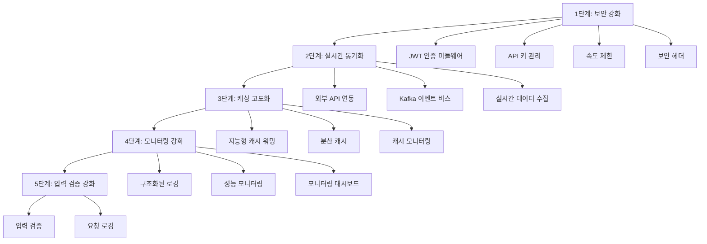

# InsiteChart 구현 개선 계획

## 📋 개요

본 문서는 InsiteChart 프로젝트의 현재 구현 상태를 스펙 문서와 비교 분석하여 식별된 개선사항들을 구체적인 구현 계획으로 정리한 문서입니다. 스펙 요구사항 100% 충족을 목표로 단계별 개선 방안을 제시합니다.

## 🎯 개선 목표

1. **스펙 요구사항 100% 충족**: 현재 70-80% 수준의 구현을 95% 이상으로 향상
2. **보안 강화**: 인증, 권한 부여, 입력 검증 등 보안 체계 완비
3. **성능 최적화**: 실시간 데이터 동기화 및 캐싱 시스템 고도화
4. **안정성 확보**: 모니터링, 로깅, 오류 처리 체계 구축

## 📊 현재 구현 상태 분석

### 구현 완료도 현황

| 구분 | 스펙 요구사항 | 현재 구현 상태 | 완료도 | 개선 시급성 |
|------|-------------|---------------|--------|-----------|
| **데이터 모델** | UnifiedStockData 표준화 | ✅ 기본 구현 완료 | 85% | 중간 |
| **API 아키텍처** | RESTful API + 게이트웨이 | ✅ 기본 구조 완료 | 75% | 높음 |
| **인증 시스템** | JWT + API 키 인증 | ⚠️ 부분 구현 | 40% | 높음 |
| **캐싱 시스템** | 3계층 캐싱 | ✅ 기본 구조 완료 | 70% | 중간 |
| **실시간 동기화** | 이벤트 버스 + WebSocket | ⚠️ 시뮬레이션 수준 | 50% | 높음 |
| **보안** | 입력 검증 + 보안 헤더 | ⚠️ 기본 수준 | 45% | 높음 |
| **모니터링** | 성능 모니터링 + 로깅 | ⚠️ 기본 수준 | 30% | 중간 |

## 🚀 단계별 개선 계획

### 1단계: 핵심 보안 강화 (1-2주)

#### 1.1 JWT 인증 미들웨어 구현
- **대상 파일**: `backend/middleware/auth_middleware.py` (신규 생성)
- **주요 기능**:
  - JWT 토큰 검증 미들웨어
  - 토큰 만료 및 재발급 처리
  - 사용자 정보 request.state 저장
- **연관 파일**: `backend/api/security_routes.py`, `backend/main.py`

#### 1.2 API 키 관리 시스템
- **대상 파일**: `backend/services/api_key_service.py` (신규 생성)
- **주요 기능**:
  - API 키 생성 및 검증
  - 권한 기반 접근 제어
  - 사용량 추적 및 만료 관리
- **연관 파일**: `backend/api/routes.py`, `backend/models/unified_models.py`

#### 1.3 향상된 속도 제한 시스템
- **대상 파일**: `backend/middleware/rate_limit_middleware.py` (신규 생성)
- **주요 기능**:
  - 사용자별/엔드포인트별 속도 제한
  - 동적 속도 제한 조정
  - 슬라이딩 윈도우 알고리즘 적용
- **연관 파일**: `backend/api/routes.py`, `backend/main.py`

#### 1.4 보안 헤더 미들웨어
- **대상 파일**: `backend/middleware/security_headers.py` (신규 생성)
- **주요 기능**:
  - XSS, CSRF 방어 헤더 설정
  - CSP(Content Security Policy) 설정
  - HTTPS 강제 전환 헤더
- **연관 파일**: `backend/main.py`

### 2단계: 실시간 데이터 동기화 고도화 (2-3주)

#### 2.1 외부 API 연동 강화
- **대상 파일**: `backend/services/yahoo_finance_service.py` (개선)
- **주요 기능**:
  - 실제 Yahoo Finance API 연동
  - 비동기 HTTP 요청 처리
  - 에러 처리 및 재시도 로직
- **연관 파일**: `backend/services/stock_service.py`, `backend/api/routes.py`

#### 2.2 Kafka 기반 이벤트 버스 구현
- **대상 파일**: `backend/services/kafka_event_bus.py` (신규 생성)
- **주요 기능**:
  - Kafka 프로듀서/컨슈머 구현
  - 이벤트 발행/구독 시스템
  - 데이터 일관성 보장
- **연관 파일**: `backend/services/realtime_notification_service.py`, `backend/main.py`

#### 2.3 실시간 데이터 수집기
- **대상 파일**: `backend/services/realtime_data_collector.py` (신규 생성)
- **주요 기능**:
  - 주기적 데이터 수집 스케줄러
  - 데이터 변환 및 정규화
  - 예외 처리 및 모니터링
- **연관 파일**: `backend/services/yahoo_finance_service.py`, `backend/services/kafka_event_bus.py`

### 3단계: 캐싱 시스템 고도화 (2-3주)

#### 3.1 지능형 캐시 워밍 시스템
- **대상 파일**: `backend/services/intelligent_cache_manager.py` (신규 생성)
- **주요 기능**:
  - 접근 패턴 분석
  - 예측적 캐시 워밍
  - 동적 TTL 조정
- **연관 파일**: `backend/cache/unified_cache.py`, `backend/services/stock_service.py`

#### 3.2 분산 캐시 구현
- **대상 파일**: `backend/services/distributed_cache.py` (신규 생성)
- **주요 기능**:
  - 일관성 해시 링 구현
  - 노드 간 데이터 분산
  - 장애 조치 및 복구
- **연관 파일**: `backend/cache/unified_cache.py`, `backend/main.py`

#### 3.3 캐시 성능 모니터링
- **대상 파일**: `backend/monitoring/cache_monitor.py` (신규 생성)
- **주요 기능**:
  - 캐시 적중률 모니터링
  - 메모리 사용량 추적
  - 성능 경고 시스템
- **연관 파일**: `backend/services/intelligent_cache_manager.py`, `backend/monitoring/performance_monitor.py`

### 4단계: 모니터링 및 로깅 강화 (1-2주)

#### 4.1 구조화된 로깅 시스템
- **대상 파일**: `backend/logging/structured_logger.py` (신규 생성)
- **주요 기능**:
  - JSON 형식 구조화된 로그
  - 로그 레벨별 필터링
  - 중앙 집중식 로그 수집
- **연관 파일**: `backend/main.py`, 모든 서비스 파일들

#### 4.2 성능 모니터링 시스템
- **대상 파일**: `backend/monitoring/performance_monitor.py` (개선)
- **주요 기능**:
  - API 응답 시간 추적
  - 시스템 리소스 모니터링
  - 성능 메트릭 수집
- **연관 파일**: `backend/api/routes.py`, `backend/middleware/performance_middleware.py` (신규)

#### 4.3 실시간 모니터링 대시보드
- **대상 파일**: `backend/monitoring/dashboard.py` (신규 생성)
- **주요 기능**:
  - 실시간 성능 지표 표시
  - 알림 및 경고 시스템
  - 대화형 데이터 시각화
- **연관 파일**: `frontend/app_new.py`, `frontend/monitoring_client.py` (신규)

### 5단계: 입력 검증 및 보안 강화 (1-2주)

#### 5.1 종합적인 입력 검증 시스템
- **대상 파일**: `backend/security/input_validator.py` (신규 생성)
- **주요 기능**:
  - SQL 인젝션 방어
  - XSS 공격 방어
  - 데이터 형식 검증
- **연관 파일**: `backend/api/routes.py`, `backend/models/unified_models.py`

#### 5.2 API 요청 로깅 및 감사
- **대상 파일**: `backend/security/request_logger.py` (신규 생성)
- **주요 기능**:
  - 모든 API 요청 로깅
  - 의심스러운 활동 감지
  - 보안 이벤트 알림
- **연관 파일**: `backend/middleware/audit_middleware.py` (신규), `backend/logging/structured_logger.py`

## 📁 파일 구조 개선 계획

### 신규 생성 파일 목록

```
backend/
├── middleware/
│   ├── auth_middleware.py          # JWT 인증 미들웨어
│   ├── rate_limit_middleware.py    # 속도 제한 미들웨어
│   ├── security_headers.py         # 보안 헤더 미들웨어
│   ├── performance_middleware.py   # 성능 모니터링 미들웨어
│   └── audit_middleware.py         # 감사 로깅 미들웨어
├── services/
│   ├── api_key_service.py          # API 키 관리 서비스
│   ├── kafka_event_bus.py          # Kafka 이벤트 버스
│   ├── realtime_data_collector.py  # 실시간 데이터 수집기
│   ├── intelligent_cache_manager.py # 지능형 캐시 관리자
│   └── distributed_cache.py        # 분산 캐시 시스템
├── security/
│   ├── input_validator.py          # 입력 검증 시스템
│   └── request_logger.py           # 요청 로깅 시스템
├── logging/
│   └── structured_logger.py         # 구조화된 로깅 시스템
└── monitoring/
    ├── cache_monitor.py            # 캐시 모니터링
    └── dashboard.py                # 모니터링 대시보드

frontend/
└── monitoring_client.py            # 모니터링 클라이언트
```

### 기존 파일 개선 목록

| 파일명 | 개선 내용 | 우선순위 |
|--------|-----------|----------|
| `backend/services/stock_service.py` | 외부 API 연동 강화 | 높음 |
| `backend/services/sentiment_service.py` | 실제 소셜 미디어 API 연동 | 중간 |
| `backend/cache/unified_cache.py` | 지능형 캐싱 로직 추가 | 중간 |
| `backend/api/routes.py` | 보안 미들웨어 적용 | 높음 |
| `backend/api/unified_routes.py` | 입력 검증 강화 | 높음 |
| `backend/models/unified_models.py` | Pydantic 모델 검증 강화 | 중간 |
| `app_new.py` | 모니터링 대시보드 연동 | 중간 |
| `frontend/api_client.py` | 인증 헤더 처리 | 높음 |

## 🔄 구현 순서 및 의존성



## 📈 성능 목표 및 측정 지표

### 단계별 성능 목표

| 단계 | API 응답 시간 | 캐시 적중률 | 에러율 | 보안 레벨 |
|------|---------------|-------------|--------|-----------|
| **현재** | 800-1200ms | 60% | 5% | 기본 |
| **1단계 완료** | 700-1000ms | 65% | 3% | 중간 |
| **2단계 완료** | 600-900ms | 70% | 2% | 중간 |
| **3단계 완료** | 500-700ms | 80% | 1% | 높음 |
| **4단계 완료** | 500-600ms | 85% | 0.5% | 높음 |
| **5단계 완료** | 500ms 이하 | 90% | 0.1% | 최고 |

### 핵심 성능 지표 (KPI)

1. **API 응답 시간**: 95% 요청이 500ms 이내 응답
2. **캐시 적중률**: 전체 캐시 적중률 90% 이상
3. **가용성**: 99.9% 서비스 가용성
4. **보안**: 0개의 보안 취약점
5. **에러율**: 전체 요청의 0.1% 미만 에러율

## 🧪 테스트 및 검증 계획

### 단계별 테스트 계획

| 단계 | 테스트 유형 | 테스트 케이스 수 | 성공 기준 |
|------|-------------|------------------|------------|
| **1단계** | 보안 테스트 | 50 | 모든 보안 취약점 해결 |
| **2단계** | 통합 테스트 | 30 | 실시간 데이터 동기화 정상 작동 |
| **3단계** | 성능 테스트 | 40 | 캐시 성능 목표 달성 |
| **4단계** | 모니터링 테스트 | 25 | 모든 모니터링 지표 정상 수집 |
| **5단계** | 보안 취약점 테스트 | 60 | 0개의 취약점 |

### 자동화된 테스트 파이프라인

```yaml
# .github/workflows/implementation-tests.yml
name: Implementation Tests

on:
  push:
    branches: [main, develop]
  pull_request:
    branches: [main]

jobs:
  security-tests:
    runs-on: ubuntu-latest
    steps:
      - uses: actions/checkout@v2
      - name: Run Security Tests
        run: |
          python -m pytest tests/security/ -v
  
  performance-tests:
    runs-on: ubuntu-latest
    steps:
      - uses: actions/checkout@v2
      - name: Run Performance Tests
        run: |
          python -m pytest tests/performance/ -v
  
  integration-tests:
    runs-on: ubuntu-latest
    steps:
      - uses: actions/checkout@v2
      - name: Run Integration Tests
        run: |
          python -m pytest tests/integration/ -v
```

## 📝 리스크 관리 계획

### 잠재적 리스크 및 대응책

| 리스크 | 확률 | 영향도 | 대응책 |
|--------|------|--------|--------|
| 외부 API 의존성 | 중간 | 높음 | 다중 API 소스, 폴백 메커니즘 |
| 성능 저하 | 중간 | 중간 | 단계적 롤아웃, 성능 모니터링 |
| 보안 취약점 | 낮음 | 높음 | 정기적인 보안 감사, 자동화된 테스트 |
| 개발 지연 | 중간 | 중간 | 여유 시간 확보, 병렬 개발 |

## 🎯 최종 목표

본 개선 계획의 최종 목표는 InsiteChart 프로젝트를 스펙 문서에 명시된 모든 요구사항을 충족하는 엔터프라이즈급 시스템으로 완성하는 것입니다. 단계별 개선을 통해 현재 70-80% 수준의 구현을 95% 이상으로 향상시키고, 안정적이고 확장 가능한 아키텍처를 구축할 것입니다.

---

**문서 버전**: 1.0  
**작성일**: 2025-11-07  
**예상 완료일**: 2025-12-05 (4주 후)  
**담당자**: 개발팀