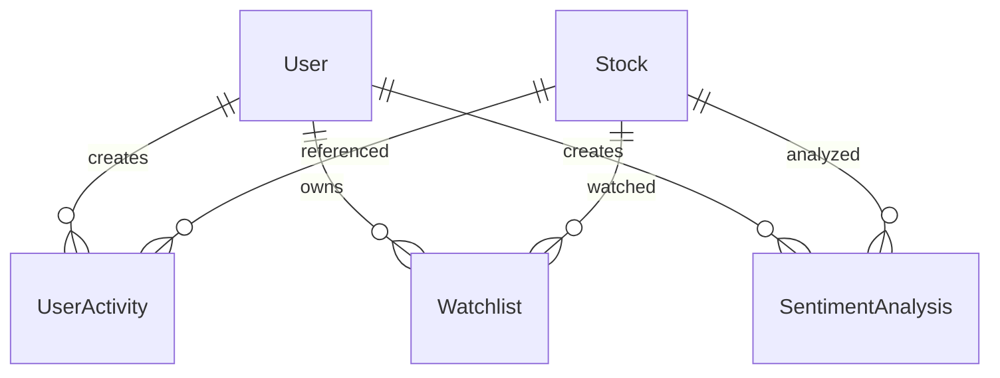

# 통합 데이터 모델 스펙

## 1. 개요

### 1.1. 목적
본 문서는 InsiteChart 프로젝트의 모든 데이터 모델을 통합하여 일관된 스펙을 제공하는 것을 목적으로 합니다.

### 1.2. 범위
- 모든 데이터 모델 정의
- 데이터 관계 및 제약 조건
- 데이터 검증 규칙
- 버전 관리 정책

### 1.3. 관련 문서
- [API 통합 스펙](docs/spec/api-spec-unified.md)
- [시스템 아키텍처](docs/spec/02-system-architecture.md)
- [API 연동 및 데이터 소스](docs/spec/03-api-integration.md)

## 2. 데이터 모델 기본 원칙

### 2.1. 명명 규칙
- 모든 필드 이름은 snake_case 사용
- 테이블 이름은 복수형 사용
- 관계형 필드는 _id 접미사 사용

### 2.2. 데이터 타입 표준
```yaml
# 기본 데이터 타입
string: 최대 255자 텍스트
text: 긴 텍스트 (제한 없음)
integer: 32비트 정수
bigint: 64비트 정수
float: 부동 소수점
boolean: true/false
timestamp: ISO 8601 형식
uuid: UUID 형식
json: JSON 객체
```

### 2.3. 필수 필드 규칙
- 모든 엔티티는 id 필드 필수 (UUID)
- created_at, updated_at 필드 자동 관리
- deleted_at 필드로 소프트 삭제 지원

## 3. 핵심 데이터 모델

### 3.1. 사용자 모델
```yaml
User:
  type: object
  properties:
    id:
      type: string
      format: uuid
      description: 사용자 고유 ID
    username:
      type: string
      minLength: 3
      maxLength: 50
      pattern: "^[a-zA-Z0-9_]+$"
      description: 사용자 이름
    email:
      type: string
      format: email
      description: 이메일 주소
    password_hash:
      type: string
      minLength: 60
      maxLength: 255
      description: 해시된 비밀번호
    role:
      type: string
      enum: [admin, user, viewer]
      default: user
      description: 사용자 역할
    is_active:
      type: boolean
      default: true
      description: 활성 상태
    profile:
      $ref: "#/components/schemas/UserProfile"
    preferences:
      $ref: "#/components/schemas/UserPreferences"
    created_at:
      type: string
      format: date-time
    updated_at:
      type: string
      format: date-time
    deleted_at:
      type: string
      format: date-time
      nullable: true
  required:
    - id
    - username
    - email
    - password_hash
    - role
    - is_active
    - created_at
    - updated_at
```

### 3.2. 주식 모델
```yaml
Stock:
  type: object
  properties:
    symbol:
      type: string
      minLength: 1
      maxLength: 10
      pattern: "^[A-Z0-9.]+$"
      description: 주식 심볼
    company_name:
      type: string
      maxLength: 255
      description: 회사명
    stock_type:
      type: string
      enum: [EQUITY, ETF, MUTUAL_FUND, INDEX, CRYPTO]
      description: 주식 유형
    exchange:
      type: string
      maxLength: 50
      description: 거래소
    sector:
      type: string
      maxLength: 100
      nullable: true
      description: 섹터
    industry:
      type: string
      maxLength: 100
      nullable: true
      description: 산업
    market_cap:
      type: number
      format: float
      nullable: true
      description: 시가총액
    current_price:
      type: number
      format: float
      nullable: true
      description: 현재 가격
    previous_close:
      type: number
      format: float
      nullable: true
      description: 전일 종가
    day_change:
      type: number
      format: float
      nullable: true
      description: 일일 변화
    day_change_pct:
      type: number
      format: float
      nullable: true
      description: 일일 변화율
    volume:
      type: integer
      format: int64
      nullable: true
      description: 거래량
    avg_volume:
      type: integer
      format: int64
      nullable: true
      description: 평균 거래량
    pe_ratio:
      type: number
      format: float
      nullable: true
      description: PER 비율
    dividend_yield:
      type: number
      format: float
      nullable: true
      description: 배당수익률
    beta:
      type: number
      format: float
      nullable: true
      description: 베타 계수
    fifty_two_week_high:
      type: number
      format: float
      nullable: true
      description: 52주 최고가
    fifty_two_week_low:
      type: number
      format: float
      nullable: true
      description: 52주 최저가
    # 센티먼트 관련 필드
    overall_sentiment:
      type: number
      format: float
      minimum: -1
      maximum: 1
      nullable: true
      description: 전체 센티먼트 점수
    sentiment_sources:
      type: object
      properties:
        reddit:
          type: number
          format: float
          minimum: -1
          maximum: 1
        twitter:
          type: number
          format: float
          minimum: -1
          maximum: 1
        discord:
          type: number
          format: float
          minimum: -1
          maximum: 1
      nullable: true
      description: 소스별 센티먼트 점수
    mention_count_24h:
      type: integer
      format: int64
      default: 0
      description: 24시간 언급 횟수
    trending_status:
      type: boolean
      default: false
      description: 트렌딩 상태
    trend_score:
      type: number
      format: float
      nullable: true
      description: 트렌드 점수
    # 메타데이터
    last_updated:
      type: string
      format: date-time
      description: 마지막 업데이트 시간
    data_quality_score:
      type: number
      format: float
      minimum: 0
      maximum: 1
      default: 1.0
      description: 데이터 품질 점수
  required:
    - symbol
    - company_name
    - stock_type
    - exchange
    - last_updated
    - data_quality_score
```

### 3.3. 센티먼트 모델
```yaml
SentimentAnalysis:
  type: object
  properties:
    id:
      type: string
      format: uuid
      description: 분석 고유 ID
    symbol:
      type: string
      description: 주식 심볼
    source:
      type: string
      enum: [reddit, twitter, discord, news]
      description: 데이터 소스
    text:
      type: string
      description: 분석 대상 텍스트
    sentiment_score:
      type: number
      format: float
      minimum: -1
      maximum: 1
      description: 센티먼트 점수
    confidence:
      type: number
      format: float
      minimum: 0
      maximum: 1
      description: 분석 신뢰도
    scores:
      type: object
      properties:
        positive:
          type: number
          format: float
          minimum: 0
          maximum: 1
        negative:
          type: number
          format: float
          minimum: 0
          maximum: 1
        neutral:
          type: number
          format: float
          minimum: 0
          maximum: 1
      description: 세부 센티먼트 점수
    keywords:
      type: array
      items:
        type: string
      description: 주요 키워드
    metadata:
      type: object
      properties:
        author:
          type: string
          description: 작성자
        community:
          type: string
          description: 커뮤니티
        upvotes:
          type: integer
          format: int64
          description: 추천 수
        timestamp:
          type: string
          format: date-time
          description: 원본 작성 시간
        url:
          type: string
          format: uri
          description: 원본 링크
      description: 메타데이터
    created_at:
      type: string
      format: date-time
    updated_at:
      type: string
      format: date-time
  required:
    - id
    - symbol
    - source
    - text
    - sentiment_score
    - confidence
    - created_at
    - updated_at
```

### 3.4. 사용자 활동 모델
```yaml
UserActivity:
  type: object
  properties:
    id:
      type: string
      format: uuid
      description: 활동 고유 ID
    user_id:
      type: string
      format: uuid
      description: 사용자 ID
    activity_type:
      type: string
      enum: [search, view, add_watchlist, remove_watchlist, export, login, logout]
      description: 활동 유형
    resource_type:
      type: string
      enum: [stock, sentiment, analysis, dashboard]
      description: 리소스 유형
    resource_id:
      type: string
      description: 리소스 ID
    details:
      type: object
      description: 활동 상세 정보
    ip_address:
      type: string
      format: ipv4
      description: IP 주소
    user_agent:
      type: string
      description: 사용자 에이전트
    timestamp:
      type: string
      format: date-time
    created_at:
      type: string
      format: date-time
  required:
    - id
    - user_id
    - activity_type
    - timestamp
    - created_at
```

### 3.5. 관심종목 모델
```yaml
Watchlist:
  type: object
  properties:
    id:
      type: string
      format: uuid
      description: 관심종목 고유 ID
    user_id:
      type: string
      format: uuid
      description: 사용자 ID
    symbol:
      type: string
      description: 주식 심볼
    category:
      type: string
      maxLength: 50
      description: 카테고리
    note:
      type: string
      maxLength: 500
      nullable: true
      description: 메모
    order_index:
      type: integer
      format: int32
      description: 표시 순서
    alert_enabled:
      type: boolean
      default: true
      description: 알림 활성화 여부
    alert_threshold:
      type: object
      properties:
        price_change:
          type: number
          format: float
          description: 가격 변화 알림 임계값
        sentiment_change:
          type: number
          format: float
          description: 센티먼트 변화 알림 임계값
        mention_spike:
          type: integer
          format: int64
          description: 언급 급증 알림 임계값
      nullable: true
      description: 알림 임계값
    created_at:
      type: string
      format: date-time
    updated_at:
      type: string
      format: date-time
  required:
    - id
    - user_id
    - symbol
    - order_index
    - created_at
    - updated_at
  uniqueConstraints:
    - [user_id, symbol]
```

## 4. 데이터 관계 정의

### 4.1. 관계 다이어그램


### 4.2. 관계 규칙
```yaml
# 1:N 관계
User -> UserActivity: 일대다
User -> Watchlist: 일대다
Stock -> SentimentAnalysis: 일대다

# N:M 관계
User <-> Stock: Watchlist를 통한 다대다

# 참조 관계
SentimentAnalysis -> Stock: 다대일 (외래 키)
UserActivity -> User: 다대일 (외래 키)
Watchlist -> User: 다대일 (외래 키)
Watchlist -> Stock: 다대일 (외래 키)
```

## 5. 데이터 검증 규칙

### 5.1. 필드 레벨 검증
```yaml
validation_rules:
  # 사용자명 검증
  username:
    minLength: 3
    maxLength: 50
    pattern: "^[a-zA-Z0-9_]+$"
    unique: true
  
  # 이메일 검증
  email:
    format: email
    unique: true
  
  # 주식 심볼 검증
  symbol:
    minLength: 1
    maxLength: 10
    pattern: "^[A-Z0-9.]+$"
    unique: true
  
  # 센티먼트 점수 검증
  sentiment_score:
    minimum: -1
    maximum: 1
```

### 5.2. 비즈니스 규칙 검증
```yaml
business_rules:
  # 관심종목 제한
  watchlist_limits:
    max_per_user: 100
    max_per_category: 20
  
  # 검색 기록 제한
  search_history:
    max_per_user: 1000
    retention_days: 90
  
  # 센티먼트 분석 제한
  sentiment_analysis:
    max_text_length: 10000
    min_text_length: 10
```

## 6. API 응답 형식

### 6.1. 단일 리소스 응답
```json
{
  "success": true,
  "data": {
    "id": "uuid",
    "symbol": "AAPL",
    "company_name": "Apple Inc.",
    "stock_type": "EQUITY",
    "exchange": "NASDAQ"
  },
  "message": "데이터가 성공적으로 조회되었습니다.",
  "timestamp": "2024-01-01T00:00:00Z"
}
```

### 6.2. 목록 응답
```json
{
  "success": true,
  "data": {
    "items": [
      {
        "id": "uuid",
        "symbol": "AAPL",
        "company_name": "Apple Inc."
      }
    ],
    "pagination": {
      "page": 1,
      "per_page": 20,
      "total": 100,
      "total_pages": 5
    }
  },
  "message": "목록이 성공적으로 조회되었습니다.",
  "timestamp": "2024-01-01T00:00:00Z"
}
```

### 6.3. 에러 응답
```json
{
  "success": false,
  "error": {
    "code": "VALIDATION_ERROR",
    "message": "요청 데이터가 유효하지 않습니다.",
    "details": {
      "field": "symbol",
      "reason": "필수 필드입니다."
    }
  },
  "timestamp": "2024-01-01T00:00:00Z"
}
```

## 7. 버전 관리

### 7.1. 버전 정책
- 메이저 버전: 호환성이 깨지는 변경
- 마이너 버전: 새로운 기능 추가 (후방 호환)
- 패치 버전: 버그 수정 (후방 호환)

### 7.2. 버전 관리 전략
```yaml
versioning:
  api_versioning: url_path
  database_versioning: migration_scripts
  model_versioning: semantic_versioning
  
  deprecation_policy:
    notice_period: 3_months
    support_period: 6_months
    removal_notice: true
```

## 8. 데이터 마이그레이션

### 8.1. 마이그레이션 전략
```yaml
migration_strategy:
  # 롤링 마이그레이션
  rolling_migrations:
    enabled: true
    batch_size: 1000
    timeout: 300
  
  # 데이터 검증
  validation:
    pre_migration: true
    post_migration: true
    sample_size: 1000
  
  # 롤백 전략
  rollback:
    enabled: true
    backup_required: true
    point_in_time: true
```

### 8.2. 마이그레이션 스크립트 예제
```sql
-- v1.0.0 -> v1.1.0 마이그레이션
BEGIN;

-- 새로운 필드 추가
ALTER TABLE stocks ADD COLUMN overall_sentiment FLOAT CHECK (overall_sentiment >= -1 AND overall_sentiment <= 1);
ALTER TABLE stocks ADD COLUMN sentiment_sources JSONB;
ALTER TABLE stocks ADD COLUMN mention_count_24h BIGINT DEFAULT 0;
ALTER TABLE stocks ADD COLUMN trending_status BOOLEAN DEFAULT FALSE;
ALTER TABLE stocks ADD COLUMN trend_score FLOAT;
ALTER TABLE stocks ADD COLUMN data_quality_score FLOAT DEFAULT 1.0;

-- 인덱스 추가
CREATE INDEX CONCURRENTLY idx_stocks_overall_sentiment ON stocks(overall_sentiment);
CREATE INDEX CONCURRENTLY idx_stocks_trending_status ON stocks(trending_status);
CREATE INDEX CONCURRENTLY idx_stocks_mention_count ON stocks(mention_count_24h DESC);

-- 데이터 마이그레이션
UPDATE stocks SET data_quality_score = 1.0 WHERE data_quality_score IS NULL;

COMMIT;
```

## 9. 품질 관리

### 9.1. 데이터 품질 지표
```yaml
quality_metrics:
  completeness:
    description: 필수 필드의 완전성
    threshold: 95%
  
  accuracy:
    description: 데이터의 정확성
    threshold: 99%
  
  consistency:
    description: 데이터의 일관성
    threshold: 98%
  
  timeliness:
    description: 데이터의 시의성
    threshold: 90%
```

### 9.2. 품질 검증 절차
```yaml
quality_checks:
  daily:
    - completeness_check
    - accuracy_sample_check
    - consistency_check
  
  weekly:
    - full_quality_report
    - data_profiling
    - anomaly_detection
  
  monthly:
    - data_quality_audit
    - performance_review
    - user_feedback_analysis
```

## 10. 검토 체크리스트

### 10.1. 모델 설계 검토
- [ ] 모든 엔티티가 명확하게 정의되었는가?
- [ ] 필드 타입과 제약 조건이 명확한가?
- [ ] 관계 정의가 올바른가?
- [ ] 비즈니스 규칙이 반영되었는가?

### 10.2. 데이터 검증 검토
- [ ] 필수 필드 검증이 완전한가?
- [ ] 비즈니스 규칙 검증이 구현되었는가?
- [ ] 데이터 품질 지표가 정의되었는가?

### 10.3. API 응답 형식 검토
- [ ] 성공 응답 형식이 표준화되었는가?
- [ ] 에러 응답 형식이 일관적인가?
- [ ] 목록 응답 페이징이 올바른가?

---

**문서 버전**: 1.0  
**작성일**: 2024-01-01  
**작성자**: InsiteChart 개발팀  
**검토자**: 기술 아키텍트