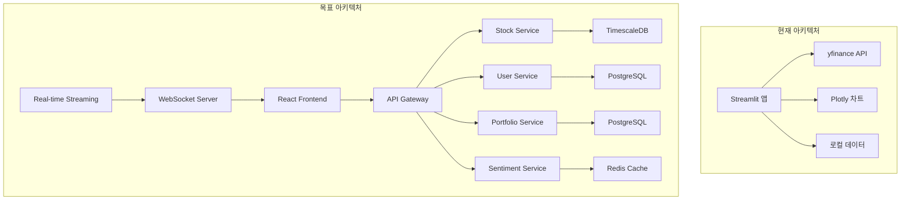

# 구현 계획 요약 및 권장사항

## 1. 전체 요약

### 1.1 프로젝트 개요

본 문서는 주식 차트 분석 애플리케이션의 현재 단순한 Streamlit 구현에서 엔터프라이즈급 마이크로서비스 아키텍처로 전환하기 위한 포괄적인 구현 계획을 요약합니다.

### 1.2 주요 성과물

| 문서 | 목적 | 주요 내용 |
|------|------|-----------|
| [`current-implementation-analysis.md`](current-implementation-analysis.md) | 현재 상태 분석 | 현재 구현의 한계점과 개선 필요성 식별 |
| [`architecture-redesign-plan.md`](architecture-redesign-plan.md) | 아키텍처 재설계 | 마이크로서비스 아키텍처 설계 및 전환 전략 |
| [`microservices-migration-plan.md`](microservices-migration-plan.md) | 마이크로서비스 전환 | Strangler Fig 패턴을 통한 점진적 전환 계획 |
| [`sentiment-analysis-integration-plan.md`](sentiment-analysis-integration-plan.md) | 소셜 감성 분석 | Reddit/Twitter 데이터 수집 및 감성 분석 통합 |
| [`performance-optimization-caching-plan.md`](performance-optimization-caching-plan.md) | 성능 최적화 | 다중 레벨 캐싱 및 데이터베이스 최적화 |
| [`security-architecture-improvement-plan.md`](security-architecture-improvement-plan.md) | 보 강화 | 다중 레이어 보안 및 GDPR 준수 |
| [`testing-framework-implementation-plan.md`](testing-framework-implementation-plan.md) | 테스트 프레임워크 | 포괄적인 테스트 전략 및 자동화 |
| [`deployment-operations-automation-plan.md`](deployment-operations-automation-plan.md) | 배포 자동화 | CI/CD 파이프라인 및 쿠버네티스 배포 |
| [`ui-ux-accessibility-improvement-plan.md`](ui-ux-accessibility-improvement-plan.md) | 접근성 개선 | WCAG 2.1 AA 준수 및 다국어 지원 |
| [`realtime-data-sync-implementation-plan.md`](realtime-data-sync-implementation-plan.md) | 실시간 동기화 | WebSocket 및 오프라인 지원 구현 |
| [`comprehensive-implementation-roadmap.md`](comprehensive-implementation-roadmap.md) | 종합 로드맵 | 전체 구현 계획 및 우선순위 설정 |
| [`phase-wise-implementation-plan.md`](phase-wise-implementation-plan.md) | 단계별 계획 | 6단계 상세 구현 계획 |

## 2. 핵심 아키텍처 변화

### 2.1 현재 vs 목표 아키텍처

### 2.2 주요 기술 스택 변화

| 영역 | 현재 | 목표 |
|------|------|------|
| 프론트엔드 | Streamlit | React + TypeScript |
| 백엔드 | Python 단일 앱 | Node.js 마이크로서비스 |
| 데이터베이스 | 단일 PostgreSQL | TimescaleDB + PostgreSQL |
| 캐싱 | 없음 | Redis 클러스터 |
| 실시간 통신 | 없음 | WebSocket + Socket.IO |
| 배포 | 수동 | Docker + Kubernetes |
| 테스트 | 없음 | Jest + Playwright |
| 모니터링 | 없음 | Prometheus + Grafana |

## 3. 단계별 구현 계획 요약

### 3.1 1단계: 핵심 아키텍처 전환 (4-6주)
- **API Gateway 구현**: Kong 기반 라우팅 및 보안
- **마이크로서비스 분리**: 주식, 사용자, 포트폴리오 서비스
- **데이터베이스 분리**: 서비스별 데이터베이스 설계

### 3.2 2단계: 실시간 데이터 처리 (3-4주)
- **WebSocket 인프라**: 실시간 통신 기반 구축
- **데이터 스트리밍**: 주식 가격 실시간 업데이트
- **오프라인 지원**: 데이터 동기화 및 충돌 해결

### 3.3 3단계: 성능 최적화 (2-3주)
- **캐싱 시스템**: Redis 기반 다중 레벨 캐싱
- **데이터베이스 최적화**: TimescaleDB 및 쿼리 튜닝

### 3.4 4단계: 소셜 감성 분석 (3-4주)
- **소셜 데이터 수집**: Reddit/Twitter API 연동
- **감성 분석 엔진**: NLP 기반 감성 분석
- **상관관계 분석**: 주식-감성 상관관계 시각화

### 3.5 5단계: 보안 및 접근성 (2-3주)
- **보안 아키텍처**: 인증/인가 및 데이터 암호화
- **접근성 개선**: WCAG 2.1 AA 준수 및 다국어 지원

### 3.6 6단계: 테스트 및 배포 (2-3주)
- **테스트 프레임워크**: 단위/통합/E2E 테스트
- **CI/CD 파이프라인**: 자동화 빌드 및 배포

## 4. 성공 측정 지표

### 4.1 기술적 KPI

| 지표 | 현재 | 목표 | 측정 방법 |
|------|------|------|-----------|
| API 응답 시간 | N/A | < 200ms | 성능 모니터링 |
| 시스템 가용성 | N/A | 99.9% | 업타임 모니터링 |
| 테스트 커버리지 | 0% | > 80% | 테스트 도구 |
| 배포 주기 | 수동 | 주 1회 | CI/CD 파이프라인 |
| 캐시 히트율 | N/A | > 80% | 캐시 통계 |

### 4.2 비즈니스 KPI

| 지표 | 현재 | 목표 | 측정 방법 |
|------|------|------|-----------|
| 사용자 만족도 | N/A | 4.5/5 | 사용자 설문조사 |
| 기능 완성도 | 30% | 100% | 스펙 대비 구현률 |
| 접근성 준수율 | 20% | 95% | WCAG 2.1 AA 테스트 |
| 보안 준수율 | 10% | 90% | 보안 감사 |

## 5. 리소스 요구사항

### 5.1 인력 구성

| 역할 | 필요 인원 | 주요 책임 |
|------|-----------|-----------|
| 아키텍트 | 1명 | 전체 아키텍처 설계 및 기술 의사결정 |
| 백엔드 개발자 | 2명 | 마이크로서비스, API, 데이터베이스 |
| 프론트엔드 개발자 | 2명 | UI/UX, 접근성, 실시간 기능 |
| 데이터 엔지니어 | 1명 | 데이터 파이프라인, 감성 분석 |
| DevOps 엔지니어 | 1명 | 배포, 모니터링, 인프라 |
| QA 엔지니어 | 1명 | 테스트 전략, 자동화 |

### 5.2 인프라 요구사항

| 리소스 | 사양 | 용도 |
|--------|------|------|
| 애플리케이션 서버 | 4코어, 8GB RAM | 마이크로서비스 실행 |
| 데이터베이스 서버 | 8코어, 16GB RAM, SSD 500GB | TimescaleDB, PostgreSQL |
| Redis 클러스터 | 2코어, 4GB RAM | 캐싱, 세션 저장 |
| 로드 밸런서 | 2코어, 4GB RAM | 트래픽 분산 |
| 모니터링 | 2코어, 4GB RAM | Prometheus, Grafana |

## 6. 위험 관리

### 6.1 기술적 위험

| 위험 | 확률 | 영향 | 완화 전략 |
|------|------|------|-----------|
| 마이크로서비스 전환 실패 | 중간 | 높음 | 점진적 전환, 롤백 계획 |
| 실시간 데이터 처리 성능 | 중간 | 중간 | 부하 테스트, 확장성 설계 |
| 소셜 API 제한 변경 | 높음 | 중간 | 다중 데이터 소스, 백업 계획 |

### 6.2 프로젝트 위험

| 위험 | 확률 | 영향 | 완화 전략 |
|------|------|------|-----------|
| 일정 지연 | 중간 | 중간 | 애자일 방법론, 유연한 범위 조정 |
| 인력 부족 | 낮음 | 높음 | 교차 트레이닝, 외부 전문가 활용 |
| 요구사항 변경 | 중간 | 중간 | 정기적인 스테이크홀더 소통 |

## 7. 다음 단계 권장사항

### 7.1 즉시 시작할 작업

1. **프로젝트 킥오프 미팅**
   - 모든 팀원 참여
   - 역할 및 책임 정의
   - 커뮤니케이션 채널 설정

2. **개발 환경 구축**
   - GitHub 리포지토리 설정
   - 개발 도구 및 IDE 구성
   - CI/CD 파이프라인 기본 설정

3. **1단계 상세 계획**
   - API Gateway 상세 설계
   - 마이크로서비스 인터페이스 정의
   - 데이터베이스 스키마 설계

### 7.2 첫 주 목표

1. **기술 스택 검증**
   - 기술 선택에 대한 PoC 수행
   - 성능 벤치마킹
   - 최종 기술 결정

2. **아키텍처 상세 설계**
   - 시스템 아키텍처 다이어그램 완성
   - API 명세서 작성
   - 데이터 모델링

3. **개발 표준 정의**
   - 코딩 컨벤션
   - 코드 리뷰 프로세스
   - 품질 기준 설정

### 7.3 성공적인 구현을 위한 핵심 요소

1. **단계적 접근**
   - 각 단계별 명확한 목표 설정
   - 성공 기준 정의 및 검증
   - 다음 단계로의 원활한 전환

2. **지속적인 커뮤니케이션**
   - 주간 진행 상황 공유
   - 기술적 의사결정 투명성
   - 정기적인 스테이크홀더 미팅

3. **품질 중심 개발**
   - 테스트 주도 개발(TDD)
   - 코드 리뷰 문화
   - 지속적인 리팩토링

4. **유연한 계획 관리**
   - 변화하는 요구사항에 대응
   - 위험 관리 및 완화
   - 성과 기반의 의사결정

## 8. 결론

본 구현 계획은 현재의 단순한 Streamlit 애플리케이션을 엔터프라이즈급 주식 분석 플랫폼으로 전환하기 위한 체계적인 접근 방식을 제시합니다.

6개월에 걸친 6단계 구현 계획을 통해 다음과 같은 핵심 가치를 실현할 수 있습니다:

1. **기술적 우수성**: 마이크로서비스 아키텍처, 실시간 처리, 고성능 캐싱
2. **사용자 경험**: 직관적인 UI, 접근성, 다국어 지원
3. **데이터 인사이트**: 소셜 감성 분석, 상관관계 시각화
4. **운영 효율성**: 자동화된 배포, 모니터링, 보안

이 계획을 성공적으로 실행하기 위해서는 명확한 리더십, 팀원들의 기술적 역량, 그리고 체계적인 프로젝트 관리가 필수적입니다.

**즉시 시작할 작업**:
1. 프로젝트 팀 구성 및 역할 정의
2. 개발 환경 및 인프라 준비
3. 1단계 상세 계획 수립

이 모든 계획 문서는 실제 구현 과정에서 지속적으로 업데이트되어야 하며, 팀원들의 적극적인 참여와 피드백을 통해 개선되어야 합니다.