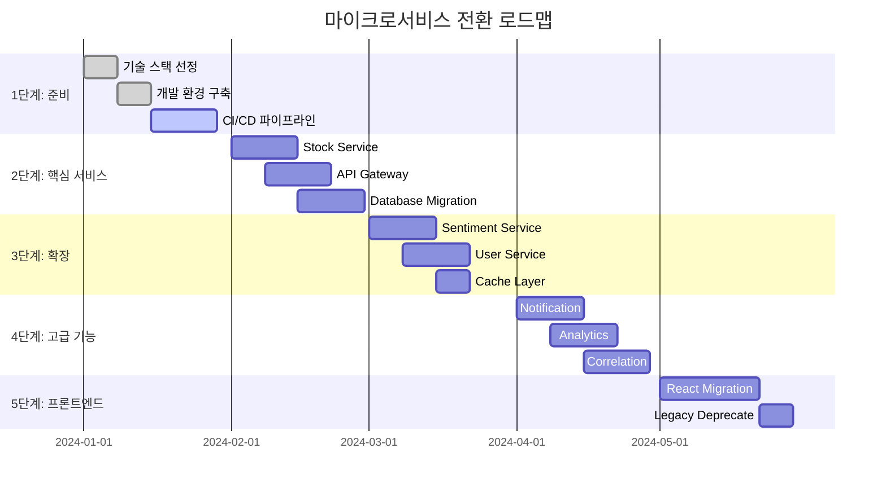

# 마이크로서비스 아키텍처 전환 계획

## 1. 개요

본 문서는 현재 단일 모놀리식 Streamlit 애플리케이션을 마이크로서비스 아키텍처로 전환하기 위한 상세한 이행 계획을 제시합니다. 점진적 전환을 통해 시스템 안정성을 유지하면서 최소한의 다운타임으로 전환을 완료하는 것을 목표로 합니다.

## 2. 전환 전략

### 2.1 스트랭글 패턴 (Strangler Fig Pattern) 적용

```
단계 1: 모놀리식 앱 + 새로운 마이크로서비스
┌─────────────────────────────────────┐
│           API Gateway               │
│  ┌─────────────────────────────────┐ │
│  │   Route: /api/v1/*              │ │
│  │   - Legacy: Streamlit App       │ │
│  │   - New: Stock Service          │ │
│  └─────────────────────────────────┘ │
└─────────────────────────────────────┘
         │                    │
┌─────────────────┐   ┌─────────────────┐
│ Streamlit App   │   │ Stock Service  │
│ (Legacy)        │   │ (New)           │
│ • UI            │   │ • API          │
│ • Business      │   │ • Data Layer   │
│ • All Features  │   │ • Stock Data   │
└─────────────────┘   └─────────────────┘

단계 2: 기능 분리 및 마이크로서비스 확장
┌─────────────────────────────────────┐
│           API Gateway               │
│  ┌─────────────────────────────────┐ │
│  │   Route: /api/v1/*              │ │
│  │   - Legacy: UI Only            │ │
│  │   - New: All Business Logic     │ │
│  └─────────────────────────────────┘ │
└─────────────────────────────────────┘
         │                    │
┌─────────────────┐   ┌─────────────────┐
│ Streamlit UI    │   │ Microservices   │
│ (Frontend Only)  │   │ • Stock         │
│ • UI Components │   │ • Sentiment     │
│ • Routing       │   │ • User          │
│ • State Mgmt    │   │ • Notification  │
└─────────────────┘   └─────────────────┘

단계 3: 완전한 마이크로서비스 아키텍처
┌─────────────────────────────────────┐
│           API Gateway               │
│  ┌─────────────────────────────────┐ │
│  │   Route: /api/v1/*              │ │
│  │   - All Services: Microservices │ │
│  └─────────────────────────────────┘ │
└─────────────────────────────────────┘
         │
┌─────────────────┐   ┌─────────────────┐
│ React Frontend  │   │ Microservices   │
│ (Modern UI)     │   │ • Stock         │
│ • Components    │   │ • Sentiment     │
│ • State Mgmt    │   │ • User          │
│ • Routing       │   │ • Notification  │
└─────────────────┘   └─────────────────┘
```

### 2.2 점진적 전환 로드맵



## 3. 기술 스택 선정

### 3.1 백엔드 마이크로서비스 기술 스택

| 구분 | 현재 기술 | 목표 기술 | 선정 이유 |
|------|-----------|-----------|-----------|
| 웹 프레임워크 | Streamlit | FastAPI | 고성능 비동기 처리, 자동 API 문서화 |
| 언어 | Python | Python | 기존 코드베이스 호환성 |
| 데이터베이스 | 없음 | TimescaleDB | 시계열 데이터 최적화, PostgreSQL 호환 |
| 캐시 | 없음 | Redis | 고성능 인메모리 캐싱, Pub/Sub 지원 |
| 메시징 | 없음 | Apache Kafka | 대용량 스트리밍 데이터 처리 |
| 컨테이너화 | 없음 | Docker | 환경 일관성, 배포 자동화 |
| 오케스트레이션 | 없음 | Kubernetes | 컨테이너 관리, 자동 스케일링 |

### 3.2 프론트엔드 기술 스택

| 구분 | 현재 기술 | 목표 기술 | 선정 이유 |
|------|-----------|-----------|-----------|
| 프레임워크 | Streamlit | React | 컴포넌트 기반 아키텍처, 생태계 |
| 상태 관리 | Session State | Redux Toolkit | 예측 가능한 상태 관리 |
| 라우팅 | Tab Navigation | React Router | 싱글 페이지 애플리케이션 |
| UI 라이브러리 | Streamlit Components | Material-UI | 디자인 시스템, 접근성 |
| 차트 라이브러리 | Plotly | Chart.js/D3.js | 성능, 커스터마이징 |
| HTTP 클라이언트 | 없음 | Axios | API 통신, 인터셉터 |

## 4. 상세 전환 계획

### 4.1 1단계: 기반 구축 (2주)

#### 주간 1: 개발 환경 설정
```bash
# 프로젝트 구조 설정
mkdir -p microservices/{stock-service,sentiment-service,user-service,gateway}
cd microservices

# Docker 환경 설정
cat > docker-compose.yml << EOF
version: '3.8'
services:
  timescaledb:
    image: timescale/timescaledb:latest-pg14
    environment:
      POSTGRES_DB: stockdb
      POSTGRES_USER: admin
      POSTGRES_PASSWORD: password
    ports:
      - "5432:5432"
    volumes:
      - timescaledb_data:/var/lib/postgresql/data

  redis:
    image: redis:7-alpine
    ports:
      - "6379:6379"
    volumes:
      - redis_data:/data

  zookeeper:
    image: confluentinc/cp-zookeeper:latest
    environment:
      ZOOKEEPER_CLIENT_PORT: 2181
      ZOOKEEPER_TICK_TIME: 2000

  kafka:
    image: confluentinc/cp-kafka:latest
    depends_on:
      - zookeeper
    ports:
      - "9092:9092"
    environment:
      KAFKA_BROKER_ID: 1
      KAFKA_ZOOKEEPER_CONNECT: zookeeper:2181
      KAFKA_ADVERTISED_LISTENERS: PLAINTEXT://localhost:9092

volumes:
  timescaledb_data:
  redis_data:
EOF

# 각 마이크로서비스 기본 구조
for service in stock-service sentiment-service user-service gateway; do
  mkdir -p $service/{app,tests,config}
  touch $service/requirements.txt
  touch $service/Dockerfile
  touch $service/app/main.py
done
```

#### 주간 2: CI/CD 파이프라인 구축
```yaml
# .github/workflows/ci-cd.yml
name: CI/CD Pipeline

on:
  push:
    branches: [main, develop]
  pull_request:
    branches: [main]

jobs:
  test:
    runs-on: ubuntu-latest
    steps:
      - uses: actions/checkout@v3
      - name: Set up Python
        uses: actions/setup-python@v4
        with:
          python-version: '3.11'
      
      - name: Install dependencies
        run: |
          pip install -r requirements.txt
          pip install pytest pytest-cov
      
      - name: Run tests
        run: |
          pytest --cov=app --cov-report=xml
      
      - name: Upload coverage
        uses: codecov/codecov-action@v3

  build:
    needs: test
    runs-on: ubuntu-latest
    if: github.ref == 'refs/heads/main'
    steps:
      - uses: actions/checkout@v3
      
      - name: Build Docker images
        run: |
          docker build -t stock-service ./stock-service
          docker build -t sentiment-service ./sentiment-service
          docker build -t user-service ./user-service
          docker build -t api-gateway ./gateway
      
      - name: Push to registry
        run: |
          echo ${{ secrets.DOCKER_PASSWORD }} | docker login -u ${{ secrets.DOCKER_USERNAME }} --password-stdin
          docker push stock-service
          docker push sentiment-service
          docker push user-service
          docker push api-gateway

  deploy:
    needs: build
    runs-on: ubuntu-latest
    if: github.ref == 'refs/heads/main'
    steps:
      - name: Deploy to Kubernetes
        run: |
          kubectl apply -f k8s/
```

### 4.2 2단계: 핵심 서비스 구현 (4주)

#### 주간 1-2: Stock Service 구현
```python
# stock-service/app/main.py
from fastapi import FastAPI, HTTPException, Depends
from fastapi.middleware.cors import CORSMiddleware
from pydantic import BaseModel
from typing import List, Optional
import yfinance as yf
import redis
import asyncio
from datetime import datetime, timedelta

app = FastAPI(title="Stock Service", version="1.0.0")

# CORS 설정
app.add_middleware(
    CORSMiddleware,
    allow_origins=["*"],
    allow_credentials=True,
    allow_methods=["*"],
    allow_headers=["*"],
)

# Redis 연결
redis_client = redis.Redis(host='redis', port=6379, decode_responses=True)

# 데이터 모델
class StockQuote(BaseModel):
    symbol: str
    price: float
    change: float
    change_percent: float
    volume: int
    market_cap: Optional[int] = None
    pe_ratio: Optional[float] = None

class StockHistory(BaseModel):
    symbol: str
    period: str
    data: List[dict]

# 캐싱 데코레이터
def cache_result(ttl: int = 300):
    def decorator(func):
        async def wrapper(*args, **kwargs):
            cache_key = f"{func.__name__}:{str(args)}:{str(kwargs)}"
            cached_result = redis_client.get(cache_key)
            if cached_result:
                return json.loads(cached_result)
            
            result = await func(*args, **kwargs)
            redis_client.setex(cache_key, ttl, json.dumps(result))
            return result
        return wrapper
    return decorator

# API 엔드포인트
@app.get("/api/v1/stocks/{symbol}/quote", response_model=StockQuote)
@cache_result(ttl=60)
async def get_stock_quote(symbol: str):
    try:
        ticker = yf.Ticker(symbol.upper())
        info = ticker.info
        
        current_price = info.get('currentPrice') or info.get('regularMarketPrice')
        previous_close = info.get('previousClose')
        
        if not current_price or not previous_close:
            raise HTTPException(status_code=404, detail="Stock data not found")
        
        change = current_price - previous_close
        change_percent = (change / previous_close) * 100
        
        return StockQuote(
            symbol=symbol.upper(),
            price=current_price,
            change=change,
            change_percent=change_percent,
            volume=info.get('volume', 0),
            market_cap=info.get('marketCap'),
            pe_ratio=info.get('trailingPE')
        )
    except Exception as e:
        raise HTTPException(status_code=500, detail=str(e))

@app.get("/api/v1/stocks/{symbol}/history", response_model=StockHistory)
@cache_result(ttl=300)
async def get_stock_history(symbol: str, period: str = "1mo"):
    try:
        ticker = yf.Ticker(symbol.upper())
        hist = ticker.history(period=period)
        
        if hist.empty:
            raise HTTPException(status_code=404, detail="Historical data not found")
        
        data = []
        for date, row in hist.iterrows():
            data.append({
                'date': date.isoformat(),
                'open': float(row['Open']),
                'high': float(row['High']),
                'low': float(row['Low']),
                'close': float(row['Close']),
                'volume': int(row['Volume'])
            })
        
        return StockHistory(
            symbol=symbol.upper(),
            period=period,
            data=data
        )
    except Exception as e:
        raise HTTPException(status_code=500, detail=str(e))

@app.post("/api/v1/stocks/search")
async def search_stocks(query: str, limit: int = 10):
    try:
        url = "https://query2.finance.yahoo.com/v1/finance/search"
        params = {
            "q": query,
            "quotes_count": limit,
            "country": "United States"
        }
        
        response = requests.get(url, params=params)
        if response.status_code == 200:
            data = response.json()
            results = []
            for quote in data.get('quotes', []):
                results.append({
                    'symbol': quote.get('symbol'),
                    'name': quote.get('shortname') or quote.get('longname'),
                    'type': quote.get('quoteType'),
                    'exchange': quote.get('exchange')
                })
            return results
        else:
            raise HTTPException(status_code=400, detail="Search failed")
    except Exception as e:
        raise HTTPException(status_code=500, detail=str(e))

if __name__ == "__main__":
    import uvicorn
    uvicorn.run(app, host="0.0.0.0", port=8001)
```

#### 주간 3: API Gateway 구현
```python
# gateway/app/main.py
from fastapi import FastAPI, HTTPException, Depends, Request
from fastapi.middleware.cors import CORSMiddleware
from fastapi.responses import JSONResponse
import httpx
import asyncio
from typing import Dict, Any
import time

app = FastAPI(title="API Gateway", version="1.0.0")

# CORS 설정
app.add_middleware(
    CORSMiddleware,
    allow_origins=["*"],
    allow_credentials=True,
    allow_methods=["*"],
    allow_headers=["*"],
)

# 서비스 라우팅 설정
SERVICES = {
    "stock-service": "http://stock-service:8001",
    "sentiment-service": "http://sentiment-service:8002",
    "user-service": "http://user-service:8003",
    "notification-service": "http://notification-service:8004",
    "analytics-service": "http://analytics-service:8005",
    "correlation-service": "http://correlation-service:8006"
}

# 라우팅 규칙
ROUTE_RULES = {
    "/api/v1/stocks/": "stock-service",
    "/api/v1/sentiment/": "sentiment-service",
    "/api/v1/users/": "user-service",
    "/api/v1/notifications/": "notification-service",
    "/api/v1/analytics/": "analytics-service",
    "/api/v1/correlation/": "correlation-service"
}

# 속도 제한 설정
RATE_LIMITS = {
    "stock-service": {"requests": 100, "window": 60},
    "sentiment-service": {"requests": 50, "window": 60},
    "user-service": {"requests": 30, "window": 60},
    "notification-service": {"requests": 20, "window": 60},
    "analytics-service": {"requests": 40, "window": 60},
    "correlation-service": {"requests": 30, "window": 60}
}

# 속도 제한 메모리 저장소
rate_limit_store: Dict[str, Dict[str, Any]] = {}

class RateLimiter:
    def __init__(self):
        self.store = rate_limit_store
    
    def is_allowed(self, client_id: str, service: str) -> bool:
        now = time.time()
        window = RATE_LIMITS[service]["window"]
        max_requests = RATE_LIMITS[service]["requests"]
        
        if client_id not in self.store:
            self.store[client_id] = {}
        
        if service not in self.store[client_id]:
            self.store[client_id][service] = []
        
        # 오래된 요청 제거
        self.store[client_id][service] = [
            req_time for req_time in self.store[client_id][service]
            if now - req_time < window
        ]
        
        # 요청 수 확인
        if len(self.store[client_id][service]) >= max_requests:
            return False
        
        # 새 요청 기록
        self.store[client_id][service].append(now)
        return True

rate_limiter = RateLimiter()

async def proxy_request(request: Request, path: str):
    # 서비스 식별
    service = None
    for route, svc in ROUTE_RULES.items():
        if path.startswith(route):
            service = svc
            break
    
    if not service:
        raise HTTPException(status_code=404, detail="Service not found")
    
    # 속도 제한 확인
    client_id = request.client.host
    if not rate_limiter.is_allowed(client_id, service):
        raise HTTPException(status_code=429, detail="Rate limit exceeded")
    
    # 요청 전달
    service_url = SERVICES[service]
    url = f"{service_url}{path}"
    
    async with httpx.AsyncClient() as client:
        try:
            response = await client.request(
                method=request.method,
                url=url,
                headers=dict(request.headers),
                content=await request.body(),
                timeout=30.0
            )
            
            return JSONResponse(
                content=response.json(),
                status_code=response.status_code,
                headers=dict(response.headers)
            )
        except httpx.RequestError as e:
            raise HTTPException(status_code=503, detail="Service unavailable")

# 라우트 핸들러
app.add_route("/api/v1/{path:path}", proxy_request, methods=["GET", "POST", "PUT", "DELETE"])

@app.get("/health")
async def health_check():
    services_status = {}
    
    async with httpx.AsyncClient() as client:
        for service_name, service_url in SERVICES.items():
            try:
                response = await client.get(f"{service_url}/health", timeout=5.0)
                services_status[service_name] = "healthy" if response.status_code == 200 else "unhealthy"
            except:
                services_status[service_name] = "unreachable"
    
    return {
        "status": "healthy",
        "services": services_status,
        "timestamp": time.time()
    }

if __name__ == "__main__":
    import uvicorn
    uvicorn.run(app, host="0.0.0.0", port=8080)
```

#### 주간 4: 데이터베이스 마이그레이션
```sql
-- 데이터베이스 스키마 마이그레이션 스크립트
-- 01_create_database.sql
CREATE DATABASE stockdb;
\c stockdb;

-- 02_create_extensions.sql
CREATE EXTENSION IF NOT EXISTS "timescaledb";
CREATE EXTENSION IF NOT EXISTS "uuid-ossp";

-- 03_create_tables.sql
-- 주식 데이터 테이블
CREATE TABLE stock_data (
    id UUID PRIMARY KEY DEFAULT uuid_generate_v4(),
    symbol VARCHAR(10) NOT NULL,
    timestamp TIMESTAMPTZ NOT NULL,
    open DECIMAL(10,2),
    high DECIMAL(10,2),
    low DECIMAL(10,2),
    close DECIMAL(10,2),
    volume BIGINT,
    adjusted_close DECIMAL(10,2),
    created_at TIMESTAMPTZ DEFAULT NOW()
);

-- 시계열 하이퍼테이블 생성
SELECT create_hypertable('stock_data', 'timestamp', 'symbol', 4);

-- 감성 데이터 테이블
CREATE TABLE sentiment_data (
    id UUID PRIMARY KEY DEFAULT uuid_generate_v4(),
    symbol VARCHAR(10) NOT NULL,
    timestamp TIMESTAMPTZ NOT NULL,
    platform VARCHAR(20) NOT NULL,
    sentiment_score DECIMAL(3,2),
    confidence DECIMAL(3,2),
    mention_count INTEGER,
    keywords JSONB,
    source_urls JSONB,
    created_at TIMESTAMPTZ DEFAULT NOW()
);

SELECT create_hypertable('sentiment_data', 'timestamp', 'symbol', 4);

-- 사용자 테이블
CREATE TABLE users (
    id UUID PRIMARY KEY DEFAULT uuid_generate_v4(),
    email VARCHAR(255) UNIQUE NOT NULL,
    password_hash VARCHAR(255) NOT NULL,
    first_name VARCHAR(100),
    last_name VARCHAR(100),
    created_at TIMESTAMPTZ DEFAULT NOW(),
    updated_at TIMESTAMPTZ DEFAULT NOW()
);

-- 왓치리스트 테이블
CREATE TABLE watchlists (
    id UUID PRIMARY KEY DEFAULT uuid_generate_v4(),
    user_id UUID REFERENCES users(id) ON DELETE CASCADE,
    symbol VARCHAR(10) NOT NULL,
    added_at TIMESTAMPTZ DEFAULT NOW(),
    UNIQUE(user_id, symbol)
);

-- 04_create_indexes.sql
CREATE INDEX idx_stock_data_symbol_timestamp ON stock_data (symbol, timestamp DESC);
CREATE INDEX idx_sentiment_data_symbol_timestamp ON sentiment_data (symbol, timestamp DESC);
CREATE INDEX idx_watchlists_user_id ON watchlists (user_id);
```

### 4.3 3단계: 확장 서비스 구현 (4주)

#### 주간 1-2: Sentiment Service 구현
```python
# sentiment-service/app/main.py
from fastapi import FastAPI, HTTPException
from pydantic import BaseModel
from typing import List, Optional
import praw
import tweepy
import asyncio
import redis
from datetime import datetime, timedelta
import json
from textblob import TextBlob

app = FastAPI(title="Sentiment Service", version="1.0.0")

# Redis 연결
redis_client = redis.Redis(host='redis', port=6379, decode_responses=True)

# 데이터 모델
class SentimentData(BaseModel):
    symbol: str
    platform: str
    sentiment_score: float
    confidence: float
    mention_count: int
    keywords: List[str]
    source_urls: List[str]

class SentimentAnalysis(BaseModel):
    symbol: str
    current_sentiment: float
    sentiment_trend: str
    mention_volume: int
    analysis_timestamp: datetime

# Reddit API 설정
reddit = praw.Reddit(
    client_id="YOUR_REDDIT_CLIENT_ID",
    client_secret="YOUR_REDDIT_CLIENT_SECRET",
    user_agent="StockSentiment/1.0"
)

# Twitter API 설정
twitter_client = tweepy.Client(
    bearer_token="YOUR_TWITTER_BEARER_TOKEN"
)

async def analyze_reddit_sentiment(symbol: str, limit: int = 100):
    try:
        subreddit = reddit.search(f"${symbol}", limit=limit)
        sentiments = []
        keywords = []
        source_urls = []
        
        for submission in subreddit:
            # 텍스트 감성 분석
            text = f"{submission.title} {submission.selftext}"
            blob = TextBlob(text)
            sentiment = blob.sentiment.polarity
            
            sentiments.append(sentiment)
            
            # 키워드 추출
            words = blob.noun_phrases
            keywords.extend(words)
            
            # 소스 URL 수집
            source_urls.append(f"https://reddit.com{submission.permalink}")
        
        if not sentiments:
            return None
        
        avg_sentiment = sum(sentiments) / len(sentiments)
        confidence = abs(avg_sentiment)
        
        # 키워드 빈도수 상위 10개
        keyword_counts = {}
        for keyword in keywords:
            keyword_counts[keyword] = keyword_counts.get(keyword, 0) + 1
        
        top_keywords = sorted(keyword_counts.items(), key=lambda x: x[1], reverse=True)[:10]
        
        return SentimentData(
            symbol=symbol.upper(),
            platform="reddit",
            sentiment_score=avg_sentiment,
            confidence=confidence,
            mention_count=len(sentiments),
            keywords=[kw for kw, count in top_keywords],
            source_urls=source_urls[:10]
        )
    except Exception as e:
        print(f"Reddit sentiment analysis error: {e}")
        return None

async def analyze_twitter_sentiment(symbol: str, limit: int = 100):
    try:
        tweets = twitter_client.search_recent_tweets(
            query=f"${symbol}",
            max_results=limit,
            tweet_fields=["created_at", "public_metrics"]
        )
        
        if not tweets.data:
            return None
        
        sentiments = []
        keywords = []
        source_urls = []
        
        for tweet in tweets.data:
            # 텍스트 감성 분석
            blob = TextBlob(tweet.text)
            sentiment = blob.sentiment.polarity
            
            sentiments.append(sentiment)
            
            # 키워드 추출
            words = blob.noun_phrases
            keywords.extend(words)
            
            # 소스 URL 수집
            source_urls.append(f"https://twitter.com/twitter/status/{tweet.id}")
        
        if not sentiments:
            return None
        
        avg_sentiment = sum(sentiments) / len(sentiments)
        confidence = abs(avg_sentiment)
        
        # 키워드 빈도수 상위 10개
        keyword_counts = {}
        for keyword in keywords:
            keyword_counts[keyword] = keyword_counts.get(keyword, 0) + 1
        
        top_keywords = sorted(keyword_counts.items(), key=lambda x: x[1], reverse=True)[:10]
        
        return SentimentData(
            symbol=symbol.upper(),
            platform="twitter",
            sentiment_score=avg_sentiment,
            confidence=confidence,
            mention_count=len(sentiments),
            keywords=[kw for kw, count in top_keywords],
            source_urls=source_urls[:10]
        )
    except Exception as e:
        print(f"Twitter sentiment analysis error: {e}")
        return None

@app.get("/api/v1/sentiment/{symbol}/current")
async def get_current_sentiment(symbol: str):
    # 캐시 확인
    cache_key = f"sentiment:current:{symbol}"
    cached_result = redis_client.get(cache_key)
    if cached_result:
        return json.loads(cached_result)
    
    # 병렬로 Reddit과 Twitter 분석 실행
    reddit_task = analyze_reddit_sentiment(symbol)
    twitter_task = analyze_twitter_sentiment(symbol)
    
    reddit_result, twitter_result = await asyncio.gather(
        reddit_task, twitter_task, return_exceptions=True
    )
    
    results = []
    if reddit_result:
        results.append(reddit_result.dict())
    if twitter_result:
        results.append(twitter_result.dict())
    
    if not results:
        raise HTTPException(status_code=404, detail="No sentiment data found")
    
    # 종합 감성 분석
    total_mentions = sum(r['mention_count'] for r in results)
    weighted_sentiment = sum(
        r['sentiment_score'] * r['mention_count'] for r in results
    ) / total_mentions if total_mentions > 0 else 0
    
    # 트렌드 분석 (과거 데이터와 비교)
    trend = "stable"
    # 여기에 트렌드 분석 로직 추가
    
    analysis = SentimentAnalysis(
        symbol=symbol.upper(),
        current_sentiment=weighted_sentiment,
        sentiment_trend=trend,
        mention_volume=total_mentions,
        analysis_timestamp=datetime.utcnow()
    )
    
    # 결과 캐싱 (5분)
    redis_client.setex(cache_key, 300, json.dumps(analysis.dict()))
    
    return analysis

@app.get("/api/v1/sentiment/{symbol}/history")
async def get_sentiment_history(symbol: str, days: int = 30):
    # 과거 감성 데이터 조회
    # 여기에 데이터베이스 조회 로직 추가
    pass

if __name__ == "__main__":
    import uvicorn
    uvicorn.run(app, host="0.0.0.0", port=8002)
```

#### 주간 3: User Service 구현
```python
# user-service/app/main.py
from fastapi import FastAPI, HTTPException, Depends, status
from fastapi.security import HTTPBearer, HTTPAuthorizationCredentials
from pydantic import BaseModel, EmailStr
from typing import List, Optional
import bcrypt
import jwt
import redis
from datetime import datetime, timedelta
import uuid

app = FastAPI(title="User Service", version="1.0.0")

# Redis 연결
redis_client = redis.Redis(host='redis', port=6379, decode_responses=True)

# JWT 설정
SECRET_KEY = "your-secret-key"
ALGORITHM = "HS256"
ACCESS_TOKEN_EXPIRE_MINUTES = 30

security = HTTPBearer()

# 데이터 모델
class User(BaseModel):
    id: Optional[str] = None
    email: EmailStr
    first_name: Optional[str] = None
    last_name: Optional[str] = None

class UserCreate(BaseModel):
    email: EmailStr
    password: str
    first_name: Optional[str] = None
    last_name: Optional[str] = None

class UserLogin(BaseModel):
    email: EmailStr
    password: str

class Token(BaseModel):
    access_token: str
    token_type: str

class WatchlistItem(BaseModel):
    symbol: str
    added_at: Optional[datetime] = None

# JWT 토큰 생성
def create_access_token(data: dict, expires_delta: Optional[timedelta] = None):
    to_encode = data.copy()
    if expires_delta:
        expire = datetime.utcnow() + expires_delta
    else:
        expire = datetime.utcnow() + timedelta(minutes=15)
    to_encode.update({"exp": expire})
    encoded_jwt = jwt.encode(to_encode, SECRET_KEY, algorithm=ALGORITHM)
    return encoded_jwt

# 현재 사용자 가져오기
async def get_current_user(credentials: HTTPAuthorizationCredentials = Depends(security)):
    credentials_exception = HTTPException(
        status_code=status.HTTP_401_UNAUTHORIZED,
        detail="Could not validate credentials",
        headers={"WWW-Authenticate": "Bearer"},
    )
    try:
        payload = jwt.decode(credentials.credentials, SECRET_KEY, algorithms=[ALGORITHM])
        user_id: str = payload.get("sub")
        if user_id is None:
            raise credentials_exception
    except jwt.PyJWTError:
        raise credentials_exception
    
    # Redis에서 사용자 정보 조회
    user_data = redis_client.hgetall(f"user:{user_id}")
    if not user_data:
        raise credentials_exception
    
    return User(
        id=user_id,
        email=user_data['email'],
        first_name=user_data.get('first_name'),
        last_name=user_data.get('last_name')
    )

@app.post("/api/v1/auth/register", response_model=User)
async def register_user(user: UserCreate):
    # 이메일 중복 확인
    existing_user = redis_client.get(f"user:email:{user.email}")
    if existing_user:
        raise HTTPException(status_code=400, detail="Email already registered")
    
    # 비밀번호 해싱
    hashed_password = bcrypt.hashpw(user.password.encode('utf-8'), bcrypt.gensalt())
    
    # 사용자 ID 생성
    user_id = str(uuid.uuid4())
    
    # 사용자 정보 저장
    user_data = {
        'id': user_id,
        'email': user.email,
        'password_hash': hashed_password.decode('utf-8'),
        'first_name': user.first_name or '',
        'last_name': user.last_name or '',
        'created_at': datetime.utcnow().isoformat()
    }
    
    # Redis에 저장
    redis_client.hset(f"user:{user_id}", mapping=user_data)
    redis_client.set(f"user:email:{user.email}", user_id)
    
    return User(
        id=user_id,
        email=user.email,
        first_name=user.first_name,
        last_name=user.last_name
    )

@app.post("/api/v1/auth/login", response_model=Token)
async def login_user(user_credentials: UserLogin):
    # 사용자 조회
    user_id = redis_client.get(f"user:email:{user_credentials.email}")
    if not user_id:
        raise HTTPException(status_code=401, detail="Invalid credentials")
    
    user_data = redis_client.hgetall(f"user:{user_id}")
    
    # 비밀번호 확인
    if not bcrypt.checkpw(
        user_credentials.password.encode('utf-8'),
        user_data['password_hash'].encode('utf-8')
    ):
        raise HTTPException(status_code=401, detail="Invalid credentials")
    
    # 액세스 토큰 생성
    access_token_expires = timedelta(minutes=ACCESS_TOKEN_EXPIRE_MINUTES)
    access_token = create_access_token(
        data={"sub": user_id}, expires_delta=access_token_expires
    )
    
    return {"access_token": access_token, "token_type": "bearer"}

@app.get("/api/v1/users/profile", response_model=User)
async def get_user_profile(current_user: User = Depends(get_current_user)):
    return current_user

@app.get("/api/v1/users/watchlist", response_model=List[WatchlistItem])
async def get_watchlist(current_user: User = Depends(get_current_user)):
    watchlist_items = redis_client.lrange(f"watchlist:{current_user.id}", 0, -1)
    
    watchlist = []
    for item in watchlist_items:
        item_data = json.loads(item)
        watchlist.append(WatchlistItem(**item_data))
    
    return watchlist

@app.post("/api/v1/users/watchlist")
async def add_to_watchlist(
    symbol: str,
    current_user: User = Depends(get_current_user)
):
    # 중복 확인
    watchlist_items = redis_client.lrange(f"watchlist:{current_user.id}", 0, -1)
    for item in watchlist_items:
        item_data = json.loads(item)
        if item_data['symbol'] == symbol.upper():
            raise HTTPException(status_code=400, detail="Symbol already in watchlist")
    
    # 왓치리스트에 추가
    watchlist_item = {
        'symbol': symbol.upper(),
        'added_at': datetime.utcnow().isoformat()
    }
    
    redis_client.lpush(f"watchlist:{current_user.id}", json.dumps(watchlist_item))
    
    return {"message": "Symbol added to watchlist"}

@app.delete("/api/v1/users/watchlist/{symbol}")
async def remove_from_watchlist(
    symbol: str,
    current_user: User = Depends(get_current_user)
):
    # 왓치리스트에서 제거
    watchlist_items = redis_client.lrange(f"watchlist:{current_user.id}", 0, -1)
    
    for i, item in enumerate(watchlist_items):
        item_data = json.loads(item)
        if item_data['symbol'] == symbol.upper():
            redis_client.lrem(f"watchlist:{current_user.id}", 1, item)
            return {"message": "Symbol removed from watchlist"}
    
    raise HTTPException(status_code=404, detail="Symbol not found in watchlist")

if __name__ == "__main__":
    import uvicorn
    uvicorn.run(app, host="0.0.0.0", port=8003)
```

#### 주간 4: 캐싱 레이어 구현
```python
# cache-service/app/main.py
from fastapi import FastAPI, HTTPException
from pydantic import BaseModel
from typing import Any, Optional
import redis
import json
from datetime import datetime, timedelta

app = FastAPI(title="Cache Service", version="1.0.0")

# Redis 연결
redis_client = redis.Redis(host='redis', port=6379, decode_responses=True)

# 데이터 모델
class CacheItem(BaseModel):
    key: str
    value: Any
    ttl: Optional[int] = None

class CacheResponse(BaseModel):
    key: str
    value: Any
    exists: bool
    ttl: Optional[int] = None

# 캐시 설정
CACHE_CONFIG = {
    "stock_quote": {"ttl": 60, "max_size": 1000},
    "stock_history": {"ttl": 300, "max_size": 500},
    "sentiment_current": {"ttl": 180, "max_size": 200},
    "sentiment_history": {"ttl": 600, "max_size": 100},
    "user_profile": {"ttl": 3600, "max_size": 1000},
    "watchlist": {"ttl": 1800, "max_size": 500}
}

@app.post("/api/v1/cache/{cache_type}")
async def set_cache(cache_type: str, item: CacheItem):
    if cache_type not in CACHE_CONFIG:
        raise HTTPException(status_code=400, detail="Invalid cache type")
    
    config = CACHE_CONFIG[cache_type]
    ttl = item.ttl or config["ttl"]
    
    # 캐시 크기 제한 확인
    cache_keys = redis_client.keys(f"{cache_type}:*")
    if len(cache_keys) >= config["max_size"]:
        # LRU 정책으로 오래된 항목 제거
        oldest_key = min(cache_keys, key=lambda k: redis_client.ttl(k))
        redis_client.delete(oldest_key)
    
    # 캐시 저장
    cache_key = f"{cache_type}:{item.key}"
    redis_client.setex(cache_key, ttl, json.dumps(item.value))
    
    return {"message": "Cache set successfully"}

@app.get("/api/v1/cache/{cache_type}/{key}")
async def get_cache(cache_type: str, key: str):
    if cache_type not in CACHE_CONFIG:
        raise HTTPException(status_code=400, detail="Invalid cache type")
    
    cache_key = f"{cache_type}:{key}"
    cached_value = redis_client.get(cache_key)
    ttl = redis_client.ttl(cache_key)
    
    if cached_value is None:
        return CacheResponse(key=key, value=None, exists=False)
    
    try:
        value = json.loads(cached_value)
        return CacheResponse(key=key, value=value, exists=True, ttl=ttl)
    except json.JSONDecodeError:
        return CacheResponse(key=key, value=cached_value, exists=True, ttl=ttl)

@app.delete("/api/v1/cache/{cache_type}/{key}")
async def delete_cache(cache_type: str, key: str):
    if cache_type not in CACHE_CONFIG:
        raise HTTPException(status_code=400, detail="Invalid cache type")
    
    cache_key = f"{cache_type}:{key}"
    result = redis_client.delete(cache_key)
    
    if result == 0:
        raise HTTPException(status_code=404, detail="Cache key not found")
    
    return {"message": "Cache deleted successfully"}

@app.delete("/api/v1/cache/{cache_type}")
async def clear_cache_type(cache_type: str):
    if cache_type not in CACHE_CONFIG:
        raise HTTPException(status_code=400, detail="Invalid cache type")
    
    cache_keys = redis_client.keys(f"{cache_type}:*")
    if cache_keys:
        redis_client.delete(*cache_keys)
    
    return {"message": f"Cache type {cache_type} cleared successfully"}

@app.get("/api/v1/cache/stats")
async def get_cache_stats():
    stats = {}
    total_memory = 0
    
    for cache_type in CACHE_CONFIG:
        cache_keys = redis_client.keys(f"{cache_type}:*")
        stats[cache_type] = {
            "count": len(cache_keys),
            "keys": cache_keys
        }
        
        # 메모리 사용량 계산
        for key in cache_keys:
            memory = redis_client.memory_usage(key)
            total_memory += memory
    
    return {
        "stats": stats,
        "total_memory_bytes": total_memory,
        "total_memory_mb": round(total_memory / (1024 * 1024), 2)
    }

if __name__ == "__main__":
    import uvicorn
    uvicorn.run(app, host="0.0.0.0", port=8007)
```

## 5. 데이터 마이그레이션 전략

### 5.1 점진적 데이터 마이그레이션
```python
# migration-service/app/main.py
from fastapi import FastAPI, HTTPException
from pydantic import BaseModel
import asyncio
import yfinance as yf
import psycopg2
from psycopg2.extras import execute_values
from datetime import datetime, timedelta
import redis

app = FastAPI(title="Migration Service", version="1.0.0")

# 데이터베이스 연결
def get_db_connection():
    return psycopg2.connect(
        host="timescaledb",
        database="stockdb",
        user="admin",
        password="password"
    )

# Redis 연결
redis_client = redis.Redis(host='redis', port=6379, decode_responses=True)

class MigrationStatus(BaseModel):
    symbol: str
    status: str
    records_migrated: int
    last_migration: datetime
    error_message: Optional[str] = None

async def migrate_stock_data(symbol: str, start_date: datetime, end_date: datetime):
    try:
        # Yahoo Finance에서 데이터 가져오기
        ticker = yf.Ticker(symbol)
        hist = ticker.history(start=start_date, end=end_date)
        
        if hist.empty:
            return None
        
        # 데이터베이스에 저장
        conn = get_db_connection()
        cursor = conn.cursor()
        
        records = []
        for date, row in hist.iterrows():
            records.append((
                symbol.upper(),
                date,
                float(row['Open']),
                float(row['High']),
                float(row['Low']),
                float(row['Close']),
                int(row['Volume']),
                float(row.get('Adj Close', row['Close'])),
                datetime.utcnow()
            ))
        
        # 대량 삽입
        query = """
            INSERT INTO stock_data (symbol, timestamp, open, high, low, close, volume, adjusted_close, created_at)
            VALUES %s
            ON CONFLICT (symbol, timestamp) DO UPDATE SET
                open = EXCLUDED.open,
                high = EXCLUDED.high,
                low = EXCLUDED.low,
                close = EXCLUDED.close,
                volume = EXCLUDED.volume,
                adjusted_close = EXCLUDED.adjusted_close,
                created_at = EXCLUDED.created_at
        """
        
        execute_values(cursor, query, records)
        conn.commit()
        cursor.close()
        conn.close()
        
        return len(records)
        
    except Exception as e:
        print(f"Migration error for {symbol}: {e}")
        raise e

@app.post("/api/v1/migrate/stock/{symbol}")
async def migrate_stock(symbol: str, days: int = 365):
    end_date = datetime.utcnow()
    start_date = end_date - timedelta(days=days)
    
    try:
        records_count = await migrate_stock_data(symbol, start_date, end_date)
        
        # 마이그레이션 상태 기록
        status = MigrationStatus(
            symbol=symbol.upper(),
            status="completed",
            records_migrated=records_count,
            last_migration=datetime.utcnow()
        )
        
        # Redis에 상태 저장
        redis_client.setex(
            f"migration:stock:{symbol}",
            86400,  # 24시간
            status.json()
        )
        
        return status
        
    except Exception as e:
        error_status = MigrationStatus(
            symbol=symbol.upper(),
            status="failed",
            records_migrated=0,
            last_migration=datetime.utcnow(),
            error_message=str(e)
        )
        
        redis_client.setex(
            f"migration:stock:{symbol}",
            86400,
            error_status.json()
        )
        
        raise HTTPException(status_code=500, detail=str(e))

@app.get("/api/v1/migrate/stock/{symbol}/status")
async def get_migration_status(symbol: str):
    status_data = redis_client.get(f"migration:stock:{symbol}")
    if not status_data:
        raise HTTPException(status_code=404, detail="Migration status not found")
    
    return MigrationStatus.parse_raw(status_data)

@app.post("/api/v1/migrate/batch")
async def batch_migrate(symbols: list, days: int = 365):
    tasks = []
    for symbol in symbols:
        task = migrate_stock(symbol, days)
        tasks.append(task)
    
    results = await asyncio.gather(*tasks, return_exceptions=True)
    
    return {
        "total_symbols": len(symbols),
        "successful": sum(1 for r in results if not isinstance(r, Exception)),
        "failed": sum(1 for r in results if isinstance(r, Exception)),
        "results": results
    }

if __name__ == "__main__":
    import uvicorn
    uvicorn.run(app, host="0.0.0.0", port=8008)
```

## 6. 테스트 전략

### 6.1 통합 테스트 프레임워크
```python
# tests/integration/test_api_gateway.py
import pytest
import httpx
from fastapi.testclient import TestClient
from app.main import app

client = TestClient(app)

@pytest.mark.asyncio
async def test_stock_service_routing():
    """Stock Service 라우팅 테스트"""
    response = client.get("/api/v1/stocks/AAPL/quote")
    assert response.status_code == 200
    
    data = response.json()
    assert "symbol" in data
    assert "price" in data
    assert "change" in data
    assert data["symbol"] == "AAPL"

@pytest.mark.asyncio
async def test_sentiment_service_routing():
    """Sentiment Service 라우팅 테스트"""
    response = client.get("/api/v1/sentiment/AAPL/current")
    assert response.status_code == 200
    
    data = response.json()
    assert "symbol" in data
    assert "current_sentiment" in data
    assert "mention_volume" in data

@pytest.mark.asyncio
async def test_rate_limiting():
    """속도 제한 테스트"""
    # 동일한 클라이언트에서 여러 요청
    responses = []
    for _ in range(150):  # 속도 제한 초과
        response = client.get("/api/v1/stocks/AAPL/quote")
        responses.append(response)
    
    # 일부 요청은 429 상태 코드를 반환해야 함
    rate_limited = any(r.status_code == 429 for r in responses)
    assert rate_limited

@pytest.mark.asyncio
async def test_circuit_breaker():
    """서킷 브레이커 테스트"""
    # 서비스 다운 시뮬레이션
    # 이 테스트은 서비스가 다운될 때 API Gateway가 적절히 처리하는지 확인
    
    response = client.get("/api/v1/stocks/INVALID/quote")
    assert response.status_code in [404, 503]
```

### 6.2 부하 테스트
```python
# tests/load/test_performance.py
import asyncio
import aiohttp
import time
from concurrent.futures import ThreadPoolExecutor

async def load_test_endpoint(session, url, requests_per_user=10):
    """단일 사용자 부하 테스트"""
    response_times = []
    
    for _ in range(requests_per_user):
        start_time = time.time()
        async with session.get(url) as response:
            await response.text()
            end_time = time.time()
            response_times.append(end_time - start_time)
    
    return response_times

async def run_load_test(base_url, concurrent_users=50, requests_per_user=10):
    """전체 부하 테스트"""
    url = f"{base_url}/api/v1/stocks/AAPL/quote"
    
    async with aiohttp.ClientSession() as session:
        tasks = []
        for _ in range(concurrent_users):
            task = load_test_endpoint(session, url, requests_per_user)
            tasks.append(task)
        
        results = await asyncio.gather(*tasks)
    
    # 결과 분석
    all_response_times = []
    for user_times in results:
        all_response_times.extend(user_times)
    
    avg_response_time = sum(all_response_times) / len(all_response_times)
    max_response_time = max(all_response_times)
    min_response_time = min(all_response_times)
    
    return {
        "total_requests": len(all_response_times),
        "concurrent_users": concurrent_users,
        "avg_response_time": avg_response_time,
        "max_response_time": max_response_time,
        "min_response_time": min_response_time,
        "requests_per_second": len(all_response_times) / (max_response_time - min_response_time)
    }

if __name__ == "__main__":
    # 부하 테스트 실행
    result = asyncio.run(run_load_test("http://localhost:8080"))
    print(f"Load test results: {result}")
```

## 7. 모니터링 및 로깅

### 7.1 분산 추적 시스템
```python
# monitoring/tracing.py
from opentelemetry import trace
from opentelemetry.exporter.jaeger.thrift import JaegerExporter
from opentelemetry.sdk.trace import TracerProvider
from opentelemetry.sdk.trace.export import BatchSpanProcessor
from opentelemetry.instrumentation.fastapi import FastAPIInstrumentor
from opentelemetry.instrumentation.httpx import HTTPXClientInstrumentor
import logging

# 추적 설정
def setup_tracing(service_name: str):
    # Jaeger exporter 설정
    jaeger_exporter = JaegerExporter(
        agent_host_name="jaeger",
        agent_port=6831,
    )
    
    # Tracer provider 설정
    trace.set_tracer_provider(TracerProvider())
    tracer = trace.get_tracer(__name__)
    
    # Span processor 추가
    span_processor = BatchSpanProcessor(jaeger_exporter)
    trace.get_tracer_provider().add_span_processor(span_processor)
    
    # FastAPI 자동 계측
    FastAPIInstrumentor.instrument()
    
    # HTTPX 자동 계측
    HTTPXClientInstrumentor.instrument()
    
    return tracer

# 로깅 설정
def setup_logging(service_name: str):
    logging.basicConfig(
        level=logging.INFO,
        format=f'%(asctime)s - {service_name} - %(name)s - %(levelname)s - %(message)s'
    )
    
    return logging.getLogger(service_name)
```

### 7.2 메트릭 수집
```python
# monitoring/metrics.py
from prometheus_client import Counter, Histogram, Gauge, start_http_server
import time
import functools

# 메트릭 정의
REQUEST_COUNT = Counter(
    'http_requests_total',
    'Total HTTP requests',
    ['method', 'endpoint', 'status_code']
)

REQUEST_DURATION = Histogram(
    'http_request_duration_seconds',
    'HTTP request duration',
    ['method', 'endpoint']
)

ACTIVE_CONNECTIONS = Gauge(
    'active_connections',
    'Number of active connections'
)

CACHE_HIT_RATE = Gauge(
    'cache_hit_rate',
    'Cache hit rate',
    ['cache_type']
)

def track_requests(func):
    """요청 추적 데코레이터"""
    @functools.wraps(func)
    async def wrapper(*args, **kwargs):
        start_time = time.time()
        
        try:
            result = await func(*args, **kwargs)
            status_code = 200
            return result
        except Exception as e:
            status_code = 500
            raise e
        finally:
            duration = time.time() - start_time
            
            # 메트릭 기록
            REQUEST_COUNT.labels(
                method='GET',
                endpoint=func.__name__,
                status_code=status_code
            ).inc()
            
            REQUEST_DURATION.labels(
                method='GET',
                endpoint=func.__name__
            ).observe(duration)
    
    return wrapper

def start_metrics_server(port: int = 8000):
    """메트릭 서버 시작"""
    start_http_server(port)
```

## 8. 롤백 전략

### 8.1 블루-그린 배포
```yaml
# k8s/blue-green-deployment.yaml
apiVersion: argoproj.io/v1alpha1
kind: Rollout
metadata:
  name: stock-service-rollout
spec:
  replicas: 3
  strategy:
    blueGreen:
      activeService: stock-service-active
      previewService: stock-service-preview
      autoPromotionEnabled: false
      scaleDownDelaySeconds: 30
      prePromotionAnalysis:
        templates:
        - templateName: success-rate
        args:
        - name: service-name
          value: stock-service-preview
      postPromotionAnalysis:
        templates:
        - templateName: success-rate
        args:
        - name: service-name
          value: stock-service-active
  selector:
    matchLabels:
      app: stock-service
  template:
    metadata:
      labels:
        app: stock-service
    spec:
      containers:
      - name: stock-service
        image: stock-service:latest
        ports:
        - containerPort: 8001
        env:
        - name: DATABASE_URL
          valueFrom:
            secretKeyRef:
              name: db-secret
              key: url
        livenessProbe:
          httpGet:
            path: /health
            port: 8001
          initialDelaySeconds: 30
          periodSeconds: 10
        readinessProbe:
          httpGet:
            path: /health
            port: 8001
          initialDelaySeconds: 5
          periodSeconds: 5
---
apiVersion: v1
kind: Service
metadata:
  name: stock-service-active
spec:
  selector:
    app: stock-service
  ports:
  - port: 8001
    targetPort: 8001
---
apiVersion: v1
kind: Service
metadata:
  name: stock-service-preview
spec:
  selector:
    app: stock-service
  ports:
  - port: 8001
    targetPort: 8001
```

### 8.2 롤백 절차
```bash
#!/bin/bash
# rollback.sh

# 1. 현재 배포 상태 확인
echo "Current deployment status:"
kubectl get rollout stock-service-rollout

# 2. 롤백 결정
read -p "Do you want to rollback to previous version? (y/n): " -n 1 -r
echo

if [[ $REPLY =~ ^[Yy]$ ]]; then
    # 3. 롤백 실행
    echo "Rolling back to previous version..."
    kubectl argo rollouts undo stock-service-rollout
    
    # 4. 롤백 상태 모니터링
    echo "Monitoring rollback progress..."
    kubectl argo rollouts get rollout stock-service-rollout --watch
    
    # 5. 헬스 체크
    echo "Performing health check..."
    sleep 30
    
    HEALTH_STATUS=$(curl -s -o /dev/null -w "%{http_code}" http://stock-service-active:8001/health)
    if [ "$HEALTH_STATUS" = "200" ]; then
        echo "Rollback successful! Service is healthy."
    else
        echo "Rollback failed! Service is unhealthy."
        exit 1
    fi
else
    echo "Rollback cancelled."
fi
```

## 9. 결론

본 마이크로서비스 전환 계획은 스트랭글 패턴을 활용하여 점진적으로 시스템을 전환하는 안전한 접근 방식을 제시합니다. 각 단계별로 명확한 목표와 성공 지표를 설정하여 전환 과정을 효과적으로 모니터링할 수 있습니다.

주요 성공 요인:
1. **점진적 전환**: 시스템 안정성 유지
2. **자동화**: CI/CD 파이프라인을 통한 일관된 배포
3. **모니터링**: 실시간 상태 추적 및 문제 조기 발견
4. **롤백 전략**: 문제 발생 시 신속한 복구
5. **테스트**: 포괄적인 테스트를 통한 품질 보증

이 계획을 통해 최소한의 다운타임으로 안정적으로 마이크로서비스 아키텍처로 전환할 수 있으며, 전환 과정에서 비즈니스 연속성을 보장할 수 있습니다.