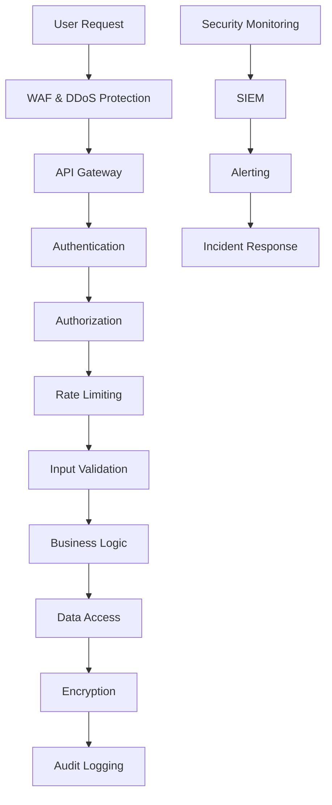

# 보안 아키텍처 개선 계획

## 1. 개요

본 문서는 주식 차트 분석 애플리케이션의 보안 아키텍처를 강화하기 위한 상세한 계획을 제시합니다. 다계층 보안 모델, 인증 및 권한 부여 시스템, 데이터 암호화, PII 관리, GDPR 준수 등 다양한 보안 측면에서의 개선 전략을 다룹니다.

## 2. 다계층 보안 아키텍처

### 2.1 전체 보안 모델

```
┌─────────────────────────────────────────────────────────────┐
│                   Presentation Layer                        │
│  ┌─────────────────┐  ┌─────────────────┐  ┌──────────────┐ │
│  │   WAF          │  │   DDoS         │  │   SSL/TLS    │ │
│  │   - OWASP       │  │   - Rate Limit  │  │   - TLS 1.3  │ │
│  │   - XSS/CSRF    │  │   - IP Blocking │  │   - HSTS     │ │
│  │   - SQL Inject.  │  │   - Geo Block  │  │   - Cert Mgmt│ │
│  └─────────────────┘  └─────────────────┘  └──────────────┘ │
└─────────────────────────────────────────────────────────────┘
                              │
┌─────────────────────────────────────────────────────────────┐
│                    Application Layer                       │
│  ┌─────────────────┐  ┌─────────────────┐  ┌──────────────┐ │
│  │   AuthN/AuthZ   │  │   API Security  │  │   Session    │ │
│  │   - JWT         │  │   - API Keys    │  │   Mgmt       │ │
│  │   - OAuth 2.0   │  │   - Rate Limit  │  │   - Redis    │ │
│  │   - MFA         │  │   - Input Valid.│  │   - Secure   │ │
│  └─────────────────┘  └─────────────────┘  └──────────────┘ │
└─────────────────────────────────────────────────────────────┘
                              │
┌─────────────────────────────────────────────────────────────┐
│                      Data Layer                             │
│  ┌─────────────────┐  ┌─────────────────┐  ┌──────────────┐ │
│  │   Encryption   │  │   Access Ctrl   │  │   Audit      │ │
│  │   - At Rest    │  │   - RBAC       │  │   - Logging  │ │
│  │   - In Transit  │  │   - ABAC       │  │   - Monitoring│ │
│  │   - Key Mgmt    │  │   - Min Priv.  │  │   - Alerts   │ │
│  └─────────────────┘  └─────────────────┘  └──────────────┘ │
└─────────────────────────────────────────────────────────────┘
                              │
┌─────────────────────────────────────────────────────────────┐
│                   Infrastructure Layer                     │
│  ┌─────────────────┐  ┌─────────────────┐  ┌──────────────┐ │
│  │   Network       │  │   Container     │  │   Cloud      │ │
│  │   - VPC        │  │   Security      │  │   Security   │ │
│  │   - Firewalls   │  │   - Scanning    │  │   - IAM      │ │
│  │   - VPN        │  │   - Policies    │  │   - Secrets  │ │
│  └─────────────────┘  └─────────────────┘  └──────────────┘ │
└─────────────────────────────────────────────────────────────┘
```

### 2.2 보안 제어 계층



## 3. 인증 및 권한 부여 시스템

### 3.1 OAuth 2.0 + JWT 인증 구현
```python
# security/auth_service.py
import jwt
import bcrypt
import secrets
import asyncio
from datetime import datetime, timedelta
from typing import Optional, Dict, List, Any
from fastapi import HTTPException, status, Depends
from fastapi.security import HTTPBearer, HTTPAuthorizationCredentials
import redis
from dataclasses import dataclass
from enum import Enum

class UserRole(Enum):
    ADMIN = "admin"
    PREMIUM_USER = "premium_user"
    BASIC_USER = "basic_user"
    GUEST = "guest"

class Permission(Enum):
    READ_STOCK_DATA = "read_stock_data"
    WRITE_STOCK_DATA = "write_stock_data"
    READ_SENTIMENT_DATA = "read_sentiment_data"
    MANAGE_USERS = "manage_users"
    ACCESS_ANALYTICS = "access_analytics"
    EXPORT_DATA = "export_data"

@dataclass
class User:
    id: str
    email: str
    username: str
    role: UserRole
    permissions: List[Permission]
    is_active: bool = True
    mfa_enabled: bool = False
    last_login: Optional[datetime] = None
    created_at: Optional[datetime] = None

class AuthenticationService:
    def __init__(self, redis_url: str = "redis://localhost:6379"):
        self.redis = redis.from_url(redis_url, decode_responses=True)
        self.secret_key = self._get_or_generate_secret_key()
        self.algorithm = "HS256"
        self.access_token_expire_minutes = 30
        self.refresh_token_expire_days = 7
        
        # 역할별 권한 매핑
        self.role_permissions = {
            UserRole.ADMIN: [
                Permission.READ_STOCK_DATA,
                Permission.WRITE_STOCK_DATA,
                Permission.READ_SENTIMENT_DATA,
                Permission.MANAGE_USERS,
                Permission.ACCESS_ANALYTICS,
                Permission.EXPORT_DATA
            ],
            UserRole.PREMIUM_USER: [
                Permission.READ_STOCK_DATA,
                Permission.READ_SENTIMENT_DATA,
                Permission.ACCESS_ANALYTICS,
                Permission.EXPORT_DATA
            ],
            UserRole.BASIC_USER: [
                Permission.READ_STOCK_DATA,
                Permission.READ_SENTIMENT_DATA
            ],
            UserRole.GUEST: [
                Permission.READ_STOCK_DATA
            ]
        }
    
    def _get_or_generate_secret_key(self) -> str:
        """시크릿 키 가져오기 또는 생성"""
        secret_key = self.redis.get("jwt_secret_key")
        if not secret_key:
            secret_key = secrets.token_urlsafe(64)
            self.redis.set("jwt_secret_key", secret_key)
        return secret_key
    
    async def register_user(
        self, 
        email: str, 
        password: str, 
        username: str,
        role: UserRole = UserRole.BASIC_USER
    ) -> User:
        """사용자 등록"""
        
        # 이메일 중복 확인
        if await self._get_user_by_email(email):
            raise HTTPException(
                status_code=status.HTTP_400_BAD_REQUEST,
                detail="Email already registered"
            )
        
        # 비밀번호 해싱
        hashed_password = bcrypt.hashpw(password.encode('utf-8'), bcrypt.gensalt())
        
        # 사용자 생성
        user_id = f"user_{secrets.token_urlsafe(16)}"
        permissions = self.role_permissions[role]
        
        user = User(
            id=user_id,
            email=email,
            username=username,
            role=role,
            permissions=permissions,
            created_at=datetime.utcnow()
        )
        
        # 사용자 정보 저장
        await self._save_user(user, hashed_password)
        
        return user
    
    async def authenticate_user(self, email: str, password: str) -> Optional[User]:
        """사용자 인증"""
        user = await self._get_user_by_email(email)
        if not user or not user.is_active:
            return None
        
        stored_hash = await self._get_user_password_hash(user.id)
        if not stored_hash:
            return None
        
        if bcrypt.checkpw(password.encode('utf-8'), stored_hash.encode('utf-8')):
            # 마지막 로그인 시간 업데이트
            user.last_login = datetime.utcnow()
            await self._update_user_last_login(user.id)
            return user
        
        return None
    
    async def create_access_token(self, user: User) -> str:
        """액세스 토큰 생성"""
        expire = datetime.utcnow() + timedelta(minutes=self.access_token_expire_minutes)
        
        payload = {
            "sub": user.id,
            "email": user.email,
            "username": user.username,
            "role": user.role.value,
            "permissions": [perm.value for perm in user.permissions],
            "exp": expire,
            "iat": datetime.utcnow(),
            "type": "access"
        }
        
        return jwt.encode(payload, self.secret_key, algorithm=self.algorithm)
    
    async def create_refresh_token(self, user: User) -> str:
        """리프레시 토큰 생성"""
        expire = datetime.utcnow() + timedelta(days=self.refresh_token_expire_days)
        token_id = secrets.token_urlsafe(32)
        
        # 리프레시 토큰 정보 저장
        refresh_data = {
            "user_id": user.id,
            "token_id": token_id,
            "exp": expire.isoformat(),
            "created_at": datetime.utcnow().isoformat()
        }
        
        self.redis.setex(
            f"refresh_token:{token_id}",
            self.refresh_token_expire_days * 24 * 3600,
            str(refresh_data)
        )
        
        payload = {
            "sub": user.id,
            "token_id": token_id,
            "exp": expire,
            "type": "refresh"
        }
        
        return jwt.encode(payload, self.secret_key, algorithm=self.algorithm)
    
    async def refresh_access_token(self, refresh_token: str) -> str:
        """액세스 토큰 갱신"""
        try:
            payload = jwt.decode(refresh_token, self.secret_key, algorithms=[self.algorithm])
            
            if payload.get("type") != "refresh":
                raise HTTPException(
                    status_code=status.HTTP_401_UNAUTHORIZED,
                    detail="Invalid token type"
                )
            
            token_id = payload.get("token_id")
            user_id = payload.get("sub")
            
            # 리프레시 토큰 유효성 확인
            refresh_data = self.redis.get(f"refresh_token:{token_id}")
            if not refresh_data:
                raise HTTPException(
                    status_code=status.HTTP_401_UNAUTHORIZED,
                    detail="Invalid refresh token"
                )
            
            # 사용자 정보 가져오기
            user = await self._get_user_by_id(user_id)
            if not user or not user.is_active:
                raise HTTPException(
                    status_code=status.HTTP_401_UNAUTHORIZED,
                    detail="User not found or inactive"
                )
            
            # 새 액세스 토큰 생성
            return await self.create_access_token(user)
            
        except jwt.ExpiredSignatureError:
            raise HTTPException(
                status_code=status.HTTP_401_UNAUTHORIZED,
                detail="Refresh token expired"
            )
        except jwt.JWTError:
            raise HTTPException(
                status_code=status.HTTP_401_UNAUTHORIZED,
                detail="Invalid refresh token"
            )
    
    async def revoke_refresh_token(self, refresh_token: str):
        """리프레시 토큰 폐기"""
        try:
            payload = jwt.decode(refresh_token, self.secret_key, algorithms=[self.algorithm])
            token_id = payload.get("token_id")
            
            if token_id:
                self.redis.delete(f"refresh_token:{token_id}")
                
        except jwt.JWTError:
            pass  # 이미 무효한 토큰은 무시
    
    async def verify_token(self, token: str) -> Optional[User]:
        """토큰 검증 및 사용자 정보 반환"""
        try:
            payload = jwt.decode(token, self.secret_key, algorithms=[self.algorithm])
            
            user_id = payload.get("sub")
            if not user_id:
                return None
            
            user = await self._get_user_by_id(user_id)
            if not user or not user.is_active:
                return None
            
            return user
            
        except jwt.ExpiredSignatureError:
            return None
        except jwt.JWTError:
            return None
    
    async def check_permission(self, user: User, permission: Permission) -> bool:
        """사용자 권한 확인"""
        return permission in user.permissions
    
    async def _get_user_by_email(self, email: str) -> Optional[User]:
        """이메일로 사용자 조회"""
        user_id = self.redis.get(f"user_email:{email}")
        if not user_id:
            return None
        
        return await self._get_user_by_id(user_id)
    
    async def _get_user_by_id(self, user_id: str) -> Optional[User]:
        """ID로 사용자 조회"""
        user_data = self.redis.hgetall(f"user:{user_id}")
        if not user_data:
            return None
        
        permissions = [
            Permission(perm) for perm in user_data.get('permissions', '').split(',')
        ]
        
        return User(
            id=user_id,
            email=user_data['email'],
            username=user_data['username'],
            role=UserRole(user_data['role']),
            permissions=permissions,
            is_active=user_data.get('is_active', 'true').lower() == 'true',
            mfa_enabled=user_data.get('mfa_enabled', 'false').lower() == 'true',
            last_login=datetime.fromisoformat(user_data['last_login']) if user_data.get('last_login') else None,
            created_at=datetime.fromisoformat(user_data['created_at']) if user_data.get('created_at') else None
        )
    
    async def _save_user(self, user: User, password_hash: str):
        """사용자 정보 저장"""
        user_data = {
            'email': user.email,
            'username': user.username,
            'role': user.role.value,
            'permissions': ','.join([perm.value for perm in user.permissions]),
            'is_active': str(user.is_active),
            'mfa_enabled': str(user.mfa_enabled),
            'created_at': user.created_at.isoformat() if user.created_at else datetime.utcnow().isoformat()
        }
        
        # 사용자 정보 저장
        self.redis.hset(f"user:{user.id}", mapping=user_data)
        
        # 이메일-ID 매핑 저장
        self.redis.set(f"user_email:{user.email}", user.id)
        
        # 비밀번호 해시 저장
        self.redis.set(f"user_password:{user.id}", password_hash)
    
    async def _get_user_password_hash(self, user_id: str) -> Optional[str]:
        """사용자 비밀번호 해시 가져오기"""
        return self.redis.get(f"user_password:{user_id}")
    
    async def _update_user_last_login(self, user_id: str):
        """마지막 로그인 시간 업데이트"""
        self.redis.hset(
            f"user:{user_id}",
            "last_login",
            datetime.utcnow().isoformat()
        )

# 의존성 주입을 위한 보안 클래스
security = HTTPBearer()

async def get_current_user(
    credentials: HTTPAuthorizationCredentials = Depends(security)
) -> User:
    """현재 사용자 가져오기"""
    auth_service = AuthenticationService()
    
    user = await auth_service.verify_token(credentials.credentials)
    if not user:
        raise HTTPException(
            status_code=status.HTTP_401_UNAUTHORIZED,
            detail="Invalid authentication credentials",
            headers={"WWW-Authenticate": "Bearer"},
        )
    
    return user

def require_permission(permission: Permission):
    """권한 요구 데코레이터"""
    def dependency(user: User = Depends(get_current_user)):
        if permission not in user.permissions:
            raise HTTPException(
                status_code=status.HTTP_403_FORBIDDEN,
                detail="Insufficient permissions"
            )
        return user
    return dependency

# 사용 예시
@require_permission(Permission.READ_STOCK_DATA)
async def get_stock_data(user: User = Depends(get_current_user)):
    """주식 데이터 조회 (권한 필요)"""
    pass
```

### 3.2 MFA (다단계 인증) 구현
```python
# security/mfa_service.py
import pyotp
import qrcode
import io
import base64
from typing import Optional, Dict
import redis
from datetime import datetime, timedelta
import secrets

class MFAService:
    def __init__(self, redis_url: str = "redis://localhost:6379"):
        self.redis = redis.from_url(redis_url, decode_responses=True)
        self.issuer_name = "Stock Analysis App"
    
    async def setup_mfa(self, user_id: str) -> Dict[str, str]:
        """MFA 설정"""
        
        # 비밀 키 생성
        secret_key = pyotp.random_base32()
        
        # TOTP URI 생성
        totp_uri = pyotp.totp.TOTP(secret_key).provisioning_uri(
            name=f"user_{user_id}",
            issuer_name=self.issuer_name
        )
        
        # QR 코드 생성
        qr = qrcode.QRCode(version=1, box_size=10, border=5)
        qr.add_data(totp_uri)
        qr.make(fit=True)
        
        img = qr.make_image(fill_color="black", back_color="white")
        
        # 이미지를 base64로 변환
        buffer = io.BytesIO()
        img.save(buffer, format='PNG')
        qr_code_base64 = base64.b64encode(buffer.getvalue()).decode()
        
        # 백업 코드 생성
        backup_codes = [secrets.token_hex(4) for _ in range(10)]
        
        # 임시 MFA 설정 정보 저장 (확인 전까지)
        temp_data = {
            "secret_key": secret_key,
            "backup_codes": backup_codes,
            "created_at": datetime.utcnow().isoformat()
        }
        
        self.redis.setex(
            f"mfa_setup:{user_id}",
            600,  # 10분 유효
            str(temp_data)
        )
        
        return {
            "secret_key": secret_key,
            "qr_code": f"data:image/png;base64,{qr_code_base64}",
            "backup_codes": backup_codes
        }
    
    async def verify_and_enable_mfa(
        self, 
        user_id: str, 
        code: str
    ) -> bool:
        """MFA 코드 확인 및 활성화"""
        
        # 임시 설정 정보 가져오기
        temp_data = self.redis.get(f"mfa_setup:{user_id}")
        if not temp_data:
            return False
        
        import ast
        setup_data = ast.literal_eval(temp_data)
        secret_key = setup_data["secret_key"]
        backup_codes = setup_data["backup_codes"]
        
        # TOTP 코드 확인
        totp = pyotp.TOTP(secret_key)
        if not totp.verify(code, valid_window=1):
            # 백업 코드 확인
            if code not in backup_codes:
                return False
            backup_codes.remove(code)
        
        # MFA 활성화
        mfa_data = {
            "secret_key": secret_key,
            "backup_codes": backup_codes,
            "enabled_at": datetime.utcnow().isoformat()
        }
        
        self.redis.set(f"mfa:{user_id}", str(mfa_data))
        
        # 임시 데이터 삭제
        self.redis.delete(f"mfa_setup:{user_id}")
        
        # 사용자 MFA 상태 업데이트
        self.redis.hset(f"user:{user_id}", "mfa_enabled", "true")
        
        return True
    
    async def verify_mfa_code(self, user_id: str, code: str) -> bool:
        """MFA 코드 확인"""
        
        mfa_data = self.redis.get(f"mfa:{user_id}")
        if not mfa_data:
            return False
        
        import ast
        data = ast.literal_eval(mfa_data)
        secret_key = data["secret_key"]
        backup_codes = data["backup_codes"]
        
        # TOTP 코드 확인
        totp = pyotp.TOTP(secret_key)
        if totp.verify(code, valid_window=1):
            return True
        
        # 백업 코드 확인
        if code in backup_codes:
            # 사용된 백업 코드 제거
            backup_codes.remove(code)
            data["backup_codes"] = backup_codes
            self.redis.set(f"mfa:{user_id}", str(data))
            return True
        
        return False
    
    async def disable_mfa(self, user_id: str, password: str) -> bool:
        """MFA 비활성화"""
        
        # 비밀번호 확인
        auth_service = AuthenticationService()
        user = await auth_service._get_user_by_id(user_id)
        if not user:
            return False
        
        stored_hash = await auth_service._get_user_password_hash(user_id)
        if not bcrypt.checkpw(password.encode('utf-8'), stored_hash.encode('utf-8')):
            return False
        
        # MFA 데이터 삭제
        self.redis.delete(f"mfa:{user_id}")
        
        # 사용자 MFA 상태 업데이트
        self.redis.hset(f"user:{user_id}", "mfa_enabled", "false")
        
        return True
    
    async def regenerate_backup_codes(self, user_id: str) -> Optional[list]:
        """백업 코드 재생성"""
        
        mfa_data = self.redis.get(f"mfa:{user_id}")
        if not mfa_data:
            return None
        
        import ast
        data = ast.literal_eval(mfa_data)
        
        # 새 백업 코드 생성
        new_backup_codes = [secrets.token_hex(4) for _ in range(10)]
        data["backup_codes"] = new_backup_codes
        
        self.redis.set(f"mfa:{user_id}", str(data))
        
        return new_backup_codes
```

## 4. 데이터 암호화 및 키 관리

### 4.1 암호화 서비스 구현
```python
# security/encryption_service.py
import os
import base64
from cryptography.fernet import Fernet
from cryptography.hazmat.primitives import hashes
from cryptography.hazmat.primitives.kdf.pbkdf2 import PBKDF2HMAC
from cryptography.hazmat.primitives.ciphers import Cipher, algorithms, modes
from cryptography.hazmat.backends import default_backend
import redis
from typing import Dict, Any, Optional
import json
import secrets

class EncryptionService:
    def __init__(self, redis_url: str = "redis://localhost:6379"):
        self.redis = redis.from_url(redis_url, decode_responses=False)
        self.backend = default_backend()
        
        # 마스터 키 가져오기 또는 생성
        self.master_key = self._get_or_create_master_key()
        
        # 데이터 암호화 키
        self.data_encryption_key = self._derive_key("data_encryption")
        self.fernet = Fernet(self.data_encryption_key)
    
    def _get_or_create_master_key(self) -> bytes:
        """마스터 키 가져오기 또는 생성"""
        master_key = self.redis.get("encryption_master_key")
        if not master_key:
            # 새 마스터 키 생성
            master_key = os.urandom(32)
            self.redis.set("encryption_master_key", master_key)
        return master_key
    
    def _derive_key(self, purpose: str) -> bytes:
        """목적별 키 파생"""
        kdf = PBKDF2HMAC(
            algorithm=hashes.SHA256(),
            length=32,
            salt=purpose.encode(),
            iterations=100000,
            backend=self.backend
        )
        return kdf.derive(self.master_key)
    
    def encrypt_data(self, data: Any) -> str:
        """데이터 암호화"""
        try:
            # 데이터 직렬화
            if isinstance(data, (dict, list)):
                data_bytes = json.dumps(data).encode()
            else:
                data_bytes = str(data).encode()
            
            # 암호화
            encrypted_data = self.fernet.encrypt(data_bytes)
            
            # Base64 인코딩
            return base64.b64encode(encrypted_data).decode()
            
        except Exception as e:
            raise ValueError(f"Encryption failed: {str(e)}")
    
    def decrypt_data(self, encrypted_data: str) -> Any:
        """데이터 복호화"""
        try:
            # Base64 디코딩
            encrypted_bytes = base64.b64decode(encrypted_data.encode())
            
            # 복호화
            decrypted_bytes = self.fernet.decrypt(encrypted_bytes)
            
            # 데이터 역직렬화 시도
            try:
                return json.loads(decrypted_bytes.decode())
            except json.JSONDecodeError:
                return decrypted_bytes.decode()
                
        except Exception as e:
            raise ValueError(f"Decryption failed: {str(e)}")
    
    def encrypt_sensitive_field(self, field_name: str, value: str) -> Dict[str, str]:
        """민감 필드 암호화"""
        # 필드별 키 파생
        field_key = self._derive_key(f"field_{field_name}")
        field_cipher = Fernet(base64.urlsafe_b64encode(field_key))
        
        # 암호화
        encrypted_value = field_cipher.encrypt(value.encode())
        
        return {
            "encrypted": base64.b64encode(encrypted_value).decode(),
            "algorithm": "Fernet",
            "field": field_name
        }
    
    def decrypt_sensitive_field(self, encrypted_data: Dict[str, str]) -> str:
        """민감 필드 복호화"""
        field_name = encrypted_data["field"]
        encrypted_value = base64.b64decode(encrypted_data["encrypted"].encode())
        
        # 필드별 키 파생
        field_key = self._derive_key(f"field_{field_name}")
        field_cipher = Fernet(base64.urlsafe_b64encode(field_key))
        
        # 복호화
        decrypted_bytes = field_cipher.decrypt(encrypted_value)
        return decrypted_bytes.decode()
    
    def rotate_encryption_keys(self):
        """암호화 키 순환"""
        # 새 마스터 키 생성
        new_master_key = os.urandom(32)
        
        # 기존 데이터 재암호화
        self._reencrypt_all_data(self.master_key, new_master_key)
        
        # 마스터 키 업데이트
        self.redis.set("encryption_master_key", new_master_key)
        self.master_key = new_master_key
        
        # 데이터 암호화 키 재생성
        self.data_encryption_key = self._derive_key("data_encryption")
        self.fernet = Fernet(self.data_encryption_key)
    
    def _reencrypt_all_data(self, old_key: bytes, new_key: bytes):
        """모든 데이터 재암호화"""
        # 여기에 모든 암호화된 데이터 재암호화 로직
        # 실제 구현에서는 데이터베이스의 모든 암호화 필드를 순회하며 재암호화
        pass

class PIIManager:
    def __init__(self, encryption_service: EncryptionService):
        self.encryption_service = encryption_service
        self.pii_fields = {
            'email', 'phone', 'ssn', 'address', 'credit_card',
            'bank_account', 'passport', 'driver_license'
        }
    
    def mask_pii_data(self, data: Dict[str, Any], user_role: str) -> Dict[str, Any]:
        """역할 기반 PII 데이터 마스킹"""
        masked_data = data.copy()
        
        for field, value in data.items():
            if self._is_pii_field(field):
                masked_value = self._mask_field_value(field, value, user_role)
                masked_data[field] = masked_value
        
        return masked_data
    
    def encrypt_pii_field(self, field_name: str, value: str) -> Dict[str, str]:
        """PII 필드 암호화"""
        if not self._is_pii_field(field_name):
            return {"value": value}
        
        return self.encryption_service.encrypt_sensitive_field(field_name, value)
    
    def decrypt_pii_field(self, encrypted_data: Dict[str, str]) -> str:
        """PII 필드 복호화"""
        if "encrypted" not in encrypted_data:
            return encrypted_data["value"]
        
        return self.encryption_service.decrypt_sensitive_field(encrypted_data)
    
    def _is_pii_field(self, field_name: str) -> bool:
        """PII 필드인지 확인"""
        return any(pii in field_name.lower() for pii in self.pii_fields)
    
    def _mask_field_value(self, field_name: str, value: str, user_role: str) -> str:
        """필드 값 마스킹"""
        if user_role in ['admin']:
            return value  # 관리자는 원본 값 접근
        
        field_lower = field_name.lower()
        
        if 'email' in field_lower:
            return self._mask_email(value)
        elif 'phone' in field_lower:
            return self._mask_phone(value)
        elif 'ssn' in field_lower:
            return self._mask_ssn(value)
        elif 'credit_card' in field_lower:
            return self._mask_credit_card(value)
        else:
            return self._mask_generic(value)
    
    def _mask_email(self, email: str) -> str:
        """이메일 마스킹"""
        if '@' not in email:
            return email
        
        local, domain = email.split('@', 1)
        if len(local) <= 2:
            masked_local = '*' * len(local)
        else:
            masked_local = local[0] + '*' * (len(local) - 2) + local[-1]
        
        return f"{masked_local}@{domain}"
    
    def _mask_phone(self, phone: str) -> str:
        """전화번호 마스킹"""
        digits = ''.join(filter(str.isdigit, phone))
        if len(digits) <= 4:
            return '*' * len(phone)
        
        return '*' * (len(digits) - 4) + digits[-4:]
    
    def _mask_ssn(self, ssn: str) -> str:
        """주민등록번호 마스킹"""
        digits = ''.join(filter(str.isdigit, ssn))
        if len(digits) != 9:
            return '*' * len(ssn)
        
        return f"***-**-{digits[-4:]}"
    
    def _mask_credit_card(self, card: str) -> str:
        """신용카드 번호 마스킹"""
        digits = ''.join(filter(str.isdigit, card))
        if len(digits) <= 4:
            return '*' * len(card)
        
        return '*' * (len(digits) - 4) + digits[-4:]
    
    def _mask_generic(self, value: str) -> str:
        """일반적인 마스킹"""
        if len(value) <= 2:
            return '*' * len(value)
        
        return value[0] + '*' * (len(value) - 2) + value[-1]
```

### 4.2 키 관리 시스템
```python
# security/key_management.py
import os
import secrets
import time
import redis
from typing import Dict, List, Optional, Tuple
from dataclasses import dataclass
from datetime import datetime, timedelta
from cryptography.fernet import Fernet
from cryptography.hazmat.primitives import hashes
from cryptography.hazmat.primitives.kdf.hkdf import HKDF
from cryptography.hazmat.backends import default_backend

@dataclass
class EncryptionKey:
    key_id: str
    key_data: bytes
    algorithm: str
    created_at: datetime
    expires_at: Optional[datetime]
    is_active: bool = True
    purpose: str = "general"

class KeyManagementService:
    def __init__(self, redis_url: str = "redis://localhost:6379"):
        self.redis = redis.from_url(redis_url, decode_responses=False)
        self.backend = default_backend()
        
        # 마스터 키 환경 변수에서 가져오기
        master_key_b64 = os.getenv("MASTER_ENCRYPTION_KEY")
        if not master_key_b64:
            raise ValueError("MASTER_ENCRYPTION_KEY environment variable not set")
        
        self.master_key = base64.b64decode(master_key_b64)
        
        # 키 순환 주기 (일)
        self.key_rotation_days = 90
    
    def generate_key(self, purpose: str = "general", expires_in_days: Optional[int] = None) -> EncryptionKey:
        """새 암호화 키 생성"""
        
        key_id = f"key_{secrets.token_urlsafe(16)}"
        key_data = os.urandom(32)  # 256-bit key
        
        # 만료 시간 설정
        expires_at = None
        if expires_in_days:
            expires_at = datetime.utcnow() + timedelta(days=expires_in_days)
        
        # 키 생성
        key = EncryptionKey(
            key_id=key_id,
            key_data=key_data,
            algorithm="AES-256-GCM",
            created_at=datetime.utcnow(),
            expires_at=expires_at,
            purpose=purpose
        )
        
        # 키 저장 (암호화된 형태로)
        self._store_key(key)
        
        return key
    
    def get_active_key(self, purpose: str = "general") -> Optional[EncryptionKey]:
        """활성 키 가져오기"""
        
        # 활성 키 ID 가져오기
        active_key_id = self.redis.get(f"active_key:{purpose}")
        if not active_key_id:
            # 활성 키가 없으면 새로 생성
            key = self.generate_key(purpose)
            self._set_active_key(key.key_id, purpose)
            return key
        
        # 키 데이터 가져오기
        key_data = self.redis.get(f"key:{active_key_id.decode()}")
        if not key_data:
            return None
        
        return self._deserialize_key(key_data)
    
    def get_key_by_id(self, key_id: str) -> Optional[EncryptionKey]:
        """ID로 키 가져오기"""
        key_data = self.redis.get(f"key:{key_id}")
        if not key_data:
            return None
        
        return self._deserialize_key(key_data)
    
    def rotate_keys(self, purpose: str = "general"):
        """키 순환"""
        
        # 현재 활성 키 가져오기
        current_key = self.get_active_key(purpose)
        if not current_key:
            return
        
        # 새 키 생성
        new_key = self.generate_key(purpose, expires_in_days=self.key_rotation_days)
        
        # 활성 키 업데이트
        self._set_active_key(new_key.key_id, purpose)
        
        # 이전 키 비활성화
        current_key.is_active = False
        self._store_key(current_key)
        
        # 키 순환 이벤트 기록
        self._log_key_rotation(current_key.key_id, new_key.key_id, purpose)
    
    def revoke_key(self, key_id: str):
        """키 폐기"""
        key = self.get_key_by_id(key_id)
        if key:
            key.is_active = False
            self._store_key(key)
            
            # 폐기 이벤트 기록
            self._log_key_revocation(key_id)
    
    def cleanup_expired_keys(self):
        """만료된 키 정리"""
        
        # 모든 키 ID 가져오기
        key_ids = self.redis.keys("key:*")
        
        for key_id_bytes in key_ids:
            key_id = key_id_bytes.decode().replace("key:", "")
            
            key = self.get_key_by_id(key_id)
            if key and key.expires_at and key.expires_at < datetime.utcnow():
                # 만료된 키 삭제
                self.redis.delete(f"key:{key_id}")
                
                # 활성 키 목록에서 제거
                purposes = ["general", "pii", "session", "audit"]
                for purpose in purposes:
                    active_key_id = self.redis.get(f"active_key:{purpose}")
                    if active_key_id and active_key_id.decode() == key_id:
                        self.redis.delete(f"active_key:{purpose}")
    
    def _store_key(self, key: EncryptionKey):
        """키 저장"""
        
        # 키 직렬화
        key_data = {
            "key_id": key.key_id,
            "key_data": base64.b64encode(key.key_data).decode(),
            "algorithm": key.algorithm,
            "created_at": key.created_at.isoformat(),
            "expires_at": key.expires_at.isoformat() if key.expires_at else None,
            "is_active": str(key.is_active),
            "purpose": key.purpose
        }
        
        # 키 암호화하여 저장
        encrypted_key_data = self._encrypt_with_master_key(json.dumps(key_data))
        self.redis.set(f"key:{key.key_id}", encrypted_key_data)
    
    def _deserialize_key(self, encrypted_data: bytes) -> EncryptionKey:
        """키 역직렬화"""
        
        # 마스터 키로 복호화
        decrypted_data = self._decrypt_with_master_key(encrypted_data)
        key_dict = json.loads(decrypted_data)
        
        return EncryptionKey(
            key_id=key_dict["key_id"],
            key_data=base64.b64decode(key_dict["key_data"]),
            algorithm=key_dict["algorithm"],
            created_at=datetime.fromisoformat(key_dict["created_at"]),
            expires_at=datetime.fromisoformat(key_dict["expires_at"]) if key_dict["expires_at"] else None,
            is_active=key_dict["is_active"] == "True",
            purpose=key_dict["purpose"]
        )
    
    def _set_active_key(self, key_id: str, purpose: str):
        """활성 키 설정"""
        self.redis.set(f"active_key:{purpose}", key_id)
    
    def _encrypt_with_master_key(self, data: str) -> bytes:
        """마스터 키로 암호화"""
        
        # HKDF를 사용한 키 파생
        hkdf = HKDF(
            algorithm=hashes.SHA256(),
            length=32,
            salt=b"key_management_salt",
            info=b"key_encryption",
            backend=self.backend
        )
        derived_key = hkdf.derive(self.master_key)
        
        # 암호화
        fernet = Fernet(base64.urlsafe_b64encode(derived_key))
        return fernet.encrypt(data.encode())
    
    def _decrypt_with_master_key(self, encrypted_data: bytes) -> str:
        """마스터 키로 복호화"""
        
        # HKDF를 사용한 키 파생
        hkdf = HKDF(
            algorithm=hashes.SHA256(),
            length=32,
            salt=b"key_management_salt",
            info=b"key_encryption",
            backend=self.backend
        )
        derived_key = hkdf.derive(self.master_key)
        
        # 복호화
        fernet = Fernet(base64.urlsafe_b64encode(derived_key))
        return fernet.decrypt(encrypted_data).decode()
    
    def _log_key_rotation(self, old_key_id: str, new_key_id: str, purpose: str):
        """키 순환 로그 기록"""
        
        log_entry = {
            "event_type": "key_rotation",
            "old_key_id": old_key_id,
            "new_key_id": new_key_id,
            "purpose": purpose,
            "timestamp": datetime.utcnow().isoformat()
        }
        
        self.redis.lpush("key_audit_log", json.dumps(log_entry))
        
        # 로그 보관 (최근 1000개만)
        self.redis.ltrim("key_audit_log", 0, 999)
    
    def _log_key_revocation(self, key_id: str):
        """키 폐기 로그 기록"""
        
        log_entry = {
            "event_type": "key_revocation",
            "key_id": key_id,
            "timestamp": datetime.utcnow().isoformat()
        }
        
        self.redis.lpush("key_audit_log", json.dumps(log_entry))
        self.redis.ltrim("key_audit_log", 0, 999)
```

## 5. API 보안

### 5.1 API 보안 미들웨어
```python
# security/api_security.py
import time
import asyncio
from typing import Dict, List, Optional
from fastapi import Request, HTTPException, status
from fastapi.security import HTTPBearer, HTTPAuthorizationCredentials
import redis
import hashlib
import ipaddress
from datetime import datetime, timedelta
import logging

class APISecurityMiddleware:
    def __init__(self, redis_url: str = "redis://localhost:6379"):
        self.redis = redis.from_url(redis_url, decode_responses=True)
        self.logger = logging.getLogger(__name__)
        
        # 보안 설정
        self.rate_limits = {
            "default": {"requests": 100, "window": 60},  # 100 requests per minute
            "auth": {"requests": 10, "window": 60},     # 10 auth requests per minute
            "sensitive": {"requests": 5, "window": 60}   # 5 sensitive requests per minute
        }
        
        # 화이트리스트/블랙리스트
        self.ip_whitelist = self._load_ip_whitelist()
        self.ip_blacklist = self._load_ip_blacklist()
        
        # 의심스러운 패턴
        self.suspicious_patterns = [
            r"<script.*?>.*?</script>",           # XSS
            r"union.*select.*from",                # SQL Injection
            r"\.\./.*",                           # Path Traversal
            r"javascript:",                        # JavaScript protocol
            r"vbscript:",                         # VBScript protocol
        ]
    
    async def check_ip_reputation(self, request: Request) -> bool:
        """IP 평판 확인"""
        client_ip = self._get_client_ip(request)
        
        # 블랙리스트 확인
        if client_ip in self.ip_blacklist:
            self.logger.warning(f"Blocked IP from blacklist: {client_ip}")
            return False
        
        # 화이트리스트 확인 (설정된 경우)
        if self.ip_whitelist and client_ip not in self.ip_whitelist:
            self.logger.warning(f"IP not in whitelist: {client_ip}")
            return False
        
        # 동적 IP 평판 확인
        reputation = await self._get_ip_reputation(client_ip)
        if reputation and reputation < 0.5:  # 0.5 이하는 의심스러움
            self.logger.warning(f"Low reputation IP: {client_ip} ({reputation})")
            return False
        
        return True
    
    async def check_rate_limit(self, request: Request, endpoint_type: str = "default") -> bool:
        """속도 제한 확인"""
        client_ip = self._get_client_ip(request)
        
        # 엔드포인트 타입별 제한
        limit_config = self.rate_limits.get(endpoint_type, self.rate_limits["default"])
        
        # Redis 키 생성
        key = f"rate_limit:{endpoint_type}:{client_ip}"
        
        # 현재 요청 수 확인
        current_requests = self.redis.get(key)
        if current_requests is None:
            # 첫 요청
            self.redis.setex(key, limit_config["window"], 1)
            return True
        
        current_requests = int(current_requests)
        
        if current_requests >= limit_config["requests"]:
            # 제한 초과
            self.logger.warning(f"Rate limit exceeded for {client_ip} on {endpoint_type}")
            return False
        
        # 요청 수 증가
        self.redis.incr(key)
        
        return True
    
    async def detect_suspicious_patterns(self, request: Request) -> bool:
        """의심스러운 패턴 감지"""
        
        # 요청 파라미터 확인
        query_params = str(request.query_params)
        body = await request.body()
        body_str = body.decode('utf-8', errors='ignore')
        
        # 의심스러운 패턴 확인
        import re
        for pattern in self.suspicious_patterns:
            if re.search(pattern, query_params, re.IGNORECASE) or \
               re.search(pattern, body_str, re.IGNORECASE):
                self.logger.warning(f"Suspicious pattern detected: {pattern}")
                return True
        
        # 요청 헤더 확인
        for header_name, header_value in request.headers.items():
            header_str = f"{header_name}: {header_value}"
            for pattern in self.suspicious_patterns:
                if re.search(pattern, header_str, re.IGNORECASE):
                    self.logger.warning(f"Suspicious header pattern: {pattern}")
                    return True
        
        return False
    
    async def validate_api_key(self, request: Request) -> Optional[Dict]:
        """API 키 검증"""
        api_key = request.headers.get("X-API-Key")
        if not api_key:
            return None
        
        # API 키 정보 가져오기
        key_data = self.redis.hgetall(f"api_key:{api_key}")
        if not key_data:
            return None
        
        # 키 상태 확인
        if key_data.get("is_active") != "true":
            return None
        
        # 만료 시간 확인
        expires_at = key_data.get("expires_at")
        if expires_at:
            expire_time = datetime.fromisoformat(expires_at)
            if expire_time < datetime.utcnow():
                return None
        
        # 사용량 확인
        usage_limit = int(key_data.get("usage_limit", "1000"))
        current_usage = int(self.redis.get(f"api_usage:{api_key}") or "0")
        
        if current_usage >= usage_limit:
            return None
        
        # 사용량 증가
        self.redis.incr(f"api_usage:{api_key}")
        self.redis.expire(f"api_usage:{api_key}", 86400)  # 24시간
        
        return {
            "key_id": key_data.get("key_id"),
            "user_id": key_data.get("user_id"),
            "permissions": key_data.get("permissions", "").split(","),
            "rate_limit": int(key_data.get("rate_limit", "100"))
        }
    
    def _get_client_ip(self, request: Request) -> str:
        """클라이언트 IP 가져오기"""
        # 프록시 헤더 확인
        forwarded_for = request.headers.get("X-Forwarded-For")
        if forwarded_for:
            return forwarded_for.split(",")[0].strip()
        
        real_ip = request.headers.get("X-Real-IP")
        if real_ip:
            return real_ip
        
        return request.client.host
    
    async def _get_ip_reputation(self, ip: str) -> Optional[float]:
        """IP 평판 점수 가져오기"""
        # 캐시된 평판 확인
        cached_score = self.redis.get(f"ip_reputation:{ip}")
        if cached_score:
            return float(cached_score)
        
        # 외부 평판 서비스 API 호출 (예시)
        try:
            # 실제로는 IP 평판 서비스 API 호출
            reputation_score = await self._fetch_external_reputation(ip)
            
            # 캐시에 저장 (1시간)
            self.redis.setex(f"ip_reputation:{ip}", 3600, str(reputation_score))
            
            return reputation_score
        except Exception as e:
            self.logger.error(f"Error fetching IP reputation: {e}")
            return None
    
    async def _fetch_external_reputation(self, ip: str) -> float:
        """외부 IP 평판 서비스 호출"""
        # 여기에 실제 IP 평판 서비스 API 호출 로직
        # 예시: VirusTotal, AbuseIPDB 등
        return 0.8  # 예시 점수
    
    def _load_ip_whitelist(self) -> List[str]:
        """IP 화이트리스트 로드"""
        # 설정 파일이나 환경 변수에서 로드
        whitelist = os.getenv("IP_WHITELIST", "")
        return [ip.strip() for ip in whitelist.split(",") if ip.strip()]
    
    def _load_ip_blacklist(self) -> List[str]:
        """IP 블랙리스트 로드"""
        # 설정 파일이나 환경 변수에서 로드
        blacklist = os.getenv("IP_BLACKLIST", "")
        return [ip.strip() for ip in blacklist.split(",") if ip.strip()]

# 보안 미들웨어 팩토리
def create_security_middleware():
    security = APISecurityMiddleware()
    
    async def security_middleware(request: Request, call_next):
        # IP 평판 확인
        if not await security.check_ip_reputation(request):
            raise HTTPException(
                status_code=status.HTTP_403_FORBIDDEN,
                detail="Access denied"
            )
        
        # API 키 검증
        api_key_info = await security.validate_api_key(request)
        
        # 엔드포인트 타입 결정
        endpoint_type = "default"
        if "/auth" in request.url.path:
            endpoint_type = "auth"
        elif "/sensitive" in request.url.path:
            endpoint_type = "sensitive"
        
        # 속도 제한 확인
        if not await security.check_rate_limit(request, endpoint_type):
            raise HTTPException(
                status_code=status.HTTP_429_TOO_MANY_REQUESTS,
                detail="Rate limit exceeded"
            )
        
        # 의심스러운 패턴 확인
        if await security.detect_suspicious_patterns(request):
            self.logger.warning(f"Suspicious request from {security._get_client_ip(request)}")
            raise HTTPException(
                status_code=status.HTTP_400_BAD_REQUEST,
                detail="Invalid request"
            )
        
        # 요청 처리
        response = await call_next(request)
        
        # 보안 헤더 추가
        response.headers["X-Content-Type-Options"] = "nosniff"
        response.headers["X-Frame-Options"] = "DENY"
        response.headers["X-XSS-Protection"] = "1; mode=block"
        response.headers["Strict-Transport-Security"] = "max-age=31536000; includeSubDomains"
        response.headers["Content-Security-Policy"] = "default-src 'self'"
        
        return response
    
    return security_middleware
```

## 6. 감사 및 로깅 시스템

### 6.1 보안 감사 시스템
```python
# security/audit_service.py
import json
import asyncio
from typing import Dict, List, Any, Optional
from datetime import datetime, timedelta
from dataclasses import dataclass, asdict
from enum import Enum
import redis
import logging
from elasticsearch import AsyncElasticsearch

class AuditEventType(Enum):
    USER_LOGIN = "user_login"
    USER_LOGOUT = "user_logout"
    USER_REGISTRATION = "user_registration"
    PASSWORD_CHANGE = "password_change"
    MFA_ENABLED = "mfa_enabled"
    MFA_DISABLED = "mfa_disabled"
    API_ACCESS = "api_access"
    DATA_EXPORT = "data_export"
    PERMISSION_CHANGE = "permission_change"
    SUSPICIOUS_ACTIVITY = "suspicious_activity"
    SECURITY_VIOLATION = "security_violation"

@dataclass
class AuditEvent:
    event_id: str
    event_type: AuditEventType
    user_id: Optional[str]
    ip_address: str
    user_agent: str
    timestamp: datetime
    resource: Optional[str]
    action: str
    result: str  # success, failure, error
    details: Dict[str, Any]
    severity: str  # low, medium, high, critical

class AuditService:
    def __init__(self, redis_url: str = "redis://localhost:6379", elasticsearch_url: str = "http://localhost:9200"):
        self.redis = redis.from_url(redis_url, decode_responses=True)
        self.elasticsearch = AsyncElasticsearch([elasticsearch_url])
        self.logger = logging.getLogger(__name__)
        
        # 이벤트 보관 기간
        self.retention_days = {
            AuditEventType.USER_LOGIN: 90,
            AuditEventType.USER_LOGOUT: 30,
            AuditEventType.USER_REGISTRATION: 365,
            AuditEventType.PASSWORD_CHANGE: 365,
            AuditEventType.MFA_ENABLED: 365,
            AuditEventType.MFA_DISABLED: 365,
            AuditEventType.API_ACCESS: 30,
            AuditEventType.DATA_EXPORT: 365,
            AuditEventType.PERMISSION_CHANGE: 365,
            AuditEventType.SUSPICIOUS_ACTIVITY: 365,
            AuditEventType.SECURITY_VIOLATION: 1825  # 5년
        }
    
    async def log_event(
        self,
        event_type: AuditEventType,
        user_id: Optional[str],
        ip_address: str,
        user_agent: str,
        action: str,
        result: str,
        resource: Optional[str] = None,
        details: Optional[Dict[str, Any]] = None,
        severity: str = "medium"
    ):
        """감사 이벤트 기록"""
        
        event_id = f"audit_{int(datetime.utcnow().timestamp() * 1000)}_{hash(ip_address)}"
        
        event = AuditEvent(
            event_id=event_id,
            event_type=event_type,
            user_id=user_id,
            ip_address=ip_address,
            user_agent=user_agent,
            timestamp=datetime.utcnow(),
            resource=resource,
            action=action,
            result=result,
            details=details or {},
            severity=severity
        )
        
        # Redis에 저장 (실시간 조회용)
        await self._store_event_redis(event)
        
        # Elasticsearch에 저장 (장기 보관 및 검색용)
        await self._store_event_elasticsearch(event)
        
        # 보안 경고 확인
        await self._check_security_alerts(event)
    
    async def _store_event_redis(self, event: AuditEvent):
        """Redis에 이벤트 저장"""
        
        event_data = asdict(event)
        event_data["timestamp"] = event.timestamp.isoformat()
        event_data["event_type"] = event.event_type.value
        
        # 이벤트 저장
        self.redis.setex(
            f"audit_event:{event.event_id}",
            86400,  # 24시간
            json.dumps(event_data)
        )
        
        # 사용자별 이벤트 목록
        if event.user_id:
            self.redis.lpush(
                f"user_events:{event.user_id}",
                event.event_id
            )
            self.redis.ltrim(f"user_events:{event.user_id}", 0, 999)  # 최근 1000개
        
        # IP별 이벤트 목록
        self.redis.lpush(
            f"ip_events:{event.ip_address}",
            event.event_id
        )
        self.redis.ltrim(f"ip_events:{event.ip_address}", 0, 999)
        
        # 보안 이벤트 목록
        if event.event_type in [AuditEventType.SUSPICIOUS_ACTIVITY, AuditEventType.SECURITY_VIOLATION]:
            self.redis.lpush("security_events", event.event_id)
            self.redis.ltrim("security_events", 0, 999)
    
    async def _store_event_elasticsearch(self, event: AuditEvent):
        """Elasticsearch에 이벤트 저장"""
        
        event_data = asdict(event)
        event_data["timestamp"] = event.timestamp.isoformat()
        event_data["event_type"] = event.event_type.value
        
        # 인덱스 이름 (날짜별)
        index_name = f"audit_logs-{event.timestamp.strftime('%Y.%m')}"
        
        try:
            await self.elasticsearch.index(
                index=index_name,
                id=event.event_id,
                body=event_data
            )
        except Exception as e:
            self.logger.error(f"Failed to store audit event in Elasticsearch: {e}")
    
    async def get_user_events(
        self,
        user_id: str,
        event_type: Optional[AuditEventType] = None,
        start_date: Optional[datetime] = None,
        end_date: Optional[datetime] = None,
        limit: int = 100
    ) -> List[Dict[str, Any]]:
        """사용자 이벤트 조회"""
        
        # Elasticsearch 쿼리 구성
        query = {
            "bool": {
                "must": [
                    {"term": {"user_id": user_id}}
                ]
            }
        }
        
        # 이벤트 타입 필터
        if event_type:
            query["bool"]["must"].append({"term": {"event_type": event_type.value}})
        
        # 날짜 범위 필터
        if start_date or end_date:
            date_range = {}
            if start_date:
                date_range["gte"] = start_date.isoformat()
            if end_date:
                date_range["lte"] = end_date.isoformat()
            
            query["bool"]["must"].append({"range": {"timestamp": date_range}})
        
        # 검색 실행
        try:
            response = await self.elasticsearch.search(
                index="audit_logs-*",
                body={
                    "query": query,
                    "sort": [{"timestamp": {"order": "desc"}}],
                    "size": limit
                }
            )
            
            return [hit["_source"] for hit in response["hits"]["hits"]]
            
        except Exception as e:
            self.logger.error(f"Failed to search user events: {e}")
            return []
    
    async def get_security_events(
        self,
        severity: Optional[str] = None,
        start_date: Optional[datetime] = None,
        end_date: Optional[datetime] = None,
        limit: int = 100
    ) -> List[Dict[str, Any]]:
        """보안 이벤트 조회"""
        
        query = {
            "bool": {
                "must": [
                    {"terms": {"event_type": ["suspicious_activity", "security_violation"]}}
                ]
            }
        }
        
        # 심각도 필터
        if severity:
            query["bool"]["must"].append({"term": {"severity": severity}})
        
        # 날짜 범위 필터
        if start_date or end_date:
            date_range = {}
            if start_date:
                date_range["gte"] = start_date.isoformat()
            if end_date:
                date_range["lte"] = end_date.isoformat()
            
            query["bool"]["must"].append({"range": {"timestamp": date_range}})
        
        try:
            response = await self.elasticsearch.search(
                index="audit_logs-*",
                body={
                    "query": query,
                    "sort": [{"timestamp": {"order": "desc"}}],
                    "size": limit
                }
            )
            
            return [hit["_source"] for hit in response["hits"]["hits"]]
            
        except Exception as e:
            self.logger.error(f"Failed to search security events: {e}")
            return []
    
    async def _check_security_alerts(self, event: AuditEvent):
        """보안 경고 확인"""
        
        # 로그인 실패 반복 확인
        if event.event_type == AuditEventType.USER_LOGIN and event.result == "failure":
            await self._check_repeated_login_failures(event.ip_address, event.user_id)
        
        # 의심스러운 활동 확인
        if event.event_type == AuditEventType.SUSPICIOUS_ACTIVITY:
            await self._trigger_security_alert(event)
        
        # 보안 위반 확인
        if event.event_type == AuditEventType.SECURITY_VIOLATION:
            await self._trigger_critical_alert(event)
    
    async def _check_repeated_login_failures(self, ip_address: str, user_id: Optional[str]):
        """반복 로그인 실패 확인"""
        
        # 최근 5분간 실패한 로그인 횟수 확인
        recent_failures = await self._count_recent_failures(ip_address, user_id, minutes=5)
        
        if recent_failures >= 5:
            # 계정 잠금
            if user_id:
                await self._lock_user_account(user_id, minutes=15)
            
            # IP 차단
            await self._block_ip_address(ip_address, minutes=30)
            
            # 보안 경고 생성
            await self.log_event(
                event_type=AuditEventType.SECURITY_VIOLATION,
                user_id=user_id,
                ip_address=ip_address,
                user_agent="",
                action="account_locked",
                result="success",
                details={"reason": "repeated_login_failures", "failures": recent_failures},
                severity="high"
            )
    
    async def _count_recent_failures(self, ip_address: str, user_id: Optional[str], minutes: int) -> int:
        """최근 실패 횟수 계산"""
        
        start_time = datetime.utcnow() - timedelta(minutes=minutes)
        
        query = {
            "bool": {
                "must": [
                    {"term": {"event_type": "user_login"}},
                    {"term": {"result": "failure"}},
                    {"term": {"ip_address": ip_address}},
                    {"range": {"timestamp": {"gte": start_time.isoformat()}}}
                ]
            }
        }
        
        if user_id:
            query["bool"]["must"].append({"term": {"user_id": user_id}})
        
        try:
            response = await self.elasticsearch.count(
                index="audit_logs-*",
                body={"query": query}
            )
            
            return response["count"]
            
        except Exception:
            return 0
    
    async def _lock_user_account(self, user_id: str, minutes: int):
        """사용자 계정 잠금"""
        lock_until = datetime.utcnow() + timedelta(minutes=minutes)
        
        self.redis.setex(
            f"account_lock:{user_id}",
            minutes * 60,
            lock_until.isoformat()
        )
    
    async def _block_ip_address(self, ip_address: str, minutes: int):
        """IP 주소 차단"""
        block_until = datetime.utcnow() + timedelta(minutes=minutes)
        
        self.redis.setex(
            f"ip_block:{ip_address}",
            minutes * 60,
            block_until.isoformat()
        )
    
    async def _trigger_security_alert(self, event: AuditEvent):
        """보안 경고 트리거"""
        # 여기에 알림 시스템 연동 로직
        self.logger.warning(f"Security alert: {event.event_type.value} - {event.details}")
        
        # Slack, Email 등으로 알림 전송
        await self._send_security_notification(event)
    
    async def _trigger_critical_alert(self, event: AuditEvent):
        """치명적 보안 경고 트리거"""
        # 여기에 즉각적인 알림 시스템 연동 로직
        self.logger.critical(f"Critical security violation: {event.event_type.value} - {event.details}")
        
        # 즉각적인 관리자 알림
        await self._send_critical_notification(event)
    
    async def _send_security_notification(self, event: AuditEvent):
        """보안 알림 전송"""
        # 여기에 Slack, Email 등 알림 전송 로직
        pass
    
    async def _send_critical_notification(self, event: AuditEvent):
        """치명적 알림 전송"""
        # 여기에 SMS, 전화 등 즉각적인 알림 전송 로직
        pass
    
    async def cleanup_old_events(self):
        """오래된 이벤트 정리"""
        
        for event_type, retention_days in self.retention_days.items():
            cutoff_date = datetime.utcnow() - timedelta(days=retention_days)
            
            # Elasticsearch 오래된 데이터 삭제
            try:
                await self.elasticsearch.delete_by_query(
                    index=f"audit_logs-*",
                    body={
                        "query": {
                            "bool": {
                                "must": [
                                    {"term": {"event_type": event_type.value}},
                                    {"range": {"timestamp": {"lt": cutoff_date.isoformat()}}}
                                ]
                            }
                        }
                    }
                )
            except Exception as e:
                self.logger.error(f"Failed to cleanup old events: {e}")
```

## 7. 결론

본 보안 아키텍처 개선 계획은 다계층 보안 모델, 강력한 인증 및 권한 부여 시스템, 포괄적인 데이터 암호화, PII 관리, 상세한 감사 로깅 등 다양한 보안 측면에서의 체계적인 접근 방식을 제시합니다.

주요 특징:
1. **다계층 보안**: 프레젠테이션부터 인프라까지 전 계층 보안 제어
2. **강력한 인증**: OAuth 2.0, JWT, MFA를 통한 다단계 인증
3. **데이터 암호화**: 전송 및 저장 데이터 암호화, 키 관리 시스템
4. **PII 관리**: 역할 기반 접근 제어 및 데이터 마스킹
5. **API 보안**: 속도 제한, IP 평판, 의심스러운 패턴 감지
6. **감사 및 로깅**: 포괄적인 보안 이벤트 추적 및 자동 경고
7. **GDPR 준수**: 개인정보 보호 및 데이터 주체 권리 보장

이 보안 아키텍처를 통해 시스템의 전반적인 보안 수준을 크게 향상시킬 수 있으며, 다양한 보안 위협으로부터 시스템과 사용자 데이터를 효과적으로 보호할 수 있습니다. 특히 제로 트러스트 모델을 기반으로 한 다계층 방어 전략과 실시간 보안 모니터링 시스템이 핵심적인 보안 강화 요소가 될 것입니다.