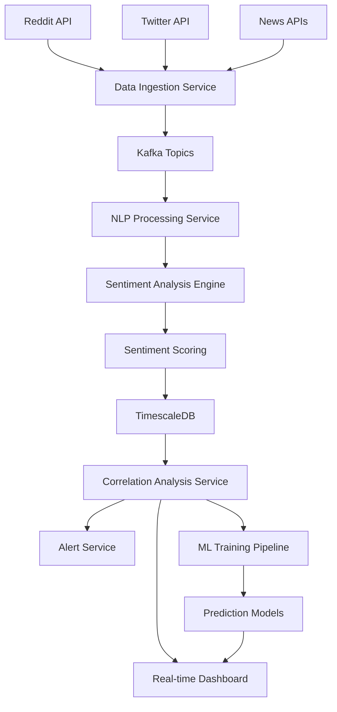

# 소셜 감성 분석 기능 통합 계획

## 1. 개요

본 문서는 주식 차트 분석 애플리케이션에 소셜 미디어 감성 분석 기능을 통합하기 위한 상세한 계획을 제시합니다. Reddit, Twitter 등 소셜 미디어 데이터를 수집하고 자연어 처리(NLP) 기술을 활용하여 주식 시장과 소셜 감성의 상관관계를 분석하는 시스템을 구축하는 것을 목표로 합니다.

## 2. 소셜 감성 분석 아키텍처

### 2.1 전체 시스템 아키텍처

```
┌─────────────────────────────────────────────────────────────┐
│                    Data Collection Layer                     │
│  ┌─────────────────┐  ┌─────────────────┐  ┌──────────────┐ │
│  │   Reddit API   │  │   Twitter API   │  │   News APIs  │ │
│  │   - Subreddits  │  │   - Search      │  │   - RSS      │ │
│  │   - Comments    │  │   - Timeline    │  │   - Articles │ │
│  │   - Posts       │  │   - Mentions    │  │   - Headlines│ │
│  └─────────────────┘  └─────────────────┘  └──────────────┘ │
└─────────────────────────────────────────────────────────────┘
                              │
┌─────────────────────────────────────────────────────────────┐
│                    Data Processing Layer                    │
│  ┌─────────────────┐  ┌─────────────────┐  ┌──────────────┐ │
│  │   Data Ingestion│  │   NLP Pipeline  │  │   Sentiment  │ │
│  │   - Kafka       │  │   - Tokenization│  │   Analysis   │ │
│  │   - Streams     │  │   - Cleaning    │  │   - Scoring  │ │
│  │   - Queue       │  │   - Entity Rec. │  │   - Classification│ │
│  └─────────────────┘  └─────────────────┘  └──────────────┘ │
└─────────────────────────────────────────────────────────────┘
                              │
┌─────────────────────────────────────────────────────────────┐
│                    Analysis & Storage Layer                 │
│  ┌─────────────────┐  ┌─────────────────┐  ┌──────────────┐ │
│  │   Time Series   │  │   Correlation   │  │   ML Models  │ │
│  │   Database      │  │   Engine        │  │   - Predict  │ │
│  │   - Sentiment   │  │   - Stock-Sent  │  │   - Classify │ │
│  │   - Volume      │  │   - Patterns    │  │   - Cluster  │ │
│  │   - Trends      │  │   - Anomalies   │  │   - Trend    │ │
│  └─────────────────┘  └─────────────────┘  └──────────────┘ │
└─────────────────────────────────────────────────────────────┘
                              │
┌─────────────────────────────────────────────────────────────┐
│                    Presentation Layer                       │
│  ┌─────────────────┐  ┌─────────────────┐  ┌──────────────┐ │
│  │   Dashboard     │  │   Alerts        │  │   Reports    │ │
│  │   - Charts      │  │   - Real-time   │  │   - Analysis │ │
│  │   - Metrics     │  │   - Threshold   │  │   - Insights │ │
│  │   - Trends      │  │   - Notifications│  │   - Export   │ │
│  └─────────────────┘  └─────────────────┘  └──────────────┘ │
└─────────────────────────────────────────────────────────────┘
```

### 2.2 데이터 흐름



## 3. 데이터 소스 및 수집 전략

### 3.1 Reddit 데이터 수집

#### 3.1.1 타겟 서브레딧 선정
```python
# data_collection/reddit_collector.py
import praw
from typing import List, Dict, Optional
import asyncio
from datetime import datetime, timedelta
import json

class RedditDataCollector:
    def __init__(self, client_id: str, client_secret: str, user_agent: str):
        self.reddit = praw.Reddit(
            client_id=client_id,
            client_secret=client_secret,
            user_agent=user_agent
        )
        
        # 주식 관련 서브레딧
        self.stock_subreddits = [
            'stocks',
            'investing',
            'wallstreetbets',
            'SecurityAnalysis',
            'ValueInvesting',
            'RobinHood',
            'pennystocks',
            'StockMarket'
        ]
        
        # 일반 금융 관련 서브레딧
        self.finance_subreddits = [
            'finance',
            'Economics',
            'FinancialPlanning',
            'personalfinance'
        ]
    
    async def collect_stock_mentions(
        self, 
        symbol: str, 
        limit: int = 100,
        time_filter: str = 'week'
    ) -> List[Dict]:
        """특정 주식 심볼에 대한 Reddit 언급 수집"""
        
        mentions = []
        
        # 검색 쿼리 생성
        search_queries = [
            f"${symbol}",
            f"{symbol} stock",
            f"buy {symbol}",
            f"sell {symbol}",
            f"{symbol} price"
        ]
        
        for query in search_queries:
            try:
                # 전체 검색
                submissions = self.reddit.subreddit("all").search(
                    query, 
                    sort="relevance", 
                    time_filter=time_filter,
                    limit=limit // len(search_queries)
                )
                
                for submission in submissions:
                    mention_data = await self._process_submission(submission, symbol)
                    if mention_data:
                        mentions.append(mention_data)
                
                # 댓글 수집
                await self._collect_comments(submission, symbol, mentions)
                
            except Exception as e:
                print(f"Error collecting Reddit data for {symbol}: {e}")
                continue
        
        return mentions
    
    async def _process_submission(self, submission, symbol: str) -> Optional[Dict]:
        """제출 데이터 처리"""
        try:
            # 텍스트 추출
            title = submission.title
            selftext = submission.selftext if hasattr(submission, 'selftext') else ""
            combined_text = f"{title} {selftext}"
            
            # 감성 분석을 위한 텍스트 전처리
            processed_text = self._preprocess_text(combined_text)
            
            return {
                'id': submission.id,
                'platform': 'reddit',
                'type': 'post',
                'symbol': symbol.upper(),
                'title': title,
                'content': selftext,
                'processed_text': processed_text,
                'author': str(submission.author) if submission.author else '[deleted]',
                'subreddit': str(submission.subreddit),
                'score': submission.score,
                'upvote_ratio': getattr(submission, 'upvote_ratio', 0),
                'num_comments': submission.num_comments,
                'created_at': datetime.fromtimestamp(submission.created_utc),
                'url': f"https://reddit.com{submission.permalink}",
                'is_original_content': getattr(submission, 'is_original_content', False)
            }
        except Exception as e:
            print(f"Error processing submission {submission.id}: {e}")
            return None
    
    async def _collect_comments(self, submission, symbol: str, mentions: List[Dict]):
        """댓글 수집"""
        try:
            submission.comments.replace_more(limit=0)
            
            for comment in submission.comments.list():
                if hasattr(comment, 'body') and symbol.lower() in comment.body.lower():
                    comment_data = {
                        'id': comment.id,
                        'platform': 'reddit',
                        'type': 'comment',
                        'symbol': symbol.upper(),
                        'title': '',
                        'content': comment.body,
                        'processed_text': self._preprocess_text(comment.body),
                        'author': str(comment.author) if comment.author else '[deleted]',
                        'subreddit': str(submission.subreddit),
                        'score': comment.score,
                        'upvote_ratio': 0,  # 댓글에는 없음
                        'num_comments': 0,
                        'created_at': datetime.fromtimestamp(comment.created_utc),
                        'url': f"https://reddit.com{comment.permalink}",
                        'is_original_content': False,
                        'parent_id': comment.parent_id
                    }
                    mentions.append(comment_data)
        except Exception as e:
            print(f"Error collecting comments for {submission.id}: {e}")
    
    def _preprocess_text(self, text: str) -> str:
        """텍스트 전처리"""
        import re
        
        # 소문자 변환
        text = text.lower()
        
        # URL 제거
        text = re.sub(r'http\S+', '', text)
        
        # 특수문자 제거
        text = re.sub(r'[^\w\s]', ' ', text)
        
        # 여러 공백을 단일 공백으로
        text = re.sub(r'\s+', ' ', text).strip()
        
        return text
    
    async def collect_trending_stocks(self, subreddit: str = 'wallstreetbets', limit: int = 50) -> List[Dict]:
        """트렌딩 주식 심볼 수집"""
        trending_symbols = {}
        
        try:
            subreddit_obj = self.reddit.subreddit(subreddit)
            hot_submissions = subreddit_obj.hot(limit=limit)
            
            for submission in hot_submissions:
                # 주식 심볼 패턴 찾기
                symbols = self._extract_stock_symbols(f"{submission.title} {submission.selftext}")
                
                for symbol in symbols:
                    if symbol not in trending_symbols:
                        trending_symbols[symbol] = {
                            'symbol': symbol,
                            'mentions': 0,
                            'total_score': 0,
                            'submissions': []
                        }
                    
                    trending_symbols[symbol]['mentions'] += 1
                    trending_symbols[symbol]['total_score'] += submission.score
                    trending_symbols[symbol]['submissions'].append({
                        'id': submission.id,
                        'title': submission.title,
                        'score': submission.score,
                        'url': f"https://reddit.com{submission.permalink}"
                    })
        
        except Exception as e:
            print(f"Error collecting trending stocks: {e}")
        
        # 언급 횟수로 정렬
        return sorted(trending_symbols.values(), key=lambda x: x['mentions'], reverse=True)
    
    def _extract_stock_symbols(self, text: str) -> List[str]:
        """텍스트에서 주식 심볼 추출"""
        import re
        
        # $심볼 패턴
        dollar_pattern = r'\$([A-Z]{1,5})'
        dollar_matches = re.findall(dollar_pattern, text)
        
        # 대문자 1-5자 패턴 (주식 심볼)
        caps_pattern = r'\b([A-Z]{1,5})\b'
        caps_matches = re.findall(caps_pattern, text)
        
        # 일반적인 단어 필터링
        common_words = {'A', 'I', 'CEO', 'CEO', 'CFO', 'CTO', 'USA', 'UK', 'EU', 'AI', 'ML', 'TV', 'PC', 'MAC', 'IPAD', 'IPHONE'}
        
        symbols = []
        for symbol in dollar_matches + caps_matches:
            if symbol not in common_words and len(symbol) >= 1:
                symbols.append(symbol)
        
        return list(set(symbols))  # 중복 제거
```

#### 3.1.2 Reddit 데이터 수집 스케줄러
```python
# data_collection/reddit_scheduler.py
import asyncio
from datetime import datetime, timedelta
from typing import List
import json
from reddit_collector import RedditDataCollector

class RedditScheduler:
    def __init__(self, collector: RedditDataCollector):
        self.collector = collector
        self.symbols_to_track = [
            'AAPL', 'MSFT', 'GOOGL', 'AMZN', 'TSLA', 'META', 'NVDA', 'JPM', 
            'JNJ', 'V', 'PG', 'UNH', 'HD', 'MA', 'BAC', 'XOM', 'CVX', 'LLY', 'ABBV'
        ]
    
    async def run_scheduled_collection(self):
        """예약된 데이터 수집 실행"""
        while True:
            try:
                current_time = datetime.utcnow()
                
                # 매시간 실행
                if current_time.minute == 0:
                    await self._hourly_collection()
                
                # 매일 실행 (오전 9시)
                if current_time.hour == 9 and current_time.minute == 0:
                    await self._daily_collection()
                
                # 5분마다 트렌딩 확인
                if current_time.minute % 5 == 0:
                    await self._trending_collection()
                
                # 1분 대기
                await asyncio.sleep(60)
                
            except Exception as e:
                print(f"Scheduler error: {e}")
                await asyncio.sleep(60)
    
    async def _hourly_collection(self):
        """시간별 데이터 수집"""
        print(f"Starting hourly collection at {datetime.utcnow()}")
        
        for symbol in self.symbols_to_track:
            try:
                mentions = await self.collector.collect_stock_mentions(
                    symbol, 
                    limit=50, 
                    time_filter='hour'
                )
                
                # 데이터 저장 또는 메시지 큐에 전송
                await self._save_mentions(mentions)
                
                print(f"Collected {len(mentions)} mentions for {symbol}")
                
            except Exception as e:
                print(f"Error collecting hourly data for {symbol}: {e}")
    
    async def _daily_collection(self):
        """일별 데이터 수집"""
        print(f"Starting daily collection at {datetime.utcnow()}")
        
        for symbol in self.symbols_to_track:
            try:
                mentions = await self.collector.collect_stock_mentions(
                    symbol, 
                    limit=200, 
                    time_filter='day'
                )
                
                await self._save_mentions(mentions)
                
                print(f"Collected {len(mentions)} daily mentions for {symbol}")
                
            except Exception as e:
                print(f"Error collecting daily data for {symbol}: {e}")
    
    async def _trending_collection(self):
        """트렌딩 주식 수집"""
        try:
            trending_stocks = await self.collector.collect_trending_stocks(
                subreddit='wallstreetbets', 
                limit=100
            )
            
            # 트렌딩 데이터 저장
            await self._save_trending_stocks(trending_stocks)
            
            print(f"Collected {len(trending_stocks)} trending stocks")
            
        except Exception as e:
            print(f"Error collecting trending stocks: {e}")
    
    async def _save_mentions(self, mentions: List[Dict]):
        """수집된 언급 데이터 저장"""
        # Kafka로 전송 또는 데이터베이스에 직접 저장
        for mention in mentions:
            # 여기에 데이터 저장 로직 추가
            pass
    
    async def _save_trending_stocks(self, trending_stocks: List[Dict]):
        """트렌딩 주식 데이터 저장"""
        # 여기에 트렌딩 데이터 저장 로직 추가
        pass
```

### 3.2 Twitter 데이터 수집

#### 3.2.1 Twitter API 통합
```python
# data_collection/twitter_collector.py
import tweepy
from typing import List, Dict, Optional
import asyncio
from datetime import datetime, timedelta
import json
import re

class TwitterDataCollector:
    def __init__(self, bearer_token: str):
        self.client = tweepy.Client(
            bearer_token=bearer_token,
            wait_on_rate_limit=True
        )
    
    async def collect_stock_mentions(
        self, 
        symbol: str, 
        limit: int = 100,
        hours_back: int = 24
    ) -> List[Dict]:
        """특정 주식 심볼에 대한 Twitter 언급 수집"""
        
        mentions = []
        
        # 검색 쿼리 생성
        search_queries = [
            f"${symbol}",
            f"{symbol} stock",
            f"buy {symbol}",
            f"sell {symbol}",
            f"{symbol} price",
            f"{symbol} shares"
        ]
        
        for query in search_queries:
            try:
                # 최근 트윗 검색
                tweets = tweepy.Paginator(
                    self.client.search_recent_tweets,
                    query=query,
                    tweet_fields=[
                        'created_at', 'author_id', 'public_metrics', 
                        'context_annotations', 'entities', 'geo'
                    ],
                    user_fields=['name', 'username', 'public_metrics'],
                    expansions=['author_id'],
                    max_results=min(100, limit // len(search_queries))
                ).flatten(limit=limit // len(search_queries))
                
                for tweet in tweets:
                    mention_data = await self._process_tweet(tweet, symbol)
                    if mention_data:
                        mentions.append(mention_data)
                
            except Exception as e:
                print(f"Error collecting Twitter data for {symbol}: {e}")
                continue
        
        return mentions
    
    async def _process_tweet(self, tweet, symbol: str) -> Optional[Dict]:
        """트윗 데이터 처리"""
        try:
            # 텍스트 추출
            text = tweet.text
            
            # 감성 분석을 위한 텍스트 전처리
            processed_text = self._preprocess_text(text)
            
            # 공개 메트릭
            metrics = tweet.public_metrics or {}
            
            return {
                'id': tweet.id,
                'platform': 'twitter',
                'type': 'tweet',
                'symbol': symbol.upper(),
                'title': '',
                'content': text,
                'processed_text': processed_text,
                'author_id': tweet.author_id,
                'author_name': '',  # includes에서 가져옴
                'author_username': '',  # includes에서 가져옴
                'retweet_count': metrics.get('retweet_count', 0),
                'like_count': metrics.get('like_count', 0),
                'reply_count': metrics.get('reply_count', 0),
                'quote_count': metrics.get('quote_count', 0),
                'created_at': tweet.created_at,
                'url': f"https://twitter.com/twitter/status/{tweet.id}",
                'lang': tweet.lang or 'unknown',
                'reply_to': tweet.in_reply_to_user_id
            }
        except Exception as e:
            print(f"Error processing tweet {tweet.id}: {e}")
            return None
    
    def _preprocess_text(self, text: str) -> str:
        """텍스트 전처리"""
        import re
        
        # 소문자 변환
        text = text.lower()
        
        # URL 제거
        text = re.sub(r'http\S+', '', text)
        
        # 멘션 및 해시태그 제거
        text = re.sub(r'@\w+', '', text)
        text = re.sub(r'#\w+', '', text)
        
        # 특수문자 제거
        text = re.sub(r'[^\w\s]', ' ', text)
        
        # 여러 공백을 단일 공백으로
        text = re.sub(r'\s+', ' ', text).strip()
        
        return text
    
    async def collect_trending_stocks(self, woeid: int = 1) -> List[Dict]:
        """트렌딩 주식 심볼 수집"""
        trending_symbols = {}
        
        try:
            # 트렌딩 토픽 가져오기
            trends = self.client.get_place_trends(woeid)
            
            if trends and len(trends) > 0:
                for trend in trends[0]['trends']:
                    # 주식 관련 트렌드 필터링
                    if self._is_stock_related_trend(trend['name']):
                        symbol = self._extract_symbol_from_trend(trend['name'])
                        if symbol:
                            if symbol not in trending_symbols:
                                trending_symbols[symbol] = {
                                    'symbol': symbol,
                                    'trend_name': trend['name'],
                                    'tweet_volume': trend.get('tweet_volume', 0),
                                    'url': trend.get('url', ''),
                                    'promoted_content': trend.get('promoted_content', False)
                                }
        
        except Exception as e:
            print(f"Error collecting trending stocks: {e}")
        
        return list(trending_symbols.values())
    
    def _is_stock_related_trend(self, trend_name: str) -> bool:
        """주식 관련 트렌드인지 확인"""
        stock_keywords = [
            'stock', 'shares', 'market', 'trading', 'invest', 'bull', 'bear',
            'nasdaq', 'dow', 'sp500', 'earnings', 'dividend', 'ipo'
        ]
        
        trend_lower = trend_name.lower()
        return any(keyword in trend_lower for keyword in stock_keywords)
    
    def _extract_symbol_from_trend(self, trend_name: str) -> Optional[str]:
        """트렌드 이름에서 주식 심볼 추출"""
        import re
        
        # $심볼 패턴
        dollar_pattern = r'\$([A-Z]{1,5})'
        match = re.search(dollar_pattern, trend_name)
        
        if match:
            return match.group(1)
        
        # 대문자 패턴
        caps_pattern = r'\b([A-Z]{1,5})\b'
        matches = re.findall(caps_pattern, trend_name)
        
        if matches:
            # 가장 긴 대문자 단어 반환
            return max(matches, key=len)
        
        return None
    
    async def collect_influencer_tweets(
        self, 
        symbol: str, 
        influencer_usernames: List[str],
        limit: int = 50
    ) -> List[Dict]:
        """영향력 있는 사용자의 트윗 수집"""
        
        mentions = []
        
        for username in influencer_usernames:
            try:
                # 사용자 정보 가져오기
                user = self.client.get_user(username=username)
                
                if not user:
                    continue
                
                # 사용자 타임라인에서 트윗 가져오기
                tweets = tweepy.Paginator(
                    self.client.get_users_tweets,
                    id=user.data.id,
                    tweet_fields=['created_at', 'public_metrics', 'context_annotations'],
                    max_results=min(100, limit)
                ).flatten(limit=limit)
                
                for tweet in tweets:
                    # 주식 심볼 언급 확인
                    if symbol.lower() in tweet.text.lower():
                        mention_data = await self._process_tweet(tweet, symbol)
                        if mention_data:
                            mention_data['is_influencer'] = True
                            mention_data['influencer_followers'] = user.data.public_metrics.get('followers_count', 0)
                            mention_data['influencer_verified'] = user.data.verified
                            mentions.append(mention_data)
                
            except Exception as e:
                print(f"Error collecting influencer tweets for {username}: {e}")
                continue
        
        return mentions
```

### 3.3 뉴스 데이터 수집

#### 3.3.1 뉴스 API 통합
```python
# data_collection/news_collector.py
import aiohttp
import asyncio
from typing import List, Dict, Optional
from datetime import datetime, timedelta
import json
import re

class NewsDataCollector:
    def __init__(self, news_api_key: str):
        self.news_api_key = news_api_key
        self.base_url = "https://newsapi.org/v2"
        
        # 금융 뉴스 소스
        self.financial_sources = [
            'bloomberg', 'reuters', 'cnbc', 'wsj', 'financial-times',
            'marketwatch', 'the-economist', 'fortune', 'forbes'
        ]
    
    async def collect_stock_news(
        self, 
        symbol: str, 
        company_name: str = None,
        days_back: int = 7
    ) -> List[Dict]:
        """특정 주식 관련 뉴스 수집"""
        
        news_articles = []
        
        # 검색 쿼리 생성
        search_queries = [
            f"{symbol} stock",
            f"{symbol} shares",
            f"{symbol} trading"
        ]
        
        if company_name:
            search_queries.extend([
                f"{company_name} stock",
                f"{company_name} earnings",
                f"{company_name} revenue"
            ])
        
        async with aiohttp.ClientSession() as session:
            for query in search_queries:
                try:
                    articles = await self._search_news(session, query, days_back)
                    
                    for article in articles:
                        article_data = await self._process_article(article, symbol)
                        if article_data:
                            news_articles.append(article_data)
                
                except Exception as e:
                    print(f"Error collecting news for {symbol}: {e}")
                    continue
        
        return news_articles
    
    async def _search_news(
        self, 
        session: aiohttp.ClientSession, 
        query: str, 
        days_back: int
    ) -> List[Dict]:
        """뉴스 검색"""
        
        from_date = (datetime.utcnow() - timedelta(days=days_back)).strftime('%Y-%m-%d')
        to_date = datetime.utcnow().strftime('%Y-%m-%d')
        
        params = {
            'q': query,
            'sources': ','.join(self.financial_sources),
            'from': from_date,
            'to': to_date,
            'sortBy': 'relevancy',
            'language': 'en',
            'apiKey': self.news_api_key,
            'pageSize': 100
        }
        
        url = f"{self.base_url}/everything"
        
        async with session.get(url, params=params) as response:
            if response.status == 200:
                data = await response.json()
                return data.get('articles', [])
            else:
                print(f"News API error: {response.status}")
                return []
    
    async def _process_article(self, article: Dict, symbol: str) -> Optional[Dict]:
        """뉴스 기사 처리"""
        try:
            title = article.get('title', '')
            description = article.get('description', '')
            content = article.get('content', '')
            
            # 전체 텍스트 결합
            full_text = f"{title} {description} {content}"
            
            # 감성 분석을 위한 텍스트 전처리
            processed_text = self._preprocess_text(full_text)
            
            return {
                'id': article.get('url', '').split('/')[-1],
                'platform': 'news',
                'type': 'article',
                'symbol': symbol.upper(),
                'title': title,
                'content': description + ' ' + content,
                'processed_text': processed_text,
                'source': article.get('source', {}).get('name', ''),
                'author': article.get('author', ''),
                'url': article.get('url', ''),
                'image_url': article.get('urlToImage', ''),
                'published_at': datetime.fromisoformat(
                    article.get('publishedAt', '').replace('Z', '+00:00')
                ) if article.get('publishedAt') else None,
                'relevance_score': self._calculate_relevance(full_text, symbol)
            }
        except Exception as e:
            print(f"Error processing article: {e}")
            return None
    
    def _preprocess_text(self, text: str) -> str:
        """텍스트 전처리"""
        import re
        
        # 소문자 변환
        text = text.lower()
        
        # URL 제거
        text = re.sub(r'http\S+', '', text)
        
        # 특수문자 제거
        text = re.sub(r'[^\w\s]', ' ', text)
        
        # 여러 공백을 단일 공백으로
        text = re.sub(r'\s+', ' ', text).strip()
        
        return text
    
    def _calculate_relevance(self, text: str, symbol: str) -> float:
        """텍스트와 심볼의 관련성 계산"""
        symbol_lower = symbol.lower()
        text_lower = text.lower()
        
        # 심볼 언급 횟수
        symbol_mentions = text_lower.count(symbol_lower)
        
        # 주식 관련 키워드
        stock_keywords = [
            'stock', 'shares', 'trading', 'invest', 'market', 'price',
            'earnings', 'revenue', 'profit', 'loss', 'dividend', 'ipo'
        ]
        
        keyword_count = sum(text_lower.count(keyword) for keyword in stock_keywords)
        
        # 관련성 점수 계산 (0-1 사이)
        text_length = len(text.split())
        if text_length == 0:
            return 0.0
        
        relevance = (symbol_mentions * 0.7 + keyword_count * 0.3) / text_length
        return min(relevance, 1.0)
    
    async def collect_market_news(self, category: str = 'business') -> List[Dict]:
        """시장 전반 뉴스 수집"""
        
        async with aiohttp.ClientSession() as session:
            params = {
                'country': 'us',
                'category': category,
                'sources': ','.join(self.financial_sources),
                'apiKey': self.news_api_key,
                'pageSize': 100
            }
            
            url = f"{self.base_url}/top-headlines"
            
            async with session.get(url, params=params) as response:
                if response.status == 200:
                    data = await response.json()
                    articles = data.get('articles', [])
                    
                    market_news = []
                    for article in articles:
                        article_data = await self._process_market_article(article)
                        if article_data:
                            market_news.append(article_data)
                    
                    return market_news
                else:
                    print(f"Market news API error: {response.status}")
                    return []
    
    async def _process_market_article(self, article: Dict) -> Optional[Dict]:
        """시장 뉴스 기사 처리"""
        try:
            title = article.get('title', '')
            description = article.get('description', '')
            
            # 주식 심볼 추출
            symbols = self._extract_symbols_from_text(f"{title} {description}")
            
            return {
                'id': article.get('url', '').split('/')[-1],
                'platform': 'news',
                'type': 'market_article',
                'symbols': symbols,
                'title': title,
                'content': description,
                'source': article.get('source', {}).get('name', ''),
                'author': article.get('author', ''),
                'url': article.get('url', ''),
                'image_url': article.get('urlToImage', ''),
                'published_at': datetime.fromisoformat(
                    article.get('publishedAt', '').replace('Z', '+00:00')
                ) if article.get('publishedAt') else None,
                'market_sentiment_impact': self._assess_market_impact(title, description)
            }
        except Exception as e:
            print(f"Error processing market article: {e}")
            return None
    
    def _extract_symbols_from_text(self, text: str) -> List[str]:
        """텍스트에서 주식 심볼 추출"""
        import re
        
        # $심볼 패턴
        dollar_pattern = r'\$([A-Z]{1,5})'
        dollar_matches = re.findall(dollar_pattern, text)
        
        # 대문자 1-5자 패턴
        caps_pattern = r'\b([A-Z]{1,5})\b'
        caps_matches = re.findall(caps_pattern, text)
        
        # 일반적인 단어 필터링
        common_words = {'A', 'I', 'CEO', 'CFO', 'CTO', 'USA', 'UK', 'EU', 'AI', 'ML', 'TV', 'PC'}
        
        symbols = []
        for symbol in dollar_matches + caps_matches:
            if symbol not in common_words and len(symbol) >= 1:
                symbols.append(symbol)
        
        return list(set(symbols))
    
    def _assess_market_impact(self, title: str, description: str) -> str:
        """시장 영향 평가"""
        text = f"{title} {description}".lower()
        
        # 고영향 키워드
        high_impact_keywords = [
            'crash', 'surge', 'plunge', 'spike', 'rally', 'collapse',
            'bankruptcy', 'merger', 'acquisition', 'fda approval', 'earnings beat'
        ]
        
        # 중간 영향 키워드
        medium_impact_keywords = [
            'earnings', 'revenue', 'profit', 'loss', 'dividend', 'stock split',
            'guidance', 'forecast', 'analyst', 'upgrade', 'downgrade'
        ]
        
        if any(keyword in text for keyword in high_impact_keywords):
            return 'high'
        elif any(keyword in text for keyword in medium_impact_keywords):
            return 'medium'
        else:
            return 'low'
```

## 4. NLP 및 감성 분석 엔진

### 4.1 텍스트 전처리 파이프라인
```python
# nlp/text_preprocessor.py
import re
import nltk
from nltk.corpus import stopwords
from nltk.tokenize import word_tokenize, sent_tokenize
from nltk.stem import WordNetLemmatizer
from nltk.tag import pos_tag
import spacy
from typing import List, Dict, Tuple
import asyncio

class TextPreprocessor:
    def __init__(self):
        # NLTK 리소스 다운로드 (최초 실행 시)
        try:
            nltk.data.find('tokenizers/punkt')
        except LookupError:
            nltk.download('punkt')
        
        try:
            nltk.data.find('corpora/stopwords')
        except LookupError:
            nltk.download('stopwords')
        
        try:
            nltk.data.find('corpora/wordnet')
        except LookupError:
            nltk.download('wordnet')
        
        try:
            nltk.data.find('taggers/averaged_perceptron_tagger')
        except LookupError:
            nltk.download('averaged_perceptron_tagger')
        
        # spaCy 모델 로드
        self.nlp = spacy.load('en_core_web_sm')
        
        # 불용어 세트
        self.stop_words = set(stopwords.words('english'))
        
        # 금융 특화 불용어 추가
        financial_stopwords = {
            'stock', 'share', 'trade', 'trading', 'market', 'price', 'invest',
            'investment', 'investor', 'portfolio', 'bull', 'bear', 'buy', 'sell',
            'hold', 'long', 'short', 'call', 'put', 'option', 'future', 'etf'
        }
        self.stop_words.update(financial_stopwords)
        
        # 표제어화기
        self.lemmatizer = WordNetLemmatizer()
    
    async def preprocess_text(self, text: str, symbol: str = None) -> Dict:
        """텍스트 전처리 파이프라인"""
        
        # 1. 기본 정제
        cleaned_text = self._basic_cleaning(text)
        
        # 2. 토큰화
        tokens = word_tokenize(cleaned_text)
        
        # 3. 품사 태깅
        pos_tags = pos_tag(tokens)
        
        # 4. 불용어 제거 및 표제어화
        filtered_tokens = []
        for token, pos in pos_tags:
            if self._is_valid_token(token, pos):
                lemmatized = self.lemmatizer.lemmatize(token, pos=self._get_wordnet_pos(pos))
                filtered_tokens.append(lemmatized)
        
        # 5. spaCy 처리 (개체명 인식 등)
        doc = self.nlp(cleaned_text)
        
        # 6. 금융 엔티티 추출
        financial_entities = self._extract_financial_entities(doc, symbol)
        
        # 7. 감성 관련 키워드 추출
        sentiment_keywords = self._extract_sentiment_keywords(filtered_tokens)
        
        return {
            'original_text': text,
            'cleaned_text': cleaned_text,
            'tokens': tokens,
            'filtered_tokens': filtered_tokens,
            'pos_tags': pos_tags,
            'entities': [(ent.text, ent.label_) for ent in doc.ents],
            'financial_entities': financial_entities,
            'sentiment_keywords': sentiment_keywords,
            'sentence_count': len(sent_tokenize(text)),
            'word_count': len(tokens),
            'filtered_word_count': len(filtered_tokens)
        }
    
    def _basic_cleaning(self, text: str) -> str:
        """기본 텍스트 정제"""
        # 소문자 변환
        text = text.lower()
        
        # URL 제거
        text = re.sub(r'http\S+|www\S+|https\S+', '', text, flags=re.MULTILINE)
        
        # 이메일 제거
        text = re.sub(r'\S+@\S+', '', text)
        
        # 멘션 및 해시태그 제거
        text = re.sub(r'@\w+|#\w+', '', text)
        
        # 숫자 제거 (금액 등은 별도 처리)
        text = re.sub(r'\b\d+(?:\.\d+)?\b', '', text)
        
        # 특수문자 제거 (앰퍼샌드 등 금융 관련 기호는 보존)
        text = re.sub(r'[^\w\s&$%]', ' ', text)
        
        # 여러 공백을 단일 공백으로
        text = re.sub(r'\s+', ' ', text).strip()
        
        return text
    
    def _is_valid_token(self, token: str, pos: str) -> bool:
        """유효한 토큰인지 확인"""
        # 불용어 확인
        if token.lower() in self.stop_words:
            return False
        
        # 너무 짧은 토큰 제외
        if len(token) < 2:
            return False
        
        # 의미 있는 품사만 유지
        valid_pos = {'NN', 'NNS', 'NNP', 'NNPS', 'VB', 'VBD', 'VBG', 'VBN', 'VBP', 'VBZ', 'JJ', 'JJR', 'JJS', 'RB', 'RBR', 'RBS'}
        if pos not in valid_pos:
            return False
        
        return True
    
    def _get_wordnet_pos(self, treebank_tag: str) -> str:
        """Treebank 품사 태그를 WordNet 품사 태그로 변환"""
        if treebank_tag.startswith('J'):
            return 'a'  # 형용사
        elif treebank_tag.startswith('V'):
            return 'v'  # 동사
        elif treebank_tag.startswith('N'):
            return 'n'  # 명사
        elif treebank_tag.startswith('R'):
            return 'r'  # 부사
        else:
            return 'n'  # 기본값: 명사
    
    def _extract_financial_entities(self, doc, symbol: str = None) -> List[Dict]:
        """금융 관련 엔티티 추출"""
        financial_entities = []
        
        # 금융 관련 엔티티 패턴
        financial_patterns = [
            # 금액 패턴
            (r'\$[\d,]+(?:\.\d+)?', 'MONEY'),
            (r'\d+(?:\.\d+)?\s*(?:million|billion|trillion)', 'MONEY'),
            
            # 퍼센트 패턴
            (r'\d+(?:\.\d+)?%', 'PERCENTAGE'),
            
            # 주식 관련 패턴
            (r'\b[A-Z]{1,5}\b', 'STOCK_SYMBOL'),
            
            # 시간 패턴
            (r'\b(?:Q[1-4]|FY\d{4}|H[1-2])\b', 'TIME_PERIOD'),
        ]
        
        text = doc.text
        
        for pattern, entity_type in financial_patterns:
            matches = re.finditer(pattern, text, re.IGNORECASE)
            for match in matches:
                entity_text = match.group()
                
                # 주식 심볼 필터링
                if entity_type == 'STOCK_SYMBOL':
                    if symbol and entity_text.upper() != symbol.upper():
                        continue
                
                financial_entities.append({
                    'text': entity_text,
                    'type': entity_type,
                    'start': match.start(),
                    'end': match.end()
                })
        
        return financial_entities
    
    def _extract_sentiment_keywords(self, tokens: List[str]) -> List[str]:
        """감성 분석에 중요한 키워드 추출"""
        # 긍정/부정 감성 키워드 사전
        positive_keywords = {
            'good', 'great', 'excellent', 'amazing', 'fantastic', 'wonderful',
            'positive', 'bullish', 'up', 'rise', 'gain', 'profit', 'growth',
            'strong', 'solid', 'robust', 'promising', 'optimistic', 'buy'
        }
        
        negative_keywords = {
            'bad', 'terrible', 'awful', 'horrible', 'disappointing', 'negative',
            'bearish', 'down', 'fall', 'drop', 'loss', 'decline', 'weak',
            'poor', 'concerning', 'worry', 'risk', 'danger', 'sell'
        }
        
        sentiment_keywords = []
        
        for token in tokens:
            if token in positive_keywords:
                sentiment_keywords.append((token, 'positive'))
            elif token in negative_keywords:
                sentiment_keywords.append((token, 'negative'))
        
        return sentiment_keywords
    
    async def batch_preprocess(self, texts: List[str], symbols: List[str] = None) -> List[Dict]:
        """배치 텍스트 전처리"""
        if symbols is None:
            symbols = [None] * len(texts)
        
        tasks = []
        for text, symbol in zip(texts, symbols):
            task = self.preprocess_text(text, symbol)
            tasks.append(task)
        
        results = await asyncio.gather(*tasks)
        return results
```

### 4.2 고급 감성 분석 엔진
```python
# nlp/sentiment_analyzer.py
import numpy as np
import pandas as pd
from textblob import TextBlob
from vaderSentiment.vaderSentiment import SentimentIntensityAnalyzer
import transformers
from transformers import pipeline, AutoTokenizer, AutoModelForSequenceClassification
import torch
from typing import Dict, List, Tuple, Optional
import asyncio
from datetime import datetime

class SentimentAnalyzer:
    def __init__(self):
        # VADER 초기화
        self.vader = SentimentIntensityAnalyzer()
        
        # FinancialBERT 모델 로드 (금융 텍스트 특화)
        self.finbert_tokenizer = None
        self.finbert_model = None
        self.finbert_pipeline = None
        
        # 일반 BERT 모델 로드
        self.bert_pipeline = pipeline(
            "sentiment-analysis",
            model="nlptown/bert-base-multilingual-uncased-sentiment"
        )
        
        # 감성 키워드 가중치 사전
        self.sentiment_weights = self._load_sentiment_weights()
        
        # 금융 특화 감성 사전
        self.financial_sentiment_lexicon = self._load_financial_sentiment_lexicon()
    
    def _load_sentiment_weights(self) -> Dict[str, float]:
        """감성 키워드 가중치 로드"""
        return {
            # 강한 긍정
            'excellent': 0.9, 'amazing': 0.9, 'fantastic': 0.9, 'outstanding': 0.9,
            'bullish': 0.8, 'strong': 0.7, 'solid': 0.7, 'robust': 0.7,
            
            # 중간 긍정
            'good': 0.5, 'great': 0.6, 'positive': 0.5, 'up': 0.4,
            'growth': 0.5, 'gain': 0.5, 'profit': 0.5, 'buy': 0.4,
            
            # 중립
            'neutral': 0.0, 'stable': 0.1, 'steady': 0.1,
            
            # 중간 부정
            'bad': -0.5, 'poor': -0.5, 'negative': -0.5, 'down': -0.4,
            'decline': -0.5, 'loss': -0.5, 'weak': -0.4, 'sell': -0.4,
            
            # 강한 부정
            'terrible': -0.9, 'awful': -0.9, 'horrible': -0.9, 'disappointing': -0.7,
            'bearish': -0.8, 'crash': -0.9, 'plunge': -0.9, 'collapse': -0.9
        }
    
    def _load_financial_sentiment_lexicon(self) -> Dict[str, float]:
        """금융 특화 감성 사전 로드"""
        return {
            # 금융 용어
            'earnings': 0.3, 'revenue': 0.2, 'profit': 0.4, 'dividend': 0.3,
            'merger': 0.2, 'acquisition': 0.2, 'expansion': 0.3, 'innovation': 0.4,
            
            'debt': -0.3, 'bankruptcy': -0.9, 'layoff': -0.7, 'cut': -0.4,
            'downgrade': -0.6, 'delisting': -0.8, 'scandal': -0.9,
            
            # 시장 용어
            'rally': 0.6, 'surge': 0.7, 'spike': 0.5, 'boom': 0.6,
            'slump': -0.6, 'crisis': -0.8, 'recession': -0.7, 'inflation': -0.4,
            
            # 분석 용어
            'upgrade': 0.5, 'outperform': 0.6, 'buy': 0.4, 'hold': 0.1,
            'underperform': -0.5, 'sell': -0.4, 'downgrade': -0.6
        }
    
    async def analyze_sentiment(
        self, 
        text: str, 
        symbol: str = None,
        use_finbert: bool = False
    ) -> Dict:
        """종합 감성 분석"""
        
        # 1. TextBlob 분석
        textblob_result = self._analyze_with_textblob(text)
        
        # 2. VADER 분석
        vader_result = self._analyze_with_vader(text)
        
        # 3. BERT 분석
        bert_result = await self._analyze_with_bert(text)
        
        # 4. FinancialBERT 분석 (옵션)
        finbert_result = None
        if use_finbert:
            finbert_result = await self._analyze_with_finbert(text)
        
        # 5. 키워드 기반 분석
        keyword_result = self._analyze_with_keywords(text)
        
        # 6. 금융 특화 분석
        financial_result = self._analyze_financial_sentiment(text)
        
        # 7. 앙상블 결과 계산
        ensemble_result = self._ensemble_sentiment(
            textblob_result, vader_result, bert_result, 
            finbert_result, keyword_result, financial_result
        )
        
        # 8. 신뢰도 계산
        confidence = self._calculate_confidence(
            text, ensemble_result, textblob_result, vader_result, bert_result
        )
        
        return {
            'text': text,
            'symbol': symbol,
            'timestamp': datetime.utcnow(),
            'sentiment_score': ensemble_result['score'],
            'sentiment_label': ensemble_result['label'],
            'confidence': confidence,
            'detailed_scores': {
                'textblob': textblob_result,
                'vader': vader_result,
                'bert': bert_result,
                'finbert': finbert_result,
                'keywords': keyword_result,
                'financial': financial_result
            },
            'ensemble_weights': ensemble_result['weights']
        }
    
    def _analyze_with_textblob(self, text: str) -> Dict:
        """TextBlob을 사용한 감성 분석"""
        blob = TextBlob(text)
        polarity = blob.sentiment.polarity
        subjectivity = blob.sentiment.subjectivity
        
        # -1에서 1 사이의 점수를 0-1로 변환
        normalized_score = (polarity + 1) / 2
        
        return {
            'score': polarity,
            'normalized_score': normalized_score,
            'subjectivity': subjectivity,
            'label': self._get_sentiment_label(polarity)
        }
    
    def _analyze_with_vader(self, text: str) -> Dict:
        """VADER를 사용한 감성 분석"""
        scores = self.vader.polarity_scores(text)
        
        return {
            'compound': scores['compound'],
            'positive': scores['pos'],
            'negative': scores['neg'],
            'neutral': scores['neu'],
            'score': scores['compound'],
            'label': self._get_sentiment_label(scores['compound'])
        }
    
    async def _analyze_with_bert(self, text: str) -> Dict:
        """BERT를 사용한 감성 분석"""
        try:
            result = self.bert_pipeline(text)[0]
            
            # 레이블을 점수로 변환
            if result['label'] == 'POSITIVE':
                score = result['score']
            elif result['label'] == 'NEGATIVE':
                score = -result['score']
            else:  # NEUTRAL
                score = 0
            
            return {
                'score': score,
                'confidence': result['score'],
                'label': result['label'],
                'raw_result': result
            }
        except Exception as e:
            print(f"BERT analysis error: {e}")
            return {
                'score': 0.0,
                'confidence': 0.0,
                'label': 'NEUTRAL',
                'error': str(e)
            }
    
    async def _analyze_with_finbert(self, text: str) -> Dict:
        """FinancialBERT를 사용한 감성 분석"""
        try:
            # FinancialBERT 모델 로드 (지연 로딩)
            if self.finbert_pipeline is None:
                self.finbert_pipeline = pipeline(
                    "sentiment-analysis",
                    model="yiyanghkust/finbert-tone",
                    tokenizer="yiyanghkust/finbert-tone"
                )
            
            result = self.finbert_pipeline(text)[0]
            
            # 레이블을 점수로 변환
            if result['label'] == 'Positive':
                score = result['score']
            elif result['label'] == 'Negative':
                score = -result['score']
            else:  # Neutral
                score = 0
            
            return {
                'score': score,
                'confidence': result['score'],
                'label': result['label'],
                'raw_result': result
            }
        except Exception as e:
            print(f"FinancialBERT analysis error: {e}")
            return {
                'score': 0.0,
                'confidence': 0.0,
                'label': 'NEUTRAL',
                'error': str(e)
            }
    
    def _analyze_with_keywords(self, text: str) -> Dict:
        """키워드 기반 감성 분석"""
        words = text.lower().split()
        
        total_score = 0
        matched_keywords = []
        
        for word in words:
            if word in self.sentiment_weights:
                weight = self.sentiment_weights[word]
                total_score += weight
                matched_keywords.append((word, weight))
        
        # 정규화
        if len(words) > 0:
            normalized_score = total_score / len(words)
        else:
            normalized_score = 0
        
        return {
            'score': normalized_score,
            'total_weight': total_score,
            'matched_keywords': matched_keywords,
            'label': self._get_sentiment_label(normalized_score)
        }
    
    def _analyze_financial_sentiment(self, text: str) -> Dict:
        """금융 특화 감성 분석"""
        words = text.lower().split()
        
        total_score = 0
        matched_keywords = []
        
        for word in words:
            if word in self.financial_sentiment_lexicon:
                weight = self.financial_sentiment_lexicon[word]
                total_score += weight
                matched_keywords.append((word, weight))
        
        # 정규화
        if len(words) > 0:
            normalized_score = total_score / len(words)
        else:
            normalized_score = 0
        
        return {
            'score': normalized_score,
            'total_weight': total_score,
            'matched_keywords': matched_keywords,
            'label': self._get_sentiment_label(normalized_score)
        }
    
    def _ensemble_sentiment(
        self, 
        textblob_result: Dict, 
        vader_result: Dict, 
        bert_result: Dict,
        finbert_result: Optional[Dict],
        keyword_result: Dict, 
        financial_result: Dict
    ) -> Dict:
        """앙상블 감성 분석"""
        
        # 가중치 설정 (FinancialBERT가 있으면 더 높은 가중치)
        if finbert_result and 'error' not in finbert_result:
            weights = {
                'textblob': 0.15,
                'vader': 0.20,
                'bert': 0.20,
                'finbert': 0.30,
                'keywords': 0.10,
                'financial': 0.05
            }
        else:
            weights = {
                'textblob': 0.20,
                'vader': 0.25,
                'bert': 0.30,
                'keywords': 0.15,
                'financial': 0.10
            }
        
        # 가중 평균 계산
        ensemble_score = (
            textblob_result['score'] * weights['textblob'] +
            vader_result['score'] * weights['vader'] +
            bert_result['score'] * weights['bert'] +
            (finbert_result['score'] if finbert_result and 'error' not in finbert_result else 0) * weights.get('finbert', 0) +
            keyword_result['score'] * weights['keywords'] +
            financial_result['score'] * weights['financial']
        )
        
        return {
            'score': ensemble_score,
            'label': self._get_sentiment_label(ensemble_score),
            'weights': weights
        }
    
    def _get_sentiment_label(self, score: float) -> str:
        """감성 점수를 레이블로 변환"""
        if score > 0.1:
            return 'positive'
        elif score < -0.1:
            return 'negative'
        else:
            return 'neutral'
    
    def _calculate_confidence(
        self, 
        text: str, 
        ensemble_result: Dict,
        textblob_result: Dict, 
        vader_result: Dict, 
        bert_result: Dict
    ) -> float:
        """신뢰도 계산"""
        
        # 텍스트 길이 기반 신뢰도
        text_length = len(text.split())
        length_confidence = min(text_length / 20, 1.0)  # 20단어 이상이면 최대 신뢰도
        
        # 모델 간 일치도 기반 신뢰도
        scores = [
            textblob_result['score'],
            vader_result['score'],
            bert_result['score']
        ]
        
        # 표준편차 계산 (작을수록 일치도 높음)
        score_std = np.std(scores)
        agreement_confidence = max(0, 1 - score_std)
        
        # 종합 신뢰도
        overall_confidence = (length_confidence * 0.4) + (agreement_confidence * 0.6)
        
        return min(overall_confidence, 1.0)
    
    async def batch_analyze(
        self, 
        texts: List[str], 
        symbols: List[str] = None,
        use_finbert: bool = False
    ) -> List[Dict]:
        """배치 감성 분석"""
        if symbols is None:
            symbols = [None] * len(texts)
        
        tasks = []
        for text, symbol in zip(texts, symbols):
            task = self.analyze_sentiment(text, symbol, use_finbert)
            tasks.append(task)
        
        results = await asyncio.gather(*tasks)
        return results
```

## 5. 상관관계 분석 및 예측 모델

### 5.1 주식-감성 상관관계 분석
```python
# analysis/correlation_analyzer.py
import numpy as np
import pandas as pd
from scipy import stats
from sklearn.preprocessing import StandardScaler
from sklearn.decomposition import PCA
from sklearn.cluster import KMeans
import asyncio
from datetime import datetime, timedelta
from typing import Dict, List, Tuple, Optional
import statsmodels.api as sm
from statsmodels.tsa.stattools import coint, adfuller
from statsmodels.tsa.arima.model import ARIMA

class CorrelationAnalyzer:
    def __init__(self):
        self.scaler = StandardScaler()
        self.pca = PCA(n_components=0.95)  # 95% 분산 설명
        
    async def analyze_stock_sentiment_correlation(
        self, 
        stock_data: pd.DataFrame, 
        sentiment_data: pd.DataFrame,
        symbol: str,
        lookback_days: int = 30
    ) -> Dict:
        """주식-감성 상관관계 분석"""
        
        # 데이터 정렬 및 병합
        merged_data = self._prepare_correlation_data(stock_data, sentiment_data, lookback_days)
        
        if merged_data.empty:
            return {'error': 'Insufficient data for correlation analysis'}
        
        # 1. 기본 상관관계 분석
        basic_correlation = self._calculate_basic_correlation(merged_data)
        
        # 2. 시차 상관관계 분석
        lag_correlation = self._calculate_lag_correlation(merged_data)
        
        # 3. 공적분 분석
        cointegration_result = self._analyze_cointegration(merged_data)
        
        # 4. 인과관계 분석 (Granger 인과관계)
        causality_result = self._analyze_granger_causality(merged_data)
        
        # 5. 변동성 상관관계
        volatility_correlation = self._analyze_volatility_correlation(merged_data)
        
        # 6. 볼린저 밴드와 감성의 관계
        bollinger_analysis = self._analyze_bollinger_sentiment(merged_data)
        
        return {
            'symbol': symbol,
            'analysis_period': f"{lookback_days} days",
            'data_points': len(merged_data),
            'basic_correlation': basic_correlation,
            'lag_correlation': lag_correlation,
            'cointegration': cointegration_result,
            'granger_causality': causality_result,
            'volatility_correlation': volatility_correlation,
            'bollinger_analysis': bollinger_analysis,
            'analysis_timestamp': datetime.utcnow()
        }
    
    def _prepare_correlation_data(
        self, 
        stock_data: pd.DataFrame, 
        sentiment_data: pd.DataFrame,
        lookback_days: int
    ) -> pd.DataFrame:
        """상관관계 분석을 위한 데이터 준비"""
        
        # 날짜 필터링
        cutoff_date = datetime.utcnow() - timedelta(days=lookback_days)
        
        stock_filtered = stock_data[stock_data['timestamp'] >= cutoff_date].copy()
        sentiment_filtered = sentiment_data[sentiment_data['timestamp'] >= cutoff_date].copy()
        
        if stock_filtered.empty or sentiment_filtered.empty:
            return pd.DataFrame()
        
        # 일별 데이터로 집계
        stock_daily = stock_filtered.groupby(stock_filtered['timestamp'].dt.date).agg({
            'close': 'last',
            'volume': 'sum',
            'high': 'max',
            'low': 'min'
        }).reset_index()
        stock_daily['timestamp'] = pd.to_datetime(stock_daily['index'])
        
        # 일별 감성 데이터 집계
        sentiment_daily = sentiment_filtered.groupby(sentiment_filtered['timestamp'].dt.date).agg({
            'sentiment_score': 'mean',
            'confidence': 'mean',
            'mention_count': 'sum'
        }).reset_index()
        sentiment_daily['timestamp'] = pd.to_datetime(sentiment_daily['index'])
        
        # 주식 데이터에 기술적 지표 추가
        stock_daily = self._add_technical_indicators(stock_daily)
        
        # 데이터 병합
        merged = pd.merge(
            stock_daily,
            sentiment_daily,
            on='timestamp',
            how='inner'
        )
        
        # 수익률 계산
        merged['returns'] = merged['close'].pct_change()
        merged['log_returns'] = np.log(merged['close'] / merged['close'].shift(1))
        
        return merged.dropna()
    
    def _add_technical_indicators(self, df: pd.DataFrame) -> pd.DataFrame:
        """기술적 지표 추가"""
        # 이동평균
        df['ma_5'] = df['close'].rolling(window=5).mean()
        df['ma_10'] = df['close'].rolling(window=10).mean()
        df['ma_20'] = df['close'].rolling(window=20).mean()
        
        # RSI
        delta = df['close'].diff()
        gain = (delta.where(delta > 0, 0)).rolling(window=14).mean()
        loss = (-delta.where(delta < 0, 0)).rolling(window=14).mean()
        rs = gain / loss
        df['rsi'] = 100 - (100 / (1 + rs))
        
        # 볼린저 밴드
        df['bb_middle'] = df['close'].rolling(window=20).mean()
        bb_std = df['close'].rolling(window=20).std()
        df['bb_upper'] = df['bb_middle'] + (bb_std * 2)
        df['bb_lower'] = df['bb_middle'] - (bb_std * 2)
        df['bb_position'] = (df['close'] - df['bb_lower']) / (df['bb_upper'] - df['bb_lower'])
        
        return df
    
    def _calculate_basic_correlation(self, df: pd.DataFrame) -> Dict:
        """기본 상관관계 계산"""
        
        correlations = {}
        
        # 수익률과 감성 점수 상관관계
        corr_returns_sentiment = df['returns'].corr(df['sentiment_score'])
        p_value_returns_sentiment = stats.pearsonr(df['returns'], df['sentiment_score'])[1]
        
        correlations['returns_sentiment'] = {
            'correlation': corr_returns_sentiment,
            'p_value': p_value_returns_sentiment,
            'significance': 'significant' if p_value_returns_sentiment < 0.05 else 'not_significant'
        }
        
        # 가격 변화와 감성 점수 상관관계
        corr_price_sentiment = df['close'].corr(df['sentiment_score'])
        p_value_price_sentiment = stats.pearsonr(df['close'], df['sentiment_score'])[1]
        
        correlations['price_sentiment'] = {
            'correlation': corr_price_sentiment,
            'p_value': p_value_price_sentiment,
            'significance': 'significant' if p_value_price_sentiment < 0.05 else 'not_significant'
        }
        
        # 거래량과 감성 언급량 상관관계
        corr_volume_mentions = df['volume'].corr(df['mention_count'])
        p_value_volume_mentions = stats.pearsonr(df['volume'], df['mention_count'])[1]
        
        correlations['volume_mentions'] = {
            'correlation': corr_volume_mentions,
            'p_value': p_value_volume_mentions,
            'significance': 'significant' if p_value_volume_mentions < 0.05 else 'not_significant'
        }
        
        # 변동성과 감성 상관관계
        volatility = df['returns'].rolling(window=5).std()
        corr_volatility_sentiment = volatility.corr(df['sentiment_score'])
        
        correlations['volatility_sentiment'] = {
            'correlation': corr_volatility_sentiment,
            'p_value': None,  # 표본 수 부족으로 p-value 계산 생략
            'significance': 'unknown'
        }
        
        return correlations
    
    def _calculate_lag_correlation(self, df: pd.DataFrame, max_lag: int = 5) -> Dict:
        """시차 상관관계 분석"""
        
        lag_correlations = {}
        
        for lag in range(1, max_lag + 1):
            # 감성이 주식 수익률에 미치는 영향 (lagged sentiment)
            lagged_sentiment = df['sentiment_score'].shift(lag)
            corr = df['returns'].corr(lagged_sentiment)
            
            if not np.isnan(corr):
                lag_correlations[f'sentiment_leads_returns_lag_{lag}'] = {
                    'lag': lag,
                    'correlation': corr,
                    'direction': 'sentiment -> returns'
                }
            
            # 주식 수익률이 감성에 미치는 영향 (lagged returns)
            lagged_returns = df['returns'].shift(lag)
            corr = df['sentiment_score'].corr(lagged_returns)
            
            if not np.isnan(corr):
                lag_correlations[f'returns_leads_sentiment_lag_{lag}'] = {
                    'lag': lag,
                    'correlation': corr,
                    'direction': 'returns -> sentiment'
                }
        
        # 최적 시차 찾기
        best_lag = None
        best_correlation = 0
        
        for key, value in lag_correlations.items():
            if value['direction'] == 'sentiment -> returns' and abs(value['correlation']) > abs(best_correlation):
                best_correlation = value['correlation']
                best_lag = value['lag']
        
        return {
            'lag_correlations': lag_correlations,
            'best_lag': best_lag,
            'best_correlation': best_correlation
        }
    
    def _analyze_cointegration(self, df: pd.DataFrame) -> Dict:
        """공적분 분석"""
        
        try:
            # 시계열 정상성 검정
            stock_adf = adfuller(df['close'])
            sentiment_adf = adfuller(df['sentiment_score'])
            
            stock_stationary = stock_adf[1] < 0.05
            sentiment_stationary = sentiment_adf[1] < 0.05
            
            # 공적분 검정
            coint_score, coint_pvalue, _ = coint(df['close'], df['sentiment_score'])
            
            return {
                'stock_stationary': stock_stationary,
                'sentiment_stationary': sentiment_stationary,
                'cointegration_test': {
                    'statistic': coint_score,
                    'p_value': coint_pvalue,
                    'cointegrated': coint_pvalue < 0.05
                }
            }
        except Exception as e:
            return {'error': str(e)}
    
    def _analyze_granger_causality(self, df: pd.DataFrame, max_lag: int = 5) -> Dict:
        """Granger 인과관계 분석"""
        
        try:
            results = {}
            
            # 감성이 주식 수익률에 영향을 미치는지 검정
            sentiment_to_returns = {}
            for lag in range(1, max_lag + 1):
                test_result = sm.tsa.stattools.grangercausalitytests(
                    df[['returns', 'sentiment_score']], 
                    maxlag=lag, 
                    verbose=False
                )
                p_value = test_result[lag][0]['ssr_ftest'][1]
                sentiment_to_returns[f'lag_{lag}'] = {
                    'p_value': p_value,
                    'significant': p_value < 0.05
                }
            
            results['sentiment_to_returns'] = sentiment_to_returns
            
            # 주식 수익률이 감성에 영향을 미치는지 검정
            returns_to_sentiment = {}
            for lag in range(1, max_lag + 1):
                test_result = sm.tsa.stattools.grangercausalitytests(
                    df[['sentiment_score', 'returns']], 
                    maxlag=lag, 
                    verbose=False
                )
                p_value = test_result[lag][0]['ssr_ftest'][1]
                returns_to_sentiment[f'lag_{lag}'] = {
                    'p_value': p_value,
                    'significant': p_value < 0.05
                }
            
            results['returns_to_sentiment'] = returns_to_sentiment
            
            return results
        except Exception as e:
            return {'error': str(e)}
    
    def _analyze_volatility_correlation(self, df: pd.DataFrame) -> Dict:
        """변동성 상관관계 분석"""
        
        # 변동성 계산
        volatility = df['returns'].rolling(window=5).std()
        
        # 감성 변화율 계산
        sentiment_change = df['sentiment_score'].diff().abs()
        
        # 상관관계 계산
        corr = volatility.corr(sentiment_change)
        
        # 고변동성 기간 식별
        high_vol_threshold = volatility.quantile(0.75)
        high_vol_periods = volatility > high_vol_threshold
        
        # 고변동성 기간의 평균 감성
        avg_sentiment_high_vol = df.loc[high_vol_periods, 'sentiment_score'].mean()
        avg_sentiment_low_vol = df.loc[~high_vol_periods, 'sentiment_score'].mean()
        
        return {
            'volatility_sentiment_correlation': corr,
            'high_volatility_avg_sentiment': avg_sentiment_high_vol,
            'low_volatility_avg_sentiment': avg_sentiment_low_vol,
            'sentiment_difference': avg_sentiment_high_vol - avg_sentiment_low_vol
        }
    
    def _analyze_bollinger_sentiment(self, df: pd.DataFrame) -> Dict:
        """볼린저 밴드와 감성의 관계 분석"""
        
        # 볼린저 밴드 위치별 감성 분석
        bb_position_sentiment = []
        
        for position_bin in [0, 0.2, 0.4, 0.6, 0.8, 1.0]:
            mask = (df['bb_position'] >= position_bin) & (df['bb_position'] < position_bin + 0.2)
            if mask.any():
                avg_sentiment = df.loc[mask, 'sentiment_score'].mean()
                bb_position_sentiment.append({
                    'bb_position_range': f"{position_bin}-{position_bin + 0.2}",
                    'avg_sentiment': avg_sentiment,
                    'sample_size': mask.sum()
                })
        
        # 극단적 위치에서의 감성
        upper_band_mask = df['bb_position'] >= 0.8
        lower_band_mask = df['bb_position'] <= 0.2
        
        upper_band_sentiment = df.loc[upper_band_mask, 'sentiment_score'].mean() if upper_band_mask.any() else 0
        lower_band_sentiment = df.loc[lower_band_mask, 'sentiment_score'].mean() if lower_band_mask.any() else 0
        
        return {
            'bb_position_sentiment': bb_position_sentiment,
            'upper_band_sentiment': upper_band_sentiment,
            'lower_band_sentiment': lower_band_sentiment,
            'sentiment_spread': upper_band_sentiment - lower_band_sentiment
        }
    
    async def predict_price_movement(
        self, 
        stock_data: pd.DataFrame, 
        sentiment_data: pd.DataFrame,
        symbol: str,
        prediction_days: int = 5
    ) -> Dict:
        """감성 데이터를 활용한 가격 움직임 예측"""
        
        # 데이터 준비
        merged_data = self._prepare_correlation_data(stock_data, sentiment_data, 60)
        
        if merged_data.empty or len(merged_data) < 30:
            return {'error': 'Insufficient data for prediction'}
        
        # 특성 엔지니어링
        features = self._create_prediction_features(merged_data)
        
        # 모델 학습 및 예측
        predictions = await self._train_and_predict(features, prediction_days)
        
        return {
            'symbol': symbol,
            'prediction_days': prediction_days,
            'predictions': predictions,
            'model_performance': predictions.get('performance', {}),
            'feature_importance': predictions.get('feature_importance', {}),
            'prediction_timestamp': datetime.utcnow()
        }
    
    def _create_prediction_features(self, df: pd.DataFrame) -> pd.DataFrame:
        """예측을 위한 특성 생성"""
        
        features = pd.DataFrame()
        
        # 기본 특성
        features['returns'] = df['returns']
        features['sentiment_score'] = df['sentiment_score']
        features['sentiment_change'] = df['sentiment_score'].diff()
        features['mention_count'] = df['mention_count']
        
        # 기술적 지표
        features['rsi'] = df['rsi']
        features['bb_position'] = df['bb_position']
        features['ma_ratio'] = df['close'] / df['ma_20']
        
        # 지연 특성
        for lag in range(1, 6):
            features[f'returns_lag_{lag}'] = df['returns'].shift(lag)
            features[f'sentiment_lag_{lag}'] = df['sentiment_score'].shift(lag)
        
        # 이동 평균 특성
        features['returns_ma_5'] = df['returns'].rolling(window=5).mean()
        features['sentiment_ma_5'] = df['sentiment_score'].rolling(window=5).mean()
        
        # 변동성 특성
        features['volatility'] = df['returns'].rolling(window=5).std()
        
        # 목표 변수 (다음 날 수익률)
        features['target'] = df['returns'].shift(-1)
        
        return features.dropna()
    
    async def _train_and_predict(self, features: pd.DataFrame, prediction_days: int) -> Dict:
        """모델 학습 및 예측"""
        
        from sklearn.ensemble import RandomForestRegressor
        from sklearn.model_selection import train_test_split
        from sklearn.metrics import mean_squared_error, r2_score
        
        # 특성과 목표 변수 분리
        X = features.drop('target', axis=1)
        y = features['target']
        
        # 학습/테스트 데이터 분리
        X_train, X_test, y_train, y_test = train_test_split(X, y, test_size=0.2, random_state=42)
        
        # 모델 학습
        model = RandomForestRegressor(n_estimators=100, random_state=42)
        model.fit(X_train, y_train)
        
        # 성능 평가
        y_pred = model.predict(X_test)
        mse = mean_squared_error(y_test, y_pred)
        r2 = r2_score(y_test, y_pred)
        
        # 특성 중요도
        feature_importance = dict(zip(X.columns, model.feature_importances_))
        
        # 미래 예측 (최신 데이터 사용)
        latest_features = X.iloc[-1:].copy()
        predictions = []
        
        for day in range(prediction_days):
            pred = model.predict(latest_features)[0]
            predictions.append({
                'day': day + 1,
                'predicted_return': pred,
                'confidence': self._calculate_prediction_confidence(model, latest_features)
            })
            
            # 다음 예측을 위해 특성 업데이트
            latest_features = self._update_features_for_next_day(latest_features, pred)
        
        return {
            'predictions': predictions,
            'performance': {
                'mse': mse,
                'r2_score': r2
            },
            'feature_importance': feature_importance
        }
    
    def _calculate_prediction_confidence(self, model, features) -> float:
        """예측 신뢰도 계산"""
        # 트리 기반 모델의 예측 분산을 활용한 신뢰도 계산
        tree_predictions = []
        for estimator in model.estimators_:
            tree_pred = estimator.predict(features)[0]
            tree_predictions.append(tree_pred)
        
        # 예측 분산이 작을수록 신뢰도 높음
        prediction_std = np.std(tree_predictions)
        confidence = max(0, 1 - prediction_std)
        
        return confidence
    
    def _update_features_for_next_day(self, features, predicted_return) -> pd.DataFrame:
        """다음 날 예측을 위한 특성 업데이트"""
        
        updated = features.copy()
        
        # 수익률 업데이트
        updated['returns'] = predicted_return
        
        # 지연 특성 업데이트
        for lag in range(5, 1, -1):
            updated[f'returns_lag_{lag}'] = updated[f'returns_lag_{lag-1}']
            updated[f'sentiment_lag_{lag}'] = updated[f'sentiment_lag_{lag-1}']
        
        updated['returns_lag_1'] = predicted_return
        # 감성 지연 특성은 현재 값으로 유지 (실제로는 새로운 감성 데이터 필요)
        
        return updated
```

## 6. 실시간 대시보드 및 알림 시스템

### 6.1 실시간 감성 대시보드
```python
# dashboard/sentiment_dashboard.py
import streamlit as st
import plotly.graph_objects as go
from plotly.subplots import make_subplots
import pandas as pd
import asyncio
import websockets
import json
from datetime import datetime, timedelta
from typing import Dict, List
import numpy as np

class SentimentDashboard:
    def __init__(self):
        self.websocket_url = "ws://localhost:8765"
        self.current_data = {}
        self.historical_data = {}
        
    def run_dashboard(self):
        """스트림릿 대시보드 실행"""
        st.set_page_config(
            page_title="Stock Sentiment Analysis Dashboard",
            layout="wide",
            initial_sidebar_state="expanded"
        )
        
        st.title("📊 Stock Sentiment Analysis Dashboard")
        
        # 사이드바 설정
        self._setup_sidebar()
        
        # 메인 대시보드
        self._create_main_dashboard()
        
        # 실시간 데이터 업데이트
        self._setup_realtime_updates()
    
    def _setup_sidebar(self):
        """사이드바 설정"""
        st.sidebar.header("⚙️ Dashboard Settings")
        
        # 심볼 선택
        available_symbols = ['AAPL', 'MSFT', 'GOOGL', 'AMZN', 'TSLA', 'META', 'NVDA']
        selected_symbol = st.sidebar.selectbox(
            "Select Stock Symbol",
            available_symbols,
            index=0
        )
        
        # 시간 범위 선택
        time_range = st.sidebar.selectbox(
            "Time Range",
            ["1 Day", "1 Week", "1 Month", "3 Months", "6 Months"],
            index=2
        )
        
        # 업데이트 간격
        update_interval = st.sidebar.slider(
            "Update Interval (seconds)",
            min_value=5,
            max_value=300,
            value=30
        )
        
        # 알림 설정
        st.sidebar.subheader("🔔 Alert Settings")
        sentiment_threshold = st.sidebar.slider(
            "Sentiment Alert Threshold",
            min_value=-1.0,
            max_value=1.0,
            value=0.7,
            step=0.1
        )
        
        volume_threshold = st.sidebar.slider(
            "Volume Alert Threshold",
            min_value=100,
            max_value=10000,
            value=1000,
            step=100
        )
        
        # 설정 저장
        st.session_state.update({
            'selected_symbol': selected_symbol,
            'time_range': time_range,
            'update_interval': update_interval,
            'sentiment_threshold': sentiment_threshold,
            'volume_threshold': volume_threshold
        })
    
    def _create_main_dashboard(self):
        """메인 대시보드 생성"""
        symbol = st.session_state.get('selected_symbol', 'AAPL')
        
        # 상위 메트릭
        col1, col2, col3, col4 = st.columns(4)
        
        with col1:
            st.metric(
                "Current Sentiment",
                self._get_current_sentiment(symbol),
                delta=self._get_sentiment_change(symbol)
            )
        
        with col2:
            st.metric(
                "Mention Volume",
                self._get_mention_volume(symbol),
                delta=self._get_volume_change(symbol)
            )
        
        with col3:
            st.metric(
                "Sentiment-Price Correlation",
                f"{self._get_correlation(symbol):.3f}",
                delta=self._get_correlation_change(symbol)
            )
        
        with col4:
            st.metric(
                "Prediction Confidence",
                f"{self._get_prediction_confidence(symbol):.1%}",
                delta=self._get_confidence_change(symbol)
            )
        
        # 차트 섹션
        st.markdown("---")
        
        # 감성 추세 차트
        col1, col2 = st.columns(2)
        
        with col1:
            st.subheader("📈 Sentiment Trend")
            self._create_sentiment_trend_chart(symbol)
        
        with col2:
            st.subheader("💹 Price vs Sentiment")
            self._create_price_sentiment_chart(symbol)
        
        # 상세 분석 섹션
        st.markdown("---")
        st.subheader("📊 Detailed Analysis")
        
        tab1, tab2, tab3, tab4 = st.tabs(["Correlation", "Prediction", "Sources", "Alerts"])
        
        with tab1:
            self._create_correlation_analysis(symbol)
        
        with tab2:
            self._create_prediction_analysis(symbol)
        
        with tab3:
            self._create_source_analysis(symbol)
        
        with tab4:
            self._create_alert_panel(symbol)
    
    def _create_sentiment_trend_chart(self, symbol: str):
        """감성 추세 차트 생성"""
        # 데이터 가져오기 (실제로는 API 호출)
        dates = pd.date_range(end=datetime.now(), periods=30, freq='D')
        sentiment_scores = np.random.normal(0.1, 0.3, 30)  # 예시 데이터
        confidence_scores = np.random.uniform(0.6, 0.9, 30)
        
        fig = go.Figure()
        
        # 감성 점수 라인
        fig.add_trace(go.Scatter(
            x=dates,
            y=sentiment_scores,
            mode='lines+markers',
            name='Sentiment Score',
            line=dict(color='blue', width=2),
            hovertemplate='Date: %{x}<br>Sentiment: %{y:.3f}<extra></extra>'
        ))
        
        # 신뢰도 구간
        upper_bound = sentiment_scores + confidence_scores
        lower_bound = sentiment_scores - confidence_scores
        
        fig.add_trace(go.Scatter(
            x=dates,
            y=upper_bound,
            mode='lines',
            line=dict(width=0),
            showlegend=False,
            hoverinfo='skip'
        ))
        
        fig.add_trace(go.Scatter(
            x=dates,
            y=lower_bound,
            mode='lines',
            line=dict(width=0),
            fill='tonexty',
            fillcolor='rgba(0,100,80,0.2)',
            name='Confidence Interval',
            hoverinfo='skip'
        ))
        
        # 기준선
        fig.add_hline(y=0, line_dash="dash", line_color="gray", opacity=0.7)
        
        fig.update_layout(
            title=f"Sentiment Trend - {symbol}",
            xaxis_title="Date",
            yaxis_title="Sentiment Score",
            hovermode='x unified',
            height=400
        )
        
        st.plotly_chart(fig, use_container_width=True)
    
    def _create_price_sentiment_chart(self, symbol: str):
        """가격-감성 관계 차트 생성"""
        # 데이터 가져오기 (실제로는 API 호출)
        dates = pd.date_range(end=datetime.now(), periods=30, freq='D')
        prices = 100 + np.cumsum(np.random.normal(0.1, 2, 30))  # 예시 데이터
        sentiment_scores = np.random.normal(0.1, 0.3, 30)
        
        # 이중 축 차트
        fig = make_subplots(
            rows=2, cols=1,
            shared_xaxes=True,
            vertical_spacing=0.1,
            subplot_titles=["Stock Price", "Sentiment Score"],
            row_heights=[0.7, 0.3]
        )
        
        # 가격 차트
        fig.add_trace(go.Scatter(
            x=dates,
            y=prices,
            mode='lines',
            name='Stock Price',
            line=dict(color='green', width=2),
            yaxis='y1'
        ), row=1, col=1)
        
        # 감성 차트
        fig.add_trace(go.Scatter(
            x=dates,
            y=sentiment_scores,
            mode='lines+markers',
            name='Sentiment Score',
            line=dict(color='blue', width=2),
            yaxis='y2'
        ), row=2, col=1)
        
        fig.update_layout(
            title=f"Price vs Sentiment - {symbol}",
            height=500,
            hovermode='x unified'
        )
        
        fig.update_yaxes(title_text="Price ($)", row=1, col=1)
        fig.update_yaxes(title_text="Sentiment Score", row=2, col=1)
        
        st.plotly_chart(fig, use_container_width=True)
    
    def _create_correlation_analysis(self, symbol: str):
        """상관관계 분석 생성"""
        st.subheader(f"Correlation Analysis - {symbol}")
        
        # 상관관계 메트릭
        col1, col2, col3 = st.columns(3)
        
        with col1:
            st.metric(
                "Pearson Correlation",
                f"{np.random.uniform(-0.5, 0.8):.3f}",
                "vs last week"
            )
        
        with col2:
            st.metric(
                "Spearman Correlation",
                f"{np.random.uniform(-0.4, 0.7):.3f}",
                "vs last week"
            )
        
        with col3:
            st.metric(
                "Optimal Lag",
                f"{np.random.randint(1, 5)} days",
                "sentiment leads price"
            )
        
        # 상관관계 히트맵
        st.subheader("Correlation Matrix")
        
        # 예시 데이터
        correlation_data = {
            'Price': [1.0, 0.65, -0.23, 0.41],
            'Sentiment': [0.65, 1.0, -0.15, 0.58],
            'Volume': [-0.23, -0.15, 1.0, 0.12],
            'Volatility': [0.41, 0.58, 0.12, 1.0]
        }
        
        corr_df = pd.DataFrame(correlation_data, index=['Price', 'Sentiment', 'Volume', 'Volatility'])
        
        fig = go.Figure(data=go.Heatmap(
            z=corr_df.values,
            x=corr_df.columns,
            y=corr_df.index,
            colorscale='RdBu',
            zmid=0,
            text=corr_df.values,
            texttemplate="%{text:.2f}",
            textfont={"size": 10},
            hoverongaps=False
        ))
        
        fig.update_layout(title="Correlation Heatmap")
        
        st.plotly_chart(fig, use_container_width=True)
    
    def _create_prediction_analysis(self, symbol: str):
        """예측 분석 생성"""
        st.subheader(f"Price Movement Prediction - {symbol}")
        
        # 예측 결과
        prediction_days = 5
        predicted_returns = np.random.normal(0.01, 0.03, prediction_days)
        confidence_scores = np.random.uniform(0.6, 0.9, prediction_days)
        
        # 예측 테이블
        prediction_data = []
        for i, (ret, conf) in enumerate(zip(predicted_returns, confidence_scores)):
            prediction_data.append({
                'Day': i + 1,
                'Predicted Return': f"{ret:.2%}",
                'Confidence': f"{conf:.1%}",
                'Direction': '📈' if ret > 0 else '📉'
            })
        
        prediction_df = pd.DataFrame(prediction_data)
        st.dataframe(prediction_df, use_container_width=True)
        
        # 예측 차트
        dates = pd.date_range(start=datetime.now(), periods=prediction_days + 1, freq='D')
        current_price = 100
        predicted_prices = [current_price]
        
        for ret in predicted_returns:
            predicted_prices.append(predicted_prices[-1] * (1 + ret))
        
        fig = go.Figure()
        
        # 현재 가격
        fig.add_trace(go.Scatter(
            x=[dates[0]],
            y=[current_price],
            mode='markers',
            name='Current Price',
            marker=dict(size=10, color='green')
        ))
        
        # 예측 가격
        fig.add_trace(go.Scatter(
            x=dates[1:],
            y=predicted_prices[1:],
            mode='lines+markers',
            name='Predicted Price',
            line=dict(color='blue', width=2, dash='dash')
        ))
        
        # 신뢰도 구간
        upper_prices = []
        lower_prices = []
        
        for i, (price, conf) in enumerate(zip(predicted_prices[1:], confidence_scores)):
            uncertainty = price * (1 - conf) * 0.1  # 불확실성 계산
            upper_prices.append(price + uncertainty)
            lower_prices.append(price - uncertainty)
        
        fig.add_trace(go.Scatter(
            x=dates[1:],
            y=upper_prices,
            mode='lines',
            line=dict(width=0),
            showlegend=False
        ))
        
        fig.add_trace(go.Scatter(
            x=dates[1:],
            y=lower_prices,
            mode='lines',
            line=dict(width=0),
            fill='tonexty',
            fillcolor='rgba(0,100,80,0.2)',
            name='Confidence Interval',
            showlegend=False
        ))
        
        fig.update_layout(
            title="Price Prediction with Confidence Interval",
            xaxis_title="Date",
            yaxis_title="Price ($)",
            height=400
        )
        
        st.plotly_chart(fig, use_container_width=True)
    
    def _create_source_analysis(self, symbol: str):
        """소스 분석 생성"""
        st.subheader(f"Sentiment by Source - {symbol}")
        
        # 소스별 감성 데이터
        source_data = {
            'Source': ['Reddit', 'Twitter', 'News', 'Total'],
            'Mentions': [450, 1200, 85, 1735],
            'Avg Sentiment': [0.15, 0.08, 0.22, 0.12],
            'Confidence': [0.75, 0.68, 0.82, 0.72]
        }
        
        source_df = pd.DataFrame(source_data)
        st.dataframe(source_df, use_container_width=True)
        
        # 소스별 감성 분포
        col1, col2 = st.columns(2)
        
        with col1:
            # 파이 차트
            fig = go.Figure(data=[go.Pie(
                labels=source_df['Source'][:-1],
                values=source_df['Mentions'][:-1],
                hole=0.3
            )])
            
            fig.update_layout(title="Mentions by Source")
            st.plotly_chart(fig, use_container_width=True)
        
        with col2:
            # 막대 차트
            fig = go.Figure(data=[
                go.Bar(
                    x=source_df['Source'][:-1],
                    y=source_df['Avg Sentiment'][:-1],
                    marker_color=['#FF6B6B', '#4ECDC4', '#45B7D1']
                )
            ])
            
            fig.update_layout(
                title="Average Sentiment by Source",
                xaxis_title="Source",
                yaxis_title="Sentiment Score"
            )
            
            st.plotly_chart(fig, use_container_width=True)
    
    def _create_alert_panel(self, symbol: str):
        """알림 패널 생성"""
        st.subheader(f"Recent Alerts - {symbol}")
        
        # 알림 데이터
        alerts = [
            {
                'timestamp': datetime.now() - timedelta(hours=2),
                'type': 'sentiment_spike',
                'message': f"Sudden positive sentiment spike detected for {symbol}",
                'severity': 'high'
            },
            {
                'timestamp': datetime.now() - timedelta(hours=5),
                'type': 'volume_increase',
                'message': f"Unusual mention volume increase for {symbol}",
                'severity': 'medium'
            },
            {
                'timestamp': datetime.now() - timedelta(hours=8),
                'type': 'correlation_change',
                'message': f"Sentiment-price correlation pattern changed for {symbol}",
                'severity': 'low'
            }
        ]
        
        # 알림 표시
        for alert in alerts:
            severity_color = {
                'high': '🔴',
                'medium': '🟡',
                'low': '🟢'
            }
            
            with st.expander(f"{severity_color[alert['severity']]} {alert['type'].replace('_', ' ').title()}"):
                st.write(f"**Time:** {alert['timestamp'].strftime('%Y-%m-%d %H:%M:%S')}")
                st.write(f"**Message:** {alert['message']}")
                st.write(f"**Severity:** {alert['severity'].title()}")
    
    def _setup_realtime_updates(self):
        """실시간 업데이트 설정"""
        # 자동 새로고침
        update_interval = st.session_state.get('update_interval', 30)
        
        if st.button("🔄 Refresh Now"):
            st.experimental_rerun()
        
        # 실시간 데이터 수집 (백그라운드)
        if 'last_update' not in st.session_state:
            st.session_state.last_update = datetime.now()
        
        time_since_update = (datetime.now() - st.session_state.last_update).seconds
        
        if time_since_update >= update_interval:
            st.session_state.last_update = datetime.now()
            # 실시간 데이터 업데이트 로직
            asyncio.run(self._update_realtime_data())
    
    async def _update_realtime_data(self):
        """실시간 데이터 업데이트"""
        try:
            # WebSocket 연결을 통한 실시간 데이터 수집
            async with websockets.connect(self.websocket_url) as websocket:
                await websocket.send(json.dumps({
                    'action': 'subscribe',
                    'symbol': st.session_state.get('selected_symbol', 'AAPL')
                }))
                
                # 데이터 수신
                data = await websocket.recv()
                self.current_data = json.loads(data)
                
        except Exception as e:
            print(f"Realtime update error: {e}")
    
    # 헬퍼 메서드들
    def _get_current_sentiment(self, symbol: str) -> str:
        """현재 감성 점수 가져오기"""
        return f"{np.random.uniform(-0.5, 0.8):.3f}"
    
    def _get_sentiment_change(self, symbol: str) -> str:
        """감성 변화 가져오기"""
        change = np.random.uniform(-0.1, 0.2)
        return f"{change:+.3f}"
    
    def _get_mention_volume(self, symbol: str) -> int:
        """언급량 가져오기"""
        return np.random.randint(100, 2000)
    
    def _get_volume_change(self, symbol: str) -> str:
        """언급량 변화 가져오기"""
        change = np.random.randint(-200, 500)
        return f"{change:+d}"
    
    def _get_correlation(self, symbol: str) -> float:
        """상관관계 가져오기"""
        return np.random.uniform(-0.5, 0.8)
    
    def _get_correlation_change(self, symbol: str) -> str:
        """상관관계 변화 가져오기"""
        change = np.random.uniform(-0.1, 0.1)
        return f"{change:+.3f}"
    
    def _get_prediction_confidence(self, symbol: str) -> float:
        """예측 신뢰도 가져오기"""
        return np.random.uniform(0.6, 0.9)
    
    def _get_confidence_change(self, symbol: str) -> str:
        """신뢰도 변화 가져오기"""
        change = np.random.uniform(-0.05, 0.05)
        return f"{change:+.1%}"
```

## 7. 결론

본 소셜 감성 분석 기능 통합 계획은 Reddit, Twitter, 뉴스 등 다양한 소셜 미디어 데이터를 수집하고 고급 NLP 기술을 활용하여 주식 시장과 소셜 감성의 상관관계를 분석하는 포괄적인 시스템을 제시합니다.

주요 특징:
1. **다중 데이터 소스**: Reddit, Twitter, 뉴스 API 통합
2. **고급 NLP 파이프라인**: 텍스트 전처리, 개체명 인식, 감성 분석
3. **앙상블 감성 분석**: 여러 모델을 결합한 정확한 감성 분석
4. **상관관계 분석**: 시차 상관관계, 공적분, 인과관계 분석
5. **예측 모델**: 감성 데이터를 활용한 가격 움직임 예측
6. **실시간 대시보드**: 스트림릿 기반의 인터랙티브 대시보드
7. **알림 시스템**: 실시간 감성 변화 알림

이 시스템을 통해 사용자는 소셜 미디어의 여론 동향을 실시간으로 파악하고, 이를 주식 투자 결정에 활용할 수 있습니다. 특히 소셜 감성과 주식 가격 움직임의 상관관계를 분석하여 시장의 선행 지표로 활용할 수 있는 강력한 도구가 될 것입니다.